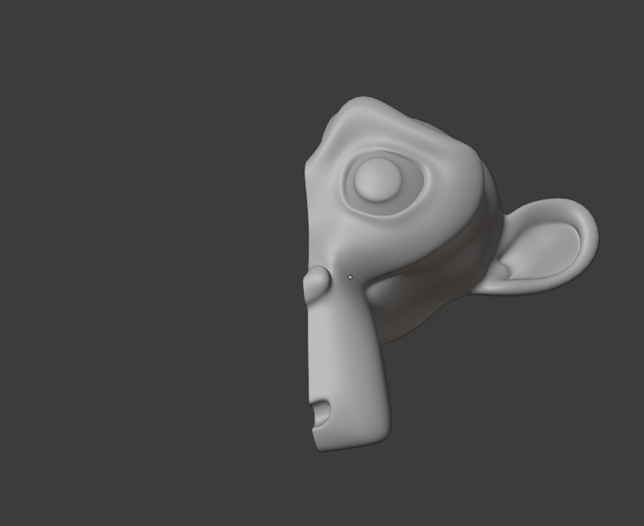
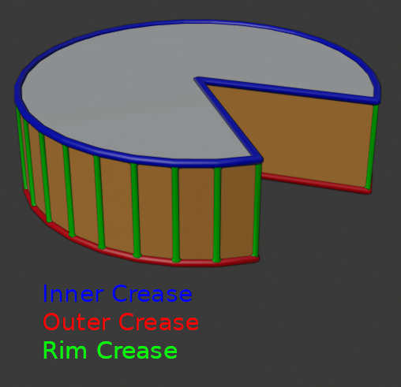

# Ek Bilgiler

Kullanılan Güzel Kaynaklar

 

* [The Blender 2.8 Encyclopedia](https://www.udemy.com/course/the-blender-encyclopedia/) - Udemy'deki sayısı bir elin parmaklarını geçmeyecek kadar az olan, gerçekten uğraşılmış kurslardan birisi. Bizim için önemli olan 9. bölüm "Modifiers", modifier'ların açıklamalarının olduğu bölüm, tabi isterseniz diğer kısımlara da bakabilirsiniz. [Buradan](https://btdig.com/search?q=The+Blender+2.8+Encyclopedia) torrent'ini bulabilirsiniz (vpn gerekebilir).
* [All Modifiers in Blender](https://brandonsdrawings.com/modifiers/) - Brandon's Drawings'in sitesi. Kendisi blender hakkında en iyi kaynaklardan birisidir.

# [Modify](#modify-1)
* [Data Transfer](#data-transfer)
* [Mesh Cache](#mesh-cache)
* [Mesh Sequence Cache](#mesh-sequence-cache)
* [Normal Edit](#normal-edit)
* [Weighted Normal](#weighted-normal)
* [UV Project](#uv-project)
* [UV Warp](#uv-warp)
* [Vertex Weight Edit](#vertex-weight-edit)
* [Vertex Weight Mix](#vertex-weight-mix)
* [Vertex Weight Proximity](#vertex-weight-proximity)

# [Generate](#generate-1)
* [Array](#array)
* [Bevel](#bevel)
* [Boolean](#boolean)
* [Build](#build)
* [Decimate](#decimate)
* [Edge Split](#edge-split)
* [Geometry Nodes](#geometry-nodes)
* [Mask](#mask)
* [Mirror](#mirror)
* [Multiresolution](#multiresolution)
* [Remesh](#remesh)
* [Screw](#screw)
* [Skin](#skin)
* [Solidify](#solidify)
* [Subdivision Surface](#subdivision-surface)
* [Triangulate](#triangulate-1)
* [Volume to Mesh](#volume-to-mesh)
* [Weld](#weld)
* [Wireframe](#wireframe)

# [Deform](#deform-1)
* [Armature](#armature)
* [Cast](#cast)
* [Curve](#curve)
* [Displace](#displace)
* [Hook](#hook)
* [Laplacian Deform](#laplacian-deform)
* [Lattice](#lattice)
* [Mesh Deform](#mesh-deform)
* [Shrinkwrap](#shrinkwrap)
* [Simple Deform](#simple-deform)
* [Smooth](#smooth-1)
* [Smooth Corrective](#smooth-corrective)
* [Smooth Laplacian](#smooth-laplacian)
* [Surface Deform](#surface-deform)
* [Volume Displace](#volume-displace)
* [Warp](#warp)
* [Wave](#wave)

 
 

# [Modify](https://docs.blender.org/manual/en/3.6/modeling/modifiers/index.html#modify)
Bu kategorideki modfier'lar objenin geometrisini direktmen değiştirmeyen, daha çok objelerin verisini değiştiren modifier'lardır.

## [Data Transfer](https://docs.blender.org/manual/en/3.6/modeling/modifiers/modify/data_transfer.html)
Bilmiyorum.

## [Mesh Cache](https://docs.blender.org/manual/en/3.6/modeling/modifiers/modify/mesh_cache.html)
Bilmiyorum.

## [Mesh Sequence Cache](https://docs.blender.org/manual/en/3.6/modeling/modifiers/modify/mesh_sequence_cache.html)
Bilmiyorum.

## [Normal Edit](https://docs.blender.org/manual/en/3.6/modeling/modifiers/modify/normal_edit.html)
Bilmiyorum.

## [Weighted Normal](https://docs.blender.org/manual/en/3.6/modeling/modifiers/modify/weighted_normal.html)
Bilmiyorum.

## [UV Project](https://docs.blender.org/manual/en/3.6/modeling/modifiers/modify/uv_project.html)
Bilmiyorum.

## [UV Warp](https://docs.blender.org/manual/en/3.6/modeling/modifiers/modify/uv_warp.html)
Bilmiyorum.

## [Vertex Weight Edit](https://docs.blender.org/manual/en/3.6/modeling/modifiers/modify/weight_edit.html)
Bilmiyorum.

## [Vertex Weight Mix](https://docs.blender.org/manual/en/3.6/modeling/modifiers/modify/weight_mix.html)
Bilmiyorum.

## [Vertex Weight Proximity](https://docs.blender.org/manual/en/3.6/modeling/modifiers/modify/weight_proximity.html)
Bilmiyorum.

 
 

# [Generate](https://docs.blender.org/manual/en/3.6/modeling/modifiers/index.html#generate)
Bu kategorideki modfier'lar objenin geometrisini/topolojisini direktmen değiştiren modifier'lardır.

## [Array](https://docs.blender.org/manual/en/3.6/modeling/modifiers/generate/array.html)
Objeyi istediğiniz sayıda ve yönde kopyalar (aynı veriyi paylaşan kopyalar oluşturur).

* #### Fit Type
Yerleştirme türü.

Mod | Açıklama
:---: | :---:
‎Fixed Count | "Count" input'una verdiğiniz sayı kadar kopya oluşturulur.
Fit Length | "Length" input'unda belirttiğiniz mesafe değerine göre, verdiğiniz offset ile kaç tane kopya sığıyorsa o kadar kopya oluşturur. Bu modda offset kullanmak zorundasınız.
Fit Curve | "Curve" input'unda belirttiğiniz curve'ün uzunluk değerine göre, verdiğiniz offset ile kaç tane kopya sığıyorsa o kadar kopya oluşturur. Bu modda offset kullanmak zorundasınız.

## Relative Offset
Objenin kendi boyut değerlerine göre offset verir.

* #### Factor X/Y/Z
Her bir kopyanın bir önceki kopyaya olan offset'i yani uzaklığı, "Relative Offset" yani objenin kendi boyut değerlerine göre offset olduğu için, mesela herhangi bir ekseni 2 ayarlamak o eksende her kopyanın arasına objenin kendisi kadar boşluk konulmasına sebep olur.

## Constant Offset
Belirttiğiniz değere göre offset verir.

* #### Distance X/Y/Z
Her bir kopyanın bir önceki kopyaya olan offset'i yani uzaklığı, "Constant Offset" yani belirttiğiniz offset değeri objenin büyüklüğünden bağımsız olarak kullanılır.

## Object Offset
Belirttiğiniz objeye göre offset verir. Bu modu sürekli küçülen kopyalar oluşturmak için veya belirli bir nokta etrafında kopyalar oluşturmak için kullanabilirsiniz.

* #### Object
Referans objesi, offset bu objenin transform değerlerine göre (location, rotation, scale) hesaplanır.

## Merge
Belirtilen mesafe değerinden küçük offset'e sahip olan kopyaları birleştirmeye yarar.

* #### Distance
Mesafe değeri, eğer bir önceki ve sonraki kopyalar arasındaki mesafe bu değerden küçükse vertice'leri birleştirilir.

* #### First and Last Copies
Bu ayarı açarak ilk ve son kopyaları birleştirebilirsiniz (tabi eğer aralarındaki mesafe "Distance" input'undan küçükse). Bu ayarı daire oluşturup tekrar başlangıç noktasına gelen kopyalarda kullanabilirsiniz.

## UVs
Offset U/V ayarları ile UV kaydırmanıza yarar.

* #### Offset U/V
X ve Y daha doğru U ve V eksenlerinde yeni oluşturulan kopyalar için UV'yi kaydırır. Eğer her kopyada farklı UV kullanılsın istiyorsanız bunu kullanabilirsiniz.

## Caps
Eğer kopyalar başlarken veya bitince koymak istediğiniz bir obje varsa bu ayarı kullanabilirsiniz.

* #### Cap Start/End
Bu ayarlar ile başlangıca ve sona (her kopya için değil, hepsinden önce ve sonra) koymak istediğiniz objeleri seçebilirsiniz. Mesela tren rayı yaptınız ve başlangıç ile bitişe duvar koymak istiyorsunuz, o zaman bu ayarı kullanabilirsiniz.

## [Bevel](https://docs.blender.org/manual/en/3.6/modeling/modifiers/generate/bevel.html)
Bildiğimiz bevel tool'unun modifier halidir. Daha gelişmiş özellik sunar. Eğer bevel tool'unu bilmiyorsanız internetten ilk baş onu ögrenin. Zaten ayarların çoğu bevel tool'undaki ayarlar ile aynı.

* #### Width Type
Bevel derecesini belirleyen modlardır.

Mod | Açıklama
:---: | :---:
‎Offset | Kenarın face'ler üzerinde kenardan uzaklaşması olarak hesaplanır (resme bakın).
‎Width | Bevel kenarlarının birbirlerinden uzaklaşması olarak hesaplanır, yani aralarındaki mesafe (resme bakın).
Depth | Derinlik yani kenarların içe doğru uzaklaşması olarak hesaplanır (resme bakın).
Percent | Face'lerin uzunluğuna göre yüzdelik olarak bevel hesaplanır. Eğer objenin yüzlerinin boyutu farklı ise, bevel derecesinin de farklı olduğunu görebilirsiniz. Mesela bir dikdörtgen üzerinde bevel modifier uygularsanız kenar'ın uzun olan face'ine daha geniş bevel uygulanmışken kısa olan face'ine daha dar bevel uygulandığını görebilirsiniz.
Absolute | Tam olarak verdiğiniz değere göre bevel hesaplanır.

* #### Amount
Bevel miktarı, "Width Type" ayarına göre bu ayarın çalışma mantığı değişebilir.

* #### Segments
Segment sayısı. Bu ayar zaten bevel tool'unda da var.

* #### Limit Method
Bevel işlemini limitlememize yarayan modlardır.

Mod | Açıklama
:---: | :---:
‎None | Limit yok.
Angle | Kenarın face'ler arasındaki açısına göre limit kullanır. "Angle" input'una veridiğiniz açıdan az açıya sahip olan kenarlara bevel uygulanmaz.
Weight | Kenarların "Bevel Weight" bilgisini kullanır.
Vertex Group | Eğer kenarı oluşturan vertex'lerin hepsi "Vertex Group" input'una verilen vertex group'ta ise bevel uygulanır.

## Profile
Buradan bevel şeklini belirleyebilirsiniz.

Mod | Açıklama
:---: | :---:
‎Superellipse | Default mod. "Shape" input'unun değerini arttırıp azaltarak bevel derecesini belirleyebilirsiniz.
Custom | Bevel şeklini curve aracılığı ile belirleyebilirsiniz.

* #### Sample Straight Edges
Sadece "Profile" ayarı "Custom" modundayken vardır. Curve üzerindeki bütün noktaların handling type'ını yani önceki ve sonraki noktalara bağlanma modlarını vector'e çevirir. Yani noktalar birbirine direktmen bağlanır, ama bu curve üzerinde görünmez. Eğer bevel edilen kenarlara bakarsanız görebilirsiniz.

* #### Sample Even Lengths
Sadece "Profile" ayarı "Custom" modundayken vardır. Curve üzerindeki bütün noktaları eşit dağıtır. Aralarındaki mesafe eşit olur.

## Geometry
Bevel ile ilgili şekil ayarları.

* #### Miter Inner/Outer
Bu ayarlar bevel şekli ile ilgili. [Buradan](https://docs.blender.org/manual/en/3.6/modeling/modifiers/generate/bevel.html#id8) modların yaptığı değişiklikleri görebilirsiniz.

* #### Spread
Sadece "Miter Inner" ayarı "Arc" modundayken vardır. Ekstra vertice'leri yayma derecesini belirler.

* #### Intersections
"Grid Fill" modu default moddur. "Cutoff" modu bevel edilmiş kenarların birbiriyle birleştikleri kısmı siler.

* #### Clamp Overlap
Kenarların bevel edilen kısımlarının birbirleriyle çakışmasını engeller. Çakışmanın başladığı noktada bevel genişliğini durdurur.

* #### Loop Slide
Bevel edilen kenarlardan bazılarının bağlı olduğu face'lerin boyutu farklı olduğu için sünme oluyorsa bu ayarı açarak bütün kenarlardaki bevel'ları eşitleyebilirsiniz. Güzel video bulamadım ama [buna](https://youtu.be/vLzY4ApZZcE?t=907) bakabilirsiniz.

## Shading
Bevel ile ilgili shading ayarları.

* #### Harden Normals
Oluşturulan bevel face'lerinin normal'larını yani baktıkları yönleri düzenler. Shading sorunlarını çözer.

* #### Mark Seam
Bilmiyorum.

* #### Mark Sharp
Bilmiyorum.

* #### Material Index
Bevel ile oluşturulan kenarlar için Materials bölümündeki (Properties > Material) materyallerden hangisinin kullanılacağını belirler. -1 yaparsanız otomatik olarak materyal atanır yani bevel ile oluşturulan kenarlara objenin bevel olmadan önceki halinde en yakın olan face'in rengi verilir. Bu sayıyı 0 veya daha büyük bir sayı yaparsanız index belitmiş olursunuz, yani Materials bölümündeki (Properties > Material) materyallerden birini seçmiş olursunuz. 0 yaparsanız ilk, 1 yaparsanız 2. materyal kullanılır ve bu şekilde verdiğiniz index'teki materyal kullanılır. Index sayıları yazılım dillerinde 0'dan başlar.

* #### Face Strength
Bilmiyorum.

## [Boolean](https://docs.blender.org/manual/en/3.6/modeling/modifiers/generate/booleans.html)
Başka bir objeyi kullanarak seçilen obje ile üst üste gelen kısımlar üzerinde işlemler yapabilirsiniz. Mesela kesiştikleri kısmı silebilirsiniz. Bu modifier'ı kullanırsanız mesh'iniz üzerinde n-gon'lar oluşabilir, mesh'inizin topolojisini bozabilir. Sadece basit mesh'ler için kullanın, kompleks mesh'lerinizde bu modifier'ı kullanmak kolaylık değil zorluk getirebilir.

* #### Operation
İşlem.

Mod | Açıklama
:---: | :---:
‎Intersect | Modifier uygulanan objenin, diğer obje ile kesişen kısmı kalır, geriye kalan her yeri silinir.
Union | İki obje birleştirilir.
Difference | Modifier uygulanan objenin, diğer obje ile kesişen kısmı silinir. Yani diğer obje silici olarak kullanılır.

* #### Operand Type
Kullanılacak objenin türü. "Object" modunda tek bir obje belirtebilirsiniz. "Collection" modunda koleksiyon belirtebilirsiniz ve bu koleksiyondaki bütün objeler kullanılır.

* #### Object/Collection
Hedef obje/koleksiyon.

* #### Solver
Hesaplama algoritması.

Mod | Açıklama
:---: | :---:
‎Fast | Hızlı ama tam doğru hesaplama sunmaz.
Exact | "Fast" moduna göre daha yavaş ama hesaplamalar doğru.

* #### Overlap Threshold
Sadece "Solver" ayarı "Fast" modundayken vardır. İki face'in üst üste gelmiş olabilmesi için maximum mesafe değeri. Yani iki face'in aralarındaki mesafe bu değerden az ise üst üste gelmişler demektir.

* #### Materials
"Index Based" modunda yeni oluşturulan yüzler için Materials bölümündeki (Properties > Material) materyalleri sırasıyla kullanır. Eğer yeterli materyal yoksa sonuncuyu kullanır. "Transfer" modunda varsa hedef obje olarak kullanılan objenin materyalini, yoksa "Index Based" gibi modifier uygulanan objenin materyallerini kullanır.

* #### Self Intersection
Hedef objenin kendisi üzerinde üst üste gelen kısımlarını da hesaplar. Bu ayarı açmak hataları önleyebilir ama ek hesaplama yapar.

* #### Hole Tolerant
Eğer "Solver" ayarı olarak "Exact" kullanıyorsanız ve sonuç hatalı oluyorsa bu ayarı açabilirsiniz. Bu ayarı açmak [Non-manifold](https://docs.blender.org/manual/en/3.6/glossary/index.html#term-Non-manifold) yani hatalı yapılmış yüzeyleri optimize eder. Ek hesaplama yaptığı için yavaş olabilir.

## [Build](https://docs.blender.org/manual/en/3.6/modeling/modifiers/generate/build.html)
Bu modifier objeye animasyonlu build efekti (inşa etme) verir. Belirtilen frame sayısına göre her frame'de objenin face'lerini görünmez halden görünür hale getirir. Bu da sanki obje yeniden oluşuyormuş gibi bir efekt verir. Ayrıca genellikle Build modifier'ı kullanıcı tarafından belirlenmiş face sıralamasına göre kullanılır. Face sıralamasını (Sort Order) nasıl yapacağınızı [buradan](https://brandonsdrawings.com/buildmodifier/) ögrenebilirsiniz.

* #### Start Frame
Animasyonun başlama frame'i. Mesela bunu 50 yaparsanız 50. frame'den sonra obje oluşmaya başlar.

* #### Length
Animasyonun kaç frame süreceğini belirler. Mesela 100 yaparsak inşa etme animasyonu 100 frame sürer.

* #### Reversed
İşlemi tersine çevirir, inşa etmek yerine yok eder. Başlangıçta tamamen görünür olan obje gitgide yok olur veya görünmez olur.

* #### Randomize
Face'lerin oluşma veya yok olma sıralamasını rastgele yapar.

* #### Seed
"Randomize" ayarı için seed değeri. Seed demek verilen sayıya göre işlemlerin bilgisayarda o sayıya özel olarak rastgele gerçekleşmesi demektir. Aynı seed'i kullandığınızda hep aynı sonucu alırsınız.

## [Decimate](https://docs.blender.org/manual/en/3.6/modeling/modifiers/generate/decimate.html)
Bu modifier mesh üzerindeki vertex/face sayısını düşürmenize yarar.

* #### Mode

Mod | Açıklama
:---: | :---:
‎Collapse | Birbirine yakın olan vertex'leri birleştirir.
Un-Subdivide | Subdivision yani face'leri bölme işleminin tam tersini yapar, face'leri birleştirir. "Iterations" input'una verdiğiniz sayı kadar bölme işlemi gerçekleşir.
Planar | Aralarındaki açı verdiğiniz açı değerinden az olan komşu face'leri birleştirir. Yani yönleri birbirine benzeyen face'leri birbirleriyle birleştirir.

* #### Ratio
Sadece "Mode" ayarı "Collapse" modundayken vardır. Vertex sayısını düşürme derecesini belirler. 1'den 0'a doğru indikçe vertex sayısı %100'den %0'a doğru azalır.

* #### Symmetry
Sadece "Mode" ayarı "Collapse" modundayken vardır. Seçilen eksende simetriyi korur.

* #### Triangulate
Sadece "Mode" ayarı "Collapse" modundayken vardır. Bütün face'leri üçgene çevirir.

* #### Vertex Group
Sadece "Mode" ayarı "Collapse" modundayken vardır. Decimate modifier'ı belirli bir vertex group ile sınırlayabilirsiniz.

* #### Factor
Sadece "Mode" ayarı "Collapse" modundayken vardır. "Vertex Group" için etki derecesi.

* #### Angle Limit
Sadece "Mode" ayarı "Planar" modundayken vardır. Açı limiti, aralarındaki açı bu açıdan küçük olan komşu face'ler birleştirilir.

* #### Delimit
Sadece "Mode" ayarı "Planar" modundayken vardır. Belirli yerleri Decimate işleminin dışında bırakabilirsiniz.

Mod | Açıklama
:---: | :---:
‎Normal | Normal'ları farklı yönlere bakan (ön/arka) face'leri Decimate işleminin dışında bırakır.
Material | Farklı materyale sahip face'leri Decimate işleminin dışında bırakır.
Seam | Seam olarak işaretlenmiş kenarları Decimate işleminin dışında bırakır.
Sharp | Sharp olarak işaretlenmiş kenarları Decimate işleminin dışında bırakır.
UVs | UV Map'te olan kenarları Decimate işleminin dışında bırakır.

* #### All Boundaries
Sadece "Mode" ayarı "Planar" modundayken vardır. Bu ayar face'lerin boundary (sınırları) yani kenarları üzerindeki bütün vertice'leri siler. Yani bir nevi n-gon oluşmasına engel olur da denebilir.

## [Edge Split](https://docs.blender.org/manual/en/3.6/modeling/modifiers/generate/edge_split.html)
Bu modifier mesh'in kenarlarını birbirinden ayırır, daha doğrusu face'leri birbirine bağlayan kenarları ayırır da denebilir çünkü kenarları ayırırken komşu face'lern birbirlerine olan açı farkına bakar. Bu modifier ile yapabildiklerinizin aynısını Auto Smooth (Properties > Data > Normals > Auto Smooth) ayarı ile de yapabilirsiniz, dolayısıyla artık kullanılmıyor, ek bilgiler için [buraya](https://www.youtube.com/watch?v=xMI3G_M_3dE) bakabilirsiniz.

* #### Edge Angle
Aralarındaki açı bu açı değerinden fazla olan kenarlar birbirlerinden ayrılır.

* #### Sharp Edges
"Sharp" olarak işaretlenmiş kenarların açıları "Edge Angle" ayarında verdiğiniz açıdan küçük olsalar bile ayrılırlar.

## [Geometry Nodes](https://docs.blender.org/manual/en/3.6/modeling/modifiers/generate/geometry_nodes.html)
Bilmiyorum.

## [Mask](https://docs.blender.org/manual/en/3.6/modeling/modifiers/generate/mask.html)
Bu modifier mesh'in sadece seçilen vertex group'unu veya seçilen armature'a bağlı olan kısmını gösterir, diğer kısımları göstermez. Bu modifier'ı debug aracı olarak kullanabilirsiniz.

* #### Mode
Mod.

Mod | Açıklama
:---: | :---:
‎Vertex Group | Sadece verdiğiniz vertex group'u gösterir. Ayrıca weight değerlerine göre eleme de yapabilirsiniz.
‎Armature | Mesh'in sadece verdiğiniz armature'a bağlı olan kısımlarını gösterir. Ayrıca weight değerlerine göre eleme de yapabilirsiniz.

* #### Smooth
Sadece "Mode" ayarı "Vertex Group" modunda iken vardır. Weight değerleri birbirine yakın olan kısımlar için yumuşak bir geçiş efekti verir. Yani tam olarak "Threshold" değerinden büyük olan yerleri göstermek yerine bölgedeki weight değerlerini ortalayıp keskin geçişleri yumuşak geçişe çevirir.

* #### Threshold
Weight değerleri için limit değeri. Vertex Group'un veya seçilen armature'un içinde olan vertex'lerin weight değeri bu değerden büyükse vertex gösterilir, küçükse veya eşitse gösterilmez.

## [Mirror](https://docs.blender.org/manual/en/3.6/modeling/modifiers/generate/mirror.html)
Bu modifier mesh'i istediğiniz eksende aynalamanıza yarar, mesela yapmak istediğiniz obje simetrik ise sadece yarısını yapıp diğer yarısını da bu modifier ile yapabilirsiniz. Default olarak mesh'in orijin noktasını kullanır.

* #### Axis
Aynalama işleminin olacağı eksen.

* #### Bisect
Aynalama işlemi olurken mesh orijin noktasından karşı tarafa geçerse, yani aynalanan kısma geçerse, orijin noktasını geçen kısımlar otomatikmen silinir.

* #### Flip
Aynalama yönünü değiştirir, "Bisect" ayarı açıkken bu ayarı da açarsanız yönler değişir, aynalama yönü tam tersi olur. Eğer aynalama yönünün tersten olmasını istiyorsanız bu ayarı kullanabilirsiniz.

* #### Mirror Object
Orijin noktası olarak başka bir objenin transform bilgilerini (location, rotation) kullanmanıza yarar.

* #### Clipping
Mesh'in edit modda orijin noktasını geçen kısımları orijin noktasına geldikten sonra daha fazla ilerleyemez. Yani bu ayar mesh'in orijin noktasının karşısına geçmesine izin vermez.

* #### Merge
Mesh ile aynalanan kopyanın vertice'lerinin arasındaki mesafe bu ayara verdiğiniz değerden küçükse otomatikmen birleştirilir.

* #### Bisect Distance
"Bisect" ayarı için mesafe değeri. Orijin noktasına bu ayara verdiğiniz değerden daha yakın olan vertice'ler bisect edilir. Yani orijin noktasında birleştirilir.

## Data

* #### Mirror U/V
Bilmiyorum.

* #### Offset U/V
Bilmiyorum.

* #### Vertex Groups
Bilmiyorum.

* #### Flip UDIM
Bilmiyorum.

## [Multiresolution](https://docs.blender.org/manual/en/3.6/modeling/modifiers/generate/multiresolution.html)
Bilmiyorum.

## [Remesh](https://docs.blender.org/manual/en/3.6/modeling/modifiers/generate/remesh.html)
Bu modifier mesh'i quad'lar yani dörtgenler kullanarak yeniden oluşturur.

* #### Mode
Mod.

Mod | Açıklama
:---: | :---:
‎Blocks | Mesh'i minecraft gibi küp küp yapar.
Smooth | Dörtgenler arası yumuşak geçişler yapar. Yumuşak bir şekil verir.
Sharp | "Smooth" modu gibidir ama keskin kısımları/köşeleri tutar.
Voxel | Mesh'i voxel'ler ile yeniden oluşturur.

* #### Octree Depth
Quad yani dörtgen sayısı/miktarı.

* #### Scale
Quad yani dörtgen sayısının/miktarının genel olarak scale değeri, dörtgenlerin büyüklüğünü ayarlar da denebilir.

* #### Sharpness
Sadece "Mode" ayarı "Sharp" modundayken vardır. Keskinlik derecesi.

* #### Remove Disconnected
Ana mesh'e bağlı olmayan kısımları silmeye yarar.

* #### Threshold
"Remove Disconnected" ayarı için threshold yani limit değeri. Silinecek kısımların ne kadar büyük olması gerektiğini belirtir.

* #### Smooth Shading
Mesh'e smooth shade uygular.

* #### Voxel Size
Sadece "Mode" ayarı "Voxel" modundayken vardır. Voxel büyüklüğünü ayarlar. Düşürdükçe daha çok voxel olacağı için detay artar ama face sayısı da artar.

* #### Adaptivity
Sadece "Mode" ayarı "Voxel" modundayken vardır. Bu ayar da aslında "Voxel Size" ayarı gibi voxel büyüklüğünü ayarlar ama bu ayarı voxel büyüklüğünü ayarlıyormuş gibi değil de voxel'leri birleştiriyormuş gibi düşünün. Yani bu ayarı arttırdıkça voxel'ler birleşir, böylelikle de voxel yani face sayısı düşmüş olur.

## [Screw](https://docs.blender.org/manual/en/3.6/modeling/modifiers/generate/screw.html)
Bu modifier spin tool'unun modifier hali gibidir. Yaptıkları iş bakımından aynıdırlar denebilir.

* #### Angle
Orijin noktası etrafında seçilen eksende dönme derecesi.

* #### Screw
Seçilen eksende yükseklik değeri.

* #### Iterations
Tekrar etme sayısı. Bu sayıyı arttırarak oluşturduğunuz meshi tekrar edebilirsiniz. Her bir tekrar yani iteration uç uca eklenir.

* #### Axis
Dönme ekseni.

* #### Axis Object
Buradan obje seçerek orijin noktasını bu objeye göre belirleyebilirsiniz.

* #### Object Screw
Eğer bu ayarı açarsanız "Screw" input'u kapanır ve "Screw" değeri olarak verdiğiniz obje ile modifier'ın uygulandığı objenin "Axis" input'unda verdiğiniz eksendeki farkları kullanılır.

* #### Steps Viewport
Viewport için objenin step yani köşe sayısı.

* #### Steps Render
Render için objenin step yani köşe sayısı.

* #### Merge
Birbirine yakın olan vertice'leri birleştirmemize yarar. Buradan limiti ayarlayabilirsiniz. Ararlarındaki fark bu limit değerinden az olan vertice'ler birleştirilir.

* #### Stretch UVs
Eğer bu ayarı açarsanız seçtiğiniz eksende (U veya V) mesh'in UV'sini sündürür. Normalde mesh uzadıkça veya boyutu arttırkça U ve V eksenlerindeki UV değeri de tekrarlamaya başlar ama bu ayarı açarsanız tekrarlama değil de sıkıştırma işlemi uygulanır yani UV sündürülür ve mesh boyutuna göre şekillenir.

## Normals

* #### Smooth Shading
Mesh'e smooth shade uygular.

* #### Calculate Order
Kenarların sırasına göre normal'larını düzenler. Düzgün normal'lar için bu ayarı açın.

* #### Flip
Normal'ların yönünü tersine çevirir.

## [Skin](https://docs.blender.org/manual/en/3.6/modeling/modifiers/generate/skin.html)
Bilmiyorum.

## [Solidify](https://docs.blender.org/manual/en/3.6/modeling/modifiers/generate/solidify.html)
Solidify modifier'ı mesh'e kalınlık/derinlik ekler.

* #### Mode
Mod.

Mod | Açıklama
:---: | :---:
‎Simple | Default mod. Tek bir kenarın 2'den fazla bağlı olduğu face olduğunda hata verebilir.
Complex | Her türlü geometri için kesin sonuç sunar. Hesaplamalar daha fazla olduğu için bu modu seçmek yavaşlık ekleyebilir ama kesin sonuç döndürür.

* #### Thickness Mode
Sadece "Mode" ayarı "Complex" modundayken vardır.

Mod | Açıklama
:---: | :---:
‎Fixed | Bu mod, "Mode" ayarı "Simple" modundayken ve "Even Thickness" ayarı kapalı iken olan sonucun benzerini verir.
‎Even | Bu mod, "Mode" ayarı "Simple" modundayken ve "Even Thickness" ile "High Quality" ayarları açık iken olan sonucun benzerini verir.
‎Constraints | Bu mod her noktada en iyi kalınlık değerini bulmaya çalışan gelişmiş bir moddur.

* #### Boundary
Sadece "Mode" ayarı "Complex" modundayken vardır.

Mod | Açıklama
:---: | :---:
‎None | Herhangi bir değiklik yapılmaz.
Round | Köşelerde keskin geçişler oluyorsa bunu önlemek için belirli noktalarda kalınlığı kısar.
Flat | Düz bir geçiş olacak şekilde kalınlığı ayarlar.

* #### Thickness
Kalınlık.

* #### Offset
Kalınlığın ekleneceği yön, default olarak bu ayar -1'dir yani normal'ların tersine doğru yani içe doğru kalınlık ekler. Eğer bu ayarı 1 yaparsanız kalınlık normal'lar yönünde eklenir, yani dışa doğru. 0 yaparak iki yöne doğru da ortalı bir şekilde kalınlık ekleyebilirsiniz.

* #### Even Thickness
Sadece "Mode" ayarı "Simple" modundayken vardır. Eğer köşelerde uygulanan kalınlık azsa/fazlaysa bu ayarı açarak diğer kısımlar ile eşit şekilde kalınlık ekleyebilirsiniz. Daha fazla işlem gerektirdiği için yavaşlık ekleyebilir.

* #### Merge Threshold
Aralarındaki fark bu değerden daha az olan vertex'ler birleştirilir.

* #### Rim Fill
Bu ayar açıkken kalınlık ile mesh birbirine bağlıdır. Eğer bu ayarı kapatırsanız oluşturulan kalınlık mesh'e bağlı olmaz, bu da sanki yeni bir yüzey oluşturmuşsunuz gibi, yani kopya oluşturmuşsunuz gibi bir görünüm verir. Oluşturulan kalınlık ile mesh birbirinden ayrı kalır.

* #### Only Rim
"Mode" ayarı "Simple" modundayken bu ayar sadece kalınlık ekler. Yani mesh'in yüzeyine paralel olan kısımları sonuca eklemez. Sadece kalınlık ekler. Eklediği kalınlığın uçlarını veya iç taraflarını yapmaz. "Mode" ayarı "Complex" modundayken bu ayar kalınlık haricindeki her şeyi siler. Sadece yeni eklenen kalınlık kalır. Yani yüzeyler yeniden oluşturulmaz, sadece kalınlık olarak oluşturulan yeni kısım kalır.

* #### Vertex Group
Verdiğiniz Vertex Group içindeki vertex'ler kalınlaştırma işleminden etkilenir. Vertex'lerin sahip olduğu weight değeri kullanılarak kalınlık hesaplanır. 0 iken hiç kalınlık olmaz. 1 iken tam kalınlık olur.

* #### Factor
Vertex Group için factor değeri. Bu ayarın çalışma mantığı şudur, vertex group'un kalınlık değeri üzerinde ne kadar etkisi olacağını belirler. Mesela bu ayar 0 iken tamamen vertex group'un içindeki vertex'lerin weight değerleri kullanılır. Eğer bu ayarı 0.5 yaparsanız yarı yarıya vertex group kullanılır. Yani vertex group içerisinde weight değeri 0 olan vertex'ler olsa bile, bu vertex'ler sadece yarı yarıya vertex weight değerinden etkilendikleri için bu vertex'lere de "Thickness" input'una verdiğiniz değerin yarısı kadar kalınlık uygulanır. Yani kalınlık değerinin yarısı "Thickness" input'undan, yarısı vertex group'tan belirlenir. Eğer bu ayarı 1 yaparsanız vertex group'un hiç etkisi kalmaz. Yani vertex group içerisinde değeri 0 olan vertex'ler ile 1 olan vertex'ler arasında bir fark kalmaz.

* #### Flat Faces
Mesh'e paralel yani düz bir kalınlık oluşturmak için vertex'lerin weight değerlerini düzenler.

## Normals

* #### Flip
Normal'ların yönünü tersine çevirir.

* #### High Quality
Bu ayarı açarsanız kalınlık hesaplamaları daha doğru olur ama hesaplamalar artacağı için yavaşlık ekleyebilir.

## Materials

* #### Material Offset
Yeni oluşturulan kalınlıgın uç veya iç tarafları için (yani rim hariç, kalınlık hariç) materyal değeri. Bu değer şu anda kullanılan materyale ek olarak hesaplanır. Yani 1 yaparsanız bir sonraki, -1 yaparsanız bir önceki materyal kullanılır.

* #### Rim
Yeni oluşturulan kalınlıgın (rim) materyal değeri. Bu değer şu anda kullanılan materyale ek olarak hesaplanır. Yani 1 yaparsanız bir sonraki, -1 yaparsanız bir önceki materyal kullanılır.

## Edge Data

* #### Crease Inner
Sadece "Mode" ayarı "Simple" modundayken vardır. İç tarafa crease ekler.

* #### Crease Outer
Sadece "Mode" ayarı "Simple" modundayken vardır. Dış tarafa crease ekler.

* #### Rim
Sadece "Mode" ayarı "Simple" modundayken vardır. Kalınlık (rim) üzerine crease ekler.

* #### Bevel Convex
Dış kenarlara eklenecek bevel weight değeri.

## Thickness Clamp

* #### Clamp
Bilmiyorum.

* #### Angle Clamp
Bilmiyorum.

## Output Vertex Groups

* #### Shell
Bilmiyorum.

* #### Rim
Bilmiyorum.

## [Subdivision Surface](https://docs.blender.org/manual/en/3.6/modeling/modifiers/generate/subdivision_surface.html)
Subdivision Surface modifier'ı (veya Subsurf) mesh'inize ekstra geometri eklemenize yarar. Mesh'iniz ile low poly çalışıp (yani face sayısı az) işlerinizi bitirdikten sonra high poly (yani face sayısı fazla) yapabilmenize yarar.

* #### Mode

Mod | Açıklama
:---: | :---:
‎Catmull-Clark | Mesh'i subdivide ederken aynı zamanda yumuşak geçişler de uygular ve mesh'in şeklini de değiştirir.
‎Simple | Mesh'i sadece subdivide eder. Catmull-Clark'ın aksine şeklini değiştirmez.

* #### Adaptive Subdivision
Bu ayar sadece [Render Engine](../Render%20Properties#render-engine) "Cycles" iken ve [Feature Set](../Render%20Properties#feature-set) "Experimental" iken vardır. ["Adaptive Subdivision"](https://docs.blender.org/manual/en/3.6/render/cycles/object_settings/adaptive_subdiv.html) özelliğini açar.

* #### Dicing Scale
Sadece "Adaptive Subdivision" ayarı açıkken vardır. Dicing için scale değerini belirler. Bu değeri düşürürseniz daha fazla subdivision olur, arttırırsanız daha az. Ek ayarlara Render ayarlarında [Subdivision](../Render%20Properties#subdivision-1) kategorisinden ulaşabilirsiniz.

* #### Levels Viewport
Viewport için subdivide sayısı.

* #### Levels Render
Render için subdivide sayısı.

* #### Optimal Display
Viewport Shading "Wireframe" modundayken bu ayar mesh'in yeni oluşturulan kenarlarını göstermez. Sadece orijinal kenarları gösterir.

## Advanced

* #### Use Limit Surface
Bu ayar açıkken vertice'ler sadece sonsuz sayıda subdivision uygulanabilecek yüzeylere koyulur.

* #### Quality
"Use Limit Surface" ayarı açıkken bu ayar vertice'lerin koyulacakları yerleri belirler. Bu ayarı çok fazla arttırmanıza gerek yok, default değeri yeterli aslında.

* #### UV Smooth
UV üzerinde yapılacak değişiklikleri belirler.

Mod | Açıklama
:---: | :---:
‎None | UV üzerinde değişiklik yapılmaz.
Keep Corners | Bilmiyorum.
Keep Corners, Junctions | Bilmiyorum.
Keep Corners, Junctions, Concave | Bilmiyorum.
Keep Boundaries | Bilmiyorum.
All | Bilmiyorum.

* #### Boundary Smooth
UV üzerinde yapılacak yumuşatmaları belirler.

Mod | Açıklama
:---: | :---:
‎All | Köşeler de dahil olmak üzere her yerde geçişler yumuşatılır.
‎Keep Corners | Köşe kısımlar haricinde geriye kalan yerlerde geçişler yumuşatılır.

* #### Use Creases
Bilmiyorum.

* #### Use Custom Normals
Bilmiyorum.

## [Triangulate](https://docs.blender.org/manual/en/3.6/modeling/modifiers/generate/triangulate.html)
Bu modifier mesh'inizin face'lerini üçgene çevirir, triangulate eder.

* #### Quad Method
Quad'lar (dörtgen) için kullanılacak triangulation (üçgene çevirme) metodu.

Mod | Açıklama
:---: | :---:
‎Beauty | Güzel bir şekilde bölmeye çalışır.
Fixed | 1. ve 3. vertice'leri kullanarak quad'ları üçgene çevirir.
Fixed Alternate | 2. ve 4. vertice'leri kullanarak quad'ları üçgene çevirir.
Shortest Diagonal | Quad'ları en kısa köşegeni bölerek üçgene çevirir.
Longest  Diagonal | Quad'ları en uzun köşegeni bölerek üçgene çevirir.

* #### N-gon Method
N-gon'lar (beşgen ve sonrası) için kullanılacak triangulation (üçgene çevirme) metodu.

Mod | Açıklama
:---: | :---:
‎Beauty | Güzel bir şekilde bölmeye çalışır.
Clip | Ear-clipping algoritması kullanır.

* #### Minimum Vertices
Triangulate edilecek face'lerin minimum vertice sayısı. Mesela bu ayarı 5 yaparsanız sadece beşgen ve sonrası çokgenler üçgene çevirilir.

* #### Keep Normals
Eğer [Custom Normals](https://docs.blender.org/manual/en/3.6/modeling/meshes/structure.html#modeling-meshes-normals-custom) kullanıyorsanız normal'ları bozmamaya çalışır.

## [Volume to Mesh](https://docs.blender.org/manual/en/3.6/modeling/modifiers/generate/volume_to_mesh.html)
Bilmiyorum.

## [Weld](https://docs.blender.org/manual/en/3.6/modeling/modifiers/generate/weld.html)
Bu modifier birbirine yakın olan vertice'leri birleştirir.

* #### Mode

Mod | Açıklama
:---: | :---:
‎All | Objenin sahip olduğu bütün vertice'ler birleşebilir.
Connected | Objenin ayrık parçaları birleşemez, sadece birbirine connected yani bağlı olan kısımlar kendi içinde birleşebilir.

* #### Distance
Aralarındaki mesafe bu değerden az olan vertice'ler birleştirilir.

* #### Only Loose Edges
Sadece "Mode" ayarı "Connected" modundayken vardır. Sadece hiçbir face'e bağlı olmayan kenarları birleştirir.

* #### Vertex Group
Sadece seçilen vertex group içerisindeki weight değeri 0'dan büyük olan vertice'ler birleştirilir. Ayrıca kenardaki invert işareti (yani <-> işareti) işlemi tersine çevirir, yani invert kapalıyken weight değeri 0'dan büyük olan vertice'ler birleştirilir ve weight değeri 0 olan vertice'ler birleştirilmez iken, invert açıldığında weight değeri 0'dan büyük olan vertice'ler birleştirilmez ve weight değeri 0 olan vertice'ler birleştirilir.

## [Wireframe](https://docs.blender.org/manual/en/3.6/modeling/modifiers/generate/wireframe.html)
Bu modifier mesh'in kenarlarını kullanarak wireframe şekli oluşturur. Yani mesh'in kenarlarına kalınlık ekler ve mesh'in kenarlarının şekli oluşturulur.

* #### Thickness
Kenarların kalınlığı.

* #### Offset
Wireframe'in içe mi dışa mı doğru olacağını belirler. -1'de içe, +1'de dışa doğru olur.

* #### Boundary
Kenarların köşe kısımlarını kapatır. Mesela bir küp mesh'inin bir yüzünü silerseniz ve wireframe modifier'ı uygularsanız silinen yüzün olduğu yerdeki kenarların uçlarının açık olduğunu görebilirsiniz. Uçları da kapatmak için bu ayarı açın.

* #### Replace Original
Bu ayar açıkken yeni oluşturulan wireframe şekli mesh'in yerini alır ve orijinal mesh silinir. Eğer bu ayarı kapatırsanız wireframe mesh'in üzerinde olur.

* #### Even
Bu ayar oluşturulan wireframe'in kenarlarının aynı kalınlığa sahip olmasını sağlar. Bu ayar kapalı iken kenarlar farklı kalınlıklarda olabilir.

* #### Relative
Oluşturulan wireframe'in kenarlarının kalınlıklarını kenarların uzunluğuna göre belirler. Bu da kenarların birbirleri arasında oranı varmış gibi bir görünüme sebep olur. Yani mesh'in geniş kısımlarında wireframe'in kenarları da kalın iken, küçük kısımlarında wireframe'in kenarları da ince görünüme sahip olur.

* #### Crease Edges
Oluşturulan wireframe'in kenarlarına crease ekler. Crease değerini de buradan ayarlayabilirsiniz.

* #### Material Offset
Oluşturulan wireframe'in materyal değeri. Bu değer şu anda kullanılan materyale ek olarak hesaplanır. Yani 1 yaparsanız bir sonraki, -1 yaparsanız bir önceki materyal kullanılır.

## Vertex Group

* #### Vertex Group
Verdiğiniz Vertex Group içindeki vertex'lerin oluşturduğu kenarlar kalınlaştırma işleminden etkilenir. Vertex'lerin sahip olduğu weight değeri kullanılarak kenarların kalınlığı hesaplanır. 0 iken hiç kalınlık olmaz. 1 iken tam kalınlık olur.

* #### Factor
Vertex Group için factor değeri. Bu ayarın çalışma mantığı şudur, vertex group'un kalınlık değeri üzerinde ne kadar etkisi olacağını belirler. Mesela bu ayar 0 iken tamamen vertex group'un içindeki vertex'lerin weight değerleri kullanılır. Eğer bu ayarı 0.5 yaparsanız yarı yarıya vertex group kullanılır. Yani vertex group içerisinde weight değeri 0 olan vertex'ler olsa bile, bu vertex'ler sadece yarı yarıya vertex weight değerinden etkilendikleri için bu vertex'lerin oluşturdukları kenarlara da "Thickness" input'una verdiğiniz değerin yarısı kadar kalınlık uygulanır. Yani kalınlık değerinin yarısı "Thickness" input'undan, yarısı vertex group'tan belirlenir. Eğer bu ayarı 1 yaparsanız vertex group'un hiç etkisi kalmaz. Yani vertex group içerisinde değeri 0 olan vertex'ler ile 1 olan vertex'ler arasında bir fark kalmaz.

 
 

# [Deform](https://docs.blender.org/manual/en/3.6/modeling/modifiers/index.html#deform)
Bu kategorideki modfier'lar objenin geometrisini/topolojisini değiştirmeyen ama şeklini değiştiren modifier'lardır. Yani topolojiyi değiştirmeden şeklini değiştirirler.

## [Armature](https://docs.blender.org/manual/en/3.6/modeling/modifiers/deform/armature.html)
a.

## [Cast](https://docs.blender.org/manual/en/3.6/modeling/modifiers/deform/cast.html)
Bu modifier mesh'i küre, silindir veya kübik şekle getirir, isterseniz belirli bir nokta belirtebilir veya orijin noktasını kullanabilirsiniz. Ayrıca modifier'ın düzgün çalışabilmesi için mesh'in yeterince vertex'e sahip olması gerekir.

* #### Shape
Şekil.

* #### Axis
Modifier'dan etkilenecek eksenler.

* #### Factor
Orijinal şekil ile oluşturulacak şekil arasındaki dereceyi belirler. 0 iken modifier'ın hiç etkisi olmaz. 1 olduğunda mesh seçtiğiniz şekle dönüşür (tam olarak dönüşmediyse muhtemelen mesh'iniz yeterince detaya yani vertex'e sahip değildir). 1'den sonra arttırdıkça deformasyon da artar. Yani şeklin etkisi de artar. Eğer eksilere doğru giderseniz de mesh seçtiğiniz şeklin tam tersi olmaya başlar. Yani yönü değişir de denebilir.

* #### Radius
Orijin noktası ile aralarındaki mesafe bu değerden daha az olan vertex'ler modifier'dan etkilenir. Yani yarıçap değerini belirler. 0 yaparsanız sınırsız olur.

* #### Size
Büyüklük/scale değeri, "Size from Radius" ayarını kapatarak bu ayarı kullanabilirsiniz. Oluşturulacak yeni şekil için büyüklük değerini ayarlar.

* #### Size from Radius
Bu ayar açık iken büyüklük olarak "Radius" değeri kullanılır. Kapalı iken "Size" değeri kullanılır.

* #### Vertex Group
Sadece bu vertex group'un içindeki vertex'ler modifier'dan etkilenir. Vertex'lerin weight değerleri modifier'dan ne kadar etkileneceklerini belirtir.

* #### Object
Orijin noktasını başka bir obje kullanarak belirleyebilirsiniz. Bu ayar sayesinde çok güzel efektler yapabilirsiniz.

https://github.com/helallao/qweqwe/assets/78656003/b32ac485-63aa-48d6-9734-0de8bffaa382

## [Curve](https://docs.blender.org/manual/en/3.6/modeling/modifiers/deform/curve.html)
Bu modifier mesh'i seçtiğiniz curve üzerinde sabitler. Mesh'i curve üzerinde hareket ettirebilir ve curve'e göre deforme ettirebilirsiniz, yani curve'ün büküldüğü kısımlarda mesh'in şekli de bundan etkilenir.

* #### Curve Object
Curve objesi.

* #### Deformation Axis
Mesh'in curve üzerinde hareket edebilmesi için ilerlemesi gereken yön. Yani mesela bunu Z yaparsanız mesh Z ekseninde ilerledikçe (orijini) curve üzerinde hareket eder.

* #### Vertex Group
Sadece bu vertex group'un içindeki vertex'ler modifier'dan etkilenir. Vertex'lerin weight değerleri modifier'dan ne kadar etkileneceklerini belirtir.

## [Displace](https://docs.blender.org/manual/en/3.6/modeling/modifiers/deform/displace.html)
Bu modifier verdiğiniz displacement texture'undaki değerler ile mesh'e displacement uygular. Modifier'ın düzgün çalışabilmesi için mesh'in yeterince vertex'e sahip olması gerekir yani vertex sayısı displacement kalitesini direktmen etkiler.

* #### Coordinates
Kullanılacak koordinat sistemi.

Mod | Açıklama
:---: | :---:
‎Local | Lokal koordinat sistemi. Mesh'e uygulanan transform işlemleri (location, rotation, scale) displacement'ı etkilemez.
Global | Global koordinat sistemi. Mesh'e uygulanan transform işlemleri (location, rotation, scale) displacement'ı etkiler yani displacement dünya üzerindeki transform değerlerine göre hesaplanır de denebilir.
Object | "Global" modu ile aynıdır ama başka bir objenin transform değerlerini kullanır. Yani o objenin konumunu, rotasyonunu, scale'ini kullanır.
UV | Displacement texture'unu mesh'in UV'sine göre kullanır. Yani bu mod mesh'in UV Map'ini kullanır.

* #### Direction
Displacement işleminin uygulanacağı yön.

Mod | Açıklama
:---: | :---:
‎X | X ekseni.
‎Y | Y ekseni.
‎Z | Z ekseni.
Normal | Her vertex için normal değerini yani baktığı yön değerini kullanır.
Custom Normal | Her vertex için custom normal değerini yani sizin ayarladığınız yön değerini kullanır.
RGB to XYZ | Displacement texture'unun RGB değerleri XYZ eksenleri için displacement değerleri olarak kullanılır. Yani R -> X, G -> Y, B -> Z olur. Mesela diyelim ki sadece X ekseninde displacement uygulayacaksınız, o zaman texture tamamen kırmızı olmalı. Diyelim ki hem X hem Y hem de Z ekseninde displacement uygulayacaksınız ama X ekseni için 1, Y ekseni için 0.5 ve Z ekseni için 0.25 değerlerinde displacement istiyorsunuz. O zaman oluşturduğunuz texture'un her bir pikselinin değeri (1, 0.5, 0.25) olmalı. Yani anlayacağınız siyah-beyaz displacement texture'u kullanıp tek bir eksende displacement uygulamak yerine, RGB değerlerine sahip olan texture'ları XYZ olarak kullanıp bütün eksenlerde displacement uygulayabilirsiniz.

* #### Space
Bu ayar işlemlerin gerçekleşeceği uzayı belirler. Local yaparsanız objenin kendi lokal yönleri kullanılır. Global yaparsanız dünyanın yönleri kullanılır.

* #### Strength
Displacement texture'undan gelen değerler için çarpan görevi görür. Yani displacement derecesini belirler.

* #### Midlevel
Displacement uygulandığında mesh yüzeyini ileri/geri almak için kullanılır.

* #### Coordinates
Sadece bu vertex group'un içindeki vertex'ler modifier'dan etkilenir. Vertex'lerin weight değerleri modifier'dan ne kadar etkileneceklerini belirtir.

## [Hook](https://docs.blender.org/manual/en/3.6/modeling/modifiers/deform/hooks.html)
Bu modifier mesh üzerindeki vertex'leri hook olarak belirtilen objeye bağlar ve obje hareket ettikçe vertex'ler de hareket eder. Ayrıca hook modifier'ı eklemenin kolay bir yolu da edit modda (Ctrl + H) kısayolunu kullanmaktır, tabi önce hook'a bağlanacak vertex'leri seçmelisiniz. Ayrıca bu modifier genellikle [Laplacian Deform](#laplacian-deform) modifier'ı ile birlikte kullanılır ve güzel bir kombinasyon oluştururlar. Animasyon değil de, küçük poz değişiklikleri yapmak istediğinizde çok kullanışlıdırlar.

* #### Object
Obje.

* #### Vertex Group
Sadece bu vertex group'un içindeki vertex'ler modifier'dan etkilenir. Vertex'lerin weight değerleri modifier'dan ne kadar etkileneceklerini belirtir.

* #### Strength
Vertex'lerin objenin hareketinden ne kadar etkileneceğini belirler. 1'de iken tam etkilenir, 0'da hiç etkilenmez. Mesela 1'de iken obje dünya üzerinde 2 birim Z ekseninde ilerlerse, vertex'ler de dünya üzerinde 2 birim Z ekseninde ilerler, yani tam olarak etkilenir. Bu ayarı 0.5 yaparsanız Z ekseninde 1 birim ilerler, yani yarım etkilenir.

* #### Reset/Recenter
Bu ayarlar sadece edit moddayken vardır. Reset butonu hook objesini hareket ettirdikten sonra (yani bu durumda mesh'in vertex'leri de hareket etmiş olacak), hook objesinin şu anki konumunu orijin noktası yapmak için kullanılır. Yani hani biz hook objesini mesh'e bağladıktan sonra hook objesini hareket ettirdiğimizde mesh'in vertex'leri de hareket ediyor ya, orijin noktası hook objesini mesh'e bağladığımız anda hook objesi neredeyse orası oluyor ve hareket işlemleri bu noktaya göre hesaplanıyor, ama bazen hook objesinin konumunu değiştirmek isteyebiliriz, hook modifier'ı kaldırıp sonra hook objesini hareket ettirip sonra tekrar hook modifier'ı eklemek çok uzun bir işlem olurdu. Bunu yerine Reset butonunu kullanarak hook objesinin şu anki konumunu orijin noktası olarak ayarlayabilirsiniz.

Recenter butonu da Falloff ile ilgili bir ayardır. Tıklandığı anda 3d cursor'ın olduğu konumu hook center olarak ayarlar. Default olarak hook center seçilen vertex'lerin konumlarının ortasıdır (veya ortalaması). Yani Falloff'un seçilen vertex'lerin konumlarının ortasından etki uygular. Falloff etkisini 3d cursor'ın olduğu konuma taşımak için bu butona basın.

* #### Select/Assign
Bu ayarlar sadece edit moddayken vardır. Select şu an hook'a bağlı olan vertex'leri seçer. Assign seçtiğiniz vertex'leri hook'a bağlar.

## Falloff

* #### Type
Buradan Falloff türünü seçebilirsiniz. "Curve" modunda kendi Falloff profilinizi yapabilirsiniz.

* #### Radius
Falloff için yarıçap değeri.

* #### Uniform Falloff
Bu ayar scale değeri farklı olan eksenlerde Falloff'un farklı olmasını engellemek içindir. Mesela diyelim ki bir küp oluşturdunuz ve bu küpü X ekseninde scale ederek uzattınız ve bir dikdörtgene dönüştü ve şu anki scale değeri (3, 1, 1) yani X ekseninde 3 kat scale edilmiş. Eğer bu ayar kapalı ise Falloff'un X ekseni üzerinde 3 kat daha geniş olduğunu, yani Falloff'un scale değerine göre kendisini ayarladığını göreceksiniz. Eğer bunu istemiyorsanız bu ayarı açarak her eksende scale değerlerini umursamadan tam olarak "Radius" ayarına verdiğiniz yarıçap üzerinde Falloff uygulayabilirsiniz.

## [Laplacian Deform](https://docs.blender.org/manual/en/3.6/modeling/modifiers/deform/laplacian_deform.html)
Bu modifier belirlediğiniz anchor vertex'lerden birisi hareket edince, diğer anchor vertex'leri hareket ettirmeden mesh'i bütün olarak (sanki proportional editing gibi) deforme eder, yani şekillendirir. Bu modifier genellikle [Hook](#hook) modifier'ı ile birlikte kullanılır ve güzel bir kombinasyon oluştururlar. Animasyon değil de, küçük poz değişiklikleri yapmak istediğinizde çok kullanışlıdırlar.

* #### Repeat
Anchor haricinde kalan vertex'lerin (yani mesh'in) yerlerini bulmak için yapılacak hesaplama miktarını belirtir. Bu değeri arttırmak daha doğru sonuçlar verir ama hesaplama süresi artar.

* #### Anchor Weights
Anchor olan vertex'leri belirten vertex group, vertex group'taki vertex'lerin weight değerleri modifier için bir şey ifade etmez. Yani weight değerini arttırmak etki derecesini arttırmaz. Sadece weight değerleri 0'a eşit mi diye kontrol edilir. Weight değeri 0 olan vertex'ler modifier'dan etkilenmez. Ayrıca kenardaki invert işareti (yani <-> işareti) işlemi tersine çevirir, yani invert kapalıyken weight değeri 0'dan büyük olan vertex'ler modifier'dan etkilenir, invert açıkken değeri 0'a eşit olan vertex'ler modifier'dan etkilenir.

* #### Bind/Unbind
Modifier'ı açar/kapatır. Bunu mesela modifier'ı kullanmadan anchor vertex'lerin yerini değiştirmek için kullanabilirsiniz.

## [Lattice](https://docs.blender.org/manual/en/3.6/modeling/modifiers/deform/lattice.html)
Lattice kullanıldığında oluşturulan modifier'dır. Eğer obje lattice'e "Lattice Deform" modunda parent'lanırsa bu modifier oluşturulur.

* #### Object
Lattice objesi.

* #### Vertex Group
Lattice'den etkilenecek vertex group, sadece bu vertex group'un içindeki vertex'ler lattice modifier'dan etkilenir. Vertex'lerin weight değeri modifier'dan etkilenme derecesini belirtir. 1 iken tam etkilenir, 0 iken etkilenmez.

* #### Strength
Lattice modifier'ın etki derecesi.

## [Mesh Deform](https://docs.blender.org/manual/en/3.6/modeling/modifiers/deform/mesh_deform.html)
[Lattice](#lattice) gibidir ama mesh'i deforme etmek, yani şekillendirmek için başka bir mesh'i kullanır. Kullnılan mesh'in vertex'leri hareket ettirildikçe bu modifier'a sahip olan mesh'in de şekli değişir.

* #### Object
Mesh objesi.

* #### Vertex Group
Modifier'dan etkilenecek vertex group, sadece bu vertex group'un içindeki vertex'ler modifier'dan etkilenir. Vertex'lerin weight değeri modifier'dan etkilenme derecesini belirtir. 1 iken tam etkilenir, 0 iken etkilenmez.

* #### Precision
Mesh'lerin birbirleri arasında eşleşecek yerlerini bulmak için yapılacak hesaplama miktarını belirtir. Bu değeri arttırmak daha doğru sonuçlar verir ama hesaplama süresi artar. Özellikle "Bind" butonuna bastığınızda çok uzun süre hesaplama yapılmasına sebep olabilir (8 yaptım blender çöktü :D).

* #### Dynamic
Bu ayar modifier uygulanan mesh üzerinde herhangi bir değiklik yapan diğer şeyleri de hesaba katar. Mesela başka modifier'lar da varsa bu ayarı açarsanız birbirleriyle koordine bir şekilde çalışırlar. Bu ayarı açarsanız hesaplama süresi ve ram kullanımı artar.

* #### Bind/Unbind
Modifier'ı açar/kapatır. Bunu mesela modifier'ı kullanmadan mesh'in vertex'lerin yerini değiştirmek için kullanabilirsiniz.

## [Shrinkwrap](https://docs.blender.org/manual/en/3.6/modeling/modifiers/deform/shrinkwrap.html)
Bu modifier bir objeyi başka bir objenin yüzeyine sarmaya/sarmalamaya yarar. Objeyi hedef objenin üzerine yansıtmamıza yarar. Modifier'ın düzgün çalışabilmesi için objenin yeterince vertex'e sahip olması gerekir yani vertex sayısı modifier kalitesini direktmen etkiler.

* #### Wrap Method
Objenin vertex'lerinin hedef obje üzerinde nereye yansıtalacağını/getirileceğini belirleyen modlardır.

Mod | Açıklama
:---: | :---:
‎Nearest Surface Point | Objenin vertex'leri hedef objenin en yakın olan noktalarına getirilir.
Project | Objenin vertex'leri belirtilen eksende veya normal'lar yönünde hedef objenin üzerine getirilir. Eğer eksen belirlerseniz vertex'ler sadece belirtilen eksende hedef objenin üzerine getirilir, yani mesela Z eksenini kullanırsanız sadece Z ekseninde vertex'ler hedef objenin üzerine getirilir. Mesela üst taraftaki objeyi alt taraftaki objeye yansıtmak için böyle yapabilirsiniz. Eğer eksen belirtmezseniz vertex'lerin normal'ları yani baktıkları yön kullanılarak vertex'ler hedef objenin üzerine getirilir.
Nearest Vertex | Objenin vertex'leri hedef objenin en yakın olan vertex'lerine getirilir.
Target Normal Project | Objenin vertex'leri hedef objenin üzerine getirilirken, hedef objenin normal'ları kullanılır. Böylelikle tam olarak üzerine gelen noktayı hesaplar ve çok daha yumuşak bir yerleştirme uygular. En kaliteli moddur ama hesaplama miktarı da artar ve yavaş olabilir.

* #### Snap Mode
Objenin vertex'lerinin hedef obje üzerinde nereye yansıtalacağını/getirileceğini ve "Offset" ayarının nasıl çalışacağını belirleyen modlardır.

Mod | Açıklama
:---: | :---:
‎On Surface | Vertex hedef objenin yüzeyine getirilir, offset verirseniz offset yönü vertex'in hedef obje üzerine getirildiği doğrultuda olur.
Inside | Vertex hedef objenin iç yüzeyi üzerine getirilir, offset verirseniz offset yönü vertex'in hedef obje üzerinde getirilen noktasından vertex'in orijinal konumuna doğru olur.
Outside | Vertex hedef objenin dış yüzeyi üzerine getirilir, offset verirseniz offset yönü vertex'in hedef obje üzerinde getirilen noktasından vertex'in orijinal konumuna doğru olur.
Outside Surface | Vertex hedef objenin dış yüzeyi üzerine getirilir, offset verirseniz offset yönü vertex'in hedef obje üzerinde getirildiği face'in baktığı yöne göre olur yani hedef objenin face'inin baktığı yöne doğru offset verir.
Above Surface | Vertex hedef objenin dış yüzeyi üzerine getirilir, offset verirseniz offset yönü vertex'in hedef obje üzerinde getirildiği noktanın baktığı yöne göre olur yani hedef objenin yüzeyinin baktığı yöne doğru offset verir. "Outside Surface" den farkı face normal'larını kullanmak yerine bu normal'ların ortalamasını alıp her nokta için hesaplama yapmasıdır, yani tam olarak yüzeyin şeklini hesaplar.

* #### Limit
Sadece "Wrap Method" ayarı "Project" modundayken vardır. Üzerine getirileceği yüzey ile aralarında bu değerden daha fazla mesafe olan vertex'ler hedef objenin üzerine getirilmez. Yani bu ayar mesafe limitini belirler.

* #### Subdivision Levels
Sadece "Wrap Method" ayarı "Project" modundayken vardır. Vertex'lerin hedef objenin yüzeyinde gelecekleri konumu hesaplarken kullanılacak detay sayısı, bu ayarı arttırmak gerçekten subdivision sayısını arttırmaz yani vertex sayısı artmaz ama hesaplamalar yapılırkenki subdivision sayısını arttırır. Eğer çok fazla arttırırsanız objeyi hareket ettirirken hesaplamaların daha uzun sürdüğünü görebilirsiniz.

* #### Axis
Sadece "Wrap Method" ayarı "Project" modundayken vardır. Vertex'ler hedef objenin yüzeyine getirilirken kullanılacak eksen, mesela Z eksenini kullanırsanız sadece Z ekseninde vertex'ler hedef objenin üzerine getirilir. Normalde vertex'lerin normal'ları yani baktıkları yön kullanılır ve bu da vertex'lerin dağınık olarak hedef yüzeye getirilmesine sebep olabilir. Böyle durumlarda eksen seçmelisiniz.

* #### Negative/Positive
Sadece "Wrap Method" ayarı "Project" modundayken vardır. Bu ayarlar vertex'lerin hedef objenin yüzeyine gelirken, kullandıkları eksenin hangi yönünde hareket edebileceklerini belirler. Yani mesela objeniz üst tarafta ise ve hedef obje de alt tarafta ise, eğer negative kullanmassanız vertex'ler hedef obje üzerine getirilmeyecektir çünkü hedef yüzeye getirilmeleri için Z ekseninin negatif yönünde ilerlemeleri gerekir.

* #### Face Cull
Sadece "Wrap Method" ayarı "Project" modundayken vardır. Vertex'lerin hedef objenin yüzeyinde geldikleri face'in ön veya arka olup olmadığını kontrol ederek buna göre vertex'lerin yüzeye getirilip getirilmeyeceğine karar verir. Ön ve arkayı kontrol etmekten kastım face'in normal'ının ön mü yoksa arka mı olduğunu kontrol etmek. Diyelim ki bu ayarı "Front" olarak ayarladınız ve hedef objeniz bir küp ve küpün bütün face'lerinin normal'ları dışa doğru. Bu durumda vertex'ler hedef obje üzerine getirilmeyecektir çünkü hedef objenin face'leri dışa doğru bakıyor. Yani "Front" ayarını seçerseniz normal'ları dışa doğru bakan face'lere vertex getirilmez. Eğer "Back" seçili olsaydı veya küpün face'lerinin normal'ları içe doğru olsaydı, vertex'ler bu face'lere getirilebilirdi. Kısacası özet geçmek gerekirse, hedef objenin face'inin normal'ı vertex'lerin o face'e getirildiği yöne bakıyorsa bu face "Front", tersi yöne bakıyorsa "Back" tir, ve bu ayar da istediğiniz yönü kısıtlamanıza, o yöne bakan face'lere vertex getirilmemesine yani o yöne bakan face'leri hariç tutmanıza yarar.

* #### Invert Cull
Sadece "Wrap Method" ayarı "Project" modundayken vardır. "Face Cull" ayarında verdiğiniz yön değerlerini tersine çevirir. Ne işe yaradığını tam anlamadım.

* #### Target
Hedef obje.

* #### Auxiliary Target
Sadece "Wrap Method" ayarı "Project" modundayken vardır. Hedef objeye ek olarak kullanılacak ikincil hedef obje. Yani bunu sanki hedef obje ile birleşikmiş gibi düşünebilirsiniz. Eğer herhangi bir obje seçerseniz vertex'ler hem "Target" ayarında belirtilen objenin yüzeyine hem de bu ayarda belirtilen objenin yüzeyine getirilir/yansıtılır.

* #### Offset
Objeyi hedef objeye sardıktan/yansıttıktan sonra offset vermemize yani ileri/geri almamıza yarar. Eğer yansıtma işleminden sonra iki obje de üst üste geliyorsa biraz offset vererek birbirlerinden ayırabilirsiniz.

* #### Vertex Group
Modifier'dan etkilenecek vertex group, sadece bu vertex group'un içindeki vertex'ler modifier'dan etkilenir. Vertex'lerin weight değeri modifier'dan etkilenme derecesini belirtir. 1 iken tam etkilenir, 0 iken etkilenmez.

## [Simple Deform](https://docs.blender.org/manual/en/3.6/modeling/modifiers/deform/simple_deform.html)
Bu modifier objeye orijin noktasından başlayarak deformasyon uygular. İstediğiniz modu kullanarak farklı işlemler uygulayabilirsiniz. Modifier'ın düzgün çalışabilmesi için objenin yeterince vertex'e sahip olması gerekir yani vertex sayısı modifier kalitesini direktmen etkiler.

* #### Mode

Mod | Açıklama
:---: | :---:
‎Twist | Objeyi seçtiğiniz eksende twist (sarmal, RNA şekli gibi, kıvırcık saç gibi) yapmanıza yarar.
‎Bend | Objeyi seçtiğiniz eksende bend yapmanıza yani bükmenize yarar.
‎Taper | Objeyi seçtiğiniz eksende doğrusal olarak büyütmenize (boyutunu değiştirmeye) yarar.
‎Stretch | Objeyi seçtiğiniz eksende sündürmenize yarar.

* #### Angle/Factor
"Twist" ve "Bend" modları için açı değerini ayarlar. "Taper" ve "Stretch" modları için

* #### Origin
Orijin noktası, normalde objenin kendi orijini kullanılır, eğer orijin noktasını kendiniz ayarlamak istiyorsanız bu ayarı kullanarak belirttiğiniz objenin orijin noktasını kullanabilirsiniz.

* #### Axis
İşlemin uygulanacağı eksen.

## Restrictions

* #### Limits
Objeye uygulanacak işlem için lower ve upper (yani alt ve üst) limitleri belirler. Bu limit işlemlerin uygulandığı eksen üzerinde, işlemlerin objenin yüzdelik olarak neresinden neresine kadar etki edeceğini belirler. Mesela diyelim ki elinizdeki objeye "Twist" işlemi uyguluyorsunuz, eğer lower limit değerini 0.25, upper limit değerini 0.75 olarak ayarlarsanız objenizin işlemin uygulandığı eksende sadece %25'inden %75'ine kadar olan kısmı işlemden etkilenir. Lower limit eksenin eksi tarafını temsil ederken, upper limit eksenin artı tarafını temsil eder.

* #### Lock
Bu ayar "Mode" ayarı "Bend" modundayken yoktur, diğer modlarda vardır. Eğer işlemin herhangi bir eksen üzerinde uyguladığı efekti kaldırmak istiyorsanız buradan seçebilirsiniz.

* #### Vertex Group
Modifier'dan etkilenecek vertex group, sadece bu vertex group'un içindeki vertex'ler modifier'dan etkilenir. Vertex'lerin weight değeri modifier'dan etkilenme derecesini belirtir. 1 iken tam etkilenir, 0 iken etkilenmez.

## [Smooth](https://docs.blender.org/manual/en/3.6/modeling/modifiers/deform/smooth.html)
Bu modifier smooth tool'unun modifier hali gibidir. Yaptıkları iş bakımından aynıdırlar denebilir. Bu modifier'ı düzgün bir şekilde kullanmayı amaçlıyorsanız "Factor" değerini değiştirmeyin, "Repeat" değerini yükseltin, bu beklenen yumuşatma efektini verecektir.

* #### Axis
Buradan hangi eksenlerde yumuşatma uygulanacağını belirleyebilirsiniz.

* #### Factor
Yumuşatma derecesi, 0-1 aralığının dışına çıkıldığında acayip şekiller vermeye başlayabilir.

* #### Repeat
Yumuşatma işlemi tekrarlama sayısı. Smooth tool'unun tekrar tekrar kullanılması ile aynıdır. Yumuşatmayı arttırmak için bu değeri arttırın.

* #### Vertex Group
Modifier'dan etkilenecek vertex group, sadece bu vertex group'un içindeki vertex'ler modifier'dan etkilenir. Vertex'lerin weight değeri modifier'dan etkilenme derecesini belirtir. 1 iken tam etkilenir, 0 iken etkilenmez.

## [Smooth Corrective](https://docs.blender.org/manual/en/3.6/modeling/modifiers/deform/corrective_smooth.html)
Bilmiyorum.

## [Smooth Laplacian](https://docs.blender.org/manual/en/3.6/modeling/modifiers/deform/laplacian_smooth.html)
Bu modifier mesh'in minimal düzeyde şeklini değiştirerek yumuşatma uygular.

* #### Repeat
Yumuşatma işleminin tekrarlama sayısı (iteration).

* #### Axis
Buradan hangi eksenlerde yumuşatma uygulanacağını belirleyebilirsiniz.

* #### Lambda Factor
Yumuşatma derecesi, küçük değerler kullanıp "Repeat" sayısını da biraz arttırarak güzel bir yumuşatma elde edebilirsiniz. Büyük değerler kullanırsanız yumuşatma işlemi mesh'in ana şeklinin geometrisini de etkileyebilir. Eksilere inerseniz yumuşatma değil de tam tersine şekli daha da arttırma işlemi uygular, yani yumuşatmanın tersi neyse.

* #### Lambda Border
Kenar kısımların devamı olmadığı için yumuşatma derecesi hesaplanamaz. Bu yüzden kenarların yumuşatma derecesini belirlemek için bu ayar kullanılır. Yani kenarlar için yumuşatma derecesi.

* #### Perserve Volume
Bu ayar açıkken mesh'in kapladığı alan genişliği yumuşatma uygulansa bile aynı derecede tutulmaya çalışılır. Eğer bu ayar kapalı ise yumuşatma efektini arttırdıkça mesh'in küçüldüğünü görebilirsiniz.

* #### Normalized
Nasıl işlediğini ve ne yaptığını tam olarak bilmiyorum ama yumuşatma efektinin kalitesini arttırıyor denebilir. Bu ayar açıkken sonuç daha güzel oluyor bu yüzden açık bırakın.

* #### Vertex Group
Modifier'dan etkilenecek vertex group, sadece bu vertex group'un içindeki vertex'ler modifier'dan etkilenir. Vertex'lerin weight değeri modifier'dan etkilenme derecesini belirtir. 1 iken tam etkilenir, 0 iken etkilenmez.

## [Surface Deform](https://docs.blender.org/manual/en/3.6/modeling/modifiers/deform/surface_deform.html)
Bu modifier mesh'in bütün vertex'lerini hedef olarak seçtiğiniz mesh'in yüzeyine bağlar ve hedef mesh'in vertex'leri hareket ettiğinde bu modifier'a sahip olan mesh de hareket eder. Yani mesh'e başka bir mesh aracılığı ile deformasyon uygulanır. Modifier'ın düzgün çalışabilmesi için objenin yeterince vertex'e sahip olması gerekir yani vertex sayısı modifier kalitesini direktmen etkiler. Bu modifier'ın en çok kullanıldığı yöntemlerden biri kıyafet simulasyonlarıdır. Bu [video'ya](https://www.youtube.com/watch?v=3tYqf2bmOUI) bakabilirsiniz.

* #### Target
Hedef mesh.

* #### Interpolation Falloff
Ne kadar komşu vertex'in hareketten etkileneceğini belirler. Küçük değerler daha yumuşak bir efekt verir ama hafif bozulmalar olabilir, gerekmedikçe default değeri değiştirmeyin.

* #### Strength
Hedef mesh ile modifier'ın uygulandığı mesh'e etki derecesi. Mesela bunu 2 yaparsanız 2 kat etki olur, yani hedef mesh 1 birim gittiğinde modifier'ın uygulandığı mesh 2 birim gider.

* #### Vertex Group
Modifier'dan etkilenecek vertex group, sadece bu vertex group'un içindeki vertex'ler modifier'dan etkilenir. Vertex'lerin weight değeri modifier'dan etkilenme derecesini belirtir. 1 iken tam etkilenir, 0 iken etkilenmez.

* #### Sparse Bind
Vertex group içerisinde weight değeri 0 olan vertex'ler için bağlama işlemi yapmaz. Bu da gereksiz işlemler yapmaktan bizi kurtarır. Eğer vertex group'a yeni vertex'ler eklenirse, tekrar bağlama (bind) işlemi gerçekleştirmeniz gerekir.

* #### Bind/Unbind
Modifier'ı açar/kapatır yani mesh'leri birbirine bağlar.

## [Volume Displace](https://docs.blender.org/manual/en/3.6/modeling/modifiers/deform/volume_displace.html)
Bilmiyorum.

## [Warp](https://docs.blender.org/manual/en/3.6/modeling/modifiers/deform/warp.html)
Bu modifier [Hook](#hook) ve [Displace](#displace) modifier'larının birleşimi gibidir. "From" olarak belirttiğiniz objeden "To" olarak belirttiğiniz objeye doğru vertex'leri hareket ettirir. Modifier'ın düzgün çalışabilmesi için objenin yeterince vertex'e sahip olması gerekir yani vertex sayısı modifier kalitesini direktmen etkiler.

* #### Object From
Başlangıç noktası. Bu noktadan "Object To" noktasına doğru vertex'ler bükülür/esnetilir/çekilir.

* #### Object To
Bitiş noktası. Vertex'ler "Object From" noktasından bu noktaya doğru bükülür/esnetilir/çekilir.

* #### Preserve Volume
"From" veya "To" olarak belirtilen objelere rotasyon uygulandığında mesh'in vertex'lerinin iç içe girmesine engel olur. Oluşturulan alanı bozmadan korur.

* #### Strength
"From" olarak belirtilen noktadan "To" olarak belirtilen noktaya doğru uygulanan bükme/esnetme/çekim gücünü ayarlar. Mesela bu ayar 1 iken "From" ile "To" noktaları arasındaki mesafe neyse o kadar bükme uygulanır. Yani maximum bükülen nokta (orta nokta) tam olarak "From" ile "To" noktaları arasındaki mesafeye eşittir. Bu değeri 2 yaparsanız "From" ile "To" noktaları arasındaki mesafenin 2 katı kadar bükme uygulanır.

* #### Vertex Group
Modifier'dan etkilenecek vertex group, sadece bu vertex group'un içindeki vertex'ler modifier'dan etkilenir. Vertex'lerin weight değeri modifier'dan etkilenme derecesini belirtir. 1 iken tam etkilenir, 0 iken etkilenmez.

## Falloff

* #### Falloff Type
Buradan Falloff türünü seçebilirsiniz. "Curve" modunda kendi Falloff profilinizi yapabilirsiniz.

* #### Radius
Falloff için yarıçap değeri.

## Texture

* #### Texture
Buradan falloff için kullanılacak displacement texture'u belirtebilirsiniz.

* #### Coordinates
Koordinat sistemi. [Displace](#displace) modifier'ındaki "Coordinates" ile aynıdır, gerekli bilgilere oradan ulaşabilirsiniz.

## [Wave](https://docs.blender.org/manual/en/3.6/modeling/modifiers/deform/wave.html)
Bu modifier objenin geometrisine dalga efekti verir. Modifier'ın düzgün çalışabilmesi için objenin yeterince vertex'e sahip olması gerekir yani vertex sayısı modifier kalitesini direktmen etkiler. Tek bir dalga efekti sizi çok etkilememiş olabilir ama birden fazla dalga yapıp her birine farklı ayarlar yapınca gerçekten çok gerçekçi dalgalı su efektleri oluşturabilirsiniz. Aslında biraz daha teknik ve profesyonel bir açıdan bakacak olursanız bu modifier'ı sinüs dalgası olarak kullanabilirsiniz, ki bu da çok fazla kombinasyon yapılabileceği anlamına gelir.

* #### Motion
a

