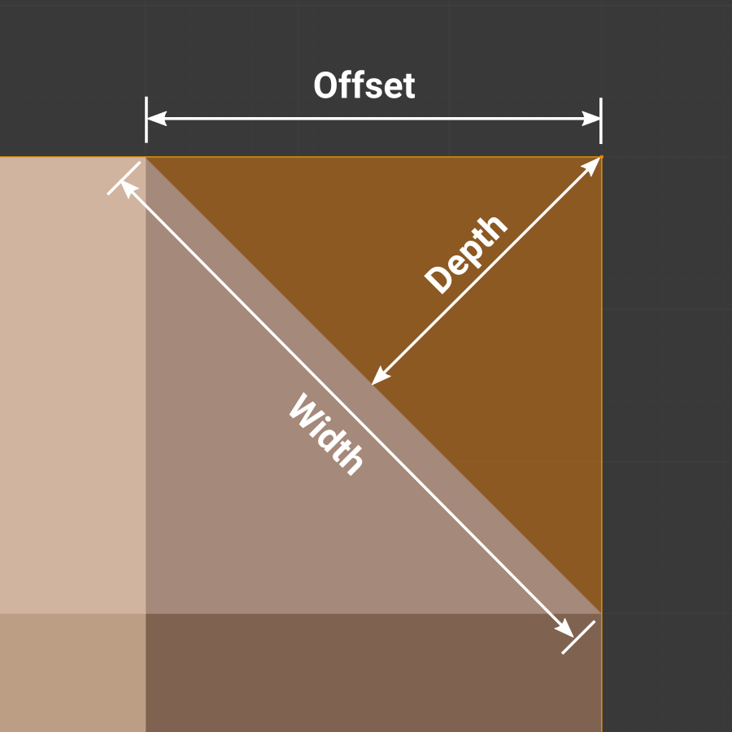

# Ek Bilgiler

Kullanılan Güzel Kaynaklar

 

* [The Blender 2.8 Encyclopedia](https://www.udemy.com/course/the-blender-encyclopedia/) - Udemy'deki sayısı bir elin parmaklarını geçmeyecek kadar az olan, gerçekten uğraşılmış kurslardan birisi. Bizim için önemli olan 9. bölüm "Modifiers", modifier'ların açıklamalarının olduğu bölüm, tabi isterseniz diğer kısımlara da bakabilirsiniz. [Buradan](https://btdig.com/search?q=The+Blender+2.8+Encyclopedia) torrent'ini bulabilirsiniz (vpn gerekebilir).
* [All Modifiers in Blender](https://brandonsdrawings.com/modifiers/) - Brandon's Drawings'in sitesi. Kendisi blender hakkında en iyi kaynaklardan birisidir.

# [Modify](#modify-1)
* [Data Transfer](#data-transfer)
* [Mesh Cache](#mesh-cache)
* [Mesh Sequence Cache](#mesh-sequence-cache)
* [Normal Edit](#normal-edit)
* [Weighted Normal](#weighted-normal)
* [UV Project](#uv-project)
* [UV Warp](#uv-warp)
* [Vertex Weight Edit](#vertex-weight-edit)
* [Vertex Weight Mix](#vertex-weight-mix)
* [Vertex Weight Proximity](#vertex-weight-proximity)

# [Generate](#generate-1)
* [Array](#array)
* [Bevel](#bevel)

 
 

# [Modify]()
Bu kategorideki modfier'lar objenin geometrisini direktmen değiştirmeyen, daha çok objelerin verisini değiştiren modifier'lardır.

## [Data Transfer](https://docs.blender.org/manual/en/3.6/modeling/modifiers/modify/data_transfer.html)
Bilmiyorum.

## [Mesh Cache](https://docs.blender.org/manual/en/3.6/modeling/modifiers/modify/mesh_cache.html)
Bilmiyorum.

## [Mesh Sequence Cache](https://docs.blender.org/manual/en/3.6/modeling/modifiers/modify/mesh_sequence_cache.html)
Bilmiyorum.

## [Normal Edit](https://docs.blender.org/manual/en/3.6/modeling/modifiers/modify/normal_edit.html)
Bilmiyorum.

## [Weighted Normal](https://docs.blender.org/manual/en/3.6/modeling/modifiers/modify/weighted_normal.html)
Bilmiyorum.

## [UV Project](https://docs.blender.org/manual/en/3.6/modeling/modifiers/modify/uv_project.html)
Bilmiyorum.

## [UV Warp](https://docs.blender.org/manual/en/3.6/modeling/modifiers/modify/uv_warp.html)
Bilmiyorum.

## [Vertex Weight Edit](https://docs.blender.org/manual/en/3.6/modeling/modifiers/modify/weight_edit.html)
Bilmiyorum.

## [Vertex Weight Mix](https://docs.blender.org/manual/en/3.6/modeling/modifiers/modify/weight_mix.html)
Bilmiyorum.

## [Vertex Weight Proximity](https://docs.blender.org/manual/en/3.6/modeling/modifiers/modify/weight_proximity.html)
Bilmiyorum.

 
 

# [Generate]()
Bu kategorideki modfier'lar objenin geometrisini direktmen değiştirmeyen, daha çok objelerin verisini değiştiren modifier'lardır.

## [Array](https://docs.blender.org/manual/en/3.6/modeling/modifiers/generate/array.html)
Objeyi istediğiniz sayıda ve yönde kopyalar (aynı veriyi paylaşan kopyalar oluşturur).

* #### Fit Type
Yerleştirme türü.

Mod | Açıklama
:---: | :---:
‎Fixed Count | "Count" input'una verdiğiniz sayı kadar kopya oluşturulur.
Fit Length | "Length" input'unda belirttiğiniz mesafe değerine göre, verdiğiniz offset ile kaç tane kopya sığıyorsa o kadar kopya oluşturur. Bu modda offset kullanmak zorundasınız.
Fit Curve | "Curve" input'unda belirttiğiniz curve'ün uzunluk değerine göre, verdiğiniz offset ile kaç tane kopya sığıyorsa o kadar kopya oluşturur. Bu modda offset kullanmak zorundasınız.

## Relative Offset
Objenin kendi boyut değerlerine göre offset verir.

* #### Factor X/Y/Z
Her bir kopyanın bir önceki kopyaya olan offset'i yani uzaklığı, "Relative Offset" yani objenin kendi boyut değerlerine göre offset olduğu için, mesela herhangi bir ekseni 2 ayarlamak o eksende her kopyanın arasına objenin kendisi kadar boşluk konulmasına sebep olur.

## Constant Offset
Belirttiğiniz değere göre offset verir.

* #### Distance X/Y/Z
Her bir kopyanın bir önceki kopyaya olan offset'i yani uzaklığı, "Constant Offset" yani belirttiğiniz offset değeri objenin büyüklüğünden bağımsız olarak kullanılır.

## Object Offset
Belirttiğiniz objeye göre offset verir. Bu modu sürekli küçülen kopyalar oluşturmak için veya belirli bir nokta etrafında kopyalar oluşturmak için kullanabilirsiniz.

* #### Object
Referans objesi, offset bu objenin transform değerlerine göre (location, rotation, scale) hesaplanır.

## Merge
Belirtilen mesafe değerinden küçük offset'e sahip olan kopyaları birleştirmeye yarar.

* #### Distance
Mesafe değeri, eğer bir önceki ve sonraki kopyalar arasındaki mesafe bu değerden küçükse vertice'leri birleştirilir.

* #### First and Last Copies
Bu ayarı açarak ilk ve son kopyaları birleştirebilirsiniz (tabi eğer aralarındaki mesafe "Distance" input'undan küçükse). Bu ayarı daire oluşturup tekrar başlangıç noktasına gelen kopyalarda kullanabilirsiniz.

## UVs
Offset U/V ayarları ile UV kaydırmanıza yarar.

* #### Offset U/V
X ve Y daha doğru U ve V eksenlerinde yeni oluşturulan kopyalar için UV'yi kaydırır. Eğer her kopyada farklı UV kullanılsın istiyorsanız bunu kullanabilirsiniz.

## Caps
Eğer kopyalar başlarken veya bitince koymak istediğiniz bir obje varsa bu ayarı kullanabilirsiniz.

* #### Cap Start/End
Bu ayarlar ile başlangıca ve sona (her kopya için değil, hepsinden önce ve sonra) koymak istediğiniz objeleri seçebilirsiniz. Mesela tren rayı yaptınız ve başlangıç ile bitişe duvar koymak istiyorsunuz, o zaman bu ayarı kullanabilirsiniz.

## [Bevel](https://docs.blender.org/manual/en/3.6/modeling/modifiers/generate/bevel.html)
Bildiğimiz bevel tool'unun modifier halidir. Daha gelişmiş özellik sunar. Eğer bevel tool'unu bilmiyorsanız internetten ilk baş onu ögrenin. Zaten ayarların çoğu bevel tool'undaki ayarlar ile aynı.

* #### Width Type
Bevel derecesini belirleyen modlardır.

Mod | Açıklama
:---: | :---:
‎Offset | Kenarın face'ler üzerinde kenardan uzaklaşması olarak hesaplanır (resme bakın).
‎Width | Bevel kenarlarının birbirlerinden uzaklaşması olarak hesaplanır, yani aralarındaki mesafe (resme bakın).
Depth | Derinlik yani kenarların içe doğru uzaklaşması olarak hesaplanır (resme bakın).
Percent | Face'lerin uzunluğuna göre yüzdelik olarak bevel hesaplanır. Eğer objenin yüzlerinin boyutu farklı ise, bevel derecesinin de farklı olduğunu görebilirsiniz. Mesela bir dikdörtgen üzerinde bevel modifier uygularsanız kenar'ın uzun olan face'ine daha geniş bevel uygulanmışken kısa olan face'ine daha dar bevel uygulandığını görebilirsiniz.
Absolute | Tam olarak verdiğiniz değere göre bevel hesaplanır.

* #### Amount
Bevel miktarı, "Width Type" ayarına göre bu ayarın çalışma mantığı değişebilir.

* #### Segments
Segment sayısı. Bu ayar zaten bevel tool'unda da var.

* #### Limit Method
Bevel işlemini limitlememize yarayan modlardır.

Mod | Açıklama
:---: | :---:
‎None | Limit yok.
Angle | Kenarın face'ler arasındaki açısına göre limit kullanır. "Angle" input'una veridiğiniz açıdan az açıya sahip olan kenarlara bevel uygulanmaz.
Weight | Kenarların "Bevel Weight" bilgisini kullanır.
Vertex Group | Eğer kenarı oluşturan vertex'lerin hepsi "Vertex Group" input'una verilen vertex group'ta ise bevel uygulanır.

## Profile
Buradan bevel şeklini belirleyebilirsiniz.

Mod | Açıklama
:---: | :---:
‎Superellipse | Default mod. "Shape" input'unun değerini arttırıp azaltarak bevel derecesini belirleyebilirsiniz.
Custom | Bevel şeklini curve aracılığı ile belirleyebilirsiniz.

* #### Sample Straight Edges
Sadece "Profile" ayarı "Custom" modundayken vardır. Curve üzerindeki bütün noktaların handling type'ını yani önceki ve sonraki noktalara bağlanma modlarını vector'e çevirir. Yani noktalar birbirine direktmen bağlanır, ama bu curve üzerinde görünmez. Eğer bevel edilen kenarlara bakarsanız görebilirsiniz.

* #### Sample Even Lengths
Sadece "Profile" ayarı "Custom" modundayken vardır. Curve üzerindeki bütün noktaları eşit dağıtır. Aralarındaki mesafe eşit olur.

## Geometry
Bevel ile ilgili şekil ayarları.

* #### Miter Inner/Outer
Bu ayarlar bevel şekli ile ilgili. [Buradan](https://docs.blender.org/manual/en/3.6/modeling/modifiers/generate/bevel.html#id8) modların yaptığı değişiklikleri görebilirsiniz.

* #### Spread
Sadece "Miter Inner" ayarı "Arc" modundayken vardır. Ekstra vertice'leri yayma derecesini belirler.

* #### Intersections
"Grid Fill" modu default moddur. "Cutoff" modu bevel edilmiş kenarların birbiriyle birleştikleri kısmı siler.

* #### Clamp Overlap
Kenarların bevel edilen kısımlarının birbirleriyle çakışmasını engeller. Çakışmanın başladığı noktada bevel genişliğini durdurur.

* #### Loop Slide
Bevel edilen kenarlardan bazılarının bağlı olduğu face'lerin boyutu farklı olduğu için sünme oluyorsa bu ayarı açarak bütün kenarlardaki bevel'ları eşitleyebilirsiniz. Güzel video bulamadım ama [buna](https://youtu.be/vLzY4ApZZcE?t=907) bakabilirsiniz.

## Shading
Bevel ile ilgili shading ayarları.

* #### Harden Normals
Oluşturulan bevel face'lerinin normal'larını yani baktıkları yönleri düzenler. Shading sorunlarını çözer.

* #### Mark Seam
Bilmiyorum.

* #### Mark Sharp
Bilmiyorum.

* #### Material Index
Bevel ile oluşturulan kenarlar için Materials bölümündeki (Properties > Material) materyallerden hangisinin kullanılacağını belirler. -1 yaparsanız otomatik olarak materyal atanır yani bevel ile oluşturulan kenarlara objenin bevel olmadan önceki halinde en yakın olan face'in rengi verilir. Bu sayıyı 0 veya daha büyük bir sayı yaparsanız index belitmiş olursunuz, yani Materials bölümündeki (Properties > Material) materyallerden birini seçmiş olursunuz. 0 yaparsanız ilk, 1 yaparsanız 2. materyal kullanılır ve bu şekilde verdiğiniz index'teki materyal kullanılır. Index sayıları yazılım dillerinde 0'dan başlar.

* #### Face Strength
Bilmiyorum.

