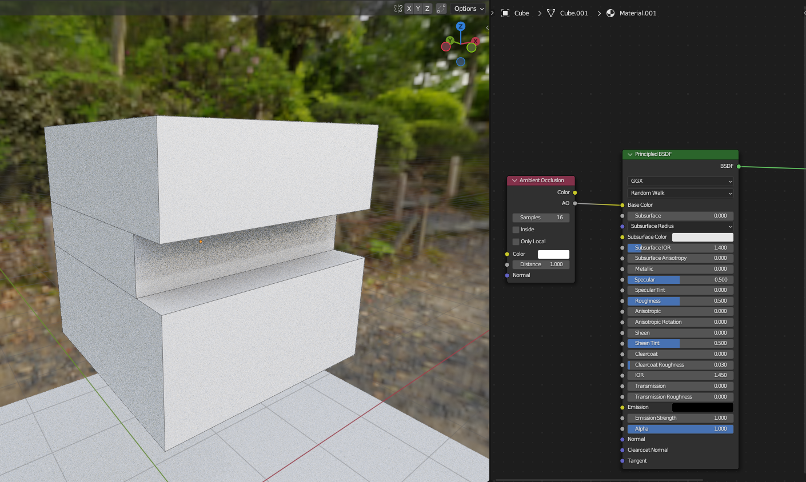
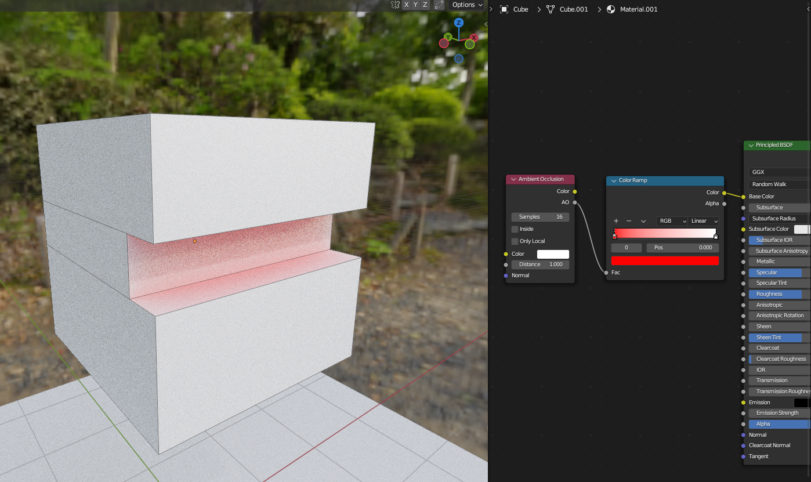
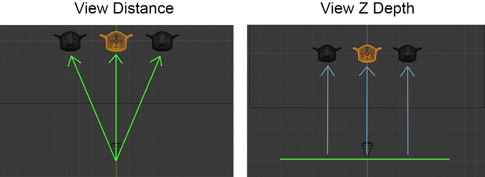
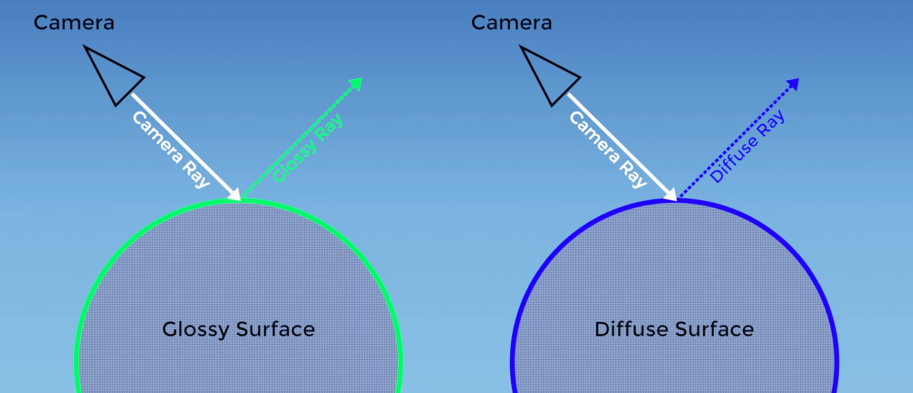
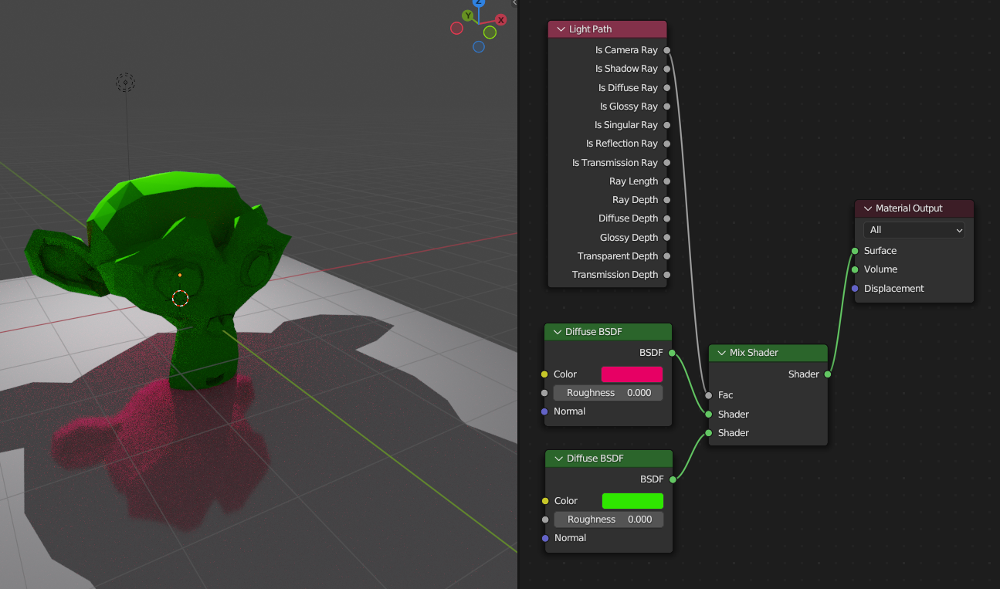
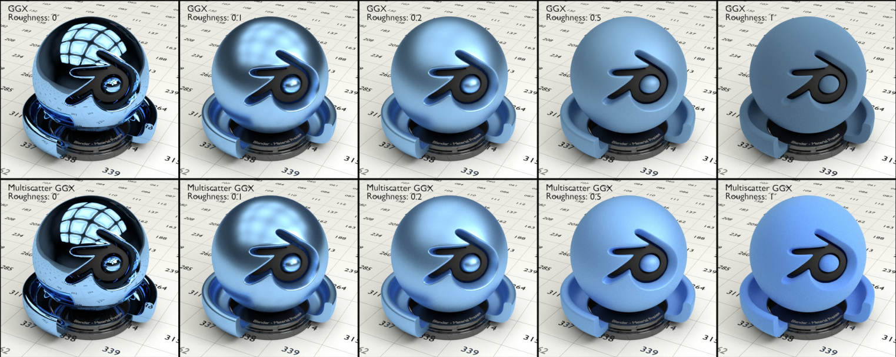
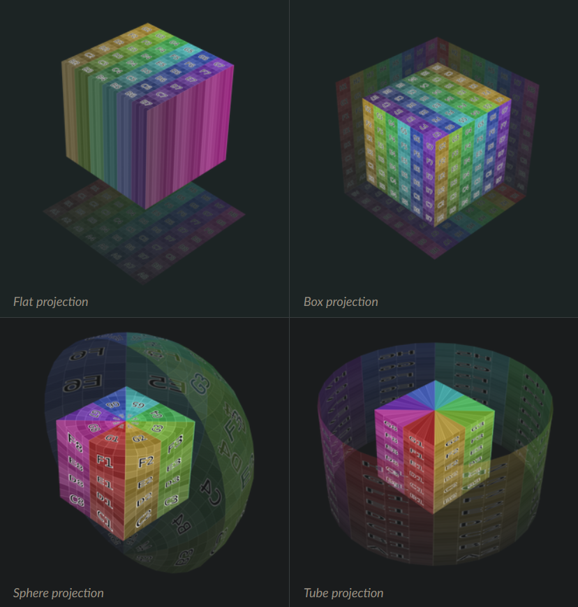
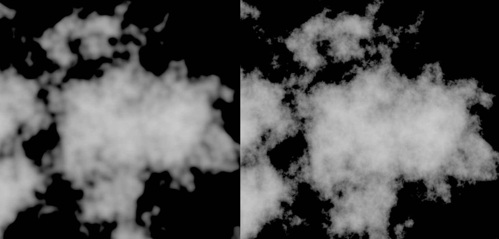
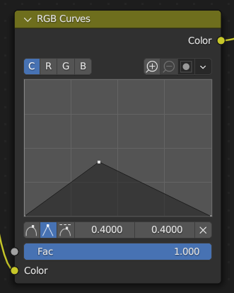
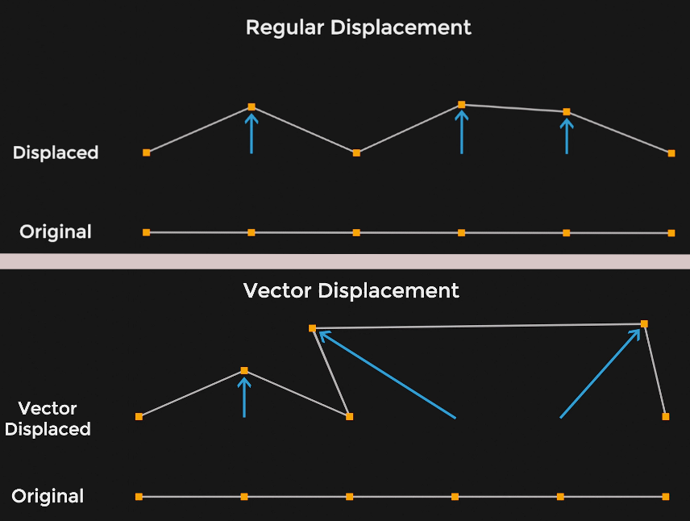

Aşağıdaki döküman Cycles render motoru kullanıldığı varsayılarak hazırlanmıştır. Eğer farklı bir render motoru kullanıyorsanız birçok özellik farklılık gösterecek veya çalışmayacaktır.

# Ek Bilgiler

Güzel Kaynaklar

 

* [The Blender 2.8 Encyclopedia](https://www.udemy.com/course/the-blender-encyclopedia/) - Udemy'deki sayısı bir elin parmaklarını geçmeyecek kadar az olan, gerçekten uğraşılmış kurslardan birisi. Bizim için önemli olan 14. bölüm "Shaders and Materials", bütün shader node'larının kendisine özel videolarının olduğu bölüm, tabi isterseniz diğer kısımlara da bakabilirsiniz. [Buradan](https://btdig.com/search?q=The+Blender+2.8+Encyclopedia) torrent'ini bulabilirsiniz (vpn gerekebilir).
* [The Cycles Encyclopedia](https://www.blenderdiplom.com/en/shop/576-the-cycles-encyclopedia.html) - Cycles üzerine shaderlar ve daha fazlası hakkında en kapsamlı kaynaklardan birisi. [Buradan](https://annas-archive.org/md5/070b8cc769760f1cd49350c046940a3e) pdf'ini indirebilirsiniz.

Node Editörü Kısayolları

 

Aşağıdaki kısayolların çoğu [Node Wrangler](https://docs.blender.org/manual/en/latest/addons/node/node_wrangler.html) eklentisinin özellikleridir. Node Wrangler eklentisini etkinleştirmek için sol üstteki "Edit" menüsünden (Preferences > Add-ons > "Node Wrangler" şeklinde aratın) ve çıkan eklentiyi etkinleştirin. Sadece gerekli gördüğüm kısayolları ekledim, amacım ne var ne yoksa yazmak değil, zaten bütün kısayolları (Preferences > Keymap) bölümünde bulabilirsiniz. Kısayollar en yararlıdan en yararsıza (yani kullanışsıza) göre sıralanmıştır ama dediğim gibi, sadece gerekli gördüğüm kısayolları ekledim, en alttaki kısayol bile yeri gelince kullanılabilir.

Genel Kısayollar | Açıklama
:---: | :---:
G | Node'u hareket ettirir.
A | Editördeki bütün node'ları seçer.
Home | Bütün node'lara odaklanır. Editörün büyüklüğünü bütün node'ları görecek hale getirir.
X / Delete | X veya Delete tuşuna basarsanız seçili olan node'lar silinir.
Shift + A | Yeni node ekleme menüsünü açar.
Ctrl + C | Seçilen node'ları panoya kopyalar.
Ctrl + V | Panoda en son kopyalanan şeyi yapıştırır.
Shift + D | Seçilen node'ları duplicate eder yani kopyalarını oluşturur.
Shift + W | Node Wrangler menüsünü açar.
M | Seçilen node'ları mute eder, yani siz açana kadar (aynı işlemi tekrarlayın) yoklarmış gibi varsayılır.
Ctrl + F | Editördeki node'lar üzerinde arama yapmamıza yarar.

 

Grup Kısayolları | Açıklama
:---: | :---:
Ctrl + G | Seçilen node'lardan [grup](#make-group) oluşturur.
Ctrl + Alt + G | Seçilen gruptaki node'ları dışarı alır, gruptan çıkarır.
Tab | En son seçilen gruba girer/çıkar. Eğer iç içe birden fazla grup oluşturduysanız ve tab tuşu ile çıkılmaz hale getirdiyseniz, editör üzerine sağ tıklayarak "Exit Group" butonunu kullanabilirsiniz.

 

Gelişmiş Kısayollar | Açıklama
:---: | :---:
Backspace | Seçilen node'ların bütün ayarlarını sıfırlar. Yapılan değişiklikleri kaldırır.
‎Shift + S | Seçili olan node'ları açılan panelden seçtiğiniz yeni node'a çevirir.
Ctrl + Shift + Sol Mouse | (Ctrl + Shift) tuşlarına basarken bir node üzerine sol tık yaparsanız o node'u otomatikmen output node'una bağlar, yani o node'un içeriğini görüntüler.
Ctrl + Sağ Mouse Kaydırma | Ctrl tuşuna basarken sağ mouse tuşunuza basıp node editörü üzerinde kaydırırsanız bir çizgi çıktığını göreceksiniz. Bu çizginin üzerine gelen bütün bağlar koparılır.
Ctrl + Alt + Sağ Mouse Kaydırma | (Ctrl + Alt) tuşlarına basarken sağ mouse tuşunuza basıp node editörü üzerinde kaydırırsanız bir çizgi çıktığını göreceksiniz. Bu çizginin üzerine gelen bütün bağlar mute edilir, yani siz açana kadar (aynı işlemi tekrarlayın) yoklarmış gibi varsayılır.
Ctrl + T | Herhangi bir [shader](#shader-1) node'u seçtikten sonra (Ctrl + T) tuşlarına basarsanız sizin için otomatiken [Mapping](#mapping) node'una bağlanmış [Texture Coordinate](#texture-coordinate) değeri ile birlikte [Image Texture](#image-texture) node'u ekler. Eğer herhangi bir [Texture](#texture-1) node'u seçili iken (Ctrl + T) tuşlarına basarsanız aynı işlem gerçekleşir ama sadece [Mapping](#mapping) node'una bağlanmış [Texture Coordinate](#texture-coordinate) değeri eklenir.
Alt + R | Kullanılan texture/resim'leri yeniler, değişiklik yapıldıysa falan diye.
Ctrl + Shift + Sağ Mouse | (Ctrl + Shift) tuşlarına basarken bir node üzerine sağ tık yapıp da başka bir node üzerine kaydırırsanız otomatik olarak mix node'u ekler. İki node'un da ilk input'unu mix node'una bağlar.
Shift + C | "Settings From Active" ayarı aktif node'un bütün özelliklerini seçilen node'lara aktarır. Seçilen node'ların aynı türden olması gerekir.
Shift + V | Seçilen node'ların label'ını aktif node'un label'ı olarak ayarlar.
Alt + Sağ Mouse | Alt tuşuna basarken bir node üzerine sağ tık yapıp da başka bir node üzerine kaydırırsanız otomatik olarak bağlama işlemi yapar. Bağlanan node'un ilk output'unu, bağlanacak node'un o veri tipine uygun ilk input'una bağlar. Tek output'u olan node'lar için kullanışlıdır.
Shift + Alt + D | Seçilmiş node'ların output bağlarını koparır.
Alt + S | Seçili olan node'un input'larına bağlanan ilk iki bağın yerlerini değiştirir.
Shift + P | Seçili olan node'ları frame içerisine alır.
Alt + X | Kullanılmamış (bağlanmamış) node'ları siler.
Shift + Sağ Mouse Kaydırma | Shift tuşuna basarken sağ mouse tuşunuza basıp node editörü üzerinde kaydırırsanız bir çizgi çıktığını göreceksiniz. Bu çizginin üzerine gelen bütün bağlara [Reroute](#reroute) eklenir.

# [Input](#input-1)
* [Ambient Occlusion](#ambient-occlusion)
* [Attribute](#attribute)
* [Bevel](#bevel)
* [Camera Data](#camera-data)
* [Color Attribute](#color-attribute)
* [Curves Info](#curves-info)
* [Fresnel](#fresnel)
* [Geometry](#geometry)
* [Layer Weight](#layer-weight)
* [Light Path](#light-path)
* [Object Info](#object-info)
* [Particle Info](#particle-info)
* [Point Info](#point-info)
* [RGB](#rgb)
* [Tangent](#tangent)
* [Texture Coordinate](#texture-coordinate)
* [UV Map](#uv-map)
* [Value](#value)
* [Volume Info](#volume-info)
* [Wireframe](#wireframe)

# [Output](#output-1)
* [AOV Output](#aov-output)
* [Light Output](#light-output)
* [Material Output](#material-output)
* [World Output](#world-output)

# [Shader](#shader-1)
* [Add Shader](#add-shader)
* [Anisotropic BSDF](#anisotropic-bsdf)
* [Background](#background)
* [Diffuse BSDF](#diffuse-bsdf)
* [Emission](#emission)
* [Glass BSDF](#glass-bsdf)
* [Glossy BSDF](#glossy-bsdf)
* [Hair BSDF](#hair-bsdf)
* [Holdout](#holdout)
* [Mix Shader](#mix-shader)
* [Principled BSDF](#principled-bsdf)
* [Principled Hair BSDF](#principled-hair-bsdf)
* [Principled Volume](#principled-volume)
* [Refraction BSDF](#refraction-bsdf)
* [Subsurface Scattering](#subsurface-scattering)
* [Toon BSDF](#toon-bsdf)
* [Translucent BSDF](#translucent-bsdf)
* [Transparent BSDF](#transparent-bsdf)
* [Velvet BSDF](#velvet-bsdf)
* [Volume Absorption](#volume-absorption)
* [Volume Scatter](#volume-scatter)

# [Texture](#texture-1)
* [Brick Texture](#brick-texture)
* [Checker Texture](#checker-texture)
* [Environment Texture](#environment-texture)
* [Gradient Texture](#gradient-texture)
* [IES Texture](#ies-texture)
* [Image Texture](#image-texture)
* [Magic Texture](#magic-texture)
* [Musgrave Texture](#musgrave-texture)
* [Noise Texture](#noise-texture)
* [Point Density](#point-density)
* [Sky Texture](#sky-texture)
* [Voronoi Texture](#voronoi-texture)
* [Wave Texture](#wave-texture)
* [White Noise Texture](#white-noise-texture)

# [Color](#color-1)
* [Brightness/Contrast](#brightnesscontrast)
* [Gamma](#gamma)
* [Hue/Saturation/Value](#huesaturationvalue)
* [Invert Color](#invert-color)
* [Light Falloff](#light-falloff)
* [Mix Color](#mix-color)
* [RGB Curves](#rgb-curves)

# [Vector](#vector-1)
* [Bump](#bump)
* [Displacement](#displacement)
* [Mapping](#mapping)
* [Normal](#normal)
* [Normal Map](#normal-map)
* [Vector Curves](#vector-curves)
* [Vector Displacement](#vector-displacement)
* [Vector Rotate](#vector-rotate)
* [Vector Transform](#vector-transform)

# [Converter](#converter-1)
* [Blackbody](#blackbody)
* [Clamp](#clamp)
* [Color Ramp](#color-ramp)
* [Combine Color](#combine-color)
* [Combine XYZ](#combine-xyz)
* [Float Curve](#float-curve)
* [Map Range](#map-range)
* [Math](#math)
* [Mix](#mix)
* [RGB to BW](#rgb-to-bw)
* [Separate Color](#separate-color)
* [Separate XYZ](#separate-xyz)
* [Vector Math](#vector-math)
* [Wavelength](#wavelength)

# [Script](#script-1)
* [Script](#script-2)

# [Group](#group-1)
* [Make Group](#make-group)
* [Ungroup](#ungroup)

# [Layout](#layout-1)
* [Frame](#frame)
* [Reroute](#reroute)

 
 

# Input
Bu kategorideki node'lar bu shader'ı kullanan obje/mesh'in bilgilerini verirler. Bu bilgileri kullanarak shader'ı yapılandırırız. Bu yüzden kategorinin ismi "Input" dur.

## [Ambient Occlusion](https://docs.blender.org/manual/en/latest/render/shader_nodes/input/ao.html)
Mesh'in üzerindeki gölgeleri veya gölgede kalan kısımlarını hesaplayıp renkli ve grayscale map'lerini verir. Bu hesaplama aslında ışıktan bağımsızdır yani gerçekten ışığın nereye vurduğunu nereye vurmadığını kontrol etmez. Gölgeleme işlemi çoğunlukla mesh'in kenarlarında ve çevresi bloklanan kısımlarında olur.

* #### Color (Output)
"Color" inputuna verdiginiz renk map'inin gölge vuran kısımlarının siyaha kaymış halini verir. Yani verdiginiz renkli map'e sanki gölge vurmuş gibi siyah renk efekti eklenmiş halini verir.

* #### AO (Output)
Gölge vuran kısımların siyaha kaydığı (yani 0'a), diğer kısımların da beyaza kaydığı (yani 1'e) grayscale map. Gölge map'i.

* #### Samples (Node Input)
Gölge vuran kısımlar hesaplanırken kullanılacak hesaplama kalitesi.

* #### Inside (Node Input)
Bu ayar açıldığında gölge vuran kısımlar mesh'in dışına göre değil de içine göre hesaplanır.

* #### Only Local (Node Input)
Bu ayar açıkken gölgeler sadece mesh'in kendisinden gelebilir yani gölgeler mesh'in kendi kendini bloklayan kısımlarına göre hesaplanır. Bu ayar kapalıyken başka objelerin de bloklaması ile mesh gölgelenebilir.

* #### Color (Socket Input)
Mesh'in gölgeleme işleminden önceki shader'ı. Bu inputa mesh'in rengi yani texture'u baglanabilir. Renk inputu yani. "Color" output'u bu input'a verilen renk map'inin gölge vuran kısımlarının siyaha kaymış halini verecek.

* #### Distance (Socket Input)
Gölgelerin maksimum yayılabileceği mesafe. Normalde gölgeler köşe/kenarlar'dan mesh'in etrafına doğru biraz yayılır. Bu ayar ile yayılım mesafesini ayarlayabilirsiniz. Eğer bu ayarı azaltırsanız gölgelerin köşeye doğru kısıtlandığını görebilirsiniz, arttırırsanız da gölgeler daha fazla yayılır.

* #### Normal (Socket Input)
Eğer shader'ın kullandığı normal map varsa buraya bağlayın. İşlemler normal map dikkate alınarak yapılır.

## [Attribute](https://docs.blender.org/manual/en/latest/render/shader_nodes/input/attribute.html)
Obje üzerinden gelen değerleri alıp kullanmamıza yarar ama artık neredeyse hiç kullanılmıyor. Henüz diğer node'lardan birinde kullanılmamış (dolayısıyla kullanıma açılmamış, test aşamasındaki) attribute'leri (bilgi, değer) almamıza yarar. Attribute listesine [buradan](https://blender.stackexchange.com/questions/14262/what-can-you-call-from-the-attribute-node#14267) (ayrıca linkteki kodların olduğu [link](https://github.com/martijnberger/blender/blob/master/intern/cycles/render/attribute.cpp#L191)) ulaşabilirsiniz.

* #### Color (Output)
Bilmiyorum.

* #### Vector (Output)
Bilmiyorum.

* #### Fac (Output)
Bilmiyorum.

* #### Alpha (Output)
Bilmiyorum.

* #### Type (Node Input)
Bilmiyorum.

* #### Name (Node Input)
Bilmiyorum.

## [Bevel](https://docs.blender.org/manual/en/latest/render/shader_nodes/input/bevel.html)
Mesh'in kenar olan kısımlarını açısal farklara dayanarak bulur ve bu kenarlara bevel uygulanmış normal map'i output olarak verir.

* #### Normal (Output)
Bevel uygulanmış normal map.

* #### Samples (Node Input)
Normal map ve bevel kalitesi.

* #### Radius (Socket Input)
Bevel miktarı/derecesi/şiddeti.

* #### Normal (Socket Input)
Eğer shader'ın kullandığı normal map varsa buraya bağlayın. İşlemler normal map dikkate alınarak yapılır.

## [Camera Data](https://docs.blender.org/manual/en/latest/render/shader_nodes/input/camera_data.html)
Kamera yani bakış açısı ile ilgili bilgileri verir.

* #### View Vector (Output)
Kameranın baktığı yön vektörü.

* #### View Z Depth (Output)
Kameraya olan uzaklık değeri, yani "View Distance" output'u gibidir ama daha farklı bir çalışma şekli vardır. Sanal bir plane (düz plaka/levha yani düzlem) oluşturulur ve bu plane'in normal'i (yani baktığı yön) kameranın baktığı yöndür ve output da bu plane'e olan uzaklık değerini döndürür (obje üzerindeki her bir nokta için).

* #### View Distance (Output)
Kameraya olan uzaklık değeri (obje üzerindeki her bir nokta için).

## [Color Attribute](https://docs.blender.org/manual/en/latest/render/shader_nodes/input/vertex_color.html)
Objenin ayarlarından "Color Attributes" (Properties > Data > Color Attributes) bölümüne eklenmiş renk değerlerini almamıza yarar.

* #### Color (Output)
Renk.

* #### Alpha (Output)
Alpha değeri.

* #### Color Attribute (Node Input)
Attribute'ün ismi. İsimleri bilmenize gerek yok zaten bu bölüme tıkladığınızda otomatikmen şu anki attribute'leri listeleyecektir. Ayrıca şu an seçili olan attribute silinmişse bu bölüm kırmızıya döner (deneyip görebilirsiniz).

## [Curves Info](https://docs.blender.org/manual/en/latest/render/shader_nodes/input/hair_info.html)
Bilmiyorum.

* #### Is Strand (Output)
Bilmiyorum.

* #### Intercept (Output)
Bilmiyorum.

* #### Length (Output)
Bilmiyorum.

* #### Thickness (Output)
Bilmiyorum.

* #### Tangent Normal (Output)
Bilmiyorum.

* #### Random (Output)
Bilmiyorum.

## [Fresnel](https://docs.blender.org/manual/en/latest/render/shader_nodes/input/fresnel.html)
Objenin yüzeyinden ne kadar ışığın yansıdığını hesaplar, yansıma miktarı fazla ise beyaza (yani 1'e) düşük ise siyaha (yani 0'a) kayan bir grayscale map verir. Yaptıgı işlemler şöyle gerçekleşir, kameranın bakış açısı ile yüzeyin bakış açısını baz alarak, aralarındaki paralellik oranı yüksekse siyaha (yani 0'a) kayan, aralarındaki paralellik oranı düşükse (en fazla 90 dereceye kadar çünkü 90'da zaten dik açı oluşturmuş olurlar yani paralellik 0 olur) beyaza kayan (yani 1'e) grayscale map verir. Yani kameranın bakış açısı ile yüzeyin bakış açısının paralelligini kontrol eder. Bu işlem genellikle obje'nin kenarlarından ortasına doğru beyazdan siyaha kayan bir renk map'i oluşturur. Fresnel'i özellikle shader'ın çevresi (bakış açımıza göre) yani kenarı üzerinde efekt oluşturacağımız zaman kullanırız.

* #### Fac (Output)
Grayscale map.

* #### IOR (Socket Input)
Bu değer arttıkça output map'indeki beyaz renkler köşelerden ortaya doğru yaklaşır, azalttıkça köşelere yaklaşır. Aslında bu değer yüzeyin [Index of Refraction](https://en.wikipedia.org/wiki/Refractive_index) değerini ayarlar, yani ışığın yönünün obje içinden geçerken kırılma derecesini.

* #### Normal (Socket Input)
Eğer shader'ın kullandığı normal map varsa buraya bağlayın. İşlemler normal map dikkate alınarak yapılır.

## [Geometry](https://docs.blender.org/manual/en/latest/render/shader_nodes/input/geometry.html)
Mesh hakkında geometrik bilgiler verir. 

* #### Position (Output)
Shader render edilirken mesh üzerindeki her bir nokta için dünya üzerindeki pozisyon vektörü. Yani shader ekrana çizilirken her bir nokta için bu bilgi farklı olabilir, her bir noktaya göre bu bilgiyi verir.

* #### Normal (Output)
Shader render edilirken mesh üzerindeki her bir nokta için noktanın baktığı yön vektörü. Yani shader ekrana çizilirken her bir nokta için bu bilgi farklı olabilir, her bir noktaya göre bu bilgiyi verir.

* #### Tangent (Output)
[Tangent](#tangent) node'u ile aynı şeyi verir dolayısıyla [Tangent](#tangent) node'una bakın. Default olarak Z eksenindeki tangent değerini verir ve istediğiniz ekseni seçemezsiniz o yüzden [Tangent](#tangent) node'unu kullanın.

* #### True Normal (Output)
"Normal" output'u ile aynıdır ama noktalar için değil de yüzler içindir yani mesh'in her bir yüzü için yüzün baktığı yönü verir.

* #### Incoming (Output)
Shader render edilirken mesh üzerindeki her bir nokta için noktanın kameraya doğru baktığı yön vektörü. Yani shader ekrana çizilirken her bir nokta için bu bilgi farklı olabilir, her bir noktaya göre bu bilgiyi verir.

* #### Parametric (Output)
Mesh'in her bir üçgeni için (dörtgenleri de üçgene çevirir) UV değerini verir. Bu UV değeri ile bütün üçgenler üzerinde işlemler yapabilirsiniz.

* #### Backfacing (Output)
Mesh'in ön ve arka yüzünü ayırt etmek içindir. İç olan taraf için 1, dış olan taraf için 0 değeri döndürür.

* #### Pointiness (Output)
Mesh'in keskin açıları için 1'e kayan değer, düz olan kısımları için 0'a kayan değer verir.

* #### Random Per Island (Output)
Bu shader'ı kullanan her obje için birbirinden farklı olmak üzere 0 ile 1 arasında rastgele değer verir.

## [Layer Weight](https://docs.blender.org/manual/en/latest/render/shader_nodes/input/layer_weight.html)
[Fresnel](#fresnel) gibidir. Ek olarak keskinlik ayarı da vardır. "IOR" input'u yerine "Blend" input'unu kullanır.

* #### Fresnel (Output)
[Fresnel](#fresnel) ile aynı mantıkta çalışır, Fresnel'in [Fac](#fac-output-1) output'u ile aynıdır.

* #### Facing (Output)
[Fresnel](#fresnel) ile aynı mantıkta çalışır ama daha keskindir. Fresnel yüzeyleri bir bütün gibi etkilerken bu özellik her bir noktayı etkilermiş gibi output verir. Yani noktanın baktığı yön ile kameranın baktığı yönün paralelligi birazcık azalsa hemen fark edilir. Bu da hesaplanan efektin dairesel olarak dağıldığını bile görebilmemizi sağlar (test ederek kendiniz de görebilirsiniz).

* #### Blend (Socket Input)
Fresnel efekti için keskinlik derecesini ayarlar. Değer düştükçe fresnel efekti şiddetlenir, arttıkça fresnel efekti azalır.

* #### Normal (Socket Input)
Eğer shader'ın kullandığı normal map varsa buraya bağlayın. İşlemler normal map dikkate alınarak yapılır.

## [Light Path](https://docs.blender.org/manual/en/latest/render/shader_nodes/input/light_path.html)
Kameranın yolladığı ışık ışınları (ray) ile ilgili bilgiler verir. Evet ışınlar kameraya gelmiyor, kamera ışıklara doğru ışınlar yolluyor. Gerçek hayattaki ışığın yazılımsal olarak çalışma şekli bu (Path Tracing). Bu node'u anlatırken ışık ışınlarının (ray) farklı farklı yüzeylerden sektiğini ve kameraya ulaştığını göreceksiniz. "Path Tracing" özelliği ışık ışınının başına gelen bütün olayları kaydeder. Bu sayede ışık ışınlarının hangi yüzeylerden sektiğini bile bilebileceksiniz. Yani ışık ışınlarının sektiği yüzeylerin hangi shader türüne ait olduğu çok önemli. Aşağıdaki resime bakın.

* #### Is Camera Ray (Output)
Işığın geldiği noktanın tam olarak objeye ait olup olmadığını kontrol eder. Yani eğer ışık kameraya mesh üzerinden geliyorsa yani yansıma yoksa ve orijinal konum dışında bir yerden gelmiyorsa 1 döndürür, eğer yansıma ile geliyorsa yani orijinal konumdan gelmiyorsa 0 döndürür. Mesela bunu kullanıp iki shader'ı birleştirirken mix faktörü olarak kullanırsanız, objeyi yeşil renk yapabilir ve obje dışındaki her şeye objeyi kırmızı olarak yansıtabilirsiniz (örnek veriyorum).

* #### Is Shadow Ray (Output)
Işığın geldiği noktanın gölge olan kısma ait olup olmadığını kontrol eder (hem objenin üzerindeki hem gölgenin vurduğu yerdeki). Eğer ışık kameraya gölge olan kısımdan geliyorsa 1'e kayan, gölge olmayan kısımdan geliyorsa 0'a kayan değer döndürür.

* #### Is Diffuse Ray (Output)
Bunu "Is Camera Ray" ile karıştırabilirsiniz çünkü çalışma şekli ona çok benziyor, "Is Camera Ray" ışığın geldiği noktanın objeye ait olup olmadığını kontrol ederken, "Is Diffuse Ray" ışığın [Diffuse shader](#diffuse-bsdf) özelliği taşıyan bir shader'dan gelip gelmediğini (direktmen) kontrol eder.

* #### Is Glossy Ray (Output)
Işığın [Glossy shader](#glossy-bsdf) özelliği taşıyan bir shader'dan gelip gelmediğini (direktmen) kontrol eder.

* #### Is Singular Ray (Output)
Işık ışını eğer tek bir yol izleyerek kameraya geliyorsa 1 değeri döndürür. Eğer ışık ışını tek bir doğru yol izlemeden kameraya geliyorsa 0 değeri döndürür. Bu şu anlama geliyor, ışık ışını bir yüzeye çarptığında yüzeyin pürüzlülüğüne yani yansıtmasına göre birden fazla ışık ışını şeklinde etrafa saçılabilir veya tek bir ışık ışını şeklinde de yansıyabilir. Eğer yüzey çok pürüzlü ise ışık ışını çok fazla parçacığa ayrılacak ve yansıma çok bulanık olacaktır. Eğer yüzey pürüzsüz ise ışık ışını tek bir parça olarak yansıyacak ve görüntü hiç bozulmamış, keskin bir halde olacaktır. İşte bu keskin yansıma yapan yüzeyler görüntüyü bozmadan yansıtırlar, yani tek bir ışık ışını şeklinde. Bu output da bize ışığın kameraya tek bir ışık ışını şeklinde geldiği noktaları verir. Ayna buna en iyi örneklerden biridir.

* #### Is Reflection Ray (Output)
Eğer ışık ışını bir yerden sekip de kameraya geldiyse yani yansıma ise 1, degilse 0 döndürür. Yani ışığın yansıma olup olmadığını kontrol eder.

* #### Is Transmission Ray (Output)
Eğer ışık ışını saydam bir objeden geçip de kameraya geldiyse 1, degilse 0 döndürür. Yani objenin saydam bir objeden geçip geçmediğini kontrol eder.

* #### Ray Length (Output)
Işık ışınının (ray) gittiği mesafe değeri. 0'dan başlayıp sonsuza kadar artabilir.

* #### Ray Depth (Output)
Işık ışınının (ray) toplamda kaç defa sektiğini veya kaç şeyin içinden geçtiğini gösterir. Mesela direktmen kameraya geldiyse 1 döndürür, kameranın önünde cam varsa ve camdan geçip geldiyse 2 döndürür. Bu sayı en fazla render ayarlarından ayarlanan (Properties > Render > Light Paths > Max Bounces > Total) maximum sekme sayısı kadar olabilir.

* #### Diffuse Depth (Output)
Çalışma mantığı "Ray Depth" ile aynıdır ama sadece [Diffuse shader](#diffuse-bsdf) özelliği taşıyan shader'lara özeldir. Yani ışık ışınının (ray) toplamda kaç defa [Diffuse shader](#diffuse-bsdf) özelliği taşıyan shader'lardan sektiğini gösterir. Bu sayı en fazla render ayarlarından ayarlanan (Properties > Render > Light Paths > Max Bounces > Diffuse) maximum sekme sayısı kadar olabilir.

* #### Glossy Depth (Output)
Çalışma mantığı "Ray Depth" ile aynıdır ama sadece [Glossy shader](#glossy-bsdf) özelliği taşıyan shader'lara özeldir. Yani ışık ışınının (ray) toplamda kaç defa [Glossy shader](#glossy-bsdf) özelliği taşıyan shader'lardan sektiğini veya geçtiğini gösterir. Bu sayı en fazla render ayarlarından ayarlanan (Properties > Render > Light Paths > Max Bounces > Glossy) maximum sekme sayısı kadar olabilir.

* #### Transparent Depth (Output)
Çalışma mantığı "Ray Depth" ile aynıdır ama sadece [Transparent shader](#transparent-bsdf) özelliği taşıyan shader'lara özeldir. Yani ışık ışınının (ray) toplamda kaç defa [Transparent shader](#transparent-bsdf) özelliği taşıyan shader'lardan sektiğini veya geçtiğini gösterir. Bu sayı en fazla render ayarlarından ayarlanan (Properties > Render > Light Paths > Max Bounces > Transparent) maximum sekme sayısı kadar olabilir.

* #### Transmission Depth (Output)
Çalışma mantığı "Ray Depth" ile aynıdır ama sadece Transmission shader özelliği taşıyan shader'lara özeldir. Yani ışık ışınının (ray) toplamda kaç defa Transmission shader özelliği taşıyan shader'lardan sektiğini veya geçtiğini gösterir. Bu sayı en fazla render ayarlarından ayarlanan (Properties > Render > Light Paths > Max Bounces > Transmission) maximum sekme sayısı kadar olabilir.

## [Object Info](https://docs.blender.org/manual/en/latest/render/shader_nodes/input/object_info.html)
Obje hakkında bilgiler verir.

* #### Location (Output)
Objenin orijin noktasını verir. Geometry'deki ["Position"](#position-output) gibi her nokta için konum vermez, sadece objenin orijin noktasını verir.

* #### Color (Output)
Objenin ayarlarından ayarlanmış renk değerini (Properties > Object > Viewport Display > Color) verir.

* #### Alpha (Output)
Objenin ayarlarından ayarlanmış renk değerinin (Properties > Object > Viewport Display > Color) alpha kanalını verir.

* #### Object Index (Output)
Objenin ayarlarından ayarlanmış "Pass Index" (Properties > Object > Relation > Pass Index) değerini verir.

* #### Material Index (Output)
Objenin material ayarlarından ayarlanmış "Pass Index" (Properties > Material > Settings > Pass Index) değerini verir.

* #### Random (Output)
Bu shader'ı kullanan her obje için birbirinden farklı olmak üzere 0 ile 1 arası rastgele değer verir.

## [Particle Info](https://docs.blender.org/manual/en/latest/render/shader_nodes/input/particle_info.html)
Bilmiyorum.

## [Point Info](https://docs.blender.org/manual/en/latest/render/shader_nodes/input/point_info.html)
Bilmiyorum.

## [RGB](https://docs.blender.org/manual/en/latest/render/shader_nodes/input/rgb.html)
Renk veri tipinde bir değer oluşturmanıza yarar, yani renk oluşturmanıza yarar. Oluşturduğunuz rengi renk input'u olan herhangi bir node'a bağlayabilirsiniz.

## [Tangent](https://docs.blender.org/manual/en/latest/render/shader_nodes/input/tangent.html)
[Anisotropic BSDF](#anisotropic-bsdf) için tangent yönünü değiştirmenize yarar, isterseniz XYZ eksenlerinden birini seçebilir veya full kontrol için UV Map kullanabilirsiniz.

* #### Tangent (Output)
Tangent değeri.

* #### Direction Type (Node Input)
Mod | Açıklama
:---: | :---:
‎Radial | Normalde kullanılan dairesel tangent. İstediğiniz ekseni seçebilirsiniz.
‎UV Map | Verilen UV Map'e göre tangent şekillenir. UV Map üzerinde değişiklik yaptığınızda tangent'in de değiştiğini görebilirsiniz.

## [Texture Coordinate](https://docs.blender.org/manual/en/latest/render/shader_nodes/input/texture_coordinate.html)
Shader'ları ve texture'ları düzgün bir şekilde mesh'e yerleştirebilmemiz için gerekli olan mesh boyut değerlerini verir.

* #### Generated (Output)
Otomatik olarak hesaplanmış UV'yi (Texture Space) kullanır. Eğer çok basit bir mesh'iniz varsa ve bu UV güzel ise kullanabilirsiniz ama çoğu durumda UV güzel bir şekilde oturmayacaktır, böyle durumlarda kendi yaptığınız UV'yi kullanabilirsiniz.

* #### Normal (Output)
Mesh'in her bir yüzünün baktığı yön değerini verir.

* #### UV (Output)
Mesh'in ayarlarından ayarlanmış (Properties > Data > UV Maps) aktif UV'sini (yanında kamera işareti olan) verir.

* #### Object (Output)
"Object" input'una verdiğiniz objenin transform değerlerini (Location, Rotation, Scale) UV olarak kullanır.

* #### Camera (Output)
Kameranın bakış açısına göre texture'u yerleştirmeye yarar, nereden bakarsak bakalım aynı görünür.

* #### Window (Output)
"Camera" output'u ile aynıdır, tek farkı ekran büyüklüğüne göre boyutları x ve y eksenlerinde oranlar.

* #### Reflection (Output)
Yüzeyden yansıyan vektörlerin yönlerini UV olarak kullanır.

* #### Object (Node Input)
"Object" output'u için kullanılacak obje.

* #### From Instancer (Node Input)
Bilmiyorum.

## [UV Map](https://docs.blender.org/manual/en/latest/render/shader_nodes/input/uv_map.html)
Eğer objenin birden fazla UV map'i varsa, istediğinizi seçebilmenize yarar.

* #### UV (Output)
UV map.

* #### From Instancer (Node Input)
Bilmiyorum.

* #### UV Map (Node Input)
Kullanılacak UV map.

## [Value](https://docs.blender.org/manual/en/latest/render/shader_nodes/input/value.html)
Float veri tipinde bir değer oluşturmanıza yarar, yani sayı değeri oluşturmanıza yarar. Oluşturduğunuz değeri sayı input'u (gri) olan herhangi bir node'a bağlayabilirsiniz.

## [Volume Info](https://docs.blender.org/manual/en/latest/render/shader_nodes/input/volume_info.html)
Bilmiyorum.

## [Wireframe](https://docs.blender.org/manual/en/latest/render/shader_nodes/input/wireframe.html)
Mesh'in üzerindeki her bir üçgen için (dörtgenleri de üçgene çevirir) kenarları beyaz (yani 1), geriye kalan kısımları siyah (yani 0) olacak şekilde bir grayscale map verir. Yani wireframe efekti oluşturur.

* #### Fac (Output)
Grayscale map.

* #### Pixel Size (Node Input)
Bu ayar açıkken "Size" input'u ekrandaki piksel sayısını temsil edecek şekilde kenarların kalınlığını ayarlar. Yani piksel bakımından kalınlık modunu açar.

* #### Size (Socket Input)
Kenarların kalınlığı.

 
 

# Output
Bu kategorideki node'lar oluşturulan shader'ın bağlandığı output node'larının olduğu kategoridir.

## [AOV Output](https://docs.blender.org/manual/en/latest/render/shader_nodes/output/aov.html)
Bilmiyorum.

## [Light Output](https://docs.blender.org/manual/en/latest/render/shader_nodes/output/light.html)
Işık shader'ı oluşturmak için kullanılır.

* #### Target (Node Input)
Bu shader için hangi render motorunun kullanılacağını belirtir. Mesela 2 tane Material Output oluşturup birinin "Target" input'unu Cycles, digerininkini de Eevee yaparsanız. Cycles render motoru seçiliyken "Target" input'u Cycles olan shader render edilir. Eevee render motoru seçiliyken "Target" input'u Eevee olan shader render edilir.

* #### Surface (Socket Input)
Işık shader'ı.

## [Material Output](https://docs.blender.org/manual/en/latest/render/shader_nodes/output/material.html)
Normalde kullandığımız shader output'udur. Yüzey ve volume (alan, hava) shader'ları oluşturmak için kullanılır.

* #### Target (Node Input)
Bu shader için hangi render motorunun kullanılacağını belirtir. Mesela 2 tane Material Output oluşturup birinin "Target" input'unu Cycles, diğerininkini de Eevee yaparsanız. Cycles render motoru seçiliyken "Target" input'u Cycles olan shader render edilir. Eevee render motoru seçiliyken "Target" input'u Eevee olan shader render edilir.

* #### Surface (Socket Input)
Yüzey (genellikle katı madde) shader'ı.

* #### Volume (Socket Input)
Volume (katı madde olmayan) shader'ı.

* #### Displacement (Socket Input)
Displacement map bağlayabilirsiniz (bkz. [Displacement](#displacement)).

## [World Output](https://docs.blender.org/manual/en/latest/render/shader_nodes/output/world.html)
(World moduna özeldir) Dünyanın genel olarak havasını/ışığını etkiler.

* #### Target (Node Input)
Bu shader için hangi render motorunun kullanılacağını belirtir. Mesela 2 tane Material Output oluşturup birinin "Target" input'unu Cycles, digerininkini de Eevee yaparsanız. Cycles render motoru seçiliyken "Target" input'u Cycles olan shader render edilir. Eevee render motoru seçiliyken "Target" input'u Eevee olan shader render edilir.

* #### Surface (Socket Input)
Dünya shader'ı.

* #### Volume (Socket Input)
Volume (alan, hava) shader'ı.

 
 

# Shader
Bu kategorideki node'lar ana shader türlerini barındırır. Bu shader node'ları ile farklı shader türlerini kullanarak istediğimiz shader'ı yapabiliriz. En fazla kullanılan shader türü [Principled BSDF'dir](#principled-bsdf) çünkü birçok shader türünü kendi içerisinde barındırır. Principled BSDF bu kategorideki birçok shader türü node'larının yerine kullanılabilir, dolayısıyla birçok node zaten gereksiz gibi düşünebilirsiniz ama aslında öyle degil. Bazı node'larda Principled BSDF node'unda olmayan özellikler de var, dolayısıyla bu özellikleri kullanmak için o node'lara da ihtiyacımız var. Ayrıca Principled BSDF kullandığınız zaman otomatikmen oluşturduğunuz shader Principled BSDF shader'ında olan bütün özellikleri taşır ama belki biz sadece belirli bir özelliği istiyor olabiliriz. Mesela [Emission](#emission) shader'ı istiyor olabilirsiniz ama bunun için Principled BSDF kullanırsanız otomatikmen [Diffuse](#diffuse-bsdf) shader'ı da kullanmış olursunuz. Böyle durumlar için shader'ların ayrı ayrı olması bize kendi kombinasyonumuzu yapabilme olanağı sunar.

## [Add Shader](https://docs.blender.org/manual/en/latest/render/shader_nodes/shader/add.html)
Verilen iki shader'ı toplar, birbirlerine ekler. Sonuç daha parlak olur.

* #### Shader (Output)
Sonuç shader'ı.

* #### Shader (Socket Input)
Toplanacak shader.

* #### Shader 2 (Socket Input)
Toplanacak shader.

## [Anisotropic BSDF](https://docs.blender.org/manual/en/latest/render/shader_nodes/shader/anisotropic.html)
[Diffuse BSDF](#diffuse-bsdf) gibidir ama ek olarak "anisotropy" özelliği vardır. "Anisotropy" özelliği ışığın yansıma yönünü değiştirebilmemizi sağlar. Hani dvd'lerin arka yüzü rengarenktir ve açıyı değiştirdikçe yansıma hareket eder ya, işte bu "anisotropy" denen efekt. "Anisotropy" özelliği ile ilgili olan iki ayar "Anisotropy" ve "Rotation" input'larıdır.

* #### BSDF (Output)
Shader.

* #### Distribution (Node Input)
Mod | Açıklama
:---: | :---:
Beckmann | "Beckmann" ve "Ashikhmin-Shirley" modları diğer modlara göre daha keskindir.
‎GGX | "GGX" ve "Multiscatter GGX" modları diğer modlara göre daha yumuşaktır.
‎Multiscatter GGX | "GGX" ve "Multiscatter GGX" modları diğer modlara göre daha yumuşaktır.
Ashikhmin-Shirley | "Beckmann" ve "Ashikhmin-Shirley" modları diğer modlara göre daha keskindir.

* #### Color (Socket Input)
Ana renk.

* #### Roughness (Socket Input)
Objenin yüzeyinin ne kadar pürüzlü olduğunu ayarlar. 0 iken pürüzsüzdür ve yansıtma özelliği artar, 1 iken çok pürüzlüdür ve yansıtma özelliği azalır.

* #### Anisotropy (Socket Input)
"Anisotropy" ve "Rotation" ayarları ışığın yansıma yönünü değiştirmek ile ilgilidir. "Rotation" ayarı yönü degiştirir. "Anisotropy" ayarı ise bu yön degiştirmenin ne kadar etkili olacağını belirler.

* #### Rotation (Socket Input)
"Anisotropy" ve "Rotation" ayarları ışığın yansıma yönünü değiştirmek ile ilgilidir. "Rotation" ayarı yönü degiştirir. "Anisotropy" ayarı ise bu yön degiştirmenin ne kadar etkili olacağını belirler.

* #### Normal (Socket Input)
Eğer shader'ın kullandığı normal map varsa buraya bağlayın. İşlemler normal map dikkate alınarak yapılır.

* #### Tangent (Socket Input)
[Tangent](#tangent) node'undan gelen değeri bağlayabilirsiniz.

## [Background](https://docs.blender.org/manual/en/latest/render/shader_nodes/shader/background.html)
(World moduna özeldir) Dünyanın genel ışığını ayarlar.

* #### Background (Output)
Shader.

* #### Color (Socket Input)
Ana renk.

* #### Strength (Socket Input)
"Color" input'una verdiğiniz rengin parlama şiddeti.

## [Diffuse BSDF](https://docs.blender.org/manual/en/latest/render/shader_nodes/shader/diffuse.html)
En basit shader'dır. Tek renk shader oluşturur.

* #### BSDF (Output)
Shader.

* #### Color (Socket Input)
Ana renk.

* #### Roughness (Socket Input)
Objenin yüzeyinin ne kadar pürüzlü olduğunu ayarlar. 0 iken pürüzsüzdür ve yansıtma özelliği artar, 1 iken çok pürüzlüdür ve yansıtma özelliği azalır.

* #### Normal (Socket Input)
Eğer shader'ın kullandığı normal map varsa buraya bağlayın. İşlemler normal map dikkate alınarak yapılır.

## [Emission](https://docs.blender.org/manual/en/latest/render/shader_nodes/shader/emission.html)
Emission [Diffuse BSDF](#diffuse-bsdf) gibidir ama neona benzer. Emission yüzey rengini ayarlar, buna ek olarak "Strength" ayarı ile yüzey renginin şiddetini arttırabiliriz. Şiddet arttıkça renk neon gibi parlamaya başlar ve ışık saçar.

* #### Emission (Output)
Sonuç shader'ı.

* #### Color (Socket Input)
Renk.

* #### Strength (Socket Input)
Emission şiddeti.

## [Glass BSDF](https://docs.blender.org/manual/en/latest/render/shader_nodes/shader/glass.html)
Cam shader'ı oluşturmaya yarar.

* #### BSDF (Output)
Shader.

* #### Mode Input (Node Input)
Buradan farklı modlar kullanarak cam shader'ı oluşturabilirsiniz.

* #### Color (Socket Input)
Cam rengi.

* #### Roughness (Socket Input)
Camın arkasını ne kadar keskin göstereceğini etkiler. 0'da iken arkayı tam gösterir, yükselttikçe arkayı bulanık gösterir.

* #### IOR (Socket Input)
[Index of Refraction](https://en.wikipedia.org/wiki/Refractive_index) değerini ayarlar, yani ışığın yönünün camın içinden geçerken kırılma derecesini.

* #### Normal (Socket Input)
Eğer shader'ın kullandığı normal map varsa buraya bağlayın. İşlemler normal map dikkate alınarak yapılır.

## [Glossy BSDF](https://docs.blender.org/manual/en/latest/render/shader_nodes/shader/glossy.html)
Ayna shader'ı oluşturmaya yarar. Yani yüzeyi ayna gibi gelen ışığı yansıtan shader oluşturur.

* #### BSDF (Output)
Shader.

* #### Mode Input (Node Input)
Buradan farklı modlar kullanarak ayna shader'ı oluşturabilirsiniz.

* #### Color (Socket Input)
Ayna rengi.

* #### Roughness (Socket Input)
Aynanın ne kadar keskin göstereceğini etkiler. 0'da iken pürüzsüz gösterir, yükselttikçe bulanık gösterir.

* #### Normal (Socket Input)
Eğer shader'ın kullandığı normal map varsa buraya bağlayın. İşlemler normal map dikkate alınarak yapılır.

## [Hair BSDF](https://docs.blender.org/manual/en/latest/render/shader_nodes/shader/hair.html)
Bilmiyorum.

## [Holdout](https://docs.blender.org/manual/en/latest/render/shader_nodes/shader/holdout.html)
Bu shader boşluk oluşturmaya yarar. Ekranda bu shader'ın olduğu yer silinir, arkayı da göstermez.

* #### Holdout (Output)
Shader.

## [Mix Shader](https://docs.blender.org/manual/en/latest/render/shader_nodes/shader/mix.html)
Verilen iki shader'ı birleştirir.

* #### Shader (Output)
Sonuç shader'ı.

* #### Fac (Socket Input)
Faktör değeri, bu değer 0'a kaydıkça 1. shader, 1'e kaydıkça 2. shader kullanılır. 0.5 yaparsanız iki shader'ın ortası olur. Bu şekilde istediğiniz gibi oranlama yapabilirsiniz.

* #### Shader (Socket Input)
Karıştırılacak 1. shader.

* #### Shader 2 (Socket Input)
Karıştırılacak 2. shader.

## [Principled BSDF](https://docs.blender.org/manual/en/latest/render/shader_nodes/shader/principled.html)
Birçok shader türünün birleşimi olan tek bir shader'dır. En çok kullanılan shader budur.

* #### BSDF (Output)
Sonuç shader'ı.

* #### Distribution Mode (Node Input)
Mod | Açıklama
:---: | :---:
‎GGX | Multiscatter GGX'e göre daha hızlı ama dogruluk bakımından onun kadar dogru degil. Bunu seçerseniz "Transmission Roughness" ayarı açılır. Multiscatter GGX'e göre shader daha koyu olur.
‎Multiscatter GGX | Bu mod GGX'e göre enerjiyi daha fazla muhafaza eder. Yani ışık ışınları enerjisi bitene kadar sekmeye devam eder. Bu da daha parlak ve gerçekçi bir görünüm ile sonuçlanır. "Roughness" değeri yüksek olan shader'larda ışınların sekmesi zor olacağı için etkisini de kaybeder, yani "Roughness" değeri düşük olan shader'larda etkisi daha belli olur. Hesaplama bakımından GGX'e göre 2.5% daha yavaştır.

* #### Subsurface Method Mode (Node Input)
Mod | Açıklama
:---: | :---:
‎Christensen-Burley | Random Walk'a göre daha hızlı ama daha az doğru.
‎Random Walk (Fixed Radius) | Random Walk'a göre daha az detaylı. Kapalı mesh'lerde doğru çalışır, yüzleri üst üste gelmiş mesh'lerde sorun çıkarabilir.
‎Random Walk | ‎Kullanıcıdan aldığı değerlere göre radius değerini hesapladığı için Random Walk (Fixed Radius)'a göre daha detaylı. Kapalı mesh'lerde doğru çalışır, yüzleri üst üste gelmiş mesh'lerde sorun çıkarabilir.

* #### Base Color (Socket Input)
Shader'ın ana rengi.

* #### Subsurface (Socket Input)
Bu değer arttıkça "Subsurface Scattering" etkisi de artar. "Subsurface Scattering" etkisi şudur, arkadan ışık vurunca objenin iç renginin yüzeye vurması ve yüzeyin biraz bu renge kaymasıdır. Mesela insan derisi örnek verilebilir, parmağınızı herhangi bir ışığın üstüne koyduğunuzda parmağınız kırmızı şekilde ışığı yansıtır. İşte buna "Subsurface Scattering" (SSS) deniyor.

* #### Subsurface Radius (Socket Input)
İnput olarak 3 boyutlu vektör alır. Her bir kanal kırmızı, yeşil ve mavi ışığın "Subsurface Scattering" etkisi derecesini belirler. Yani mesela default olarak verilen değer (1.0, 0.2, 0.1) dir. Bu da kırmızı ışığın daha fazla "Subsurface Scattering" etkisi yapacağını gösterir.

* #### Subsurface Color (Socket Input)
"Subsurface Scattering" etkisi için kullanılacak renk.

* #### Subsurface IOR (Socket Input)
[Index of Refraction](https://en.wikipedia.org/wiki/Refractive_index) değerini ayarlar, yani ışığın yönünün obje içinden geçerken kırılma derecesini.

* #### Subsurface Anisotropy (Socket Input)
"Subsurface Scattering" etkisi için ışığın yansıma yönünü değiştirme derecesi.

* #### Metallic (Socket Input)
Objeyi metalik hale getirir.

* #### Specular (Socket Input)
Işığı yansıtma derecesi. 0 iken hiç yansıtmaz, arttıkça daha fazla yansıtır.

* #### Specular Tint (Socket Input)
Yansıyan ışığa yüzeyin rengini verme derecesi. 0 iken yansıyan ışığın rengini degiştirmez. 1 iken yansıyan ışığa yüzeyin de rengini ekler. Yani yansıtırken kendi rengini de ekler.

* #### Roughness (Socket Input)
Objenin yüzeyinin ne kadar pürüzlü olduğunu ayarlar. 0 iken pürüzsüzdür ve yansıtma özelliği artar. 1 iken çok pürüzlüdür ve yansıtma özelliği azalır.

* #### Anisotropic (Socket Input)
"Anisotropic" ve "Anisotropic Rotation" ayarları ışığın yansıtma yönünü değiştirmek ile ilgilidir. "Anisotropic Rotation" ayarı yönü degiştirir. "Anisotropic" ayarı ise bu yön degiştirmenin ne kadar etkili olacağını belirler.

* #### Anisotropic Rotation (Socket Input)
"Anisotropic" ve "Anisotropic Rotation" ayarları ışığın yansıma yönünü değiştirmek ile ilgilidir. "Anisotropic Rotation" ayarı yönü degiştirir. "Anisotropic" ayarı ise bu yön degiştirmenin ne kadar etkili olacağını belirler.

* #### Sheen (Socket Input)
Bu ayar genellikle giysi tarzı shader'larda kullanılıyor. Kenarlara ışığın yansımasından dolayı parlaklık efekti ekler.

* #### Sheen Tint (Socket Input)
Aynı "Specular Tint" gibi, "Sheen" etkisinin verdigi parlaklığa yüzeyin de rengini eklemesine sebep olur.

* #### Clearcoat (Socket Input)
Clearcoat sanki yüzey bir şey ile kaplanmış gibi görünmesine sebep olur. İkincil bir yüzey oluşturur. Araba boyası gibi.

* #### Clearcoat Roughness (Socket Input)
"Clearcoat" için Roughness değeri.

* #### IOR (Socket Input)
[Index of Refraction](https://en.wikipedia.org/wiki/Refractive_index) değerini ayarlar, yani ışığın yönünün obje içinden geçerken kırılma derecesini. [Buradan](https://pixelandpoly.com/ior.html) gerçek hayattaki birçok materyalin IOR değerine ulaşabilirsiniz.

* #### Transmission (Socket Input)
Objeyi saydam yapar.

* #### Transmission Roughness (Socket Input)
Transmission için Roughness değeri.

* #### Emission (Socket Input)
Emission ayarı Base Color gibidir. Yüzey rengini ayarlar. "Emission Strength" ayarı ile yüzey renginin şiddetini arttırabiliriz. Şiddet arttıkça renk neon gibi parlamaya başlar ve ışık saçar.

* #### Emission Strength (Socket Input)
Emission şiddeti.

* #### Alpha (Socket Input)
Shader için alpha değeri. Alpha değeri saydamlık (veya opaklık) derecesini ayarlar. Eğer texture kullanıyorsanız buraya texture'un alpha kanalını bağlayabilirsiniz. 0 yaptığınızda saydam, 1 yaptığınızda opak olur.

* #### Normal (Socket Input)
Bu ayar sayesinde yüzeydeki noktalar için sahte yükseklik verebilirsiniz. Yani aslında yüksekligi olmayan yüzeyleri sanki yükseklikleri varmış gibi gösterebilirsiniz.

* #### Clearcoat Normal (Socket Input)
"Clearcoat" için Normal verebilmemize yarar.

* #### Tangent (Socket Input)
"Anisotropy" ayarı ile ilgilidir. [Tangent](#tangent) node'undan gelen değeri bağlayabilirsiniz.

## [Principled Hair BSDF](https://docs.blender.org/manual/en/latest/render/shader_nodes/shader/hair_principled.html)
Bilmiyorum.

* #### BSDF (Output)
Sonuç shader'ı.

## [Principled Volume](https://docs.blender.org/manual/en/latest/render/shader_nodes/shader/volume_principled.html)
Bilmiyorum.

* #### BSDF (Output)
Sonuç shader'ı.

## [Refraction BSDF](https://docs.blender.org/manual/en/latest/render/shader_nodes/shader/refraction.html)
Cam shader'ı oluşturmamıza yarar.

* #### BSDF (Output)
Sonuç shader'ı.

* #### Distribution Mode (Node Input)
Mod | Açıklama
:---: | :---:
‎Sharp | Beckmann ve GGX'in aksine "Roughness" input'undan bağımsız olarak arkayı keskin gösterir.
Beckmann | GGX'e göre koyu kısımları daha doğru gösterir. Test edip kendiniz görmelisiniz.
GGX | Beckmann'e göre koyu kısımları daha az gösterir. Test edip kendiniz görmelisiniz.

* #### Color (Socket Input)
Cam rengi.

* #### Roughness (Socket Input)
Camın arkasını ne kadar keskin gösterecegini etkiler. 0'da iken arkayı tam gösterir, yükselttikçe arkayı bulanık gösterir.

* #### IOR (Socket Input)
[Index of Refraction](https://en.wikipedia.org/wiki/Refractive_index) değerini ayarlar, yani ışığın yönünün camın içinden geçerken kırılma derecesini.

* #### Normal (Socket Input)
Eğer shader'ın kullandığı normal map varsa buraya bağlayın. İşlemler normal map dikkate alınarak yapılır.

## [Subsurface Scattering](https://docs.blender.org/manual/en/latest/render/shader_nodes/shader/sss.html)
"Subsurface Scattering" etkisi oluşturmanıza yarar. "Subsurface Scattering" etkisi şudur, arkadan ışık vurunca objenin iç renginin yüzeye vurması ve yüzeyin biraz bu renge kaymasıdır. Mesela insan derisi örnek verilebilir, parmağınızı herhangi bir ışığın üstüne koyduğunuzda parmağınız kırmızı şekilde ışığı yansıtır. İşte buna "Subsurface Scattering" (SSS) deniyor.

* #### BSSRDF (Output)
Sonuç shader'ı.

* #### Subsurface Method (Node Input)
Mod | Açıklama
:---: | :---:
‎Christensen-Burley | Random Walk'a göre daha hızlı ama daha az doğru.
‎Random Walk (Fixed Radius) | Random Walk'a göre daha az detaylı. Kapalı mesh'lerde doğru çalışır, yüzleri üst üste gelmiş mesh'lerde sorun çıkarabilir.
‎Random Walk | ‎Kullanıcıdan aldıgı değerlere göre radius değerini hesapladığı için Random Walk (Fixed Radius)'a göre daha detaylı. Kapalı mesh'lerde doğru çalışır, yüzleri üst üste gelmiş mesh'lerde sorun çıkarabilir.

* #### Color (Socket Input)
"Subsurface Scattering" etkisi için kullanılacak renk.

* #### Scale (Socket Input)
"Subsurface Scattering" etkisi derecesi.

* #### Radius (Socket Input)
İnput olarak 3 boyutlu vektör alır. Her bir kanal kırmızı, yeşil ve mavi ışığın "Subsurface Scattering" etkisi derecesini belirler. Yani mesela default olarak verilen değer (1.0, 0.2, 0.1) dir. Bu da kırmızı ışığın daha fazla "Subsurface Scattering" etkisi yapacağını gösterir.

* #### IOR (Socket Input)
[Index of Refraction](https://en.wikipedia.org/wiki/Refractive_index) değerini ayarlar, yani ışığın yönünün obje içinden geçerken kırılma derecesini.

* #### Anisotropy (Socket Input)
"Subsurface Scattering" etkisi için ışığın yansıma yönünü değiştirme derecesi.

* #### Normal (Socket Input)
Eğer shader'ın kullandığı normal map varsa buraya bağlayın. İşlemler normal map dikkate alınarak yapılır.

## [Toon BSDF](https://docs.blender.org/manual/en/latest/render/shader_nodes/shader/toon.html)
Yansımaları keskin bir şekilde hesaplayan bir shader türüdür. Çizgi film tarzı, çok detaya kaçmadan olabildiğince sade bir şekilde görünüm verir. Keskinliğini Smooth input'u ile ayarlayabilirsiniz.

* #### BSDF (Output)
Sonuç shader'ı.

* #### Component Mode (Node Input)
Mod | Açıklama
:---: | :---:
‎Diffuse | [Diffuse BSDF](#diffuse-bsdf) türünde shader kullanır. Yani tek renk.
Glossy | [Glossy BSDF](#glossy-bsdf) türünde shader kullanır. Yani ayna gibi.

* #### Color (Socket Input)
Ana renk.

* #### Size (Socket Input)
Yansımaların boyutu.

* #### Smooth (Socket Input)
Keskinliği azaltır, yumuşaklık ekler. 0'da iken yansımalar keskin, arttıkça daha yumuşak olur.

## [Translucent BSDF](https://docs.blender.org/manual/en/latest/render/shader_nodes/shader/translucent.html)
Objeye saydamlık ekler. Saydam obje ışığı geçirebilir. Işık vurdugu zaman objenin yüzeyinde ışığın etkisini görebilirsiniz.

* #### BSDF (Output)
Sonuç shader'ı.

* #### Color (Socket Input)
Ana renk.

* #### Normal (Socket Input)
Eğer shader'ın kullandığı normal map varsa buraya bağlayın. İşlemler normal map dikkate alınarak yapılır.

## [Transparent BSDF](https://docs.blender.org/manual/en/latest/render/shader_nodes/shader/transparent.html)
Objeyi görünmez yapar.

* #### BSDF (Output)
Sonuç shader'ı.

* #### Color (Socket Input)
Ana renk. Eğer renk beyaz olursa yani (1, 1, 1) tamamen görünmez olur. Eğer herhangi bir renk verirseniz o renkte görünür.

## [Velvet BSDF](https://docs.blender.org/manual/en/latest/render/shader_nodes/shader/velvet.html)
Objeye yansımalar ekler, sanki giysi tarzı maddelerin shader'ı gibi.

* #### BSDF (Output)
Sonuç shader'ı.

* #### Color (Socket Input)
Ana renk.

* #### Sigma (Socket Input)
Yansıma ekleme derecesi, arttırdıkça daha fazla yansıma ekler.

* #### Normal (Socket Input)
Eğer shader'ın kullandığı normal map varsa buraya bağlayın. İşlemler normal map dikkate alınarak yapılır.

## [Volume Absorption](https://docs.blender.org/manual/en/latest/render/shader_nodes/shader/volume_absorption.html)
[Volume Absorption](#volume-absorption) ile [Volume Scatter](#volume-scatter) birbirlerine benzerlerdir, dolayısıyla bu ikisinin açıklamalarını dikkatli okuyup aralarındaki farkları anlamak gerekli. Volume Absorption içinden geçen ışığı emer. Bu da sanki renkli gözlük takmış ve gözlükten bakıyormuşsunuz gibi veya ışık renkli bir camdan geçiyormuş gibi efekt verir ve bu camın emme gücü ile rengini ayarlayabilirsiniz.

* #### Volume (Output)
Sonuç shader'ı.

* #### Color (Socket Input)
Ana renk.

* #### Density (Socket Input)
Alanının yoğunluğu.

## [Volume Scatter](https://docs.blender.org/manual/en/latest/render/shader_nodes/shader/volume_scatter.html)
[Volume Absorption](#volume-absorption) ile [Volume Scatter](#volume-scatter) birbirlerine benzerlerdir, dolayısıyla bu ikisinin açıklamalarını dikkatli okuyup aralarındaki farkları anlamak gerekli. Volume Scatter içinden geçen ışığı farklı yönlere dağıtır. Bu da sanki orada bir alan varmış gibi efekt verir, mesela duman efekti gibi veya toz efekti gibi. Bu alanın rengini ve yoğunluğunu ayarlayabilirsiniz.

* #### Volume (Output)
Sonuç shader'ı.

* #### Color (Socket Input)
Ana renk.

* #### Density (Socket Input)
Alanının yoğunluğu.

* #### Anisotropy (Socket Input)
Bu ayar alanın içinden geçen ışığın dağılacağı yönü ayarlar. 0 iken eşit şekilde etrafa dağılır, artılara gittikçe öne doğru, eksilere gittikçe arkaya doğru dağılır.

 
 

# Texture
Bu kategorideki node'lar shader içerisinde kullanılacak belirli şekilleri oluşturmamızı sağlar. Ayrıca bu node'lar "Procedural Material" (texture kullanmadan, node'lar ile belirli şekiller oluşturduğumuz) oluşturma konusunda çok kullanışlıdırlar.

## [Brick Texture](https://docs.blender.org/manual/en/latest/render/shader_nodes/textures/brick.html)
Tuğla texture'u oluşturur.

* #### Color (Output)
Texture.

* #### Fac (Output)
Grayscale çukur map'i. 1 veya 1'e kayan değere sahip olan kısımların çukurları ifade ettiği grayscale map.

* #### Offset (Node Input)
"Offset" ve "Frequency" input'ları beraber çalışırlar. "Offset" input'u offset vermeye yani tuğlanın yerini ileri geri almaya yarar. Değer 0 ile 1 arasında değiştikçe tuğlalar soldaki ve sağdaki tuğlanın yerine doğru kayar. "Frequency" input'u da offset verme işleminin kaç tuğlada bir yapılacağını belirler. Mesela 3 olarak ayarlarsanız her 3 tuğlanın ikisi aynı, sonuncusu offsetli olur.

* #### Frequency (Node Input)
"Offset" ve "Frequency" input'ları beraber çalışırlar. "Offset" input'u offset vermeye yani tuğlanın yerini ileri geri almaya yarar. Değer 0 ile 1 arasında değiştikçe tuğlalar soldaki ve sağdaki tuğlanın yerine doğru kayar. "Frequency" input'u da offset verme işleminin kaç tuğlada bir yapılacağını belirler. Mesela 3 olarak ayarlarsanız her 3 tuğlanın ikisi aynı, sonuncusu offsetli olur.

* #### Squash (Node Input)
"Squash" ve "Frequency" input'ları beraber çalışırlar. "Squash" input'u tuğlanın uzunluğunu değiştirmeye yarar, değer arttıkça tuğlaların da uzunluğu artar, değer küçüldükçe tuğlaların da uzunluğu azalır. "Frequency" input'u da "Squash" işleminin kaç tuğlada bir yapılacağını belirler. Mesela 3 olarak ayarlarsanız her 3 tuğlanın ikisinin uzunluğu aynı, sonuncusunun uzunluğu farklı olur.

* #### Frequency (Node Input)
"Squash" ve "Frequency" input'ları beraber çalışırlar. "Squash" input'u tuğlanın uzunluğunu değiştirmeye yarar, değer arttıkça tuğlaların da uzunluğu artar, değer küçüldükçe tuğlaların da uzunluğu azalır. "Frequency" input'u da "Squash" işleminin kaç tuğlada bir yapılacağını belirler. Mesela 3 olarak ayarlarsanız her 3 tuğlanın ikisinin uzunluğu aynı, sonuncusunun uzunluğu farklı olur.

* #### Vector (Socket Input)
Texture'un oluşturulacağı konumu belirten texture coordinate değeri.

* #### Color1 (Socket Input)
Tuğlalar için 1. renk.

* #### Color2 (Socket Input)
Tuğlalar için 2. renk.

* #### Mortar (Socket Input)
Tuğlaların arasındaki çukurların rengi.

* #### Scale (Socket Input)
Texture'un boyutu.

* #### Mortar Size (Socket Input)
Tuğlaların arasındaki çukurların boyutu.

* #### Mortar Smooth (Socket Input)
Tuğlaların çukurlar ile birleştikleri kısımdaki yumuşaklık efektini ayarlar. Değer 0'a yaklaştıkça geçişin çok keskin olduğunu, değer arttıkça daha yumuşak bir geçiş olduğunu görebilirsiniz (kamerayı çukura iyice yaklaştırıp bu değeri değiştirirseniz ne dediğimi anlarsınız).

* #### Bias (Socket Input)
Tuğlaların rengini ayarlar. -1 iken bütün tuğlalar "Color1" input'una verilen renkte olur, +1 iken bütün tuğlalar "Color2" input'una verilen renkte olur. 0 iken iki rengin de karışımı olur.

* #### Brick Width (Socket Input)
Tuğlaların uzunluğunu ayarlar.

* #### Row Height (Socket Input)
Tuğlaların boyunu ayarlar.

## [Checker Texture](https://docs.blender.org/manual/en/latest/render/shader_nodes/textures/checker.html)
Checker texture'u (türkçesi damalı, kareli, yani satranç tahtası gibi) oluşturur.

* #### Color (Output)
Texture.

* #### Fac (Output)
Her bir kare için siyah ve beyaz (0 ve 1) renklere sahip grayscale map.

* #### Vector (Socket Input)
Texture'un oluşturulacağı konumu belirten texture coordinate değeri.

* #### Color1 (Socket Input)
Kareler için 1. renk.

* #### Color2 (Socket Input)
Kareler için 2. renk.

* #### Scale (Socket Input)
Texture'un boyutu. Ayrıca eğer "Vector" input'una birşey bağlamadıysanız bu input'a vereceğiniz değer X ve Y eksenindeki kare sayısını temsil eder, yani 8 yaparsanız 8x8 64 kare elde edersiniz, aynı satranç tahtası gibi.

## [Environment Texture](https://docs.blender.org/manual/en/latest/render/shader_nodes/textures/environment.html)
Bilmiyorum.

## [Gradient Texture](https://docs.blender.org/manual/en/latest/render/shader_nodes/textures/gradient.html)
0'dan 1'e veya 1'den 0'a doğru, belirli formüller ile kayan grayscale texture'lar oluşturur.

* #### Color (Output)
"Color" ile "Fac" output'ları arasında ne fark olduğunu bilmiyorum. İkisi de gradient texture'unu veriyor.

* #### Fac (Output)
"Color" ile "Fac" output'ları arasında ne fark olduğunu bilmiyorum. İkisi de gradient texture'unu veriyor.

* #### Type (Node Input)
Mod | Açıklama
:---: | :---:
‎Linear | Doğrusal, "Vector" input'u ile verilen texture coordinate'in X ekseni değeri ile aynıdır. 0'dan 1'e doğru yüzey boyunca değer döndürür.
Quadratic | "Linear" ile aynıdır ama daha yumuşak bir geçişi vardır.
Easing | "Linear" ile "Quadratic" modlarının karışımı.
Diagonal | "Vector" input'u ile verilen texture coordinate'in X ve Y eksenlerinin değerinin karışımına göre değer döndürür.
Spherical | 0'dan 1'e doğru değil de 1'den 0'a kayan bir şekilde "Diagonal" moduna benzeyen ama daha keskin bir şekilde daire şekli oluşturan bir değer döndürür.
Quadratic Sphere | "Spherical" ile aynıdır ama daha yumuşak bir geçişi vardır.
Radial | "Vector" input'u ile verilen texture coordinate'in Z eksenini baz alarak dairesel bir şekilde gradient döndürür.

* #### Vector (Socket Input)
Texture'un oluşturulacağı konumu belirten texture coordinate değeri.

## [IES Texture](https://docs.blender.org/manual/en/latest/render/shader_nodes/textures/ies.html)
"ies" uzantılı dosyaları kullanabilmemize yarar. "ies" dosyası lambalarda kullanılan farklı ışık şekillerini tutan dosyalardır. İnternette ["online free ies"](https://www.google.com/search?q=online+free+ies) diye aratırsanız bedava ies dosyaları bulabilirsiniz. Bu texture'u (shader'ı) bir lamba (ışık) objesinde kullanmalısınız.

* #### Fac (Output)
Texture.

* #### Mode (Node Input)
Mod | Açıklama
:---: | :---:
‎Internal | "ies" dosyasındaki yazıyı kopyalayıp yapıştırarak kullanabilirsiniz.
External | Bilgisayarınızdan dosya yolunu belirterek kullanabilirsiniz.

* #### Vector (Socket Input)
Texture'un oluşturulacağı konumu belirten texture coordinate değeri.

* #### Strength (Socket Input)
Işık şiddeti.

## [Image Texture](https://docs.blender.org/manual/en/latest/render/shader_nodes/textures/image.html)
Texture'ları (resim) shader içinde kullanabilmemize yarar.

* #### Color (Output)
Texture.

* #### Alpha (Output)
Texture'un alpha kanalı.

* #### Image (Node Input)
Buradan "New" butonuna basarak blender'ın kendi sunduğu texture'lardan birini oluşturabilirsiniz. "Open" butonuna basarak bilgisayarınızdan texture açabilirsiniz.

* #### Interpolation (Node Input)
Buradan texture'a uygulanan yumuşatma (çevredeki pikseller ile birleştirme) işleminin nasıl olacağını seçebilirsiniz.

Mod | Açıklama
:---: | :---:
‎Linear | Yanyana olan pikselleri yumuşatır.
Cubic | Yumuşatma işlemi çok fazladır.
Closest | Yumuşatma işlemi uygulanmaz. Verdiğiniz texture'un bütün pikselleri aynen kullanılır.
Smart | Texture büyütüldükçe "Cubic" modunu, küçültüldükçe "Linear" modunu kullanır.

* #### Projection (Node Input)
Texture'un obje üzerine nasıl yerleştirileceğini belirler.

Mod | Açıklama
:---: | :---:
‎Flat | Texture düz bir şekilde tek yöne doğru yerleştirilir.
‎Box | Texture'u bütün eksenlere doğru yerleştirir.
‎Sphere | Küresel olarak yerleştirir.
‎Tube | Silindirel olarak yerleştirir.

* #### Blend (Node Input)
Sadece "Projection" ayarı "Box" modunda iken vardır. Texture'un birbiri ile birleştiği kenar kısımları yumuşatır (çevredeki pikseller ile birleştirme).

* #### Extension (Node Input)
UV texture'un sınırlarının dışına çıktığında ne olacağını belirler.

Mod | Açıklama
:---: | :---:
‎Repeat | UV texture'un sınırlarının dışına çıktığında texture'u tekrarlar (tiling).
Extend | UV texture'un sınırlarının dışına çıktığında texture'u sündürür.
Clip | "Repeat" modunun tam tersi, UV texture'un sınırlarının dışına çıktığında texture'u tekrarlamaz (tiling yapmaz).
Mirror | "Repeat" gibidir ama her tekrarlamada texture'u tekrarlandığı eksende (tiling) ters döndürür. Yani aynalanmış gibi ters olur.

* #### Source (Node Input)
Kullanılan kaynağın türünü belirler.

Mod | Açıklama
:---: | :---:
Single Image | Tek resim.
Image Sequence | Arka arkaya gelen birden fazla resim diziniz varsa ve sayısal olarak isimlendirilmişlerse (mesela 001, 002, 003 gibi), resimler ardı ardına oynatılır.
Movie | Video dosyası oynatır.
Generated | Bilmiyorum.
UDIM Tiles | Bilmiyorum.

* #### Frames (Node Input)
Sadece "Source" ayarı "Image Sequence" ve "Movie" ayarında iken vardır. Toplamda kullanılacak frame sayısı.

* #### Start Frame (Node Input)
Sadece "Source" ayarı "Image Sequence" ve "Movie" ayarında iken vardır. Shader'ın bu texture animasyonunu oynatacağı frame numarası. Yani dünyanız üzerinde kaçıncı frame'e gelince bu texture'un animasyonunun oynamaya başlayacağını belirler.

* #### Offset (Node Input)
Sadece "Source" ayarı "Image Sequence" ve "Movie" ayarında iken vardır. Texture'un animasyonunun kaçıncı frame'den oynatılacagını belirler. Yani diyelim ki animasyonunuzun 10. frame'inden oynamaya başlamasını istiyorsunuz, o zaman bu ayarı 10 yaparsınız.

* #### Cyclic (Node Input)
Sadece "Source" ayarı "Image Sequence" ve "Movie" ayarında iken vardır. Bu ayar açıksa texture'un animasyonu bitince tekrar başlar.

* #### Auto Refresh (Node Input)
Sadece "Source" ayarı "Image Sequence" ve "Movie" ayarında iken vardır. Texture'un animasyonunun viewport üzerinde de gösterilmesini sağlar. Bu ayar kapalı olsa da olmasa da zaten render'da texture'un animasyonu görünür. Bu ayar sadece viewport ile ilgilidir.

* #### Color Space (Node Input)
Texture'un içersinde barındırdığı bilgiye göre renk uzayı.

Mod | Açıklama
:---: | :---:
Filmic Log | 
Filmic sRGB | 
Linear | 
Linear ACES | 
Linear ACEScg | 
Non-Color | 
Raw | 
sRGB | 
XYZ | 

* #### Alpha (Node Input)
Bilmiyorum.

Mod | Açıklama
:---: | :---:
Straight | 
Premultiplied |
Channel Packed |
None |

* #### Vector (Socket Input)
Texture'un oluşturulacağı konumu belirten texture coordinate değeri.

## [Magic Texture](https://docs.blender.org/manual/en/latest/render/shader_nodes/textures/magic.html)
Rastgele renklerin ve şekillerin oluştuğu rengarenk bir texture verir.

* #### Color (Output)
Texture.

* #### Fac (Output)
Grayscale texture.

* #### Depth (Node Input)
Tekrarlama sayısı. Bu değer değiştikçe texture'daki şekiller de değişir.

* #### Vector (Socket Input)
Texture'un oluşturulacağı konumu belirten texture coordinate değeri.

* #### Scale (Socket Input)
Texture'un boyutu.

* #### Distortion (Socket Input)
Bu değer değiştikçe texture'daki şekiller de değişir.

## [Musgrave Texture](https://docs.blender.org/manual/en/latest/render/shader_nodes/textures/musgrave.html)
Noise (gürültü) texture'u oluşturmamıza yarar.

* #### Height (Output)
Grayscale map.

* #### Dimensions (Node Input)
Mod | Açıklama
:---: | :---:
1D | "W" input'una verilen her bir değer bir nokta olarak ele alınır ve her nokta için tek bir değer verir. Eğer "W" input'una texture coordinate verirseniz dalga gibi bir efekt oluşturduğunu görürsünüz.
2D | 2D texture verir. Yani Z ekseni umursanmaz.
3D | 3D texture verir.
4D | "3D" modundaymış gibi çalışıp "W" input'u ile seed verebilme özelliğini açar.

* #### Type (Node Input)
Noise texture'unu oluşturan algoritmalardır.

Mod | Açıklama
:---: | :---:
Multifractal | fBM'e göre koyu kısımlar daha açık renkli.
Ridged Multifractal | Açık renkli olan kısımları koyu renkle çevreler.
Hybrid Multifractal | Hetero Terrain gibidir ama açık olan kısımları da etkiler.
fBM (Fractal Brownian Motion) | Default mod.
Hetero Terrain (Heterogeneous Terrain) | Koyu olan kısımları daha koyu yapar, açık olan kısımlar aynı kalır.

* #### Vector (Socket Input)
Texture'un oluşturulacağı konumu belirten texture coordinate değeri.

* #### W (Socket Input)
"Dimensions" ayarı "1D" ve "4D" modunda iken vardır. "1D" modunda noktanın konumunu belirtir. "4D" modunda ise seed olarak kullanılır. Seed demek verilen sayıya göre işlemlerin bilgisayarda o sayıya özel olarak rastgele gerçekleşmesi demektir. Aynı seed'i kullandığınızda hep aynı sonucu alırsınız.

* #### Scale (Socket Input)
Texture'un boyutu.

* #### Detail (Socket Input)
Noise'in detay derecesi, arttırdıkça detay da artar ve yakından bakarsanız texture'un keskinleştiğini görebilirsiniz. Detay arttıkça texture yumuşak geçişleri kaybedip keskin geçişlere sahip olur. Aşağıdaki resimde detay derecesi 5 ve 10 olan texture'ların arasındaki farkı görebilirsiniz.

* #### Dimension (Socket Input)
"Lacunarity" ile "Dimension" ayarları beraber çalışırlar. "Lacunarity" noise ekleyerek texture'u bozarken, "Dimension" bu bozulmaları tekrar eski haline getirir, yani mesela "Dimension" ayarını çok yükseltirseniz "Lacunarity" ayarının eklediği bozulmaların geri alındığını ve tekrar baştaki texture'a döndüğünü görebilirsiniz. Ayrıca "Dimension" ayarının çalışabilmesi için "Lacunarity" ayarının 1'den büyük olması gerekir, yani "Lacunarity" ayarının texture'a biraz noise eklemiş olması gerekir.

* #### Lacunarity (Socket Input)
"Lacunarity" ile "Dimension" ayarları beraber çalışırlar. "Lacunarity" noise ekleyerek texture'u bozarken, "Dimension" bu bozulmaları tekrar eski haline getirir, yani mesela "Dimension" ayarını çok yükseltirseniz "Lacunarity" ayarının eklediği bozulmaların geri alındığını ve tekrar baştaki texture'a döndüğünü görebilirsiniz. Ayrıca "Dimension" ayarının çalışabilmesi için "Lacunarity" ayarının 1'den büyük olması gerekir, yani "Lacunarity" ayarının texture'a biraz noise eklemiş olması gerekir.

* #### Offset (Socket Input)
"Type" ayarı "Ridged Multifractal", "Hybrid Multifractal" ve "Hetero Terrain" modunda iken vardır. Bu değer arttıkça texture'daki siyah kısımlar beyaz olmaya başlar.

* #### Gain (Socket Input)
"Type" ayarı "Ridged Multifractal" ve "Hybrid Multifractal" modunda iken vardır. Bu değer arttıkça texture'daki siyah ve beyaz renklerin kontrastı artar yani siyahlar daha siyah, beyazlar daha beyaz olur. Bu da aralardaki yumuşak geçişlerin yok olup keskin geçişlerin olmasına sebep olur. Ayrıca bu ayarın çalışabilmesi için detay derecesinin yüksek olması (yani "Detail" ayarı) ve biraz da noise yani "Lacunarity" verilmiş olması gerekir.

## [Noise Texture](https://docs.blender.org/manual/en/latest/render/shader_nodes/textures/noise.html)
Noise (gürültü) texture'u oluşturmamıza yarar.

* #### Fac (Output)
Grayscale map.

* #### Color (Output)
Renkli map.

* #### Dimensions (Node Input)
Mod | Açıklama
:---: | :---:
1D | "W" input'una verilen her bir değer bir nokta olarak ele alınır ve her nokta için tek bir değer verir. Eğer "W" input'una texture coordinate verirseniz dalga gibi bir efekt oluşturduğunu görürsünüz.
2D | 2D texture verir. Yani Z ekseni umursanmaz.
3D | 3D texture verir.
4D | "3D" modundaymış gibi çalışıp "W" input'u ile seed verebilme özelliğini açar.

* #### Vector (Socket Input)
Texture'un oluşturulacağı konumu belirten texture coordinate değeri.

* #### W (Socket Input)
"Dimensions" ayarı "1D" ve "4D" modunda iken vardır. "1D" modunda noktanın konumunu belirtir. "4D" modunda ise seed olarak kullanılır. Seed demek verilen sayıya göre işlemlerin bilgisayarda o sayıya özel olarak rastgele gerçekleşmesi demektir. Aynı seed'i kullandığınızda hep aynı sonucu alırsınız.

* #### Scale (Socket Input)
Texture'un boyutu.

* #### Detail (Socket Input)
Noise'in detay derecesi, arttırdıkça detay da artar ve yakından bakarsanız texture'un keskinleştiğini görebilirsiniz. Detay arttıkça texture yumuşak geçişleri kaybedip keskin geçişlere sahip olur.

* #### Roughness (Socket Input)
Noise texture'unun ne kadar pürüzlü olacağını belirler. 0'da iken yumuşak geçişlere sahip olan bir texture verirken, 1'de tamamen her yeri dağınık ve pürüzlü bir texture verir.

* #### Distortion (Socket Input)
Noise texture'unun şekillerinin ne kadar dağınık olacağını belirler. Arttırdıkça şekiller rastgele yönlere doğru birbirleri ile karışırlar.

## [Point Density](https://docs.blender.org/manual/en/latest/render/shader_nodes/textures/point_density.html)
Bilmiyorum.

## [Sky Texture](https://docs.blender.org/manual/en/latest/render/shader_nodes/textures/sky.html)
[Background](#background) shader'ına bağlanarak kullanılabilecek bir gökyüzü shader'ı oluşturur. World modunda kullanılır.

* #### Color (Output)
Texture.

* #### Sky Type (Node Input)
Farklı gökyüzü modlarını buradan seçebilirsiniz. Ayrıca thumbnail üzerinden gökyüzünün yönünü değiştirebilirsiniz.

Mod | Açıklama
:---: | :---:
Preetham | Aydınlık bir gökyüzü texture'u verir.
Hosek/Wilkie | Preetham'a göre daha farklı görünümleri var.
Nishita | En kapsamlı gökyüzü ayarları bu moddadır.

* #### Turbidity (Node Input)
"Sky Type" ayarı "Preetham" ve "Hosek/Wilkie" modundayken vardır. 1'den 10'a doğru soğuktan sıcağa gökyüzü görünümü verir.

* #### Ground Albedo (Node Input)
"Sky Type" ayarı "Hosek/Wilkie" modundayken vardır. Yeryüzünden seken ışık miktarını ayarlar. Arttıkça gökyüzü de parlaklaşır.

* #### Vector (Socket Input)
"Sky Type" ayarı "Preetham" ve "Hosek/Wilkie" modundayken vardır. Texture'un oluşturulacağı konumu belirten texture coordinate değeri.

* #### Sun Disc (Node Input)
"Sky Type" ayarı "Nishita" modundayken vardır. Güneşin kendisinin görünümünü açar/kapatır.

* #### Sun Size (Node Input)
"Sky Type" ayarı "Nishita" modundayken ve "Sun Disc" ayarı açıkken vardır. Güneşin büyüklüğünü ayarlar. Eğer güneşi göremiyorsanız "Sun Intensity" ayarını kısmayı deneyin.

* #### Sun Intensity (Node Input)
"Sky Type" ayarı "Nishita" modundayken ve "Sun Disc" ayarı açıkken vardır. Güneşin parlaklığını ayarlar.

* #### Sun Elevation (Node Input)
"Sky Type" ayarı "Nishita" modundayken vardır. Güneşin yükleşini ayarlar.

* #### Sun Rotation (Node Input)
"Sky Type" ayarı "Nishita" modundayken vardır. Güneşin dünya çevresindeki konumunu ayarlar.

* #### Altitude (Node Input)
"Sky Type" ayarı "Nishita" modundayken vardır. Dünyamızın daha doğrusu sahnenin olduğu konumun rakımını ayarlar.

* #### Air (Node Input)
"Sky Type" ayarı "Nishita" modundayken vardır. Havanın yoğunluğunu ayarlar. Mesela 0 iken yoğunluk hiç olmadığı için uzaydaymışız gibi bir gökyüzü olur, arttırdıkça da yoğunluk arttığı için gökyüzü koyulaşmaya başlar.

* #### Dust (Node Input)
"Sky Type" ayarı "Nishita" modundayken vardır. Havanın yoğunluğunu ayarlar. Bu ayarı şöyle düşünün, 0 iken havada hiç sis yok ve her şey net, bu ayarı arttırdıkça dünyaya sis yayılıyor ve güneş ışığı bu sisin içinden geçmek zorunda kalıyormuş gibi düşünün.

* #### Ozone (Node Input)
"Sky Type" ayarı "Nishita" modundayken vardır. Ozon tabakasının yoğunluğu. Bu ayarı yükseltmek havaya mavi rengini verir.

## [Voronoi Texture](https://docs.blender.org/manual/en/latest/render/shader_nodes/textures/voronoi.html)
Rastgele noktalar oluşturup bu noktaların oldukları konuma göre, aralarındaki farka göre, kenarlara olan uzaklıklarına göre çeşitli şekiller oluşturur.

* #### Distance (Output)
Noktaların grayscale yükseklik map'i.

* #### Color (Output)
Texture.

* #### Position (Output)
Her bir noktanın kendi çevresinin yani kapladığı alanın değerini verir.

* #### W (Output)
"Dimensions" ayarı "1D" ve "4D" modunda iken vardır. "W" input'una verilen değeri direktmen döndürür.

* #### Dimensions (Node Input)
Mod | Açıklama
:---: | :---:
1D | "W" input'una verilen her bir değer bir nokta olarak ele alınır ve her nokta için tek bir değer verir. Eğer "W" input'una texture coordinate verirseniz dalga gibi bir efekt oluşturduğunu görürsünüz.
2D | 2D texture verir. Yani Z ekseni umursanmaz.
3D | 3D texture verir.
4D | "3D" modundaymış gibi çalışıp "W" input'u ile seed verebilme özelliğini açar.

* #### Feature (Node Input)
Noktaların yükseklik değerlerinin, yumuşaklıklarının oluşturulma modu.

Mod | Açıklama
:---: | :---:
F1 | Default mod, noktaların olduğu yer tam siyahtır (yani 0), noktadan uzaklaştıkça değer artar ve 1'e yaklaşır.
F2 | F1 gibidir ama yumuşaklık (yani yükseklik) değerinin geçişi dairesel değil de kareseldir. Yani yükseklik geçişi kareseldir.
Smooth F1 | F1 ile neredeyse aynıdır ama bu modda "Smoothness" ayarı açılır. "Smoothness" ayarı ile yumuşaklık (yani yükseklik) değerinin geçişini daha yumuşak yapabilirsiniz.
Distance to Edge | Kenarlara olan uzaklığa göre yumuşaklık (yani yükseklik) değeri belirlenir.
N-Sphere Radius | Her bir noktanın sahip olduğu yarıçap değerini verir.

* #### Distance Metric (Node Input)
"Feature" ayarı "F1", "F2" ve "Smooth F1" modundayken vardır. "Feature" ayarı gibi noktaların yükseklik değerlerinin, yumuşaklıklarının oluşturulma şeklini belirler.

Mod | Açıklama
:---: | :---:
Euclidean | Default mod, [Euclidean distance](https://en.wikipedia.org/wiki/Euclidean_distance) formülünü kullanır.
Manhattan | Euclidean gibidir ama yumuşaklık (yani yükseklik) değerinin geçişi dairesel değil de kareseldir. Yani yükseklik geçişi kareseldir. [Manhattan distance](https://en.wikipedia.org/wiki/Taxicab_geometry) formülünü kullanır.
Chebychev | Manhattan gibidir, sadece karesel geçişlerin yönünün 45 derece kaymış halini verir. [Chebychev distance](https://en.wikipedia.org/wiki/Chebyshev_distance) formülünü kullanır.
Minkowski | Bu modda "Exponent" input'u açılır. "Exponent" input'u ile yumuşaklık (yani yükseklik) değerinin geçiş derecesini kendiniz ayarlayabilirsiniz, bu da çok kapsamlı bir şekilde tam istediğiniz geçişi yapabilmenize olanak sağlar. [Minkowski distance](https://en.wikipedia.org/wiki/Minkowski_distance) formülünü kullanır.

* #### Vector (Socket Input)
Texture'un oluşturulacağı konumu belirten texture coordinate değeri.

* #### W (Socket Input)
"Dimensions" ayarı "1D" ve "4D" modunda iken vardır. "1D" modunda noktanın konumunu belirtir. "4D" modunda ise seed olarak kullanılır. Seed demek verilen sayıya göre işlemlerin bilgisayarda o sayıya özel olarak rastgele gerçekleşmesi demektir. Aynı seed'i kullandığınızda hep aynı sonucu alırsınız.

* #### Scale (Socket Input)
Texture'un boyutu.

* #### Exponent (Socket Input)
Yumuşaklık (yani yükseklik) değerinin geçiş derecesini kendiniz ayarlayabilirsiniz.

* #### Smoothness (Socket Input)
"Feature" ayarı "Smooth F1" modundayken vardır. Yumuşaklık (yani yükseklik) değerinin geçişini daha yumuşak yapabilirsiniz.

* #### Randomness (Socket Input)
Oluşturulan noktaların konumlarının rastgeleliği, 0'da iken noktalar düzenli olarak dağıtılır, yükselttikçe noktaların konumuna rastgelelik verilir.

## [Wave Texture](https://docs.blender.org/manual/en/latest/render/shader_nodes/textures/wave.html)
Dalga şeklinde texture oluşturur.

* #### Color (Output)
Texture.

* #### Fac (Output)
Grayscale texture.

* #### Type (Node Input)
Dalga türü.

Mod | Açıklama
:---: | :---:
Bands | Dalgalar düz çizgiler halinde olur.
Rings | Dalgalar halkalar halinde olur.

* #### Bands/Rings Direction (Node Input)
Dalgaların yönü.

Mod | Açıklama
:---: | :---:
X | X ekseni.
Y | Y ekseni.
Z | Z ekseni.
Diagonal | Dalgalar çaprazlama şekilde olur.
Spherical | "Type" ayarı "Rings" modundayken vardır. Dalgalar dairesel şekilde olur.

* #### Wave Profile (Node Input)
Dalgaların geçişlerini belirleyen mod.

Mod | Açıklama
:---: | :---:
Sine | Default mod.
Saw | Dalgalar keskin geçişlere sahip olur.
Triangle | Sine gibidir ama geçişleri keskin bir şekilde atlayarak yapar.

* #### Vector (Socket Input)
Texture'un oluşturulacağı konumu belirten texture coordinate değeri.

* #### Scale (Socket Input)
Texture'un boyutu.

* #### Distortion (Socket Input)
Arttırdıkça dalgaların konumlarına rastgelelik verir, yani karıştırır.

* #### Detail (Socket Input)
Texture'un detay derecesi, arttırdıkça detay da artar ve yakından bakarsanız texture'un keskinleştiğini görebilirsiniz. Detay arttıkça texture yumuşak geçişleri kaybedip keskin geçişlere sahip olur.

* #### Detail Scale (Socket Input)
Texture'un detay derecesi, bunu şöyle düşünün, eğer dalgaların boyutunu uzatırsanız dalgalar texture üzerinde daha fazla yer kaplar ve daha fazla detaya sahip olmuş olurlar. İşte bu ayar da bu mantıkta çalışıyor, detay ekleyebilmek için dalgalara ekleme yapar.

* #### Detail Roughness (Socket Input)
0'a yaklaştıkça detayların geçişi yumuşak olur yani dalgaların geçişi yumuşak olur, 1'e yaklaştıkça geçişler de keskinleşir.

* #### Phase Offset (Socket Input)
Dalgalara offset vermemize yani ileri geri almamıza yarar.

## [White Noise Texture](https://docs.blender.org/manual/en/latest/render/shader_nodes/textures/white_noise.html)
Siyah ile beyaz arasında rastgele renklere sahip texture oluşturur.

* #### Value (Output)
Grayscale texture.

* #### Color (Output)
Texture.

* #### Dimensions (Node Input)
Mod | Açıklama
:---: | :---:
1D | "W" input'una verilen her bir değer bir nokta olarak ele alınır ve her nokta için tek bir değer verir. Eğer "W" input'una texture coordinate verirseniz dalga gibi bir efekt oluşturduğunu görürsünüz.
2D | 2D texture verir. Yani Z ekseni umursanmaz.
3D | 3D texture verir.
4D | "3D" modundaymış gibi çalışıp "W" input'u ile seed verebilme özelliğini açar.

* #### Vector (Socket Input)
Texture'un oluşturulacağı konumu belirten texture coordinate değeri.

* #### W (Socket Input)
"Dimensions" ayarı "1D" ve "4D" modunda iken vardır. "1D" modunda noktanın konumunu belirtir. "4D" modunda ise seed olarak kullanılır. Seed demek verilen sayıya göre işlemlerin bilgisayarda o sayıya özel olarak rastgele gerçekleşmesi demektir. Aynı seed'i kullandığınızda hep aynı sonucu alırsınız.

 
 

# Color
Bu kategorideki node'lar renkler üzerinde işlemler yapmamıza yarayan nodları içerir.

## [Brightness/Contrast](https://docs.blender.org/manual/en/latest/render/shader_nodes/color/bright_contrast.html)
Verilen texture/renk'in parlaklığını ve kontrastını arttırır.

* #### Color (Output)
Sonuç.

* #### Color (Socket Input)
Texture/renk.

* #### Bright (Socket Input)
Arttırdıkça texture/renk'e değer ekler ve bu da sonucun beyaza yaklaşmasına sebep olur.

* #### Contrast (Socket Input)
Renkleri keskinleştirir. Bu da her rengin daha da parlak olması ile sonuçlanır.

## [Gamma](https://docs.blender.org/manual/en/latest/render/shader_nodes/color/gamma.html)
Verilen texture/renk'in [gamma değerini](https://en.wikipedia.org/wiki/Gamma_correction) değiştirir.

* #### Color (Output)
Sonuç.

* #### Color (Socket Input)
Texture/renk.

* #### Gamma (Socket Input)
Gamma değeri.

## [Hue/Saturation/Value](https://docs.blender.org/manual/en/latest/render/shader_nodes/color/hue_saturation.html)
Verilen texture/renk'e HSV renk modelinde renk değişimi uygular.

* #### Color (Output)
Sonuç.

* #### Hue (Socket Input)
Ton değişimi. 0'dan 1'e doğru gittikçe rengi renk paletinde 360 derece döndürür.

* #### Saturation (Socket Input)
1'den 0'a doğru gittikçe texture/renk siyah beyaz olur. 1'den yukarıya doğru gittikçe renkler canlanmaya başlar.

* #### Value (Socket Input)
Texture/renk'in genel olarak parlaklığını ayarlar.

* #### Fac (Socket Input)
Texture/renk'e uygulanan işlemlerin etki derecesi.

* #### Color (Socket Input)
Texture/renk.

## [Invert Color](https://docs.blender.org/manual/en/latest/render/shader_nodes/color/invert_color.html)
Verilen texture/renk'in renklerini tersine çevirir.

* #### Color (Output)
Sonuç.

* #### Fac (Socket Input)
Renk değiştirme derecesi.

* #### Color (Socket Input)
Texture/renk.

## [Light Falloff](https://docs.blender.org/manual/en/latest/render/shader_nodes/color/light_falloff.html)
Işık shader'ı oluşturmak için kullanılır. Bu node'un neden bu kategoride olduğunu bilmiyorum, [Shader](#shader-1) kategorisinde olmalıydı.

* #### Quadratic (Output)
Linear ve Constant'a göre daha gerçekçi bir görünümü vardır. Uzaklaştıkça azalan bir ışık görünümü verir.

* #### Linear (Output)
Uzaklaştıkça azalan bir ışık görünümü verir. Quadratic kadar yumuşak bir geçişi yoktur ve daha fazla ışık verir.

* #### Constant (Output)
Quadratic ve Linear'a göre çok daha şiddetli ışık verir. Çok uzak mesafelere kadar yüksek şiddette ışık vermeye devam eder.

* #### Strength (Socket Input)
Işık şiddeti.

* #### Smooth (Socket Input)
Yumuşaklık derecesi, zaten Quadratic, Linear ve Constant output'ları kendi başlarına yumuşaklık efektine sahip oldukları için, bu ayar sanki ışığın şiddetini azaltıyor gibi görünüyor.

## [Mix Color](https://docs.blender.org/manual/en/latest/render/shader_nodes/color/mix.html)
Sayı, renk ve vektör değerlerini karıştırır.

* #### Result (Output)
Sonuç.

* #### Data Type (Node Input)
Mod | Açıklama
:---: | :---:
Float | İki sayıyı karıştırır.
Vector | İki vektörü karıştırır.
Color | İki rengi karıştırır.

* #### Blending Mode (Node Input)
"Data Type" ayarı "Vector" ve "Color" modundayken vardır. "Vector" modunda "Non-Uniform" ve "Uniform" diye iki mod vardır. "Non-Uniform" modunu kullanarak vektörlerin her bir kanalı için ayrı faktör değerleri verebilirsiniz. "Color" modunda çok fazla mod var, her biri hakkında detaylı açıklamalara [buradan](https://docs.krita.org/en/reference_manual/blending_modes.html#available-blending-modes) ulaşabilirsiniz.

* #### Clamp Result (Node Input)
"Data Type" ayarı "Color" modundayken vardır. Sonucu clamp eder, yani 0'dan küçük olan değerler 0'a, 1'den büyük olan değerler 1'e çekilir. Sonuç değerleri 0-1 arasında olur.

* #### Clamp Factor (Node Input)
"Factor" input'una verilen değerleri clamp eder, yani 0'dan küçük olan değerler 0'a, 1'den büyük olan değerler 1'e çekilir. "Factor" değerleri 0-1 arasında olur.

* #### Factor (Socket Input)
1\. ve 2. değerler arasındaki karışım oranı. Faktör değeri 0 iken 1. input'a verilen değer (A), 1 iken 2. input'a verilen değer (B) kullanılır.

* #### A (Socket Input)
Karıştırılacak 1. değer.

* #### B (Socket Input)
Karıştırılacak 2. değer.

## [RGB Curves](https://docs.blender.org/manual/en/latest/render/shader_nodes/color/rgb_curves.html)
Verilen texture/renk'in renklerini curve aracılığı ile ayarlamamıza yarar.

* #### Color (Output)
Sonuç.

* #### Curve Widget (Node Input)
Detaylı açıklamalara [buradan](https://docs.blender.org/manual/en/latest/interface/controls/templates/curve.html#ui-curve-widget) ulaşabilirsiniz. Curve noktalar koyarak bu noktalar arasında eğim oluşturabildiğiniz bölümdür. Eğimin üzerine tıklayarak yeni noktalar ekleyebilirsiniz, böylelikle istediğiniz kadar detay verebilirsiniz. Çalışma mantığı şudur, input olarak verilen texture'un içerisindeki her bir değer (piksel) için renk değerini kontrol eder ve yaptığınız eğim üzerinde bu değerin geldiği yerdeki değeri alıp, yeni değeri koyar. Yani şöyle, siz şimdi bir eğim tasarlayacaksınız, bu eğimin X ve Y eksenlerinde değerleri olacak. X eksenindeki her bir değer, input olarak verilen texture'un içerisindeki her bir renk değerinin (piksel) konumunu temsil ediyor. Y eksenindeki her bir değer, bu rengin yerine yerleştirilecek yeni renk değerini temsil ediyor. Mesela diyelim ki elinizde soldan sağa doğru siyahtan beyaza kayan renklere sahip bir texture var. Bu texture üzerinde RGB Curves kullandınız ve bu texture'un çok beyaz kısımlarını siyaha kaydırmak istiyorsunuz. Mesela 0.4'den büyük değere sahip olan yerleri siyah yapacaksınız. Bu durumda oluşturduğunuz curve'ün X ekseninde 0.4'den sonrasını ayarlamalısınız. Mesela ben 0.4'den sonrasında renkler beyazlaştıkça daha da siyah olmasını istiyorum. Bu durumda yaptığınız eğim aşağıdaki resimde gördüğünüz gibi olmalıdır. Aşağıdaki eğimde olan şey şu, X değeri yani input olarak verilen texture'un içerisindeki her bir renk değeri (piksel) oluşturduğumuz eğime göre yeni değerler ile değiştiriliyor ve bu değiştirme esnasında 0.4'den büyük olan değerler eğim üzerinde geldiği konumun Y değerini alıyor. Yani değeri 0.6 olan renkler yaptığımız eğimin X ekseninin 0.6 konumundaki Y ekseni değerini alıyor.

Ayrıca yukarıdan RGB olmak üzere istediğiniz renk kanalını özel olarak veya C seçeneğini seçerek "Combined" yani bütün kanalları birden düzenleyebilirsiniz. Büyüteç işaretleri ile eğimi yakınlaştırabilir/uzaklaştırabilirsiniz. En sağdaki ok işaretinden eğimi veya eğimin görünümünü sıfırlayabilirsiniz. "Extend Horizontal" ayarı ile baştaki ve sondaki noktaları başa ve sona doğru düz bir şekilde gitmeye ayarlayabilirsiniz, "Extend Extrapolated" ayarı ile tekrar eski haline getirebilirsiniz. En sağdaki ok işaretinin bir solundaki bölümden X ve Y ekseni için sınırları ayarlayabilirsiniz.

Herhangi bir noktayı seçerseniz eğimin altında o noktanın X ve Y değerleri gösterilir, buradan konumunu ve değerini ayarlayabilirsiniz, sağındaki X işaretinden noktayı silebilirsiniz (baştaki ve sondaki noktalar hariç). Ayrıca buradan soldaki 3 buton ile noktanın diğer noktalarla birleşme modunu da ayarlayabilirsiniz.

* #### Fac (Socket Input)
Yapılan işlemin etki derecesi.

* #### Color (Socket Input)
Texture/renk.

 
 

# Vector
Bu kategoride vektörler ve texture coordinate değerleri ile ilgili işlemleri yapmamıza yarayan node'lar vardır.

## [Bump](https://docs.blender.org/manual/en/latest/render/shader_nodes/vector/bump.html)
Verilen grayscale texture'dan bump map (yükseklik map'i) oluşturmaya yarar.

* #### Normal (Output)
Bump map.

* #### Invert (Node Input)
Bu ayar açıldığında yükseklik map'i tersine çevirilir. Yüksek olan kısımlar alçak, alçak olan kısımlar yüksek olur. Yani siyah değerler (yani 0) dışa, beyaz değerler (yani 1) içe doğru ilerler.

* #### Strength (Socket Input)
Oluşturulan yükseklik map'inin etki derecesi. "Distance" ayarının aksine yükseklik map'inin şeklini değiştirmez, sadece etki derecesini ayarlar.

* #### Distance (Socket Input)
Oluşturulan yükseklik map'inin yüksekliğini arttırır. "Strength" ayarının aksine yükseklik map'inin şeklini değiştirir.

* #### Height (Socket Input)
Grayscale texture, yükseklik map'i. Siyah değerler (yani 0) içe, beyaz değerler (yani 1) dışa doğru ilerler.

* #### Normal (Socket Input)
Eğer shader'ın kullandığı normal map varsa buraya bağlayın. İşlemler normal map dikkate alınarak yapılır.

## [Displacement](https://docs.blender.org/manual/en/latest/render/shader_nodes/vector/bump.html)
Verilen grayscale texture'dan displacement map (yükseklik map'i) oluşturmaya yarar.

* #### Displacement (Output)
Displacement map.

* #### Space (Node Input)
Mod | Açıklama
:---: | :---:
Object Space | Objeyi scale etmek displacement map'ini de etkiler.
World Space | Objeyi scale etmek displacement map'ini etkilemez, sadece "Scale" input'u etkiler (eğer bu modda da scale işlemi displacement map'ini etkiliyorsa, viewport shading'inizi solid'e alıp tekrar render'a alın, aslında etki etmediğini göreceksiniz).

* #### Height (Socket Input)
Grayscale texture, yükseklik map'i. Siyah değerler (yani 0) içe, beyaz değerler (yani 1) dışa doğru ilerler.

* #### Midlevel (Socket Input)
Eğer materyalin ayarlardan displacement modu displacement olarak seçildiyse, displacement kullandığınızda shader'ın geriye doğru kaydığını görebilirsiniz. Midlevel ayarı shader'ı düzgün bir şekilde oturtmak için shader'ı ileri alır.

* #### Scale (Socket Input)
Oluşturulan yükseklik map'inin yükseklik derecesi.

* #### Normal (Socket Input)
Eğer shader'ın kullandığı normal map varsa buraya bağlayın. İşlemler normal map dikkate alınarak yapılır.

## [Mapping](https://docs.blender.org/manual/en/latest/render/shader_nodes/vector/mapping.html)
Verilen texture coordinate değeri üzerinde düzenleme yapar.

* #### Vector (Output)
Texture coordinate değeri.

* #### Type (Node Input)
Mod | Açıklama
:---: | :---:
Point | Default mod. İşlemleri (Scale -> Rotation -> Location) sıralamasında yapar.
Texture | Point ile aynıdır, tek farkı işlemleri (Location -> Rotation -> Scale) sıralamasında yapmasıdır.
Vector | Vektörleri kullanır, vektörlerin konumu olmadığı için konumu ayarlayamazsınız.
Normal | Scale ederken normalleri de baz alarak scale işlemi uygular. Sanki sündürürmüş gibi efekt verir. Mesela küre üzerinde kullanırken texture'un kürenin üst ve altına doğru küçülmesini istiyorsanız bunu kullanabilirsiniz.

* #### Vector (Socket Input)
Kullanılacak texture coordinate değeri.

* #### Location (Socket Input)
Texture coordinate konum değeri.

* #### Rotation (Socket Input)
Texture coordinate rotasyon değeri.

* #### Scale (Socket Input)
Texture coordinate boyut değeri.

## [Normal](https://docs.blender.org/manual/en/latest/render/shader_nodes/vector/normal.html)
Bu node'u istediğiniz yöne bakan normal oluşturmak veya elinizde olan iki normal'ı [Dot Product](https://en.wikipedia.org/wiki/Dot_product) kullanarak karşılaştırmak için kullanabilirsiniz. Normal input'ları için node size interaktif thumbnail'ler sunuyor. Bunlar ile normal'ları ayarlayabilirsiniz. Muhtemelen sadece 1. normal'ı bu şekilde ayarlarsınız çünkü 2. normal 1. normal ile karşılaştırmak için kullanlıyor ve muhtemelen socket kullanarak normal değeri bağlayacaksınız. İnteraktif thumbnail'lerdeki kürelerin beyaz olan tarafları normal'ın baktığı yönü temsil ediyor ve "Normal" output'u bu normal değerini veriyor. Bu normal'ı shader'ların sadece belirli yerlerine efektler uygulamak için kullanabilirsiniz. "Dot" output'u  normal değerlerinin [Dot Product](https://en.wikipedia.org/wiki/Dot_product) kullanılarak karşılaştırılmasından çıkan sonucu verir. Bunu da elinizdeki normal değeri istediğiniz yöne bakıyor mu diye kontrol etmek için kullanabilirsiniz.

* #### Normal (Output)
Sonuç normal'ı.

* #### Dot (Output)
1\. ve 2. normal'ın karşılaştırılması sonucu çıkan değer. Eğer normal'lar aynı yöne bakıyorsa 1, aralarında 90 derece veya daha fazla fark varsa 0 döndürür.

* #### Normal 1 (Node Input)
1. normal değeri, socket kullanarak normal bağlayamazsınız, node üzerinden ayarlayabilirsiniz.

* #### Normal 2 (Socket Input)
2. normal değeri, buraya 1. normal ile karşılaştırmak istediğiniz normal'ı verebilirsiniz.

## [Normal Map](https://docs.blender.org/manual/en/latest/render/shader_nodes/vector/normal_map.html)
Normal Map texture'undan normal map oluşturmaya yarar.

* #### Normal (Output)
Normal map.

* #### Space (Node Input)
Normal map uzayı.

* #### UV Map (Node Input)
Kullanılacak UV map.

* #### Strength (Socket Input)
Normal map şiddeti.

* #### Color (Socket Input)
Normal map texture'u.

## [Vector Curves](https://docs.blender.org/manual/en/latest/render/shader_nodes/vector/curves.html)
[RGB Curves](#rgb-curves) node'unun vektörler için olan versiyonudur.

* #### Vector (Output)
Sonuç.

* #### Curve (Node Input)
Açıklama için [RGB Curves](#rgb-curves) node'una bakın.

* #### Fac (Socket Input)
Yapılan işlemin etki derecesi.

* #### Vector (Socket Input)
Vektör.

## [Vector Displacement](https://docs.blender.org/manual/en/latest/render/shader_nodes/vector/vector_displacement.html)
Normal [Displacement](#displacement) işleminin aksine, yüzleri sadece yukarı kaldırmakla kalmaz, aynı zamanda yüzleri 3 eksende hareket de ettirebilir.

* #### Displacement (Output)
Displacement map.

* #### Space (Node Input)
Displacement map uzayı.

* #### Vector (Socket Input)
Eğer kullanmak istediğiniz displacement map varsa buraya bağlayabilirsiniz.

* #### Midlevel (Socket Input)
Eğer materyalin ayarlardan displacement modu displacement olarak seçildiyse, displacement kullandığınızda shader'ın geriye doğru kaydığını görebilirsiniz. Midlevel ayarı shader'ı düzgün bir şekilde oturtmak için shader'ı ileri alır.

* #### Scale (Socket Input)
Oluşturulan yükseklik map'inin yükseklik derecesi.

## [Vector Rotate](https://docs.blender.org/manual/en/latest/render/shader_nodes/vector/vector_rotate.html)
Bilmiyorum.

## [Vector Transform](https://docs.blender.org/manual/en/latest/render/shader_nodes/vector/transform.html)
Bilmiyorum.

 
 

# Converter
Bu kategoride veriler üzerinde işlemler yapmamıza yarayan, araç görevi gören node'lar vardır.

## [Blackbody](https://docs.blender.org/manual/en/latest/render/shader_nodes/converter/blackbody.html)
Gerçekçi olması amacıyla verdiğiniz kelvin sıcaklık derecesine göre renk oluşturur.

* #### Color (Output)
Renk.

* #### Temper (Socket Input)
Kelvin biriminde sıcaklık derecesi.

## [Clamp](https://docs.blender.org/manual/en/latest/render/shader_nodes/converter/clamp.html)
Verilen değeri verilen minimum ve maximum değer arasında tutar. Yani minimum 1 maximum 5 ise sayı 1'den küçük olduğunda tekrar 1'e yükseltilir, sayı 5'den büyük olduğunda tekrar 5'e indirilir.

* #### Result (Output)
Sonuç.

* #### Clamp Type (Node Input)
Clamp modu.

Mod | Açıklama
:---: | :---:
Min Max | Eğer minimum maximumdan büyükse (yani maximum minimumdan küçükse) sonuç değeri her zaman maximum değeri olur.
Range | Eğer minimum maximumdan büyükse (yani maximum minimumdan küçükse) minimum ve maximum değerleri yer değiştirir. Yani bu modda önemli olan hangi input'un minimum hangisinin maximum olduğu değildir. Verilen iki input'un küçük olanı minimum olarak büyük olanı maximum olarak alınır.

* #### Value (Socket Input)
Değer.

* #### Min (Socket Input)
Minimum değeri.

* #### Max (Socket Input)
Maximum değeri.

## [Color Ramp](https://docs.blender.org/manual/en/latest/render/shader_nodes/converter/color_ramp.html)
[RGB Curves](#rgb-curves) node'unun renkler için olan versiyonudur. Curve yerine [Color Ramp Widget](https://docs.blender.org/manual/en/latest/interface/controls/templates/color_ramp.html#ui-color-ramp-widget) kullanılmış hali.

* #### Color (Output)
Renk değeri.

* #### Alpha (Output)
Alpha değeri.

* #### Color Ramp Widget (Node Input)
Açıklama için [RGB Curves](#rgb-curves) bölümüne bakın, çalışma mantıkları neredeyse aynı. Ayrıca Color Ramp Widget hakkında açıklamalara da [buradan](https://docs.blender.org/manual/en/latest/interface/controls/templates/color_ramp.html#ui-color-ramp-widget) ulaşabilirsiniz.

* #### Fac (Socket Input)
Texture.

## [Combine Color](https://docs.blender.org/manual/en/latest/render/shader_nodes/converter/combine_color.html)
Verdiğiniz grayscale değerler ile renk oluşturmanıza yarar.

* #### Color (Output)
Renk değeri.

* #### Mode (Node Input)
Renk formatı.

* #### Red (Socket Input)
Kırmızı.

* #### Green (Socket Input)
Yeşil.

* #### Blue (Socket Input)
Mavi.

## [Combine XYZ](https://docs.blender.org/manual/en/latest/render/shader_nodes/converter/combine_xyz.html)
Verdiğiniz grayscale değerler ile vektör oluşturmanıza yarar.

* #### Vector (Output)
Vektör değeri.

* #### X (Socket Input)
X.

* #### Y (Socket Input)
Y.

* #### Z (Socket Input)
Z.

## [Float Curve](https://docs.blender.org/manual/en/latest/render/shader_nodes/converter/float_curve.html)
[RGB Curves](#rgb-curves) node'unun float (grayscale) değerler için olan versiyonudur.

* #### Value (Output)
Değer.

* #### Curve Widget (Node Input)
Açıklama için [RGB Curves](#rgb-curves) node'una bakın.

* #### Fac (Socket Input)
Yapılan işlemin etki derecesi.

* #### Value (Socket Input)
Texture/değer.

## [Map Range](https://docs.blender.org/manual/en/latest/render/shader_nodes/converter/map_range.html)
Verilen değeleri belirli bir aralıktan başka bir aralığa oranlar. Mesela 0-1 arası olan değerlerinizi 0-10 arasında oranladığınızda, 0.4 olan bi değer 4 olur. 0.1 olan değer 1 olur. Bu şekilde "From" ve "To" input'larına verdiğiniz değerlere göre oran çıkarılır. Ayrıca bu işlem gerçekleşirken minimum ve maximum değerler sadece oran için minimum ve maksimum değeri temsil eder. Yani mesela "From Min" ve "From Max" olarak 0.5 ve 1 verdiğinizde, 0.5'in altında olan değerler bu oranlamadan etkilenmeyecek diye bir şey yok. Bütün değerler orandan etkilenir.

* #### Result (Output)
Değer.

* #### Data Type (Node Input)
İsterseniz vektör de kullanabilirsiniz.

* #### Interpolation Type (Node Input)
Geçiş/yumuşaklık derecesini belirleyen mod.

Mod | Açıklama
:---: | :---:
Linear | Default mod. Doğrusal.
Stepped Linear | Doğrusal ama oranı belirlediğiniz adım sayısı kadar parçaya bölüp bu şekilde yerleştirir. Adım sayısını arttırdıkça detay da artar. Adım sayısını "Steps" input'u ile belirleyebilirsiniz.
Smooth Step | Yumuşak geçiş.
Smoother Step | Yumuşak geçiş.

* #### Clamp (Node Input)
Bu ayar açıkken değerler 0 ile 1 arasında tutulur.

* #### Value/Vector (Socket Input)
Kullanılacak değer.

* #### From Min (Socket Input)
Şu anki oranın minimum değeri.

* #### From Max (Socket Input)
Şu anki oranın maximum değeri.

* #### To Min (Socket Input)
Yeni oranın minimum değeri.

* #### To Max (Socket Input)
Yeni oranın maximum değeri.

* #### Steps (Socket Input)
"Interpolation Type" ayarı "Stepped Linear" modundayken vardır. Adım sayısı.

## [Math](https://docs.blender.org/manual/en/latest/render/shader_nodes/converter/math.html)
Matematiksel işlemler yapmamıza yarar.

* #### Value (Output)
Sonuç.

* #### Operation (Node Input)
Yapılacak matematiksel işlem.

Functions | Açıklama
:---: | :---:
Add | İki değeri toplar (A + B).
Subtract | A değerinden B değerini çıkarır (A - B).
Multiply | İki değeri çarpar (A \* B).
Divide | A değerini B değerine böler (A / B).
Multiply Add | "Value" değerini "Multiplier" değeri ile çarpar (yani "Multiplier" çarpan görevi görüyor), sonra da sonuca "Addend" değerini ekler (Value * Multiplier + Addend). 
Power | "Base" değerinin "Exponent" değeri kadar üssünü alır. Mesela "Base" 2, "Exponent" 3 olsun. 2\*2\*2=8 olur.
Logarithm | "Value" değerinin "Base" değeri taban alınarak logaritmasını hesaplar. Mesela "Value" 100, "Base" 10 olsun, sonuç 2 olur çünkü 100'ün 10 tabanına göre logaritması 2'dir.
Square Root | Karekök alır.
Inverse Square Root | Verilen değerin karekökünün 1'e bölümünü verir (1 / sqrt(Value)).
Absolute | Mutlak değerini alır.
Exponent | "Value" değeri kadar [e sayısının](https://tr.wikipedia.org/wiki/E_say%C4%B1s%C4%B1) üssünü alır.

Comparison | Açıklama
:---: | :---:
Minimum | İki değerin küçük olanını verir.
Maximum | İki değerin büyük olanını verir.
Less Than | Eğer "Value" değeri "Threshold" değerinden küçükse 1, değilse 0 döndürür. Yani küçük mü diye kontrol eder.
Greater Than | Eğer "Value" değeri "Threshold" değerinden büyükse 1, değilse 0 döndürür. Yani büyük mü diye kontrol eder.
Sign | Eğer değer 0'dan küçükse -1, değer 0'a eşitse 0, 0'dan büyükse +1 döndürür. Bunu verdiğiniz değerin sayı doğrusunun ne tarafında olduğunu gösteriyormuş gibi düşünün. Sol -1, orta 0, sağ +1.
Compare | Verilen iki değerin aralarındaki fark "Epsilon" değerinden fazla değilse 1, fazla ise 0 döndürür. Yani değerlerin farkını belirlediğiniz maksimum fark değerine yani "Epsilon" değerine göre kontrol eder.
Smooth Minimum | Kodlara [buradan](https://github.com/blender/blender/blob/594f47ecd2d5367ca936cf6fc6ec8168c2b360d0/source/blender/gpu/shaders/material/gpu_shader_material_math.glsl#L204) ulaşabilirsiniz. Tabi kodlar ile anlaması zor olduğu için [desmos](https://www.desmos.com/calculator/bkew6yvmke) üzerinden yaptığım örneğe de bakabilirsiniz. Verilen iki değerin küçük olanını seçer. "Distance" değeri verilen iki değerin arasındaki fark değerini geçtikten sonra, arttıkça output olarak gelen minimum değeri de azalmaya devam eder. Yani mesela diyelim ki 5 ve 4 verdiniz, "Distance" değeri 1'den az iken sonuç hep minimum yani 4'e eşit olur, ama "Distance" değeri 1'i geçtikten sonra output değeri de 4'den aşağıya doğru azalmaya başlar.
Smooth Maximum | Kodlara [buradan](https://github.com/blender/blender/blob/594f47ecd2d5367ca936cf6fc6ec8168c2b360d0/source/blender/gpu/shaders/material/gpu_shader_material_math.glsl#L215) ulaşabilirsiniz. "Smooth Minimum" ile aynıdır ama maximum değeri döndürür ve azalmak yerine artar.

Rounding | Açıklama
:---: | :---:
Round | Değeri en yakın sayıya yuvarlar.
Floor | Değeri en yakın küçük tam sayıya yuvarlar. Mesela 1.1 -> 1 olur, 1.7 -> 1 olur.
Ceil | Değeri en yakın büyük tam sayıya yuvarlar. Mesela 1.1 -> 2 olur, 1.7 -> 2 olur.
Truncate | Değerin kesirli kısmını siler. Mesela 1.1 -> 1 olur, 1.7 -> 1 olur.
Fraction | Değerin kesirli kısmını verir. Mesela 2.1 -> 0.1 olur, 3.7 -> 0.7 olur.
Modulo | Verilen A değerinin B değerine bölümünden kalan değeri verir. Mesela 5/2 -> 1 olur.
Wrap | Kodlara [buradan](https://github.com/blender/blender/blob/594f47ecd2d5367ca936cf6fc6ec8168c2b360d0/source/blender/gpu/shaders/material/gpu_shader_material_math_util.glsl#L37) ulaşabilirsiniz. Tabi kodlar ile anlaması zor olduğu için [desmos](https://www.desmos.com/calculator/1ddt189vns) üzerinden yaptığım örneğe de bakabilirsiniz. "Max" değerinin verilen değerden küçük olan en büyük katınının, değer ile aralarındaki farka göre, "Min" ve "Max" olarak belirlenen aralıkta bir değer verir.
Snap | "Increment" değerinin verilen değerden küçük olan en büyük katını döndürür.
Ping-Pong | Kodlara [buradan](https://github.com/blender/blender/blob/83b23d37e735285e5110bcf409b583a19f27dcc5/intern/cycles/kernel/osl/shaders/node_math.h#L44) ulaşabilirsiniz. Tabi kodlar ile anlaması zor olduğu için [desmos](https://www.desmos.com/calculator/metz7iogso) üzerinden yaptığım örneğe de bakabilirsiniz. Çalışma mantığı şöyledir, ilk baş verilen değerde kaç tane "Scale" değeri olduğunu bulur, yani verilen değeri "Scale" değerine böler ve sonucun kesirli kısmını siler, mesela verilen değer 3 ise ve "Scale" 2 ise, 3/2 = 1.5, sonra da kesirli kısım silinir ve 1.5 da 1 olur. Yani 3'de 1 tane 2 varmış. İşte bu şekilde kaç tane olduğunu kontrol eder ve eğer sonuç tek ise "Scale" değerinin verdiğimiz değerden büyük bir sonraki en küçük katına kalan uzaklığı verir, eğer sonuç çift ise "Scale" değerinin verdiğimiz değerden küçük en büyük katına olan uzaklığı verir, ya da o katın ne kadar üzerinde olduğumuzu. Bu şekilde anlatınca çok karışık oldu, şimdi desmos üzerinden yaptığım örneği açın, "Scale" değerinin 2 iken oluşturduğu grafigi göreceksiniz. İşte Ping-Pong sürekli bu şekilde tekrar tekrar aynı değerleri veriyor. Şimdi en alt satırdaki fonksiyona verdiğimiz ilk değeri (1.5) değiştirin. Değer 0 ile 2 arasında iken "Scale" değerinin en küçük katından yani 0'dan olan uzaklığı verecektir. Eğer değeri 2 ile 4 arası yaparsanız "Scale" değerinin verdiğimiz değerden büyük olan bir sonraki en küçük değerine kalan uzaklığı verdiğini görebilirsiniz. Eğer değeri 4 ile 6 arası yaparsanız tekrardan 0 ile 2 arasında olduğu gibi, "Scale" değerinin verdiğimiz değerden büyük en küçük katına olan uzaklığı verdiğini göreceksiniz. İşte Ping-Pong bu şekilde sürekli kendisini tekrar edip edip durur ve bunu yaparken baz aldığı şey de "Scale" değerinin verdiğimiz değer içinde kaç tane olduğudur, tek ve çift oluşuna göre bir sonraki ve bir önceki "Scale" değeri katlarına olan mesafeyi verir. Yazı ile anlatması zor olduğu için en fazla bu kadar anlatabildim, eğer desmos üzerinden yaptığım örnekle biraz oynarsanız hemen anlarsınız.

Trigonometric | Açıklama
:---: | :---:
Sine | Verilen değerin [Sinüs](https://en.wikipedia.org/wiki/Sine) değerini verir.
Cosine | Verilen değerin [Kosinüs](https://en.wikipedia.org/wiki/Trigonometric_functions) değerini verir.
Tangent | Verilen değerin [Tanjant](https://en.wikipedia.org/wiki/Trigonometric_functions) değerini verir.
Arcsine | Verilen değerin [Ark Sinüs](https://en.wikipedia.org/wiki/Inverse_trigonometric_functions) değerini verir.
Arccosine | Verilen değerin [Ark Kosinüs](https://en.wikipedia.org/wiki/Inverse_trigonometric_functions) değerini verir.
Arctangent | Verilen değerin [Ark Tanjant](https://en.wikipedia.org/wiki/Inverse_trigonometric_functions) değerini verir.
Arctan2 | Bilmiyorum.
Hyperbolic Sine | Verilen değerin [Hiperbolik Sinüs](https://en.wikipedia.org/wiki/Hyperbolic_functions) değerini verir.
Hyperbolic Cosine | Verilen değerin [Hiperbolik Kosinüs](https://en.wikipedia.org/wiki/Hyperbolic_functions) değerini verir.
Hyperbolic Tangent | Verilen değerin [Hiperbolik Tanjant](https://en.wikipedia.org/wiki/Hyperbolic_functions) değerini verir.

Conversion | Açıklama
:---: | :---:
To Radians | Verilen değeri dereceden [radyana](https://en.wikipedia.org/wiki/Radian) çevirir.
To Degrees | Verilen değeri [radyandan](https://en.wikipedia.org/wiki/Radian) dereceye çevirir.

* #### Clamp (Node Input)
Bu ayar açıkken sonuç değeri 0 ile 1 arasında tutulur.

## [Mix](https://docs.blender.org/manual/en/latest/render/shader_nodes/converter/mix.html)
Verilen iki flaot, vektör veya renk değerini karıştırır.

* #### Result (Output)
Sonuç.

* #### Data Type (Node Input)
Mod | Açıklama
:---: | :---:
Float | İki sayıyı karıştırır.
Vector | İki vektörü karıştırır.
Color | İki rengi karıştırır.

* #### Blending Mode (Node Input)
"Data Type" ayarı "Color" modundayken vardır. Çok fazla mod var, her biri hakkında detaylı açıklamalara [buradan](https://docs.krita.org/en/reference_manual/blending_modes.html#available-blending-modes) ulaşabilirsiniz.

* #### Factor Mode (Node Input)
"Data Type" ayarı "Vector" modundayken vardır. "Non-Uniform" ve "Uniform" diye iki mod vardır. "Non-Uniform" modunu kullanarak vektörlerin her bir kanalı için ayrı faktör değerleri verebilirsiniz.

* #### Clamp Result (Node Input)
"Data Type" ayarı "Color" modundayken vardır. Sonucu clamp eder, yani 0'dan küçük olan değerler 0'a, 1'den büyük olan değerler 1'e çekilir. Sonuç değerleri 0-1 arasında olur.

* #### Clamp Factor (Node Input)
"Factor" input'una verilen değerleri clamp eder, yani 0'dan küçük olan değerler 0'a, 1'den büyük olan değerler 1'e çekilir. "Factor" değerleri 0-1 arasında olur.

* #### Factor (Socket Input)
1\. ve 2. değerler arasındaki karışım oranı. Faktör değeri 0 iken 1. input'a verilen değer (A), 1 iken 2. input'a verilen değer (B) kullanılır.

* #### A (Socket Input)
Karıştırılacak 1. değer.

* #### B (Socket Input)
Karıştırılacak 2. değer.

## [RGB to BW](https://docs.blender.org/manual/en/latest/render/shader_nodes/converter/rgb_to_bw.html)
Verilen texture/renk değerini Black White yani siyah beyaz yapar.

* #### Val (Output)
Grayscale.

* #### Color (Socket Input)
Texture/renk.

## [Separate Color](https://docs.blender.org/manual/en/latest/render/shader_nodes/converter/separate_color.html)
Verdiğiniz texture/renk'in bütün kanallarını ayrı ayrı verir.

* #### Red (Output)
Kırmızı.

* #### Green (Output)
Yeşil.

* #### Blue (Output)
Mavi.

* #### Mode (Node Input)
Renk formatı.

* #### Color (Socket Input)
Texture/renk.

## [Separate XYZ](https://docs.blender.org/manual/en/latest/render/shader_nodes/converter/separate_xyz.html)
Verdiğiniz vektörün bütün kanallarını ayrı ayrı verir.

* #### X (Output)
X.

* #### Y (Output)
Y.

* #### Z (Output)
Z.

* #### Vector (Socket Input)
Vektör.

## [Vector Math](https://docs.blender.org/manual/en/latest/render/shader_nodes/converter/vector_math.html)
Vektörler üzerinde matematiksel işlemler yapmamıza yarar.

* #### Vector (Output)
Sonuç.

* #### Operation (Node Input)
Yapılacak matematiksel işlem.

Mod | Açıklama
:---: | :---:
a | a

## [Wavelength](https://docs.blender.org/manual/en/latest/render/shader_nodes/converter/wavelength.html)
Işık dalga boyuna göre renk verir. Işık spektrumundan belirli bir rengi almak için kullanılabilir.

* #### Color (Output)
Renk.

* #### Wavelength (Socket Input)
Dalga boyu.

 
 

# Script
Bu kategorideki "Script" node'unu kullanarak [OSL (Open Shading Language)](https://github.com/AcademySoftwareFoundation/OpenShadingLanguage) shader dilinde yazdığınız kodları kullanabilirsiniz.

## [Script](https://docs.blender.org/manual/en/latest/render/shader_nodes/osl.html)
Bu node ile [OSL (Open Shading Language)](https://github.com/AcademySoftwareFoundation/OpenShadingLanguage) shader dilinde yazdığınız kodları kullanabilirsiniz. OSL kullanabilmek için render ayarlarından "Open Shading Language" ayarını açmanız gerekir. "Internal" modunda kodları yazı olarak yazabilir, "External" modunda bilgisayarınızdan dosya yolunu belirterek kullanabilirsiniz.

 
 

# Group
Bu kategorideki node'lar grup oluşturmaya yarar. Gruplar yazılımdaki fonksiyonlar gibidir, aynı kodları tekrar yazmaktan bizi kurtarırlar. Yaptığınız bütün gruplar bu kategoride gösterilir. Grupları başka materyallere de ekleyebilirsiniz.

## [Make Group](https://docs.blender.org/manual/en/latest/render/shader_nodes/groups.html)
Seçilen node'lar üzerinden grup oluşturur. İsterseniz "Ctrl + G" kısayolunu da kullanabilirsiniz. Oluşturduğunuz gruba "Tab" tuşuna basarak girebilir/çıkabilirsiniz. Grup hakkında ayarlamaları "N" tuşuna basarak sağdaki toolbar üzerinden yapabilirsiniz.

## [Ungroup](https://docs.blender.org/manual/en/latest/render/shader_nodes/groups.html)
Seçilen grubu bozar, içerisindeki kodları dışarıya alır ve grubu siler. İsterseniz "Ctrl + Alt + G" kısayolunu da kullanabilirsiniz.

 
 

# Layout
Bu kategorideki node'lar düzenleme için kullanılır.

## [Frame]()
İçerisine node'lar koyabileceğiniz bir çerçeve oluşturur. Sadece düzenleme amaçlıdır. Çerçeve hakkında ayarlamaları "N" tuşuna basarak sağdaki toolbar üzerinden yapabilirsiniz.

## [Reroute]()
Node bağlarını düzenlemek için ek node bağı ekler. Sadece düzenleme amaçlıdır.

