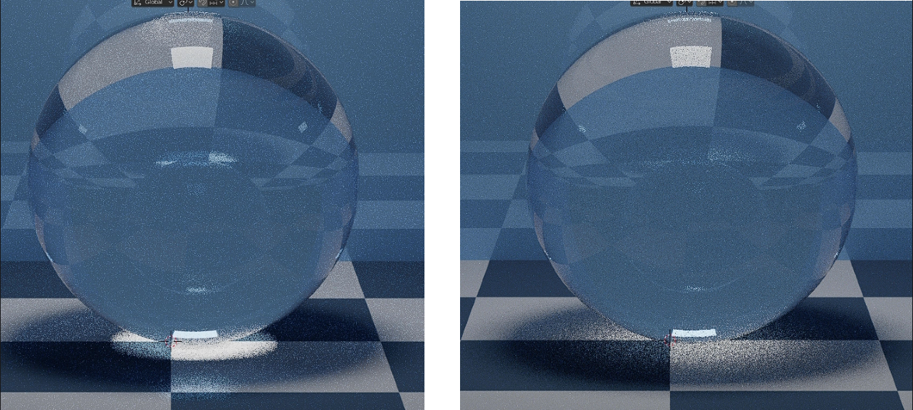

Aşağıdaki döküman Cycles render motoru kullanıldığı varsayılarak hazırlanmıştır. Cycles için render ayarlarının açıklamaları (Properties > Render) vardır. Eğer farklı bir render motoru kullanıyorsanız birçok özellik farklılık gösterecek veya çalışmayacaktır.

# Ek Bilgiler

Kullanılan Güzel Kaynaklar

 

* [The Blender 2.8 Encyclopedia](https://www.udemy.com/course/the-blender-encyclopedia/) - Udemy'deki sayısı bir elin parmaklarını geçmeyecek kadar az olan, gerçekten uğraşılmış kurslardan birisi. Bizim için önemli olan 17. bölüm "Render (Cycles)", render ayarlarının açıklamalarının olduğu bölüm, tabi isterseniz diğer kısımlara da bakabilirsiniz. [Buradan](https://btdig.com/search?q=The+Blender+2.8+Encyclopedia) torrent'ini bulabilirsiniz (vpn gerekebilir).
* [The Cycles Encyclopedia](https://www.blenderdiplom.com/en/shop/576-the-cycles-encyclopedia.html) - Cycles üzerine shaderlar ve render ayarları hakkında en kapsamlı kaynaklardan birisi. Bizim için önemli olan kısım 237. sayfadan sonrası, tabi isterseniz kalan kısımlara da bakabilirsiniz. [Buradan](https://annas-archive.org/md5/070b8cc769760f1cd49350c046940a3e) pdf'ini indirebilirsiniz.

# [General](#general-1)
* [Render Engine](#render-engine)
* [Feature Set](#feature-set)
* [Device](#device)
* [Open Shading Language](#open-shading-language)

# [Sampling](#sampling-1)
* [Noise Threshold (Viewport)](#noise-threshold)
* [Max Samples (Viewport)](#max-samples)
* [Min Samples (Viewport)](#min-samples)
* [Denoise (Viewport)](#denoise)
* [Denoiser (Viewport)](#denoiser)
* [Passes (Viewport)](#passes)
* [Start Sample (Viewport)](#start-sample)
* [Noise Threshold (Render)](#noise-threshold-1)
* [Max Samples (Render)](#max-samples-1)
* [Min Samples (Render)](#min-samples-1)
* [Time Limit (Render)](#time-limit)
* [Denoise (Render)](#denoise-1)
* [Denoiser (Render)](#denoiser-1)
* [Passes (Render)](#passes-1)
* [Prefilter (Render)](#prefilter)
* [Light Tree (Lights)](#light-tree)
* [Light Threshold (Lights)](#light-threshold)
* [Seed (Advanced)](#seed)
* [Sample Offset (Advanced)](#sample-offset)
* [Scrambling Distance (Advanced)](#scrambling-distance)
* [Multiplier (Advanced)](#multiplier)
* [Min Light Bounces (Advanced)](#min-light-bounces)
* [Min Transparent Bounces (Advanced)](#min-transparent-bounces)

# [Light Paths](#light-paths-1)
* [Total (Max Bounces)](#total)
* [Diffuse (Max Bounces)](#diffuse)
* [Glossy (Max Bounces)](#glossy)
* [Transmission (Max Bounces)](#transmission)
* [Volume (Max Bounces)](#volume)
* [Transparent (Max Bounces)](#transparent)
* [Direct Light (Clamping)](#direct-light)
* [Indirect Light (Clamping)](#indirect-light)
* [Filter Glossy (Caustics)](#filter-glossy)
* [Reflective Caustics (Caustics)](#reflective-caustics)
* [Refractive Caustics (Caustics)](#refractive-caustics)
* [Method (Fast GI Approximation)](#method)
* [AO Factor (Fast GI Approximation)](#ao-factor)
* [AO Distance (Fast GI Approximation)](#ao-distance)
* [Viewport Bounces (Fast GI Approximation)](#viewport-bounces)
* [Render Bounces (Fast GI Approximation)](#render-bounces)

# [Volumes](#volumes-1)
* [Step Rate Render](#step-rate-render)
* [Viewport](#viewport-1)
* [Max Steps](#max-steps)

# [Curves](#curves-1)
* [Shape](#shape)
* [Curve Subdivisions](#curve-subdivisions)
* [Shape (Viewport Display)](#shape-1)
* [Additional Subdivision (Viewport Display)](#additional-subdivision)

# [Simplify](#simplify-1)
* [Max Subdivision (Viewport)](#max-subdivision)
* [Child Particles (Viewport)](#child-particles)
* [Texture Limit (Viewport)](#texture-limit)
* [Volume Resolution (Viewport)](#volume-resolution)
* [Max Subdivision (Render)](#max-subdivision-1)
* [Child Particles (Render)](#child-particles-1)
* [Texture Limit (Render)](#texture-limit-1)
* [Camera Culling (Culling)](#camera-culling)
* [Distance Culling (Culling)](#distance-culling)
* [Playback Only (Grease Pencil)](#playback-only)
* [Fill (Grease Pencil)](#fill)
* [Modifiers (Grease Pencil)](#modifiers)
* [Shader Effects (Grease Pencil)](#shader-effects)
* [Layer Tinting (Grease Pencil)](#layer-tinting)
* [Antialiasing (Grease Pencil)](#antialiasing)

# [Motion Blur](#motion-blur-1)
* [Position](#position)
* [Shutter](#shutter)
* [Rolling Shutter](#rolling-shutter)
* [Rolling Shutter Duration](#rolling-shutter-duration)
* [Curve Widget (Shutter Curve)](#curve-widget)

# [Film](#film-1)
* [Exposure](#exposure)
* [Type (Pixel Filter)](#type)
* [Width (Pixel Filter)](#width)
* [Transparent Glass (Transparent)](#transparent-glass)
* [Roughness Threshold (Transparent)](#roughness-threshold)

# [Performance](#performance-1)
* [Threads Mode (Threads)](#threads-mode)
* [Threads (Threads)](#threads)
* [Use Tiling (Memory)](#use-tiling)
* [Tile Size (Memory)](#tile-size)
* [Use Spatial Splits (Acceleration Structure)](#use-spatial-splits)
* [BVH Time Steps (Acceleration Structure)](#bvh-time-steps)
* [Use Curves BVH (Acceleration Structure)](#use-curves-bvh)
* [Use Compact BVH (Acceleration Structure)](#use-compact-bvh)
* [Final Render (Persistent Data)](#final-render)
* [Pixel Size (Viewport)](#pixel-size)

# [Bake](#bake-1)

# [Grease Pencil](#grease-pencil-2)
* [Anti-Aliasing Threshold](#anti-aliasing-threshold)

# [Freestyle](#freestyle-1)
* [Line Thickness Mode](#line-thickness-mode)
* [Line Thickness](#line-thickness)

# [Color Management](#color-management-1)
* [Display Device](#display-device)
* [View Transform](#view-transform)
* [Look](#look)
* [Exposure](#exposure-1)
* [Gamma](#gamma)
* [Sequencer](#sequencer)
* [Curve Widget (Use Curves)](#curve-widget-1)

 
 

# [General]()
Bu kategori render ayarlarına başlamadan önce, render motorunu ve özelliklerini seçtiğimiz kısımdır.

* #### Render Engine
Buradan kullanacağınız render motorunu seçebilirsiniz.

* #### Feature Set
Sadece "Render Engine" ayarı "Cycles" iken vardır. "Experimental" ayarını seçerek deneysel özellikleri kullanabilirsiniz.

* #### Device
Sadece "Render Engine" ayarı "Cycles" iken vardır. Render işleminin cpu (işlemci) üzerinde mi yoksa gpu (ekran kartı) üzerinde yapılacağını seçebilirsiniz. Gpu (ekran kartı) seçeneğini kullanmadan önce ayarlara girip (Preferences) "System" menüsünde en üst bölümden gpu için kullanmak istediğimiz cihazı seçmeliyiz.

* #### Open Shading Language
Sadece "Render Engine" ayarı "Cycles" iken vardır. Shader'larda Open Shading Language'in kullanımını açar/kapatır. Bu ayarın kullanılabilmesi için "Device" ayarı cpu olmalıdır.

 
 

# [Sampling](https://docs.blender.org/manual/en/3.6/render/cycles/render_settings/sampling.html)
Bu kategoride genel olarak render ve sampling işlemi ile ilgili ayarlar yani ışık ışınları ile ilgili ayarlar vardır.

## Viewport

* #### Noise Threshold
Bu ayar eskiden yoktu, blender 3.0 güncellemesi ile Cycles render motoru "Cycles X" olarak güncellendi ve bu ayar da yeni özelliklerden biri. Eskiden verdiğiniz samples sayısı kadar sample hesaplanıyordu ama artık piksellerin noise (gürültü) derecesine göre kalitesini belirleyebiliyor ve yeterince kaliteliyse sample sayısını da azaltabiliyoruz. İlk baş sample işleminin ne olduğunu anlamanız gerek, Cycles sahneyi render ederken her bir piksel için sample sayısı kadar kameradan sahneye ışık ışını (ray) yollar. Sonra bu ışık ışınları çarptığı yüzeylerden rastgele (tamamen rastgele değil, ışık ışının sekebileceği yerlerin listesi var ve bu listeden rastgele seçim yapılıyor) etrafa saçılır. Bu ışık ışınlarının bazıları ışık kaynağına ulaşır, bazıları ulaşamaz. Bu şekilde her bir piksel için o yerin/yüzeyin rengi belirlenir. Sample sayısı da her bir piksel için toplamda yollanacak ışık ışını sayısıdır. Sample sayısı arttıkça daha fazla tekrarlama olacağı için elimize o pikselin alabileceği renk hakkında (yani çevre/ortam hakkında) daha fazla bilgi geçer. Sonra da bütün sample'lardan alınan değerlerin ortalamasına göre o piksele renk verilir. Eğer samples sayısını düşük tutarsanız bazı piksellerin farklı farklı renklere sahip olduğunu yani noise (gürültü) olduğunu görebilirsiniz. Bu durumda samples sayısını arttırırız ve noise azalır.

Şimdi gelelim "Noise Threshold" ayarına, "Noise Threshold" ayarı bu durumlar için geliştirilmiş yeni bir özellik. "Noise Threshold" ayarı her bir piksel (veya daha fazla pikseli birden hesaplıyor da olabilir, bilmiyorum) için noise derecesini hesaplar ve verdiğimiz limit (threshold) değerine gelene kadar sample sayısını arttırmaya devam eder. Yani sample sayısı noise derecesine göre artar/azalır. Bu da bize noise'in az olduğu yerler için daha az sample alma imkanı sunar, böylelikle de render süresi kısalır. Bu sample sayısını otomatik ayarlama işlemine "Adaptive Sampling" deniyor. Tabi sample sayısı otomatik belirlenecek olsa bile yine de minimum ve maximum sample sayısı limitlerini ayarlayabilirsiniz (Min Samples, Max Samples).

Gelelim şimdi bu input'a verdiğiniz değerin çalışma şekline, "Noise Threshold" değeri aslında render'da her bir piksel için ne kadar noise olabileceğini yani ne kadar noise'e tahammül edilebileceğini temsil ediyor. Yani anladığınız üzere bu değer yükseldikçe render'da noise daha fazla (dolayısıyla samples daha az) olacak, değer azaldıkça da noise daha az (dolayısıyla samples daha fazla) olacak. Eğer isterseniz bu ayarı kapatabilirsiniz, ayarı kapattığınızda eskiden olduğu gibi tek bir "Samples" input'u olacak ve samples sayısını manuel olarak belirleyebileceksiniz. Ayrıca bu ayarların Viewport için olduğunu unutmayın, eğer render için bu ayarları yapmak istiyorsanız [Render](#render) kategorisine bakın.

* #### Max Samples
Sadece "Noise Threshold" ayarı açıkken vardır. Maximum sample sayısını temsil eder. Eğer render alınırken sample sayısı bu sayıya ulaşırsa, noise seviyesi yeteri kadar düşürülmemiş olsa bile o piksel için daha fazla sample alınmaz. Yani bu değer "Adaptive Sampling" için maximum sample sayısını temsil eder.

* #### Min Samples
Sadece "Noise Threshold" ayarı açıkken vardır. Minimum sample sayısını temsil eder. Eğer render alınırken noise seviyesi yeteri kadar düşürülmüş olsa bile, sample sayısı bu sayıya ulaşmadıysa o piksel için bu sayıya ulaşana kadar sample alınmaya devam eder. Yani bu değer "Adaptive Sampling" için minimum sample sayısını temsil eder. Ayrıca eğer render alınırken noise seviyesi yeteri kadar düşürülene kadar sample alınmasını istiyorsanız bu ayarı 0 yapabilirsiniz (tabi hala "Max Samples" değerini geçemez), 0 yaptığınızda Cycles sizin için otomatikmen bu değeri belirler.

* #### Denoise
Denoise ayarlarını açar. Denoise viewport üzerinde çıkan noise'ı (gürültü) silmeye yarayan çok etkili bir araçtır.

* #### Denoiser
Buradan denoise işlemini gerçekleştiren farklı modlar seçebilirsiniz.

* #### Passes
Buradan denoise işleminde kullanılacak bilgileri seçebilirsiniz, Albedo + Normal en detaylısıdır.

* #### Start Sample
Buradan denoise işleminin kaçıncı sample'dan sonra başlayacağınız belirleyebilirsiniz.

## Render

* #### Noise Threshold
Bu ayar eskiden yoktu, blender 3.0 güncellemesi ile Cycles render motoru "Cycles X" olarak güncellendi ve bu ayar da yeni özelliklerden biri. Eskiden verdiğiniz samples sayısı kadar sample hesaplanıyordu ama artık piksellerin noise (gürültü) derecesine göre kalitesini belirleyebiliyor ve yeterince kaliteliyse sample sayısını da azaltabiliyoruz. İlk baş sample işleminin ne olduğunu anlamanız gerek, Cycles sahneyi render ederken her bir piksel için sample sayısı kadar kameradan sahneye ışık ışını (ray) yollar. Sonra bu ışık ışınları çarptığı yüzeylerden rastgele (tamamen rastgele değil, ışık ışının sekebileceği yerlerin listesi var ve bu listeden rastgele seçim yapılıyor) etrafa saçılır. Bu ışık ışınlarının bazıları ışık kaynağına ulaşır, bazıları ulaşamaz. Bu şekilde her bir piksel için o yerin/yüzeyin rengi belirlenir. Sample sayısı da her bir piksel için toplamda yollanacak ışık ışını sayısıdır. Sample sayısı arttıkça daha fazla tekrarlama olacağı için elimize o pikselin alabileceği renk hakkında (yani çevre/ortam hakkında) daha fazla bilgi geçer. Sonra da bütün sample'lardan alınan değerlerin ortalamasına göre o piksele renk verilir. Eğer samples sayısını düşük tutarsanız bazı piksellerin farklı farklı renklere sahip olduğunu yani noise (gürültü) olduğunu görebilirsiniz. Bu durumda samples sayısını arttırırız ve noise azalır.

Şimdi gelelim "Noise Threshold" ayarına, "Noise Threshold" ayarı bu durumlar için geliştirilmiş yeni bir özellik. "Noise Threshold" ayarı her bir piksel (veya daha fazla pikseli birden hesaplıyor da olabilir, bilmiyorum) için noise derecesini hesaplar ve verdiğimiz limit (threshold) değerine gelene kadar sample sayısını arttırmaya devam eder. Yani sample sayısı noise derecesine göre artar/azalır. Bu da bize noise'in az olduğu yerler için daha az sample alma imkanı sunar, böylelikle de render süresi kısalır. Bu sample sayısını otomatik ayarlama işlemine "Adaptive Sampling" deniyor. Tabi sample sayısı otomatik belirlenecek olsa bile yine de minimum ve maximum sample sayısı limitlerini ayarlayabilirsiniz (Min Samples, Max Samples).

Gelelim şimdi bu input'a verdiğiniz değerin çalışma şekline, "Noise Threshold" değeri aslında render'da her bir piksel için ne kadar noise olabileceğini yani ne kadar noise'e tahammül edilebileceğini temsil ediyor. Yani anladığınız üzere bu değer yükseldikçe render'da noise daha fazla (dolayısıyla samples daha az) olacak, değer azaldıkça da noise daha az (dolayısıyla samples daha fazla) olacak. Eğer isterseniz bu ayarı kapatabilirsiniz, ayarı kapattığınızda eskiden olduğu gibi tek bir "Samples" input'u olacak ve samples sayısını manuel olarak belirleyebileceksiniz. Ayrıca bu ayarların render için olduğunu unutmayın, eğer Viewport için bu ayarları yapmak istiyorsanız [Viewport](#viewport) kategorisine bakın.

* #### Max Samples
Sadece "Noise Threshold" ayarı açıkken vardır. Maximum sample sayısını temsil eder. Eğer render alınırken sample sayısı bu sayıya ulaşırsa, noise seviyesi yeteri kadar düşürülmemiş olsa bile o piksel için daha fazla sample alınmaz. Yani bu değer "Adaptive Sampling" için maximum sample sayısını temsil eder.

* #### Min Samples
Sadece "Noise Threshold" ayarı açıkken vardır. Minimum sample sayısını temsil eder. Eğer render alınırken noise seviyesi yeteri kadar düşürülmüş olsa bile, sample sayısı bu sayıya ulaşmadıysa o piksel için bu sayıya ulaşana kadar sample alınmaya devam eder. Yani bu değer "Adaptive Sampling" için minimum sample sayısını temsil eder. Ayrıca eğer render alınırken noise seviyesi yeteri kadar düşürülene kadar sample alınmasını istiyorsanız bu ayarı 0 yapabilirsiniz (tabi hala "Max Samples" değerini geçemez), 0 yaptığınızda Cycles sizin için otomatikmen bu değeri belirler.

* #### Time Limit
Render süresi limiti. Eğer render süresi bu limiti geçerse render işlemi bitirilir. Ayrıca süre ile ilgili 2-3 saniye kaymalar olabilir çünkü bu ayar render işlemi başlamadan önceki hazırlık kısmında geçen süreyi saymaz.

* #### Denoise
Denoise ayarlarını açar. Denoise render üzerinde çıkan noise'ı (gürültü) silmeye yarayan çok etkili bir araçtır.

* #### Denoiser
Buradan denoise işlemini gerçekleştiren farklı modlar seçebilirsiniz.

* #### Passes
Buradan denoise işleminde kullanılacak bilgileri seçebilirsiniz, Albedo + Normal en detaylısıdır.

* #### Prefilter
Denoise işleminden önce "Passes" input'unda seçilen bilgilere filtreleme uygular. Kaliteyi etkiler, Accurate en detaylısıdır.

## Lights

* #### Light Tree
Light Tree ışıkların şiddetini/uzaklığı falan hesaplayıp, ışıkların renderda daha kaliteli görünmesini sağlar ve noise'i azaltır. Özellikle sahnenizde çok fazla ışık kaynağı varsa bu özelliğin çok büyük etkisi olduğunu görebilirsiniz. Sahnenizde az ışık kaynağı olsa bile bence bu ayarı kapatmayın, ama tabi isterseniz kapatabilirsiniz de, test edip etkisini kendiniz görün. Bu ayarın açık olması render işlemini biraz daha uzatır. Bu ayarı kapattığınızda otomatikmen "Light Threshold" ayarı aktifleşir. "Light Threshold" ayarı ile manuel olarak hesaplama yapılması gereken minimum ışık şiddetini belirtebilirsiniz.

* #### Light Threshold
"Light Threshold" ayarı kapatıldığında bu ayar aktifleşir. Bu ayar minimum ne kadar ışık şiddeti için hesaplama yapılması gerektiğini verir. Mesela çok düşük şiddetli veya çok uzakta olan ve etkisi çok az olan ışıkları hesaplama işlemlerine katmak istemiyorsanız bu ayarı biraz arttırabilirsiniz. Ya da minimum derecede etki eden ışıkları bile hesaplamak istiyorsanız bu ayarı düşürebilirsiniz. 0 yaparak bütün ışıkların hesaplanmasını sağlayabilirsiniz ama render süresi de uzar. Yani anladığınız üzere bu ayar ışık etkisinin hesaba katılabilmesi için minimum ne kadar olması gerektiğini belirtiyor, bu derecenin altında olan ışıklar da hesaplanmıyor.

## Advanced

* #### Seed
Noise için seed kullanabilmemize yarar. Farklı seed numarası vermek her defasında farklı noise oluşturur. Eğer yandaki saat işaretine tıklarsanız otomatikmen her frame'de seed numarasını rastgele seçer. Bu da render'da tek bir noise olmasının önüne geçer. Aşağıdaki videolardan tek bir noise olduğunda ve her frame'de farklı noise olduğunda nasıl sonuçlar çıktığını görebilirsiniz.

<video src='https://github.com/helallao/qweqwe/assets/78656003/be6beed1-b937-4165-9c0a-9282b9d27522'></video>
<video src='https://github.com/helallao/qweqwe/assets/78656003/70fa39e8-8364-4c70-8acc-2264f8e8b859'></video>

* #### Sample Offset
Render alırken kaçıncı frame'den başlanacağını belirler. Yani verdiğiniz sayı kadar frame'i atlar.

* #### Scrambling Distance
"Automatic" ve "Viewport" şeklinde iki seçenek var. "Viewport" seçeneği "Scrambling Distance" ayarını Viewport için aktifleştirir. "Automatic" ayarı "Scrambling Distance" ayarını için "Multiplier" değerini otomatik olarak belirleyen bir modu açar. Yani "Automatic" modu blender'ın "Multiplier" değerini kendisinin belirlemesini söyler. "Automatic" güzel sonuçlar vermeyebilir bu yüzden "Multiplier" değerini kendiniz test ederek bulmanız daha doğrudur. İlk baş "Scrambling Distance" ayarının ne olduğundan bahsedelim, "Scrambling Distance" ayarı birbirine komşu piksellerin rastgeleligini azaltır, böylelikle pikseller arasında benzerlik olur, aynı zamanda bu işlem önbellekte olan bilgileri birden fazla piksel için kullanabildiği için render işlemlerini azaltır. Daha az işlem ile aynı kaliteye yakın render alabilmemize yarar.

* #### Multiplier
"Scrambling Distance" ayarı derecesi. 1 ve üzeri iken Scrambling kapalı anlamına gelir. Değeri düşürdükçe Scrambling artar. Yani bu değeri düşürünce rastgelelik de azalıyormuş gibi düşünün. Bu değeri render'da bozulmaların olmadığı dereceye manuel olarak ayarlayıp kullanabilirsiniz.

* #### Min Light Bounces
Işığın minimum sekme sayısı. Bu sayıyı arttırmak render'daki noise'ı azaltabilir ama render süresi uzar.

* #### Min Transparent Bounces
Transparent ışık ışınları için minimum sekme sayısı. Bu sayıyı arttırmak render'daki noise'ı azaltabilir ama render süresi uzar.

 
 

# [Light Paths](https://docs.blender.org/manual/en/3.6/render/cycles/render_settings/light_paths.html)
Bu kategoride ışık ve ışık ışınları ile ilgili ayarlar vardır. Default olarak gelen değerler biraz fazla olabilir, tabi amacınıza göre bunları kendiniz belirlemelisiniz ama genel olarak güzel sonuç veren bir şekilde ayar yapacak olursanız şöyle yapabilirsiniz, sırasıyla: 4, 2, 2, 4, 0, 4.

## Max Bounces

* #### Total
Işık ışınları için toplam maximum sekme sayısı.

* #### Diffuse
[Diffuse](../Shader%20Nodes#is-diffuse-ray-output) özelliği taşıyan shader'lar için maximum sekme sayısı.

* #### Glossy
[Glossy](../Shader%20Nodes#is-glossy-ray-output) özelliği taşıyan shader'lar için maximum sekme sayısı.

* #### Transmission
[Transmission](../Shader%20Nodes#is-transmission-ray-output) özelliği taşıyan shader'lar için maximum sekme sayısı.

* #### Volume
Volume özelliği taşıyan shader'lar için maximum sekme sayısı.

* #### Transparent
[Transparent](../Shader%20Nodes#transparent-bsdf) özelliği taşıyan shader'lar için maximum sekme sayısı.

## Clamping

* #### Direct Light
Işığın direktmen vurduğu yerlerde ışık parlaklığını düşürebilmemize yarar. Bu ayarı değiştirmenin hem iyi hem kötü etkileri olacağı için gerçekten lazım değilse değiştirmeyin. Eğer değeri arttırırsanız ışık parlaklığı azalır.

* #### Indirect Light
Işığın sekerek vurduğu yerlerde ışık parlaklığını düşürebilmemize yarar. Eğer render aldıktan sonra noise gibi etrafta nokta nokta parlayan kısımlar görüyorsanız muhtemelen indirect light yani ışığın sekerek vurduğu noktalardan dolayıdır. Bu ayarı kısarak bu noktaların parlaklığını düşürebilir yani daha görünmez yapabilirsiniz ama unutmayın, bu ayar ışığın sekerek vurduğu bütün noktaları etkiler, yani render üzerinde genel olarak parlaklık düşüşüne sebep olabilir, aynısı "Direct Light" ayarı için de geçerli. Yine de nokta nokta parlak ışıklar kalıyorsa bu ayarı düşürebilirsiniz. Çok fazla düşürmek bazı sorunlar çıkarabilir.

## Caustics

* #### Filter Glossy
Bu ayarları anlatmadan önce caustics'in ne olduğunu bilmelisiniz. [Buradan](https://en.wikipedia.org/wiki/Caustic_(optics)) wikipedia sayfasına bakabilirsiniz. Kısacası saydam objelere ışık vurduktan sonra arka yüzeye objenin oluşturduğu şekiller diyebiliriz. Bu ayarı arttırmak caustics'i yani objenin arkasına yaptığı yansımayı yumuşatır, blur efekti ekler. Eğer bu ayarı 0 yaparsanız blur efekti uygulanmaz, objenin arkasına yaptığı yansıma keskin olur. Aşağıdaki resimden farkı görebilirsiniz.

* #### Reflective Caustics
Objenin ışık vurunca arkasına yaptığı yansımaya objenin rengini eklemeyi kapatır.

* #### Refractive Caustics
Objenin ışık vurunca arkasına yaptığı yansımayı kapatır, sadece gölge olur.

## Fast GI Approximation

* #### Method
"Fast GI Approximation" ayarı indirect light'lar için yani sekerek gelen ışıklar için global illumination kullanmak yerine [Ambient Occlusion](../Shader%20Nodes#ambient-occlusion) kullanır ve ışığı Ambient Occlusion değeri ile yüzeyin rengini değiştirerek (tint) simule eder. Bu da daha hızlı hesaplama ile sonuçlanır ama gerçekçi sonuçlar vermeyebilir. %40 civarında daha hızlı render almanıza olanak sağlar.

Mod | Açıklama
:---: | :---:
‎Replace | Yüzeyin parlaklığını ve rengini ışığa göre yeniden hesaplar. Bu da toplam parlaklığın biraz azalmasına sebep olur.
Add | Yüzeylerin parlaklığını ve rengini ışığa göre arttırır. Bu da daha parlak render oluşturur.

* #### AO Factor
[Ambient Occlusion](../Shader%20Nodes#ambient-occlusion) şiddeti.

* #### AO Distance
[Ambient Occlusion](../Shader%20Nodes#ambient-occlusion) için gölgeleri hesaplama mesafesi. Bu değer düşünce gölgeler de parlaklığını kaybeder.

* #### Viewport Bounces
Viewport için ışığın kaç defa sektikten sonra hesaplanacağını ayarlar.

* #### Render Bounces
Render için ışığın kaç defa sektikten sonra hesaplanacağını ayarlar.

 
 

# [Volumes](https://docs.blender.org/manual/en/3.6/render/cycles/render_settings/volumes.html)
Bu kategoride volume'ler ile ilgili ayarlar var.

* #### Step Rate Render
Render için volume kalitesi. Bu ayarın değerini düşürdükçe kalite artar, arttırdıkça kalite düşer.

* #### Viewport
Viewport için volume kalitesi. Bu ayarın değerini düşürdükçe kalite artar, arttırdıkça kalite düşer.

* #### Max Steps
Volume hesaplanırken gönderilen ışınların volume içerisinde ne kadar derine gidebileceğini belirler. Bu ayarın default değeri çok yüksek, 10-30 arası bir şeyler yapabilirsiniz. Eğer kaliteli olsun diyorsanız 100 yapabilirsiniz ama 1000 yapmayın çünkü gereksiz oluyor ve render süresi uzuyor.

 
 

# [Curves](https://docs.blender.org/manual/en/3.6/render/cycles/render_settings/hair.html)
Bu kategorinin eski adı "Hair" di.

* #### Shape
a

* #### Curve Subdivisions
a

## Viewport Display

* #### Shape
a

* #### Additional Subdivision
a

 
 

# [Simplify](https://docs.blender.org/manual/en/3.6/render/cycles/render_settings/simplify.html)
Bu kategoride sahne için hem Viewport hem de render üzerinde kullanılacak özellikleri sınırlandırabiliriz. Buradaki ayarlar ile genel olarak sahne üzerinde efektlere sınırlar koyabiliriz. Kategorinin yanındaki tik işaretine basarak bu sınırlandırmaları etkinleştirebilir/devre dışı bırakabilirsiniz.

## Viewport

* #### Max Subdivision
Viewport için sahnedeki objelerin "Subdivision Surface" ve "Multiresolution Modifier" modifier'larının "subdivision" sayısı limiti. Yani mesela diyelim ki bu ayarı 2 yaptınız, o zaman modifier'ların hiçbirisi bu sayıdan fazla "subdivision" oluşturamaz.

* #### Child Particles
Viewport için "Child Particle" özelliği kullanan bütün Particle System'lar için Child Particle limiti. Mesela bu ayarı 0.5 yaparsak %50 yani Child Particle'ların sadece yarısı oluşturulur.

* #### Texture Limit
Viewport için texture kullanan bütün materyaller için maximum texture çözünürlüğü. Mesela bunu 1024 yani 1k yaparsanız 4k texture'lar kullanamazsınız.

* #### Volume Resolution
Viewport için volume kullanan objeler için volume kalitesi/çözünürlüğü. Mesela bu ayarı 0.5 yaparsak %50 yani volume'ların kalitesi yarıya düşer.

## Render

* #### Max Subdivision
Render için sahnedeki objelerin "Subdivision Surface" ve "Multiresolution Modifier" modifier'larının "subdivision" sayısı limiti. Yani mesela diyelim ki bu ayarı 2 yaptınız, o zaman modifier'ların hiçbirisi bu sayıdan fazla "subdivision" oluşturamaz.

* #### Child Particles
Render için "Child Particle" özelliği kullanan bütün Particle System'lar için Child Particle limiti. Mesela bu ayarı 0.5 yaparsak %50 yani Child Particle'ların sadece yarısı oluşturulur.

* #### Texture Limit
Render için texture kullanan bütün materyaller için maximum texture çözünürlüğü. Mesela bunu 1024 yani 1k yaparsanız 4k texture'lar kullanamazsınız.

## Culling

* #### Camera Culling
Kamera dışındaki şeyleri temizlememize yarar. Eğer bu ayarı 0 yaparsanız sahnede olacak şeylerin hepsinin kameranın içinde olması gerekir. Yani kamerada olmayan objeler sahneden kaldırılır ve sahneyi etkileyemez. Bu ayarı 0'dan yukarıya doğru arttırırsanız, kameranın gördüğü alanın çevresindeki şeyler de sahneye dahil olmaya başlar. Yani bunu bir nevi kameranın gördüğü alanı büyütüyormuşsunuz ve çevredeki objeler kameranın gördüğü alana dahil oluyor ve sahneden silinmiyor gibi düşünün (kamera gerçekten büyümüyor, örnek veriyorum). Yani kameranın çevreye doğru kapsadığı Culling alanını genişletir.

* #### Distance Culling
Bu ayar kameraya verdiğiniz değerden daha uzak olan şeyleri dahil etmez. Yani eğer objeler bu ayara verdiğiniz mesafe değerinden daha uzaktalarsa, yani bu mesafede değillerse sahneden silinirler.

## Grease Pencil

* #### Playback Only
a

* #### Fill
a

* #### Modifiers
a

* #### Shader Effects
a

* #### Layer Tinting
a

* #### Antialiasing
a

 
 

# [Motion Blur](https://docs.blender.org/manual/en/3.6/render/cycles/render_settings/motion_blur.html)
Bu kategoride [motion blur](https://en.wikipedia.org/wiki/Motion_blur) efekti ile ilgili ayarları yapabilirsiniz. Motion blur frame'ler arasına geçiş efekti ekler. Eğer animasyon yapıyorsanız motion blur animasyonlarınıza gerçekçilik ekleyecektir. Kategorinin yanındaki tik işaretine basarak motion blur'u etkinleştirebilir/devre dışı bırakabilirsiniz.

* #### Position
Motion blur efektinin uygulanacağı yönü belirtir.

Mod | Açıklama
:---: | :---:
‎Start on Frame | Şu anki frame'den sonraki frame'e doğru motion blur oluşturur. Yani mesela diyelim ki bi animasyon yaptınız ve 30. frame'i render ediyorsunuz. Eğer bu ayarı seçerseniz 30. frame'den 31. frame'e doğru motion blur efekti verilir.
‎Center on Frame | Şu anki frame'den bir önceki ve sonraki frame'e doğru motion blur oluşturur yani tam ortada. Yani mesela diyelim ki bi animasyon yaptınız ve 30. frame'i render ediyorsunuz. Eğer bu ayarı seçerseniz 29. frame'den 31. frame'e doğru motion blur efekti verilir (daha doğrusu 30'dan 29 ve 31'e).
‎End on Frame | Önceki frame'den şu anki frame'e doğru motion blur oluşturur. Yani mesela diyelim ki bi animasyon yaptınız ve 30. frame'i render ediyorsunuz. Eğer bu ayarı seçerseniz 29. frame'den 30. frame'e doğru motion blur efekti verilir.

* #### Shutter
Motion blur derecesi, bu değeri arttırmak motion blur efekti derecesini arttırır. 0 yaparsanız motion blur olmaz. Eğer isterseniz 1'den fazla değerler de verebilirsiniz. Bu ayarı arttırmak motion blur'u arttırır ve motion blur'un artması render süresini uzatır, aynı zamanda render'daki noise de artar.

* #### Rolling Shutter
Motion blur efekti için [Rolling shutter](https://en.wikipedia.org/wiki/Rolling_shutter) efekti kullanmamıza yarar. Yani hareketli bir şekilde motion blur hesaplanır.

* #### Rolling Shutter Duration
Sadece "Rolling Shutter" ayarı açıkken vardır. Rolling Shutter efektinin motion blur derecesini ayarlar. 0 iken motion blur olmaz, sadece rolling shutter efekti olur. 1 iken hem rolling shutter hem de motion blur olur.

<video src='https://github.com/helallao/qweqwe/assets/78656003/932792eb-60b5-42f3-8cfa-dfe235504bf2'></video>

## Shutter Curve

* #### Curve Widget
Curve Widget kullanımı hakkında detaylı açıklamalara [buradan](https://docs.blender.org/manual/en/latest/interface/controls/templates/curve.html#ui-curve-widget) ulaşabilirsiniz. Curve'ün X ekseni zamanı temsil eder, yani önceki frame ve sonraki frame. Curve'ün Y ekseni fade derecesini yani sönme derecesini (yavaş yavaş yok olma, görünmezleşme) temsil eder.

 
 

# [Film](https://docs.blender.org/manual/en/3.6/render/cycles/render_settings/film.html)
Bu kategoride render ile ilgili görünüm ve filtre ayarları var.

* #### Exposure
Render ışık parlağını ayarlar.

## Pixel Filter

* #### Type
Render üzerindeki keskin kısımları yumuşatma efekti uygulayan filtedir.

Mod | Açıklama
:---: | :---:
‎Box | Bu mod "Width" ayarına sahip değildir. Keskin kenarları ve detayları tutar ama bu keskin kısımlar render'ı kötü gösterebilir.
‎Gaussian | Bu mod "Blackman-Harris" moduna göre biraz daha fazla yumuşatma efekti uygular ama "Blackman-Harris" modu hem detayları hem de yumuşatma efektini daha iyi ayarladığı için daha iyi sonuçlar verir.
Blackman-Harris | Bu mod render'da hem yumuşatma efekti uyguladığı hem de keskin kenarlardaki detayı düzgün şekilde tuttuğu için en iyi sonucu verir.

* #### Width
Sadece "Type" ayarı "Gaussian" ve "Blackman-Harris" modunda iken vardır. Bu ayarın değerini yükselttikçe yumuşatma efekti arttırılır.

## Transparent
Bu kategorinin yanındaki tik işaretine tıklayarak sahnenizin arka planını yani dünyayı transparent yani görünmez yapabilirsiniz. Bu ayar eğer sahnenizin arka planını render'dan sonra ayarlayacaksanız kullanabilirsiniz. Ayrıca bu kategorideki alt ayarları kullanmak için de tik işaretine tıklamanız gerek.

* #### Transparent Glass
Bu ayar [Transparent](../Shader%20Nodes#transparent-bsdf) özelliği taşıyan shader'lar için arka planı göstermesini engellemeye yarar. Ayrıca bu ayar açıkken "Roughness Threshold" ayarı da açılır ve buradan roughness limiti koyabilirsiniz.

* #### Roughness Threshold
Sadece "Transparent Glass" ayarı açıkken vardır. Bu ayar "Transparent Glass" ayarı için roughness limiti olarak görev görür. [Transparent](../Shader%20Nodes#transparent-bsdf) özelliği taşıyan shader'ların roughness değeri eğer bu ayara verdiğiniz değerden yüksekse arka planı göstermezler yani opak olurlar. Eğer shader'ın roughness değeri bu ayara verdiğiniz değerden düşükse [Transparent](../Shader%20Nodes#transparent-bsdf) olabilir yani arka planı gösterebilir.

 
 

# [Performance](https://docs.blender.org/manual/en/3.6/render/cycles/render_settings/performance.html)
Bu kategoride render performans ayarları vardır.

## Threads

* #### Threads Mode
Eğer render için [Device](#device) olarak cpu (işlemci) kullanıyorsanız bu ayar ile toplamda kullanılacak thread sayısını belirleyebilirsiniz. "Auto-Detect" modunda otomatikmen bütün thread'ler kullanılır. "Fixed" modunda "Threads" ayarı açılır ve oradan kullanmak istediğiniz thread sayısını belirtebilirsiniz.

* #### Threads
Sadece "Threads Mode" ayarı "Fixed" modunda iken vardır. Buradan kullanılacak thread sayısını belirleyebilirsiniz.

## Memory

* #### Use Tiling
Tile şeklinde render etme modunu açar. Eğer güzel tile değerleri verirseniz hızlı bir şekilde render gerçekleştirebilirsiniz.

* #### Tile Size
Render işleminde her bir tile için boyut değeri. Eğer gpu (ekran kartı) üzerinde render alıyorsanız en hızlı şekilde render almak için 512 veya 256 kullanabilirsiniz. Eğer cpu (işlemci) üzerinde render alıyorsanız en hızlı şekilde render almak için 64 veya 32 kullanabilirsiniz.

## Acceleration Structure

* #### Use Spatial Splits
Bu ayar şu işe yarar, render süresini kısaltmak için build süresini yani hazırlık süresini uzatır, böylelikle render için harcanacak zaman build için harcanmış olur ama bu ayar kullanışsız görünüyor, bu ayarı açsanız bile build süresinden dolayı render süresi kısalmıyor. Bu ayarın gerçekten render süresini azaltabilecek bir hız katmasını istiyorsanız olması gereken senaryo şu, cpu'nuz yani işlemciniz iyi olmalı çünkü build aşaması cpu üzerinde gerçekleşiyor (sanırım) ve render ettiğiniz sahne baya detaylı olmalı. Ancak böyle bir durumda build süresi cpu'nuz iyi olduğu için kısalacağından ve render süresi de build işleminden dolayı kısalacağından daha hızlı render alabilirsiniz. Yine de çok kullanışlı durmuyor, tabi test edip kendiniz görmelisiniz.

* #### BVH Time Steps
Ne olduğu tam olarak bilmiyorum ama hesaplamalar [BVH](https://en.wikipedia.org/wiki/Bounding_volume_hierarchy) (Bounding volume hierarchy) ile parçalara bölünüp ayrı ayrı hesaplanıyor ve daha fazla ram kullanımı ile daha hızlı render sunuyor.

* #### Use Curves BVH
Curves (hair) için daha fazla ram kullanımı ile daha hızlı render sunuyor. Bu ayarı kapatırsanız ram kullanımı azalır ama render süresi uzar.

* #### Use Compact BVH
Bu ayarı açarsanız ram kullanımı azalır ama render süresi uzar.

## Final Render

* #### Persistent Data
Bu ayar açıksa render işlemi gerçekleşirken veriler ram'de tutulur ve tekrar kullanılır böylelikle render süresi kısalır.

## Viewport

* #### Pixel Size
Viewport için sahne çözünürlüğü, 2x yaparsanız %50, 4x yaparsanız %25 şeklinde.

 
 

# [Bake](https://docs.blender.org/manual/en/3.6/render/cycles/baking.html)
a.

 
 

# [Grease Pencil](https://docs.blender.org/manual/en/3.6/render/cycles/render_settings/grease_pencil.html)
a.

* #### Anti-Aliasing Threshold
a.

 
 

# [Freestyle](https://docs.blender.org/manual/en/3.6/render/freestyle/render.html)
a.

* #### Line Thickness Mode
a.

* #### Line Thickness
a.

 
 

# [Color Management](https://docs.blender.org/manual/en/3.6/render/color_management.html)
Bu kategoride renk ayarları vardır.

* #### Display Device
Render'ın görüntüleneceği cihazın renk uzayı. Render bu renk uzayına göre yapılandırılır. Eğer monitörünüzün renk uzayı farklı değilse bu ayarı "sRGB" modunda bırakın.

* #### View Transform
a

* #### Look
a

* #### Exposure
Render ışık parlağını ayarlar.

* #### Gamma
Render'ın [gamma değerini](https://en.wikipedia.org/wiki/Gamma_correction) değiştirir.

* #### Sequencer
a

## Use Curves

* #### Curve Widget
Curve Widget kullanımı hakkında detaylı açıklamalara [buradan](https://docs.blender.org/manual/en/latest/interface/controls/templates/curve.html#ui-curve-widget) ulaşabilirsiniz. Bu curve render'daki renkleri değiştirir, çalışma şekli aynen RGB Curves shader node'unun [Curve Widget'ı](../Shader%20Nodes#curve-widget-node-input) gibidir.

