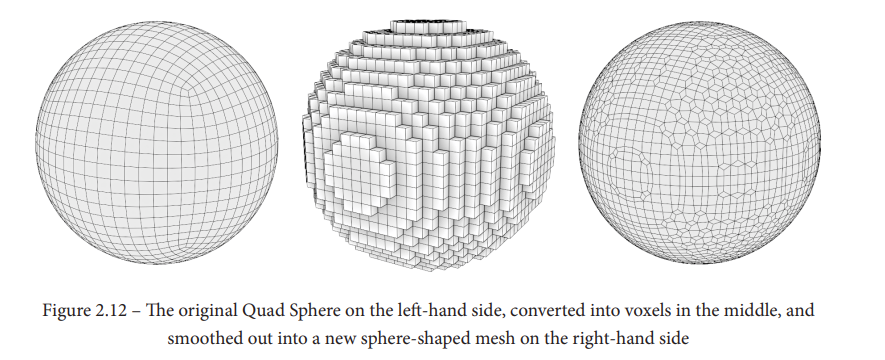

Aşağıdaki döküman sözlük mantığında yapılmıştır, herhangi bir konuda genel olarak konu anlatımı sunmaz. Spesifik olarak aradığınız ayarların açıklamaları, kısayollar, özellikler ve konu anlatımlarına ulaşabileceğiniz kaynakların olduğu bir sözlüktür. Aşağıdaki bölümden benim işime yarayan kapsamlı kaynaklar var ama sadece bunları kullanarak öğrenemezsiniz. Sculping konusunda kendinizi geliştirmek için internetten bulabildiğiniz bütün yazılara ve videolara bakmalısınız ve öğrendiklerinizi kendiniz de uygulamalısınız.

## Kullanılan Güzel Kaynaklar

* [CGCookie - Fundamentals of Digital Sculpting](https://cgcookie.com/courses/fundamentals-of-digital-sculpting-with-blender) - Udemy'deki en güzel sculpting kurslarından birisi. [Buradan](https://btdig.com/search?order=0&q=CGCookie+-+Fundamentals+of+Digital+Sculpting) torrent'ini bulabilirsiniz (vpn gerekebilir).
* [CGBoost - Master 3D Sculpting in Blender](https://www.cgboost.com/courses/master-3d-sculpting-in-blender) - En güzel sculpting kurslarından birisi. [Buradan](https://btdig.com/search?q=CGBoost+-+Master+3D+Sculpting+in+Blender) torrent'ini bulabilirsiniz (vpn gerekebilir).
* [Sculpting the Blender Way](https://www.packtpub.com/product/sculpting-the-blender-way/9781801073875) - Sculpting hakkında kapsamlı kaynaklardan birisi. [Buradan](https://annas-archive.org/md5/959e918ffd6c9275fa2b59694168a6a9) pdf'ini indirebilirsiniz.

 

# [Brushlar](#brushlar-1)
* [Draw](#draw)
* [Draw Sharp](#draw-sharp)
* [Clay](#clay)
* [Clay Strips](#clay-strips)
* [Clay Thumb](#clay-thumb)
* [Layer](#layer)
* [Inflate](#inflate)
* [Blob](#blob)
* [Crease](#crease)
* [Smooth](#smooth)
* [Flatten](#flatten)
* [Fill](#fill)
* [Scrape](#scrape)
* [Multi-plane Scrape](#multi-plane-scrape)
* [Pinch](#pinch)
* [Grab](#grab)
* [Elastic Deform](#elastic-deform)
* [Snake Hook](#snake-hook)
* [Thumb](#thumb)
* [Pose](#pose)
* [Nudge](#nudge)
* [Rotate](#rotate)
* [Slide Relax](#slide-relax)
* [Boundary](#boundary)
* [Cloth](#cloth)
* [Simplify](#simplify)
* [Mask](#mask)
* [Draw Face Sets](#draw-face-sets)
* [Multires Displacement Eraser](#multires-displacement-eraser)
* [Multires Displacement Smear](#multires-displacement-smear)
* [Paint](#paint)
* [Smear](#smear)
* [Box Mask](#box-mask)
* [Lasso Mask](#lasso-mask)
* [Line Mask](#line-mask)
* [Box Hide](#box-hide)
* [Box Face Set](#box-face-set)
* [Lasso Face Set](#lasso-face-set)
* [Box Trim](#box-trim)
* [Lasso Trim](#lasso-trim)
* [Line Project](#line-project)
* [Mesh Filter](#mesh-filter)
* [Cloth Filter](#cloth-filter)
* [Color Filter](#color-filter)
* [Edit Face Set](#edit-face-set)
* [Mask by Color](#mask-by-color)

# [Brush Ayarları](#brush-ayarları-1)
* [Advanced](#advanced)
* [Texture](#texture)
* [Stroke](#stroke)
* [Falloff](#falloff)
* [Cursor](#cursor)

# [Workflowlar](#workflowlar-1)
* [Dynamic Topology (Dyntopo)](#dynamic-topology-dyntopo)
* [Voxel Remesh](#voxel-remesh)
* [Multiresolution](#multiresolution)

# [Maske İşlemleri](#maske-i̇şlemleri-1)

# [Kısayollar](#kısayollar-1)

 
 

# Brushlar
Bu kategoride her bir fırçanın kendisine özel ayarlarının ve ne işe yaradığının açıklamaları vardır. Brushlar kategori olarak 4'e ayrılır, renklerine göre bu kategorileri görebilirsiniz. Mesela [Draw](#draw) brush'ından [Crease](#crease) brush'ına kadar mavi renkli brush'lar vardır. Mavi renkli brush'lar ekleme/çıkarma yapmaya yarayan brush'lardır. Kırmızı renkli brush'lar varolan geometri üzerinde düzenlemeler yapmaya yarayan brush'lardır. Sarı renkli brush'lar da varolan geometri üzerinde işlemler yaparlar ama daha çok geometriyi hareket ettirme, değişikliğe uğratmaya yöneliktirler. Geriye kalan beyaz brush'lar ise tool yani araç tarzı brush'lardır. Çeşitli amaçlar için kullanılırlar.

## [Draw](https://docs.blender.org/manual/en/latest/sculpt_paint/sculpting/tools/draw.html)
Klasik çizim brush'ıdır. Geometriyi ileri-geri almamıza yarar, yani kendimize doğru çekmemize veya itmemize yarar. Brush'ın kısayolu "V" dir ([Kısayollar](#kısayollar-1) bölümünden "Brush Kısayolları" na bakın).

* #### Radius
Fırçanın yarıçapı. 3D Viewport üzerinde mouse'unuzun etrafındaki çember fırçanın yarıçapını belirtir. "F" kısayolu ile ayarlayabilirsiniz ([Kısayollar](#kısayollar-1) bölümünden "Genel Kısayollar" a bakın). Yandaki "Size Pressure" ayarını açarak eğer sculpting için çizim tableti kullanıyorsanız, kaleminiz ile ekrana uyguladığınız baskıya göre kendisini otomatikmen değiştiren yarıçap modunu açabilirsiniz. Onun yanındaki "Use Unified Radius" ayarını açarak da yarıçap değerini bütün fırçalara uygulayabilirsiniz.

* #### Radius Unit
Fırçanın yarıçap değerini ayarlamak için kullanılacak birim değerini temsil eder. "View" modundayken yarıçap için piksel birimi kullanılır, bu da sculpting yaptığınız mesh'e olan uzaklığınıza göre fırçanın yarıçapının değişebilmesine sebep olur. "Scene" modunda ise yarıçap için Blender'ın kullandığı sahne birimleri (metre) kullanılır.

* #### Strength
Fırçanın uyguladığı efektin şiddeti, yani fırçanın şiddeti. 3D Viewport üzerinde mouse'unuzun etrafındaki çember fırçanın yarıçapını belirtir, bu çemberin içerisindeki ikinci çember de fırçanın şiddetini belirtir, mesela fırçanın şiddeti 0.5 yani yarım iken iç çemberin dış çemberin yarısı kadar olduğunu görebilirsiniz. "Shift + F" kısayolu ile ayarlayabilirsiniz ([Kısayollar](#kısayollar-1) bölümünden "Genel Kısayollar" a bakın). Yandaki "Strength Pressure" ayarını açarak eğer sculpting için çizim tableti kullanıyorsanız, kaleminiz ile ekrana uyguladığınız baskıya göre kendisini otomatikmen değiştiren fırça şiddeti modunu açabilirsiniz. Onun yanındaki "Use Unified Strength" ayarını açarak da fırça şiddeti değerini bütün fırçalara uygulayabilirsiniz.

* #### Direction
Fırçanın efektinin yönünü belirler. Artı yön mesh'in geometrisini kameraya doğru yaklaştırırken (yani kameraya doğru, efektin uygulandığı yöne doğru), eksi yönü geometriyi tam tersi yöne doğru götürür, yani uzaklaştırır. Fırçanın yönünü değiştirmek için bu ayarları neredeyse hep kısayollar ile kullanırız, yani manuel olarak bu ayarı elle değiştirmekle uğraşmayız. Fırçanın kısayolunu değiştirmek için çizim işlemine başlamadan önce "Ctrl" kısayoluna basılı tutmanız yeterlidir (çizmeye başladıktan sonra bırakabilirsiniz).

* #### Normal Radius
Bu ayar fırçanın normal'ını yani baktığı yönü hesaplamak için kullanılacak yarıçapı belirtir. 3D Viewport üzerinde mouse'unuzun etrafındaki çember fırçanın yarıçapını belirtir, çemberin baktığı yön ise fırçanın normal'ını belirtir. Fırçanın normal'ı mouse'unuzun şu an üzerinde olduğu konumdan verilen yarıçap boyunca çevredeki diğer vertex'lerin ortalaması alınarak bulunur. Yani verilen yarıçap içerisindeki vertex'lerin normal'larının ortalaması alınır ve çıkan sonuç fırçanın normal'ı olarak kullanılır. İşte bu ayar da bu yarıçapı belirleyen ayardır. Eğer bu ayarın değerini 1 olarak ayarlarsanız fırçanın şu anki yarıçapı ne ise o yarıçap büyüklüğünde "Normal Radius" kullanılır. Eğer bu ayarı 0.5 olarak ayarlarsanız fırçanın şu anki yarıçapı ne ise o yarıçapın yarısı büyüklüğünde "Normal Radius" kullanılır. Yani "Normal Radius" değeri fırçanın yarıçapına da bağlıdır.

* #### Hardness
Bu ayar fırçanın falloff'unun yumuşaklık derecesini belirler. Daha doğrusu falloff'un başlangıç noktasını beliler. Bu ayarın değeri 0 iken falloff tam orta noktadan başlar, 1'e doğru gittikçe falloff kenara yani uç noktalara doğru kayar, yani kenara yakın olan yerlerden başlar. Bu ayarı bu şekilde anlatması zor, anlamak için kendiniz test etmelisiniz. Düz bir plane oluşturup subdivide uygulayın, sonra fırçanızın şiddetini sona getirip bu ayarı değiştirerek nasıl bir efekt verdiğine bakın. Yandaki "Use Pressure for Hardness" ayarını açarak eğer sculpting için çizim tableti kullanıyorsanız, kaleminiz ile ekrana uyguladığınız baskıya göre kendisini otomatikmen değiştiren hardness modunu açabilirsiniz. Onun yanındaki "Invert Pressure for Hardness" ayarını açarak da kaleminiz ile ekrana uyguladığınız baskıyı tam tersine çevirebilirsiniz.

* #### Auto-Smooth
Bu ayar fırçayı kullanırken otomatik smooth işlemi uygulamaya yarar. Yani siz fırçayı kullanırken bir yandan da [Smooth](#smooth) fırçasını kullanarak üzerinden geçiyormuşsunuz gibi bir efekt verir. Kullandığınız fırçanın keskin geometrileri yumuşatmasını ve kendisinin de keskin geometri oluşturmamasını istiyorsanız bu ayarı kullanabilirsiniz. Yandaki "Invert Smooth Pressure" ayarını açarak eğer sculpting için çizim tableti kullanıyorsanız, kaleminiz ile ekrana uyguladığınız baskıyı tam tersine çevirme modunu açabilirsiniz. Bu modu açtığınızda hafif baskılar daha fazla smooth işleminin uygulanmasına sebep olur (kapalı iken tam tersi).

## [Draw Sharp](https://docs.blender.org/manual/en/latest/sculpt_paint/sculpting/tools/draw_sharp.html)
Bu brush [Draw](#draw) brush'ının birkaç ayarı değiştirilmiş versiyonudur, kısaca özetlemek gerekirse falloff'u [Draw](#draw) brush'ına göre daha keskindir. Bu brush kullanım amacı olarak [Crease](#crease) brush'ına benzer ama ona göre daha agresiftir ve güzel sonuç için fazla geometri gerektirir. Ayrıca bu brush [Dynamic Topology (Dyntopo)](#dynamic-topology-dyntopo) ile beraber kullanılamaz ama [Crease](#crease) brush'ı kullanılabilir.

* #### Radius
Fırçanın yarıçapı. 3D Viewport üzerinde mouse'unuzun etrafındaki çember fırçanın yarıçapını belirtir. "F" kısayolu ile ayarlayabilirsiniz ([Kısayollar](#kısayollar-1) bölümünden "Genel Kısayollar" a bakın). Yandaki "Size Pressure" ayarını açarak eğer sculpting için çizim tableti kullanıyorsanız, kaleminiz ile ekrana uyguladığınız baskıya göre kendisini otomatikmen değiştiren yarıçap modunu açabilirsiniz. Onun yanındaki "Use Unified Radius" ayarını açarak da yarıçap değerini bütün fırçalara uygulayabilirsiniz.

* #### Radius Unit
Fırçanın yarıçap değerini ayarlamak için kullanılacak birim değerini temsil eder. "View" modundayken yarıçap için piksel birimi kullanılır, bu da sculpting yaptığınız mesh'e olan uzaklığınıza göre fırçanın yarıçapının değişebilmesine sebep olur. "Scene" modunda ise yarıçap için Blender'ın kullandığı sahne birimleri (metre) kullanılır.

* #### Strength
Fırçanın uyguladığı efektin şiddeti, yani fırçanın şiddeti. 3D Viewport üzerinde mouse'unuzun etrafındaki çember fırçanın yarıçapını belirtir, bu çemberin içerisindeki ikinci çember de fırçanın şiddetini belirtir, mesela fırçanın şiddeti 0.5 yani yarım iken iç çemberin dış çemberin yarısı kadar olduğunu görebilirsiniz. "Shift + F" kısayolu ile ayarlayabilirsiniz ([Kısayollar](#kısayollar-1) bölümünden "Genel Kısayollar" a bakın). Yandaki "Strength Pressure" ayarını açarak eğer sculpting için çizim tableti kullanıyorsanız, kaleminiz ile ekrana uyguladığınız baskıya göre kendisini otomatikmen değiştiren fırça şiddeti modunu açabilirsiniz. Onun yanındaki "Use Unified Strength" ayarını açarak da fırça şiddeti değerini bütün fırçalara uygulayabilirsiniz.

* #### Direction
Fırçanın efektinin yönünü belirler. Artı yön mesh'in geometrisini kameraya doğru yaklaştırırken (yani kameraya doğru, efektin uygulandığı yöne doğru), eksi yönü geometriyi tam tersi yöne doğru götürür, yani uzaklaştırır. Fırçanın yönünü değiştirmek için bu ayarları neredeyse hep kısayollar ile kullanırız, yani manuel olarak bu ayarı elle değiştirmekle uğraşmayız. Fırçanın kısayolunu değiştirmek için çizim işlemine başlamadan önce "Ctrl" kısayoluna basılı tutmanız yeterlidir (çizmeye başladıktan sonra bırakabilirsiniz).

* #### Normal Radius
Bu ayar fırçanın normal'ını yani baktığı yönü hesaplamak için kullanılacak yarıçapı belirtir. 3D Viewport üzerinde mouse'unuzun etrafındaki çember fırçanın yarıçapını belirtir, çemberin baktığı yön ise fırçanın normal'ını belirtir. Fırçanın normal'ı mouse'unuzun şu an üzerinde olduğu konumdan verilen yarıçap boyunca çevredeki diğer vertex'lerin ortalaması alınarak bulunur. Yani verilen yarıçap içerisindeki vertex'lerin normal'larının ortalaması alınır ve çıkan sonuç fırçanın normal'ı olarak kullanılır. İşte bu ayar da bu yarıçapı belirleyen ayardır. Eğer bu ayarın değerini 1 olarak ayarlarsanız fırçanın şu anki yarıçapı ne ise o yarıçap büyüklüğünde "Normal Radius" kullanılır. Eğer bu ayarı 0.5 olarak ayarlarsanız fırçanın şu anki yarıçapı ne ise o yarıçapın yarısı büyüklüğünde "Normal Radius" kullanılır. Yani "Normal Radius" değeri fırçanın yarıçapına da bağlıdır.

* #### Hardness
Bu ayar fırçanın falloff'unun yumuşaklık derecesini belirler. Daha doğrusu falloff'un başlangıç noktasını beliler. Bu ayarın değeri 0 iken falloff tam orta noktadan başlar, 1'e doğru gittikçe falloff kenara yani uç noktalara doğru kayar, yani kenara yakın olan yerlerden başlar. Bu ayarı bu şekilde anlatması zor, anlamak için kendiniz test etmelisiniz. Düz bir plane oluşturup subdivide uygulayın, sonra fırçanızın şiddetini sona getirip bu ayarı değiştirerek nasıl bir efekt verdiğine bakın. Yandaki "Use Pressure for Hardness" ayarını açarak eğer sculpting için çizim tableti kullanıyorsanız, kaleminiz ile ekrana uyguladığınız baskıya göre kendisini otomatikmen değiştiren hardness modunu açabilirsiniz. Onun yanındaki "Invert Pressure for Hardness" ayarını açarak da kaleminiz ile ekrana uyguladığınız baskıyı tam tersine çevirebilirsiniz.

* #### Auto-Smooth
Bu ayar fırçayı kullanırken otomatik smooth işlemi uygulamaya yarar. Yani siz fırçayı kullanırken bir yandan da [Smooth](#smooth) fırçasını kullanarak üzerinden geçiyormuşsunuz gibi bir efekt verir. Kullandığınız fırçanın keskin geometrileri yumuşatmasını ve kendisinin de keskin geometri oluşturmamasını istiyorsanız bu ayarı kullanabilirsiniz. Yandaki "Invert Smooth Pressure" ayarını açarak eğer sculpting için çizim tableti kullanıyorsanız, kaleminiz ile ekrana uyguladığınız baskıyı tam tersine çevirme modunu açabilirsiniz. Bu modu açtığınızda hafif baskılar daha fazla smooth işleminin uygulanmasına sebep olur (kapalı iken tam tersi).

## [Clay](https://docs.blender.org/manual/en/latest/sculpt_paint/sculpting/tools/clay.html)
Bu brush gerçekten kil (clay) üzerinde heykeltıraşlık (sculpting) yapıyormuşsunuz gibi bir efekt verir. [Draw](#draw) brush'ına benzer, ek olarak "Plane Offset" ve "Plane Trim" ayarlarına sahiptir.

* #### Radius
Fırçanın yarıçapı. 3D Viewport üzerinde mouse'unuzun etrafındaki çember fırçanın yarıçapını belirtir. "F" kısayolu ile ayarlayabilirsiniz ([Kısayollar](#kısayollar-1) bölümünden "Genel Kısayollar" a bakın). Yandaki "Size Pressure" ayarını açarak eğer sculpting için çizim tableti kullanıyorsanız, kaleminiz ile ekrana uyguladığınız baskıya göre kendisini otomatikmen değiştiren yarıçap modunu açabilirsiniz. Onun yanındaki "Use Unified Radius" ayarını açarak da yarıçap değerini bütün fırçalara uygulayabilirsiniz.

* #### Radius Unit
Fırçanın yarıçap değerini ayarlamak için kullanılacak birim değerini temsil eder. "View" modundayken yarıçap için piksel birimi kullanılır, bu da sculpting yaptığınız mesh'e olan uzaklığınıza göre fırçanın yarıçapının değişebilmesine sebep olur. "Scene" modunda ise yarıçap için Blender'ın kullandığı sahne birimleri (metre) kullanılır.

* #### Strength
Fırçanın uyguladığı efektin şiddeti, yani fırçanın şiddeti. 3D Viewport üzerinde mouse'unuzun etrafındaki çember fırçanın yarıçapını belirtir, bu çemberin içerisindeki ikinci çember de fırçanın şiddetini belirtir, mesela fırçanın şiddeti 0.5 yani yarım iken iç çemberin dış çemberin yarısı kadar olduğunu görebilirsiniz. "Shift + F" kısayolu ile ayarlayabilirsiniz ([Kısayollar](#kısayollar-1) bölümünden "Genel Kısayollar" a bakın). Yandaki "Strength Pressure" ayarını açarak eğer sculpting için çizim tableti kullanıyorsanız, kaleminiz ile ekrana uyguladığınız baskıya göre kendisini otomatikmen değiştiren fırça şiddeti modunu açabilirsiniz. Onun yanındaki "Use Unified Strength" ayarını açarak da fırça şiddeti değerini bütün fırçalara uygulayabilirsiniz.

* #### Direction
Fırçanın efektinin yönünü belirler. Artı yön mesh'in geometrisini kameraya doğru yaklaştırırken (yani kameraya doğru, efektin uygulandığı yöne doğru), eksi yönü geometriyi tam tersi yöne doğru götürür, yani uzaklaştırır. Fırçanın yönünü değiştirmek için bu ayarları neredeyse hep kısayollar ile kullanırız, yani manuel olarak bu ayarı elle değiştirmekle uğraşmayız. Fırçanın kısayolunu değiştirmek için çizim işlemine başlamadan önce "Ctrl" kısayoluna basılı tutmanız yeterlidir (çizmeye başladıktan sonra bırakabilirsiniz).

* #### Normal Radius
Bu ayar fırçanın normal'ını yani baktığı yönü hesaplamak için kullanılacak yarıçapı belirtir. 3D Viewport üzerinde mouse'unuzun etrafındaki çember fırçanın yarıçapını belirtir, çemberin baktığı yön ise fırçanın normal'ını belirtir. Fırçanın normal'ı mouse'unuzun şu an üzerinde olduğu konumdan verilen yarıçap boyunca çevredeki diğer vertex'lerin ortalaması alınarak bulunur. Yani verilen yarıçap içerisindeki vertex'lerin normal'larının ortalaması alınır ve çıkan sonuç fırçanın normal'ı olarak kullanılır. İşte bu ayar da bu yarıçapı belirleyen ayardır. Eğer bu ayarın değerini 1 olarak ayarlarsanız fırçanın şu anki yarıçapı ne ise o yarıçap büyüklüğünde "Normal Radius" kullanılır. Eğer bu ayarı 0.5 olarak ayarlarsanız fırçanın şu anki yarıçapı ne ise o yarıçapın yarısı büyüklüğünde "Normal Radius" kullanılır. Yani "Normal Radius" değeri fırçanın yarıçapına da bağlıdır.

* #### Hardness
Bu ayar fırçanın falloff'unun yumuşaklık derecesini belirler. Daha doğrusu falloff'un başlangıç noktasını beliler. Bu ayarın değeri 0 iken falloff tam orta noktadan başlar, 1'e doğru gittikçe falloff kenara yani uç noktalara doğru kayar, yani kenara yakın olan yerlerden başlar. Bu ayarı bu şekilde anlatması zor, anlamak için kendiniz test etmelisiniz. Düz bir plane oluşturup subdivide uygulayın, sonra fırçanızın şiddetini sona getirip bu ayarı değiştirerek nasıl bir efekt verdiğine bakın. Yandaki "Use Pressure for Hardness" ayarını açarak eğer sculpting için çizim tableti kullanıyorsanız, kaleminiz ile ekrana uyguladığınız baskıya göre kendisini otomatikmen değiştiren hardness modunu açabilirsiniz. Onun yanındaki "Invert Pressure for Hardness" ayarını açarak da kaleminiz ile ekrana uyguladığınız baskıyı tam tersine çevirebilirsiniz.

* #### Auto-Smooth
Bu ayar fırçayı kullanırken otomatik smooth işlemi uygulamaya yarar. Yani siz fırçayı kullanırken bir yandan da [Smooth](#smooth) fırçasını kullanarak üzerinden geçiyormuşsunuz gibi bir efekt verir. Kullandığınız fırçanın keskin geometrileri yumuşatmasını ve kendisinin de keskin geometri oluşturmamasını istiyorsanız bu ayarı kullanabilirsiniz. Yandaki "Invert Smooth Pressure" ayarını açarak eğer sculpting için çizim tableti kullanıyorsanız, kaleminiz ile ekrana uyguladığınız baskıyı tam tersine çevirme modunu açabilirsiniz. Bu modu açtığınızda hafif baskılar daha fazla smooth işleminin uygulanmasına sebep olur (kapalı iken tam tersi).

* #### Plane Offset
Bu ayar planar işlem yapan brush'larda vardır (Clay, Fill, Flatten, Scrape vs.). Clay brush'ında, mouse'unuzun olduğu konumun çevresindeki geometrinin hesaplanması ile plane oluşturulur. Oluşturulan plane her bir stroke için (yani her bir fırça darbesi, bir kere sol mouse tuşuna tıkayıp basılı tutarak çizim yapmanız) geometrinin hareket ettirilebileceği maksimum mesafedir. Yani mouse'unuzun konumunun altındaki veya üstündeki geometri tek bir stroke'ta en fazla bu plane mesafesi kadar hareket ettirilebilir. Bu ayar da bu plane'in mesafesini arttırabilmenize yarar, yani tek bir stroke'ta fırçanın uygulayabileceği efektin maksimum limitini yükseltir. Aşağıdaki videodan ayarın nasıl çalıştığını görebilirsiniz.

https://github.com/helallao/qweqwe/assets/78656003/39784c90-4d76-4c24-b2a8-fb523f173aba

* #### Plane Trim
Clay brush'ında bu ayarın nasıl çalıştığını bilmiyorum.

## [Clay Strips](https://docs.blender.org/manual/en/latest/sculpt_paint/sculpting/tools/clay_strips.html)
Bu brush [Draw](#draw) brush'ına ve [Clay](#clay) brush'ına benzer ama daha agresif ve kare şeklindedir. Geniş alanları hızlıca sculpt etmek için sık kullanılan bir brush'tır. Keskin kenarlar bırakan bir brush'tır, ana hatları oluşturmada kullanılır. Yani ince ayar gerektiren işlemler için değil de kaba işlemler için kullanılır. Brush'ın kısayolu "C" dir ([Kısayollar](#kısayollar-1) bölümünden "Brush Kısayolları" na bakın).

* #### Radius
Fırçanın yarıçapı. 3D Viewport üzerinde mouse'unuzun etrafındaki çember fırçanın yarıçapını belirtir. "F" kısayolu ile ayarlayabilirsiniz ([Kısayollar](#kısayollar-1) bölümünden "Genel Kısayollar" a bakın). Yandaki "Size Pressure" ayarını açarak eğer sculpting için çizim tableti kullanıyorsanız, kaleminiz ile ekrana uyguladığınız baskıya göre kendisini otomatikmen değiştiren yarıçap modunu açabilirsiniz. Onun yanındaki "Use Unified Radius" ayarını açarak da yarıçap değerini bütün fırçalara uygulayabilirsiniz.

* #### Radius Unit
Fırçanın yarıçap değerini ayarlamak için kullanılacak birim değerini temsil eder. "View" modundayken yarıçap için piksel birimi kullanılır, bu da sculpting yaptığınız mesh'e olan uzaklığınıza göre fırçanın yarıçapının değişebilmesine sebep olur. "Scene" modunda ise yarıçap için Blender'ın kullandığı sahne birimleri (metre) kullanılır.

* #### Strength
Fırçanın uyguladığı efektin şiddeti, yani fırçanın şiddeti. 3D Viewport üzerinde mouse'unuzun etrafındaki çember fırçanın yarıçapını belirtir, bu çemberin içerisindeki ikinci çember de fırçanın şiddetini belirtir, mesela fırçanın şiddeti 0.5 yani yarım iken iç çemberin dış çemberin yarısı kadar olduğunu görebilirsiniz. "Shift + F" kısayolu ile ayarlayabilirsiniz ([Kısayollar](#kısayollar-1) bölümünden "Genel Kısayollar" a bakın). Yandaki "Strength Pressure" ayarını açarak eğer sculpting için çizim tableti kullanıyorsanız, kaleminiz ile ekrana uyguladığınız baskıya göre kendisini otomatikmen değiştiren fırça şiddeti modunu açabilirsiniz. Onun yanındaki "Use Unified Strength" ayarını açarak da fırça şiddeti değerini bütün fırçalara uygulayabilirsiniz.

* #### Direction
Fırçanın efektinin yönünü belirler. Artı yön mesh'in geometrisini kameraya doğru yaklaştırırken (yani kameraya doğru, efektin uygulandığı yöne doğru), eksi yönü geometriyi tam tersi yöne doğru götürür, yani uzaklaştırır. Fırçanın yönünü değiştirmek için bu ayarları neredeyse hep kısayollar ile kullanırız, yani manuel olarak bu ayarı elle değiştirmekle uğraşmayız. Fırçanın kısayolunu değiştirmek için çizim işlemine başlamadan önce "Ctrl" kısayoluna basılı tutmanız yeterlidir (çizmeye başladıktan sonra bırakabilirsiniz).

* #### Normal Radius
Bu ayar fırçanın normal'ını yani baktığı yönü hesaplamak için kullanılacak yarıçapı belirtir. 3D Viewport üzerinde mouse'unuzun etrafındaki çember fırçanın yarıçapını belirtir, çemberin baktığı yön ise fırçanın normal'ını belirtir. Fırçanın normal'ı mouse'unuzun şu an üzerinde olduğu konumdan verilen yarıçap boyunca çevredeki diğer vertex'lerin ortalaması alınarak bulunur. Yani verilen yarıçap içerisindeki vertex'lerin normal'larının ortalaması alınır ve çıkan sonuç fırçanın normal'ı olarak kullanılır. İşte bu ayar da bu yarıçapı belirleyen ayardır. Eğer bu ayarın değerini 1 olarak ayarlarsanız fırçanın şu anki yarıçapı ne ise o yarıçap büyüklüğünde "Normal Radius" kullanılır. Eğer bu ayarı 0.5 olarak ayarlarsanız fırçanın şu anki yarıçapı ne ise o yarıçapın yarısı büyüklüğünde "Normal Radius" kullanılır. Yani "Normal Radius" değeri fırçanın yarıçapına da bağlıdır.

* #### Hardness
Bu ayar fırçanın falloff'unun yumuşaklık derecesini belirler. Daha doğrusu falloff'un başlangıç noktasını beliler. Bu ayarın değeri 0 iken falloff tam orta noktadan başlar, 1'e doğru gittikçe falloff kenara yani uç noktalara doğru kayar, yani kenara yakın olan yerlerden başlar. Bu ayarı bu şekilde anlatması zor, anlamak için kendiniz test etmelisiniz. Düz bir plane oluşturup subdivide uygulayın, sonra fırçanızın şiddetini sona getirip bu ayarı değiştirerek nasıl bir efekt verdiğine bakın. Yandaki "Use Pressure for Hardness" ayarını açarak eğer sculpting için çizim tableti kullanıyorsanız, kaleminiz ile ekrana uyguladığınız baskıya göre kendisini otomatikmen değiştiren hardness modunu açabilirsiniz. Onun yanındaki "Invert Pressure for Hardness" ayarını açarak da kaleminiz ile ekrana uyguladığınız baskıyı tam tersine çevirebilirsiniz.

* #### Auto-Smooth
Bu ayar fırçayı kullanırken otomatik smooth işlemi uygulamaya yarar. Yani siz fırçayı kullanırken bir yandan da [Smooth](#smooth) fırçasını kullanarak üzerinden geçiyormuşsunuz gibi bir efekt verir. Kullandığınız fırçanın keskin geometrileri yumuşatmasını ve kendisinin de keskin geometri oluşturmamasını istiyorsanız bu ayarı kullanabilirsiniz. Yandaki "Invert Smooth Pressure" ayarını açarak eğer sculpting için çizim tableti kullanıyorsanız, kaleminiz ile ekrana uyguladığınız baskıyı tam tersine çevirme modunu açabilirsiniz. Bu modu açtığınızda hafif baskılar daha fazla smooth işleminin uygulanmasına sebep olur (kapalı iken tam tersi).

* #### Plane Offset
Bu ayar planar işlem yapan brush'larda vardır (Clay, Fill, Flatten, Scrape vs.). Clay Strips brush'ında bu ayar aynı "Strength" ayarı gibi çalışır, arttırdığınızda uyguladığı efektin şiddeti artar.

* #### Plane Trim
Bu ayar planar işlem yapan brush'larda vardır (Clay, Fill, Flatten, Scrape vs.). Clay Strips brush'ında, mouse'unuzun olduğu konumun çevresindeki geometrinin hesaplanması ile plane oluşturulur. Bu ayar da brush'ın uyguladığı efekti sadece belirli mesafedeki geometri ile sınırlamamıza yarar, yani uzaklık limiti olarak çalışır. Eğer plane ile aralarındaki mesafe bu ayarda belirtilen mesafeden fazla ise, geometri brush'tan etkilenmez. Aşağıdaki videodan ayarın nasıl çalıştığını görebilirsiniz.

https://github.com/helallao/qweqwe/assets/78656003/5259ce54-8a55-47e7-9d9c-c617c2d4fa78

* #### Tip Roundness
Fırçanın kare ile yuvarlak arasında şeklini ayarlar. 0'da iken kare, 1'de iken yuvarlak olur.

* #### Tip Scale X
Fırçanın kendi X ekseninde scale'ini yani uzunluğunu ayarlar.

## [Clay Thumb](https://docs.blender.org/manual/en/latest/sculpt_paint/sculpting/tools/clay_thumb.html)
Bu brush [Draw](#draw) brush'ına benzer. Brush'ın amacı gerçekten parmaklarınızı kullanarak bir kili şekillendiriyormuşsunuz gibi efekt vermektir, parmağınızla kilin üzerinde bastırıyormuşsunuz gibi.

* #### Radius
Fırçanın yarıçapı. 3D Viewport üzerinde mouse'unuzun etrafındaki çember fırçanın yarıçapını belirtir. "F" kısayolu ile ayarlayabilirsiniz ([Kısayollar](#kısayollar-1) bölümünden "Genel Kısayollar" a bakın). Yandaki "Size Pressure" ayarını açarak eğer sculpting için çizim tableti kullanıyorsanız, kaleminiz ile ekrana uyguladığınız baskıya göre kendisini otomatikmen değiştiren yarıçap modunu açabilirsiniz. Onun yanındaki "Use Unified Radius" ayarını açarak da yarıçap değerini bütün fırçalara uygulayabilirsiniz.

* #### Radius Unit
Fırçanın yarıçap değerini ayarlamak için kullanılacak birim değerini temsil eder. "View" modundayken yarıçap için piksel birimi kullanılır, bu da sculpting yaptığınız mesh'e olan uzaklığınıza göre fırçanın yarıçapının değişebilmesine sebep olur. "Scene" modunda ise yarıçap için Blender'ın kullandığı sahne birimleri (metre) kullanılır.

* #### Strength
Fırçanın uyguladığı efektin şiddeti, yani fırçanın şiddeti. 3D Viewport üzerinde mouse'unuzun etrafındaki çember fırçanın yarıçapını belirtir, bu çemberin içerisindeki ikinci çember de fırçanın şiddetini belirtir, mesela fırçanın şiddeti 0.5 yani yarım iken iç çemberin dış çemberin yarısı kadar olduğunu görebilirsiniz. "Shift + F" kısayolu ile ayarlayabilirsiniz ([Kısayollar](#kısayollar-1) bölümünden "Genel Kısayollar" a bakın). Yandaki "Strength Pressure" ayarını açarak eğer sculpting için çizim tableti kullanıyorsanız, kaleminiz ile ekrana uyguladığınız baskıya göre kendisini otomatikmen değiştiren fırça şiddeti modunu açabilirsiniz. Onun yanındaki "Use Unified Strength" ayarını açarak da fırça şiddeti değerini bütün fırçalara uygulayabilirsiniz.

* #### Normal Radius
Bu ayar fırçanın normal'ını yani baktığı yönü hesaplamak için kullanılacak yarıçapı belirtir. 3D Viewport üzerinde mouse'unuzun etrafındaki çember fırçanın yarıçapını belirtir, çemberin baktığı yön ise fırçanın normal'ını belirtir. Fırçanın normal'ı mouse'unuzun şu an üzerinde olduğu konumdan verilen yarıçap boyunca çevredeki diğer vertex'lerin ortalaması alınarak bulunur. Yani verilen yarıçap içerisindeki vertex'lerin normal'larının ortalaması alınır ve çıkan sonuç fırçanın normal'ı olarak kullanılır. İşte bu ayar da bu yarıçapı belirleyen ayardır. Eğer bu ayarın değerini 1 olarak ayarlarsanız fırçanın şu anki yarıçapı ne ise o yarıçap büyüklüğünde "Normal Radius" kullanılır. Eğer bu ayarı 0.5 olarak ayarlarsanız fırçanın şu anki yarıçapı ne ise o yarıçapın yarısı büyüklüğünde "Normal Radius" kullanılır. Yani "Normal Radius" değeri fırçanın yarıçapına da bağlıdır.

* #### Hardness
Bu ayar fırçanın falloff'unun yumuşaklık derecesini belirler. Daha doğrusu falloff'un başlangıç noktasını beliler. Bu ayarın değeri 0 iken falloff tam orta noktadan başlar, 1'e doğru gittikçe falloff kenara yani uç noktalara doğru kayar, yani kenara yakın olan yerlerden başlar. Bu ayarı bu şekilde anlatması zor, anlamak için kendiniz test etmelisiniz. Düz bir plane oluşturup subdivide uygulayın, sonra fırçanızın şiddetini sona getirip bu ayarı değiştirerek nasıl bir efekt verdiğine bakın. Yandaki "Use Pressure for Hardness" ayarını açarak eğer sculpting için çizim tableti kullanıyorsanız, kaleminiz ile ekrana uyguladığınız baskıya göre kendisini otomatikmen değiştiren hardness modunu açabilirsiniz. Onun yanındaki "Invert Pressure for Hardness" ayarını açarak da kaleminiz ile ekrana uyguladığınız baskıyı tam tersine çevirebilirsiniz.

* #### Auto-Smooth
Bu ayar fırçayı kullanırken otomatik smooth işlemi uygulamaya yarar. Yani siz fırçayı kullanırken bir yandan da [Smooth](#smooth) fırçasını kullanarak üzerinden geçiyormuşsunuz gibi bir efekt verir. Kullandığınız fırçanın keskin geometrileri yumuşatmasını ve kendisinin de keskin geometri oluşturmamasını istiyorsanız bu ayarı kullanabilirsiniz. Yandaki "Invert Smooth Pressure" ayarını açarak eğer sculpting için çizim tableti kullanıyorsanız, kaleminiz ile ekrana uyguladığınız baskıyı tam tersine çevirme modunu açabilirsiniz. Bu modu açtığınızda hafif baskılar daha fazla smooth işleminin uygulanmasına sebep olur (kapalı iken tam tersi).

* #### Plane Offset
Bu ayar planar işlem yapan brush'larda vardır (Clay, Fill, Flatten, Scrape vs.). Clay Thumb brush'ında, mouse'unuzun olduğu konumun çevresindeki geometrinin hesaplanması ile plane oluşturulur. Oluşturulan plane her bir stroke için (yani her bir fırça darbesi, bir kere sol mouse tuşuna tıkayıp basılı tutarak çizim yapmanız) geometrinin hareket ettirilebileceği maksimum mesafedir. Yani mouse'unuzun konumunun altındaki veya üstündeki geometri tek bir stroke'ta en fazla bu plane mesafesi kadar hareket ettirilebilir. Bu ayar da bu plane'in mesafesini arttırabilmenize yarar, yani tek bir stroke'ta fırçanın uygulayabileceği efektin maksimum limitini yükseltir. Bu ayarı arttırdığınızda/azalttığınızda geometrinin daha fazla/az hareket ettiğini görebilirsiniz.

* #### Plane Trim
Clay Thumb brush'ında bu ayarın nasıl çalıştığını bilmiyorum.

## [Layer](https://docs.blender.org/manual/en/latest/sculpt_paint/sculpting/tools/layer.html)
Bu brush [Draw](#draw) brush'ına benzer. Ek olarak "Height" ve "Persistent" ayarlarına sahiptir, bu ayarlar brush'a uygulanan efekti belirli bir yükseklik ile sınırlayabilme özelliği katar. Böylelikle oluşturacağınız yeni katman (layer) üzerinde tam kontrole sahip olursunuz. Ayrıca bu brush kullanılırken [Dynamic Topology (Dyntopo)](#dynamic-topology-dyntopo) çalışmaz.

* #### Radius
Fırçanın yarıçapı. 3D Viewport üzerinde mouse'unuzun etrafındaki çember fırçanın yarıçapını belirtir. "F" kısayolu ile ayarlayabilirsiniz ([Kısayollar](#kısayollar-1) bölümünden "Genel Kısayollar" a bakın). Yandaki "Size Pressure" ayarını açarak eğer sculpting için çizim tableti kullanıyorsanız, kaleminiz ile ekrana uyguladığınız baskıya göre kendisini otomatikmen değiştiren yarıçap modunu açabilirsiniz. Onun yanındaki "Use Unified Radius" ayarını açarak da yarıçap değerini bütün fırçalara uygulayabilirsiniz.

* #### Radius Unit
Fırçanın yarıçap değerini ayarlamak için kullanılacak birim değerini temsil eder. "View" modundayken yarıçap için piksel birimi kullanılır, bu da sculpting yaptığınız mesh'e olan uzaklığınıza göre fırçanın yarıçapının değişebilmesine sebep olur. "Scene" modunda ise yarıçap için Blender'ın kullandığı sahne birimleri (metre) kullanılır.

* #### Strength
Fırçanın uyguladığı efektin şiddeti, yani fırçanın şiddeti. 3D Viewport üzerinde mouse'unuzun etrafındaki çember fırçanın yarıçapını belirtir, bu çemberin içerisindeki ikinci çember de fırçanın şiddetini belirtir, mesela fırçanın şiddeti 0.5 yani yarım iken iç çemberin dış çemberin yarısı kadar olduğunu görebilirsiniz. "Shift + F" kısayolu ile ayarlayabilirsiniz ([Kısayollar](#kısayollar-1) bölümünden "Genel Kısayollar" a bakın). Yandaki "Strength Pressure" ayarını açarak eğer sculpting için çizim tableti kullanıyorsanız, kaleminiz ile ekrana uyguladığınız baskıya göre kendisini otomatikmen değiştiren fırça şiddeti modunu açabilirsiniz. Onun yanındaki "Use Unified Strength" ayarını açarak da fırça şiddeti değerini bütün fırçalara uygulayabilirsiniz.

* #### Direction
Fırçanın efektinin yönünü belirler. Artı yön mesh'in geometrisini kameraya doğru yaklaştırırken (yani kameraya doğru, efektin uygulandığı yöne doğru), eksi yönü geometriyi tam tersi yöne doğru götürür, yani uzaklaştırır. Fırçanın yönünü değiştirmek için bu ayarları neredeyse hep kısayollar ile kullanırız, yani manuel olarak bu ayarı elle değiştirmekle uğraşmayız. Fırçanın kısayolunu değiştirmek için çizim işlemine başlamadan önce "Ctrl" kısayoluna basılı tutmanız yeterlidir (çizmeye başladıktan sonra bırakabilirsiniz).

* #### Normal Radius
Bu ayar fırçanın normal'ını yani baktığı yönü hesaplamak için kullanılacak yarıçapı belirtir. 3D Viewport üzerinde mouse'unuzun etrafındaki çember fırçanın yarıçapını belirtir, çemberin baktığı yön ise fırçanın normal'ını belirtir. Fırçanın normal'ı mouse'unuzun şu an üzerinde olduğu konumdan verilen yarıçap boyunca çevredeki diğer vertex'lerin ortalaması alınarak bulunur. Yani verilen yarıçap içerisindeki vertex'lerin normal'larının ortalaması alınır ve çıkan sonuç fırçanın normal'ı olarak kullanılır. İşte bu ayar da bu yarıçapı belirleyen ayardır. Eğer bu ayarın değerini 1 olarak ayarlarsanız fırçanın şu anki yarıçapı ne ise o yarıçap büyüklüğünde "Normal Radius" kullanılır. Eğer bu ayarı 0.5 olarak ayarlarsanız fırçanın şu anki yarıçapı ne ise o yarıçapın yarısı büyüklüğünde "Normal Radius" kullanılır. Yani "Normal Radius" değeri fırçanın yarıçapına da bağlıdır.

* #### Hardness
Bu ayar fırçanın falloff'unun yumuşaklık derecesini belirler. Daha doğrusu falloff'un başlangıç noktasını beliler. Bu ayarın değeri 0 iken falloff tam orta noktadan başlar, 1'e doğru gittikçe falloff kenara yani uç noktalara doğru kayar, yani kenara yakın olan yerlerden başlar. Bu ayarı bu şekilde anlatması zor, anlamak için kendiniz test etmelisiniz. Düz bir plane oluşturup subdivide uygulayın, sonra fırçanızın şiddetini sona getirip bu ayarı değiştirerek nasıl bir efekt verdiğine bakın. Yandaki "Use Pressure for Hardness" ayarını açarak eğer sculpting için çizim tableti kullanıyorsanız, kaleminiz ile ekrana uyguladığınız baskıya göre kendisini otomatikmen değiştiren hardness modunu açabilirsiniz. Onun yanındaki "Invert Pressure for Hardness" ayarını açarak da kaleminiz ile ekrana uyguladığınız baskıyı tam tersine çevirebilirsiniz.

* #### Auto-Smooth
Bu ayar fırçayı kullanırken otomatik smooth işlemi uygulamaya yarar. Yani siz fırçayı kullanırken bir yandan da [Smooth](#smooth) fırçasını kullanarak üzerinden geçiyormuşsunuz gibi bir efekt verir. Kullandığınız fırçanın keskin geometrileri yumuşatmasını ve kendisinin de keskin geometri oluşturmamasını istiyorsanız bu ayarı kullanabilirsiniz. Yandaki "Invert Smooth Pressure" ayarını açarak eğer sculpting için çizim tableti kullanıyorsanız, kaleminiz ile ekrana uyguladığınız baskıyı tam tersine çevirme modunu açabilirsiniz. Bu modu açtığınızda hafif baskılar daha fazla smooth işleminin uygulanmasına sebep olur (kapalı iken tam tersi).

* #### Height
Bu ayar her bir stroke için (yani her bir fırça darbesi, bir kere sol mouse tuşuna tıkayıp basılı tutarak çizim yapmanız) geometrinin hareket ettirilebileceği maksimum yüksekliktir. Yani bu ayar ile oluşturduğunuz yeni katmanın (layer) maksimum yüksekliğini belirlersiniz ve geometri bu yüksekliğe ulaştıktan sonra artık daha yükseğe gidemez.

* #### Persistent
Bu ayar "Set Persistent Base" butonu ile birlikte kullanılır. Normalde Layer brush'ı kullanırken "Height" ayarı her bir stroke (yani her bir fırça darbesi, bir kere sol mouse tuşuna tıkayıp basılı tutarak çizim yapmanız) için bir defalığına çalışır, yani Layer brush'ı kullanarak yeni bir katman (layer) oluşturduktan sonra tekrar yeni bir stroke ile Layer brush'ı kullandığınızda, az önce oluşturduğunuz katmanın üzerindeki geometrinin yükseklik bilgisi kaydedilmediği için 0 olarak hesaplanır, yani sıfırmış gibi varsayılıp "Height" ayarında belirtilen yükseklik değeri kadar yeni bir katman daha oluşturulur. Kısacası her bir stroke için ayrı bir katman oluşturulur, ama biz tek bir katmanı düzenlerken birden fazla stroke kullanmak isteyebiliriz. İşte bu durumda "Persistent" ayarı kullanılır, "Set Persistent Base" butonuna bastığınız zaman geometrinin şu anki konumları "Persistent Base" olarak kaydedilir ve "Persistent" ayarını açtığımızda yaptığımız bütün stroke'lar tek bir katmanı düzenlemek için kullanılır. Yani "Persistent" ayarı açık olduğu sürece tek bir katman üzerinde çalışırız ve istediğimiz kadar stroke kullanabiliriz.

* #### Set Persistent Base
Bu ayar "Persistent" ayarı ile birlikte kullanılır. Tıkladığınız anda geometrinin şu anki konumlarını "Persistent Base" olarak kaydeder.

## [Inflate](https://docs.blender.org/manual/en/latest/sculpt_paint/sculpting/tools/inflate.html)
Bu brush [Draw](#draw) brush'ına benzer. Tek farkı geometriyi (yani vertex'leri) normal'ı (baktığı yön) yönde ileri/geri almasıdır. Yani vertex'ler baktıkları yönde hareket ettirilirler, bu da bir nevi biraz yumuşak/yuvarlak bir efekt verir. Brush'ın kısayolu "I" dır ([Kısayollar](#kısayollar-1) bölümünden "Brush Kısayolları" na bakın).

* #### Radius
Fırçanın yarıçapı. 3D Viewport üzerinde mouse'unuzun etrafındaki çember fırçanın yarıçapını belirtir. "F" kısayolu ile ayarlayabilirsiniz ([Kısayollar](#kısayollar-1) bölümünden "Genel Kısayollar" a bakın). Yandaki "Size Pressure" ayarını açarak eğer sculpting için çizim tableti kullanıyorsanız, kaleminiz ile ekrana uyguladığınız baskıya göre kendisini otomatikmen değiştiren yarıçap modunu açabilirsiniz. Onun yanındaki "Use Unified Radius" ayarını açarak da yarıçap değerini bütün fırçalara uygulayabilirsiniz.

* #### Radius Unit
Fırçanın yarıçap değerini ayarlamak için kullanılacak birim değerini temsil eder. "View" modundayken yarıçap için piksel birimi kullanılır, bu da sculpting yaptığınız mesh'e olan uzaklığınıza göre fırçanın yarıçapının değişebilmesine sebep olur. "Scene" modunda ise yarıçap için Blender'ın kullandığı sahne birimleri (metre) kullanılır.

* #### Strength
Fırçanın uyguladığı efektin şiddeti, yani fırçanın şiddeti. 3D Viewport üzerinde mouse'unuzun etrafındaki çember fırçanın yarıçapını belirtir, bu çemberin içerisindeki ikinci çember de fırçanın şiddetini belirtir, mesela fırçanın şiddeti 0.5 yani yarım iken iç çemberin dış çemberin yarısı kadar olduğunu görebilirsiniz. "Shift + F" kısayolu ile ayarlayabilirsiniz ([Kısayollar](#kısayollar-1) bölümünden "Genel Kısayollar" a bakın). Yandaki "Strength Pressure" ayarını açarak eğer sculpting için çizim tableti kullanıyorsanız, kaleminiz ile ekrana uyguladığınız baskıya göre kendisini otomatikmen değiştiren fırça şiddeti modunu açabilirsiniz. Onun yanındaki "Use Unified Strength" ayarını açarak da fırça şiddeti değerini bütün fırçalara uygulayabilirsiniz.

* #### Direction
Fırçanın efektinin yönünü belirler. Artı yön mesh'in geometrisini kameraya doğru yaklaştırırken (yani kameraya doğru, efektin uygulandığı yöne doğru), eksi yönü geometriyi tam tersi yöne doğru götürür, yani uzaklaştırır. Fırçanın yönünü değiştirmek için bu ayarları neredeyse hep kısayollar ile kullanırız, yani manuel olarak bu ayarı elle değiştirmekle uğraşmayız. Fırçanın kısayolunu değiştirmek için çizim işlemine başlamadan önce "Ctrl" kısayoluna basılı tutmanız yeterlidir (çizmeye başladıktan sonra bırakabilirsiniz).

* #### Normal Radius
Bu ayar fırçanın normal'ını yani baktığı yönü hesaplamak için kullanılacak yarıçapı belirtir. 3D Viewport üzerinde mouse'unuzun etrafındaki çember fırçanın yarıçapını belirtir, çemberin baktığı yön ise fırçanın normal'ını belirtir. Fırçanın normal'ı mouse'unuzun şu an üzerinde olduğu konumdan verilen yarıçap boyunca çevredeki diğer vertex'lerin ortalaması alınarak bulunur. Yani verilen yarıçap içerisindeki vertex'lerin normal'larının ortalaması alınır ve çıkan sonuç fırçanın normal'ı olarak kullanılır. İşte bu ayar da bu yarıçapı belirleyen ayardır. Eğer bu ayarın değerini 1 olarak ayarlarsanız fırçanın şu anki yarıçapı ne ise o yarıçap büyüklüğünde "Normal Radius" kullanılır. Eğer bu ayarı 0.5 olarak ayarlarsanız fırçanın şu anki yarıçapı ne ise o yarıçapın yarısı büyüklüğünde "Normal Radius" kullanılır. Yani "Normal Radius" değeri fırçanın yarıçapına da bağlıdır.

* #### Hardness
Bu ayar fırçanın falloff'unun yumuşaklık derecesini belirler. Daha doğrusu falloff'un başlangıç noktasını beliler. Bu ayarın değeri 0 iken falloff tam orta noktadan başlar, 1'e doğru gittikçe falloff kenara yani uç noktalara doğru kayar, yani kenara yakın olan yerlerden başlar. Bu ayarı bu şekilde anlatması zor, anlamak için kendiniz test etmelisiniz. Düz bir plane oluşturup subdivide uygulayın, sonra fırçanızın şiddetini sona getirip bu ayarı değiştirerek nasıl bir efekt verdiğine bakın. Yandaki "Use Pressure for Hardness" ayarını açarak eğer sculpting için çizim tableti kullanıyorsanız, kaleminiz ile ekrana uyguladığınız baskıya göre kendisini otomatikmen değiştiren hardness modunu açabilirsiniz. Onun yanındaki "Invert Pressure for Hardness" ayarını açarak da kaleminiz ile ekrana uyguladığınız baskıyı tam tersine çevirebilirsiniz.

* #### Auto-Smooth
Bu ayar fırçayı kullanırken otomatik smooth işlemi uygulamaya yarar. Yani siz fırçayı kullanırken bir yandan da [Smooth](#smooth) fırçasını kullanarak üzerinden geçiyormuşsunuz gibi bir efekt verir. Kullandığınız fırçanın keskin geometrileri yumuşatmasını ve kendisinin de keskin geometri oluşturmamasını istiyorsanız bu ayarı kullanabilirsiniz. Yandaki "Invert Smooth Pressure" ayarını açarak eğer sculpting için çizim tableti kullanıyorsanız, kaleminiz ile ekrana uyguladığınız baskıyı tam tersine çevirme modunu açabilirsiniz. Bu modu açtığınızda hafif baskılar daha fazla smooth işleminin uygulanmasına sebep olur (kapalı iken tam tersi).

## [Blob](https://docs.blender.org/manual/en/latest/sculpt_paint/sculpting/tools/blob.html)
Bu brush [Draw](#draw) ve [Inflate](#inflate) brush'larına benzer. Tek farkı geometriyi (yani vertex'leri) hareket ettirirken [Pinch](#pinch) brush'ının tersi olan "Magnify" efektini kullanmasıdır. Yani geometriyi dışa doğru iter, bu da yuvarlakımsı şekiller verir.

* #### Radius
Fırçanın yarıçapı. 3D Viewport üzerinde mouse'unuzun etrafındaki çember fırçanın yarıçapını belirtir. "F" kısayolu ile ayarlayabilirsiniz ([Kısayollar](#kısayollar-1) bölümünden "Genel Kısayollar" a bakın). Yandaki "Size Pressure" ayarını açarak eğer sculpting için çizim tableti kullanıyorsanız, kaleminiz ile ekrana uyguladığınız baskıya göre kendisini otomatikmen değiştiren yarıçap modunu açabilirsiniz. Onun yanındaki "Use Unified Radius" ayarını açarak da yarıçap değerini bütün fırçalara uygulayabilirsiniz.

* #### Radius Unit
Fırçanın yarıçap değerini ayarlamak için kullanılacak birim değerini temsil eder. "View" modundayken yarıçap için piksel birimi kullanılır, bu da sculpting yaptığınız mesh'e olan uzaklığınıza göre fırçanın yarıçapının değişebilmesine sebep olur. "Scene" modunda ise yarıçap için Blender'ın kullandığı sahne birimleri (metre) kullanılır.

* #### Strength
Fırçanın uyguladığı efektin şiddeti, yani fırçanın şiddeti. 3D Viewport üzerinde mouse'unuzun etrafındaki çember fırçanın yarıçapını belirtir, bu çemberin içerisindeki ikinci çember de fırçanın şiddetini belirtir, mesela fırçanın şiddeti 0.5 yani yarım iken iç çemberin dış çemberin yarısı kadar olduğunu görebilirsiniz. "Shift + F" kısayolu ile ayarlayabilirsiniz ([Kısayollar](#kısayollar-1) bölümünden "Genel Kısayollar" a bakın). Yandaki "Strength Pressure" ayarını açarak eğer sculpting için çizim tableti kullanıyorsanız, kaleminiz ile ekrana uyguladığınız baskıya göre kendisini otomatikmen değiştiren fırça şiddeti modunu açabilirsiniz. Onun yanındaki "Use Unified Strength" ayarını açarak da fırça şiddeti değerini bütün fırçalara uygulayabilirsiniz.

* #### Direction
Fırçanın efektinin yönünü belirler. Artı yön mesh'in geometrisini kameraya doğru yaklaştırırken (yani kameraya doğru, efektin uygulandığı yöne doğru), eksi yönü geometriyi tam tersi yöne doğru götürür, yani uzaklaştırır. Fırçanın yönünü değiştirmek için bu ayarları neredeyse hep kısayollar ile kullanırız, yani manuel olarak bu ayarı elle değiştirmekle uğraşmayız. Fırçanın kısayolunu değiştirmek için çizim işlemine başlamadan önce "Ctrl" kısayoluna basılı tutmanız yeterlidir (çizmeye başladıktan sonra bırakabilirsiniz).

* #### Normal Radius
Bu ayar fırçanın normal'ını yani baktığı yönü hesaplamak için kullanılacak yarıçapı belirtir. 3D Viewport üzerinde mouse'unuzun etrafındaki çember fırçanın yarıçapını belirtir, çemberin baktığı yön ise fırçanın normal'ını belirtir. Fırçanın normal'ı mouse'unuzun şu an üzerinde olduğu konumdan verilen yarıçap boyunca çevredeki diğer vertex'lerin ortalaması alınarak bulunur. Yani verilen yarıçap içerisindeki vertex'lerin normal'larının ortalaması alınır ve çıkan sonuç fırçanın normal'ı olarak kullanılır. İşte bu ayar da bu yarıçapı belirleyen ayardır. Eğer bu ayarın değerini 1 olarak ayarlarsanız fırçanın şu anki yarıçapı ne ise o yarıçap büyüklüğünde "Normal Radius" kullanılır. Eğer bu ayarı 0.5 olarak ayarlarsanız fırçanın şu anki yarıçapı ne ise o yarıçapın yarısı büyüklüğünde "Normal Radius" kullanılır. Yani "Normal Radius" değeri fırçanın yarıçapına da bağlıdır.

* #### Hardness
Bu ayar fırçanın falloff'unun yumuşaklık derecesini belirler. Daha doğrusu falloff'un başlangıç noktasını beliler. Bu ayarın değeri 0 iken falloff tam orta noktadan başlar, 1'e doğru gittikçe falloff kenara yani uç noktalara doğru kayar, yani kenara yakın olan yerlerden başlar. Bu ayarı bu şekilde anlatması zor, anlamak için kendiniz test etmelisiniz. Düz bir plane oluşturup subdivide uygulayın, sonra fırçanızın şiddetini sona getirip bu ayarı değiştirerek nasıl bir efekt verdiğine bakın. Yandaki "Use Pressure for Hardness" ayarını açarak eğer sculpting için çizim tableti kullanıyorsanız, kaleminiz ile ekrana uyguladığınız baskıya göre kendisini otomatikmen değiştiren hardness modunu açabilirsiniz. Onun yanındaki "Invert Pressure for Hardness" ayarını açarak da kaleminiz ile ekrana uyguladığınız baskıyı tam tersine çevirebilirsiniz.

* #### Auto-Smooth
Bu ayar fırçayı kullanırken otomatik smooth işlemi uygulamaya yarar. Yani siz fırçayı kullanırken bir yandan da [Smooth](#smooth) fırçasını kullanarak üzerinden geçiyormuşsunuz gibi bir efekt verir. Kullandığınız fırçanın keskin geometrileri yumuşatmasını ve kendisinin de keskin geometri oluşturmamasını istiyorsanız bu ayarı kullanabilirsiniz. Yandaki "Invert Smooth Pressure" ayarını açarak eğer sculpting için çizim tableti kullanıyorsanız, kaleminiz ile ekrana uyguladığınız baskıyı tam tersine çevirme modunu açabilirsiniz. Bu modu açtığınızda hafif baskılar daha fazla smooth işleminin uygulanmasına sebep olur (kapalı iken tam tersi).

* #### Magnify
Geometriyi dışa itme derecesi, "Magnify" efekti şiddeti.

## [Crease](https://docs.blender.org/manual/en/latest/sculpt_paint/sculpting/tools/crease.html)
Bu brush [Draw Sharp](#draw-sharp) brush'ına benzer. Tek farkı geometriyi (yani vertex'leri) hareket ettirirken [Pinch](#pinch) brush'ı efekti kullanmasıdır. Yani geometriyi içe doğru çeker. Bu brush crease yani kırışıklık/buruşukluk yani keskin kesikler oluşturmaya yarar. Brush'ın kısayolu "Shift + C" dir ([Kısayollar](#kısayollar-1) bölümünden "Brush Kısayolları" na bakın).

* #### Radius
Fırçanın yarıçapı. 3D Viewport üzerinde mouse'unuzun etrafındaki çember fırçanın yarıçapını belirtir. "F" kısayolu ile ayarlayabilirsiniz ([Kısayollar](#kısayollar-1) bölümünden "Genel Kısayollar" a bakın). Yandaki "Size Pressure" ayarını açarak eğer sculpting için çizim tableti kullanıyorsanız, kaleminiz ile ekrana uyguladığınız baskıya göre kendisini otomatikmen değiştiren yarıçap modunu açabilirsiniz. Onun yanındaki "Use Unified Radius" ayarını açarak da yarıçap değerini bütün fırçalara uygulayabilirsiniz.

* #### Radius Unit
Fırçanın yarıçap değerini ayarlamak için kullanılacak birim değerini temsil eder. "View" modundayken yarıçap için piksel birimi kullanılır, bu da sculpting yaptığınız mesh'e olan uzaklığınıza göre fırçanın yarıçapının değişebilmesine sebep olur. "Scene" modunda ise yarıçap için Blender'ın kullandığı sahne birimleri (metre) kullanılır.

* #### Strength
Fırçanın uyguladığı efektin şiddeti, yani fırçanın şiddeti. 3D Viewport üzerinde mouse'unuzun etrafındaki çember fırçanın yarıçapını belirtir, bu çemberin içerisindeki ikinci çember de fırçanın şiddetini belirtir, mesela fırçanın şiddeti 0.5 yani yarım iken iç çemberin dış çemberin yarısı kadar olduğunu görebilirsiniz. "Shift + F" kısayolu ile ayarlayabilirsiniz ([Kısayollar](#kısayollar-1) bölümünden "Genel Kısayollar" a bakın). Yandaki "Strength Pressure" ayarını açarak eğer sculpting için çizim tableti kullanıyorsanız, kaleminiz ile ekrana uyguladığınız baskıya göre kendisini otomatikmen değiştiren fırça şiddeti modunu açabilirsiniz. Onun yanındaki "Use Unified Strength" ayarını açarak da fırça şiddeti değerini bütün fırçalara uygulayabilirsiniz.

* #### Direction
Fırçanın efektinin yönünü belirler. Artı yön mesh'in geometrisini kameraya doğru yaklaştırırken (yani kameraya doğru, efektin uygulandığı yöne doğru), eksi yönü geometriyi tam tersi yöne doğru götürür, yani uzaklaştırır. Fırçanın yönünü değiştirmek için bu ayarları neredeyse hep kısayollar ile kullanırız, yani manuel olarak bu ayarı elle değiştirmekle uğraşmayız. Fırçanın kısayolunu değiştirmek için çizim işlemine başlamadan önce "Ctrl" kısayoluna basılı tutmanız yeterlidir (çizmeye başladıktan sonra bırakabilirsiniz).

* #### Normal Radius
Bu ayar fırçanın normal'ını yani baktığı yönü hesaplamak için kullanılacak yarıçapı belirtir. 3D Viewport üzerinde mouse'unuzun etrafındaki çember fırçanın yarıçapını belirtir, çemberin baktığı yön ise fırçanın normal'ını belirtir. Fırçanın normal'ı mouse'unuzun şu an üzerinde olduğu konumdan verilen yarıçap boyunca çevredeki diğer vertex'lerin ortalaması alınarak bulunur. Yani verilen yarıçap içerisindeki vertex'lerin normal'larının ortalaması alınır ve çıkan sonuç fırçanın normal'ı olarak kullanılır. İşte bu ayar da bu yarıçapı belirleyen ayardır. Eğer bu ayarın değerini 1 olarak ayarlarsanız fırçanın şu anki yarıçapı ne ise o yarıçap büyüklüğünde "Normal Radius" kullanılır. Eğer bu ayarı 0.5 olarak ayarlarsanız fırçanın şu anki yarıçapı ne ise o yarıçapın yarısı büyüklüğünde "Normal Radius" kullanılır. Yani "Normal Radius" değeri fırçanın yarıçapına da bağlıdır.

* #### Hardness
Bu ayar fırçanın falloff'unun yumuşaklık derecesini belirler. Daha doğrusu falloff'un başlangıç noktasını beliler. Bu ayarın değeri 0 iken falloff tam orta noktadan başlar, 1'e doğru gittikçe falloff kenara yani uç noktalara doğru kayar, yani kenara yakın olan yerlerden başlar. Bu ayarı bu şekilde anlatması zor, anlamak için kendiniz test etmelisiniz. Düz bir plane oluşturup subdivide uygulayın, sonra fırçanızın şiddetini sona getirip bu ayarı değiştirerek nasıl bir efekt verdiğine bakın. Yandaki "Use Pressure for Hardness" ayarını açarak eğer sculpting için çizim tableti kullanıyorsanız, kaleminiz ile ekrana uyguladığınız baskıya göre kendisini otomatikmen değiştiren hardness modunu açabilirsiniz. Onun yanındaki "Invert Pressure for Hardness" ayarını açarak da kaleminiz ile ekrana uyguladığınız baskıyı tam tersine çevirebilirsiniz.

* #### Auto-Smooth
Bu ayar fırçayı kullanırken otomatik smooth işlemi uygulamaya yarar. Yani siz fırçayı kullanırken bir yandan da [Smooth](#smooth) fırçasını kullanarak üzerinden geçiyormuşsunuz gibi bir efekt verir. Kullandığınız fırçanın keskin geometrileri yumuşatmasını ve kendisinin de keskin geometri oluşturmamasını istiyorsanız bu ayarı kullanabilirsiniz. Yandaki "Invert Smooth Pressure" ayarını açarak eğer sculpting için çizim tableti kullanıyorsanız, kaleminiz ile ekrana uyguladığınız baskıyı tam tersine çevirme modunu açabilirsiniz. Bu modu açtığınızda hafif baskılar daha fazla smooth işleminin uygulanmasına sebep olur (kapalı iken tam tersi).

* #### Pinch
Geometriyi içe çekme derecesi, "Pinch" efekti şiddeti.

## [Smooth](https://docs.blender.org/manual/en/latest/sculpt_paint/sculpting/tools/smooth.html)
Bu brush en çok kullanılan brush'tır. Yumuşatma efekti uygular yani vertex'lerin yönlerini çevredeki vertex'lere göre düzenler. Sert geçişli yerleri bu brush ile yumuşak geçişli hale getirebilirsiniz. Bu brush neredeyse her işlemden sonra önceki brush'ın efektini düzenlemek/yumuşatmak için kullanılır. Yani sculpting yaparken sürekli tekrar tekrar bu brush'ı kullanırız. Bu yüzden kendisine özel kısayolu olan tek brush'tır. Kısayolu kullanmak için çizim işlemine başlamadan önce "Shift" kısayoluna basılı tutmanız yeterlidir (çizmeye başladıktan sonra bırakabilirsiniz). "Slide Relax", "Mask", "Draw Face Sets", "Paint", "Smear" ve diğer kategorilerdeki brush'lar ("Smear" brush'ından sonraki) "Shift" kısayolunu kendi kısayolları için kullandıklarından dolayı bu brush'larda "Shift" kısayolunu kullanarak Smooth brush'ını kullanamazsınız. Ayrıca "Shift" kısayolunu kullanarak Smooth brush'ı kullandığınızda Smooth brush'ın şu anki ayarları ne ise o kullanılır, eğer ayarları değiştirmek istiyorsanız Smooth brush'ını seçip ayarlarını değiştirebilirsiniz. Brush'ın kısayolu "S" dir ([Kısayollar](#kısayollar-1) bölümünden "Brush Kısayolları" na bakın). Ayrıca bu brush kullanılırken [Dynamic Topology (Dyntopo)](#dynamic-topology-dyntopo) çalışmaz.

* #### Radius
Fırçanın yarıçapı. 3D Viewport üzerinde mouse'unuzun etrafındaki çember fırçanın yarıçapını belirtir. "F" kısayolu ile ayarlayabilirsiniz ([Kısayollar](#kısayollar-1) bölümünden "Genel Kısayollar" a bakın). Yandaki "Size Pressure" ayarını açarak eğer sculpting için çizim tableti kullanıyorsanız, kaleminiz ile ekrana uyguladığınız baskıya göre kendisini otomatikmen değiştiren yarıçap modunu açabilirsiniz. Onun yanındaki "Use Unified Radius" ayarını açarak da yarıçap değerini bütün fırçalara uygulayabilirsiniz.

* #### Radius Unit
Fırçanın yarıçap değerini ayarlamak için kullanılacak birim değerini temsil eder. "View" modundayken yarıçap için piksel birimi kullanılır, bu da sculpting yaptığınız mesh'e olan uzaklığınıza göre fırçanın yarıçapının değişebilmesine sebep olur. "Scene" modunda ise yarıçap için Blender'ın kullandığı sahne birimleri (metre) kullanılır.

* #### Strength
Fırçanın uyguladığı efektin şiddeti, yani fırçanın şiddeti. 3D Viewport üzerinde mouse'unuzun etrafındaki çember fırçanın yarıçapını belirtir, bu çemberin içerisindeki ikinci çember de fırçanın şiddetini belirtir, mesela fırçanın şiddeti 0.5 yani yarım iken iç çemberin dış çemberin yarısı kadar olduğunu görebilirsiniz. "Shift + F" kısayolu ile ayarlayabilirsiniz ([Kısayollar](#kısayollar-1) bölümünden "Genel Kısayollar" a bakın). Yandaki "Strength Pressure" ayarını açarak eğer sculpting için çizim tableti kullanıyorsanız, kaleminiz ile ekrana uyguladığınız baskıya göre kendisini otomatikmen değiştiren fırça şiddeti modunu açabilirsiniz. Onun yanındaki "Use Unified Strength" ayarını açarak da fırça şiddeti değerini bütün fırçalara uygulayabilirsiniz.

* #### Direction
Fırçanın efektinin yönünü belirler. Artı yön mesh'in geometrisini kameraya doğru yaklaştırırken (yani kameraya doğru, efektin uygulandığı yöne doğru), eksi yönü geometriyi tam tersi yöne doğru götürür, yani uzaklaştırır. Fırçanın yönünü değiştirmek için bu ayarları neredeyse hep kısayollar ile kullanırız, yani manuel olarak bu ayarı elle değiştirmekle uğraşmayız. Fırçanın kısayolunu değiştirmek için çizim işlemine başlamadan önce "Ctrl" kısayoluna basılı tutmanız yeterlidir (çizmeye başladıktan sonra bırakabilirsiniz). Ayrıca Smooth brush'ında yön değiştirmek yumuşatma işlemini tersi tarafına çevirdiği için yumuşatmanın tam tersini yani "Enhance Details" efektini uygular. "Enhance Details" efekti geometrinin sahip olduğu detayları daha da abartmamıza yani kabalaştırmamıza yarar.

* #### Normal Radius
Bu ayar fırçanın normal'ını yani baktığı yönü hesaplamak için kullanılacak yarıçapı belirtir. 3D Viewport üzerinde mouse'unuzun etrafındaki çember fırçanın yarıçapını belirtir, çemberin baktığı yön ise fırçanın normal'ını belirtir. Fırçanın normal'ı mouse'unuzun şu an üzerinde olduğu konumdan verilen yarıçap boyunca çevredeki diğer vertex'lerin ortalaması alınarak bulunur. Yani verilen yarıçap içerisindeki vertex'lerin normal'larının ortalaması alınır ve çıkan sonuç fırçanın normal'ı olarak kullanılır. İşte bu ayar da bu yarıçapı belirleyen ayardır. Eğer bu ayarın değerini 1 olarak ayarlarsanız fırçanın şu anki yarıçapı ne ise o yarıçap büyüklüğünde "Normal Radius" kullanılır. Eğer bu ayarı 0.5 olarak ayarlarsanız fırçanın şu anki yarıçapı ne ise o yarıçapın yarısı büyüklüğünde "Normal Radius" kullanılır. Yani "Normal Radius" değeri fırçanın yarıçapına da bağlıdır.

* #### Hardness
Bu ayar fırçanın falloff'unun yumuşaklık derecesini belirler. Daha doğrusu falloff'un başlangıç noktasını beliler. Bu ayarın değeri 0 iken falloff tam orta noktadan başlar, 1'e doğru gittikçe falloff kenara yani uç noktalara doğru kayar, yani kenara yakın olan yerlerden başlar. Bu ayarı bu şekilde anlatması zor, anlamak için kendiniz test etmelisiniz. Düz bir plane oluşturup subdivide uygulayın, sonra fırçanızın şiddetini sona getirip bu ayarı değiştirerek nasıl bir efekt verdiğine bakın. Yandaki "Use Pressure for Hardness" ayarını açarak eğer sculpting için çizim tableti kullanıyorsanız, kaleminiz ile ekrana uyguladığınız baskıya göre kendisini otomatikmen değiştiren hardness modunu açabilirsiniz. Onun yanındaki "Invert Pressure for Hardness" ayarını açarak da kaleminiz ile ekrana uyguladığınız baskıyı tam tersine çevirebilirsiniz.

* #### Deformation
Bu ayar kullanılacak deformasyon yöntemini belirtir. "Laplacian" modunda mesh'in hem yüzey hem de volume yani hacmi smooth edilir. Yani "Surface" modunun aksine mesh'in volume'ünü koruyarak smooth işlemi uygulayamazsınız. Bu da bazı durumlarda istenmedik sonuçlar doğurabilir. Mesela bazen sadece vertex'lerin arasındaki geçişin yumuşak olmasını istiyor ve şeklinizin bozulmamasını istiyor olabilirsiniz ama smooth brush şeklin bozulup bozulmamasına dikkat etmeden her yeri düzlüyor olabilir. Bu durumlarda "Surface" modunu kullanarak hem yüzey üzerinde smooth işlemi uygulayabilir hem de volume'ü yani hacmi koruyabiliriz.

* #### Shape Preservation
Bu ayar sadece "Deformation" ayarı "Surface" modundayken vardır. Orijinal şeklin korunma derecesini belirtir. Yani bu ayarı arttırdıkça yumuşatma işleminin şiddeti de azalır.

* #### Per-Vertex Displacement
Bu ayar sadece "Deformation" ayarı "Surface" modundayken vardır. Her bir vertex'in yumuşatma efektine olan etkisini belirtir. Bunu arttırmak yumuşatma efektinin şiddetini azaltır.

* #### Iterations
Bu ayar sadece "Deformation" ayarı "Surface" modundayken vardır. Yumuşatma işleminin tekrarlama sayısı. Bu ayarı arttırmak yumuşatma efektinin şiddetini arttırmışsınız gibi sonuç verir.

## [Flatten](https://docs.blender.org/manual/en/latest/sculpt_paint/sculpting/tools/flatten.html)
Bu brush düzleme veya ayırma (düzlemenin tam tersi, iki tarafı birbirinden uzaklaştırma) işlemleri için kullanılır.

* #### Radius
Fırçanın yarıçapı. 3D Viewport üzerinde mouse'unuzun etrafındaki çember fırçanın yarıçapını belirtir. "F" kısayolu ile ayarlayabilirsiniz ([Kısayollar](#kısayollar-1) bölümünden "Genel Kısayollar" a bakın). Yandaki "Size Pressure" ayarını açarak eğer sculpting için çizim tableti kullanıyorsanız, kaleminiz ile ekrana uyguladığınız baskıya göre kendisini otomatikmen değiştiren yarıçap modunu açabilirsiniz. Onun yanındaki "Use Unified Radius" ayarını açarak da yarıçap değerini bütün fırçalara uygulayabilirsiniz.

* #### Radius Unit
Fırçanın yarıçap değerini ayarlamak için kullanılacak birim değerini temsil eder. "View" modundayken yarıçap için piksel birimi kullanılır, bu da sculpting yaptığınız mesh'e olan uzaklığınıza göre fırçanın yarıçapının değişebilmesine sebep olur. "Scene" modunda ise yarıçap için Blender'ın kullandığı sahne birimleri (metre) kullanılır.

* #### Strength
Fırçanın uyguladığı efektin şiddeti, yani fırçanın şiddeti. 3D Viewport üzerinde mouse'unuzun etrafındaki çember fırçanın yarıçapını belirtir, bu çemberin içerisindeki ikinci çember de fırçanın şiddetini belirtir, mesela fırçanın şiddeti 0.5 yani yarım iken iç çemberin dış çemberin yarısı kadar olduğunu görebilirsiniz. "Shift + F" kısayolu ile ayarlayabilirsiniz ([Kısayollar](#kısayollar-1) bölümünden "Genel Kısayollar" a bakın). Yandaki "Strength Pressure" ayarını açarak eğer sculpting için çizim tableti kullanıyorsanız, kaleminiz ile ekrana uyguladığınız baskıya göre kendisini otomatikmen değiştiren fırça şiddeti modunu açabilirsiniz. Onun yanındaki "Use Unified Strength" ayarını açarak da fırça şiddeti değerini bütün fırçalara uygulayabilirsiniz.

* #### Direction
Fırçanın efektinin yönünü belirler. Artı yön mesh'in geometrisini kameraya doğru yaklaştırırken (yani kameraya doğru, efektin uygulandığı yöne doğru), eksi yönü geometriyi tam tersi yöne doğru götürür, yani uzaklaştırır. Fırçanın yönünü değiştirmek için bu ayarları neredeyse hep kısayollar ile kullanırız, yani manuel olarak bu ayarı elle değiştirmekle uğraşmayız. Fırçanın kısayolunu değiştirmek için çizim işlemine başlamadan önce "Ctrl" kısayoluna basılı tutmanız yeterlidir (çizmeye başladıktan sonra bırakabilirsiniz). Ayrıca Flatten brush'ında yön değiştirmek düzleme işlemini tersine çevirdiği için düzlemenin tam tersini yani ayırma (iki tarafı birbirinden uzaklaştırma) efektini uygular. Ayırma efekti geometriyi (yani vertex'leri) zıt yönlere doğru uzaklaştırmanıza yarar.

* #### Normal Radius
Bu ayar fırçanın normal'ını yani baktığı yönü hesaplamak için kullanılacak yarıçapı belirtir. 3D Viewport üzerinde mouse'unuzun etrafındaki çember fırçanın yarıçapını belirtir, çemberin baktığı yön ise fırçanın normal'ını belirtir. Fırçanın normal'ı mouse'unuzun şu an üzerinde olduğu konumdan verilen yarıçap boyunca çevredeki diğer vertex'lerin ortalaması alınarak bulunur. Yani verilen yarıçap içerisindeki vertex'lerin normal'larının ortalaması alınır ve çıkan sonuç fırçanın normal'ı olarak kullanılır. İşte bu ayar da bu yarıçapı belirleyen ayardır. Eğer bu ayarın değerini 1 olarak ayarlarsanız fırçanın şu anki yarıçapı ne ise o yarıçap büyüklüğünde "Normal Radius" kullanılır. Eğer bu ayarı 0.5 olarak ayarlarsanız fırçanın şu anki yarıçapı ne ise o yarıçapın yarısı büyüklüğünde "Normal Radius" kullanılır. Yani "Normal Radius" değeri fırçanın yarıçapına da bağlıdır.

* #### Hardness
Bu ayar fırçanın falloff'unun yumuşaklık derecesini belirler. Daha doğrusu falloff'un başlangıç noktasını beliler. Bu ayarın değeri 0 iken falloff tam orta noktadan başlar, 1'e doğru gittikçe falloff kenara yani uç noktalara doğru kayar, yani kenara yakın olan yerlerden başlar. Bu ayarı bu şekilde anlatması zor, anlamak için kendiniz test etmelisiniz. Düz bir plane oluşturup subdivide uygulayın, sonra fırçanızın şiddetini sona getirip bu ayarı değiştirerek nasıl bir efekt verdiğine bakın. Yandaki "Use Pressure for Hardness" ayarını açarak eğer sculpting için çizim tableti kullanıyorsanız, kaleminiz ile ekrana uyguladığınız baskıya göre kendisini otomatikmen değiştiren hardness modunu açabilirsiniz. Onun yanındaki "Invert Pressure for Hardness" ayarını açarak da kaleminiz ile ekrana uyguladığınız baskıyı tam tersine çevirebilirsiniz.

* #### Auto-Smooth
Bu ayar fırçayı kullanırken otomatik smooth işlemi uygulamaya yarar. Yani siz fırçayı kullanırken bir yandan da [Smooth](#smooth) fırçasını kullanarak üzerinden geçiyormuşsunuz gibi bir efekt verir. Kullandığınız fırçanın keskin geometrileri yumuşatmasını ve kendisinin de keskin geometri oluşturmamasını istiyorsanız bu ayarı kullanabilirsiniz. Yandaki "Invert Smooth Pressure" ayarını açarak eğer sculpting için çizim tableti kullanıyorsanız, kaleminiz ile ekrana uyguladığınız baskıyı tam tersine çevirme modunu açabilirsiniz. Bu modu açtığınızda hafif baskılar daha fazla smooth işleminin uygulanmasına sebep olur (kapalı iken tam tersi).

* #### Plane Offset
Bu ayar planar işlem yapan brush'larda vardır (Clay, Fill, Flatten, Scrape vs.). Flatten brush'ında, mouse'unuzun olduğu konumun çevresindeki geometrinin hesaplanması ile plane oluşturulur. Düzleme işlemi bu oluşturulan plane'e göre yapılır. Bu ayar da bu plane'in mesafesini arttırabilmenize yarar, yani plane'i daha yukarı veya aşağı alarak düzleme işleminin uygulanacağı düzlemi hareket ettirebilirsiniz (offset).

* #### Plane Trim
Bu ayar planar işlem yapan brush'larda vardır (Clay, Fill, Flatten, Scrape vs.). Flatten brush'ında, mouse'unuzun olduğu konumun çevresindeki geometrinin hesaplanması ile plane oluşturulur. Bu ayar da brush'ın uyguladığı efekti sadece belirli mesafedeki geometri ile sınırlamamıza yarar, yani uzaklık limiti olarak çalışır. Eğer plane ile aralarındaki mesafe bu ayarda belirtilen mesafeden fazla ise, geometri brush'tan etkilenmez. Aşağıdaki videodan ayarın nasıl çalıştığını görebilirsiniz.

https://github.com/helallao/qweqwe/assets/78656003/f5aae465-2a7c-4ddb-a8a7-a8ba31415ec7

## [Fill](https://docs.blender.org/manual/en/latest/sculpt_paint/sculpting/tools/fill.html)
Bu brush boşluk olan kısımları doldurmaya yarar. Çevredeki geometriye bakarak aşağıda kalan kısımları doldurur, yükseltir. [Scrape](#scrape) brush'ının tersidir.

* #### Radius
Fırçanın yarıçapı. 3D Viewport üzerinde mouse'unuzun etrafındaki çember fırçanın yarıçapını belirtir. "F" kısayolu ile ayarlayabilirsiniz ([Kısayollar](#kısayollar-1) bölümünden "Genel Kısayollar" a bakın). Yandaki "Size Pressure" ayarını açarak eğer sculpting için çizim tableti kullanıyorsanız, kaleminiz ile ekrana uyguladığınız baskıya göre kendisini otomatikmen değiştiren yarıçap modunu açabilirsiniz. Onun yanındaki "Use Unified Radius" ayarını açarak da yarıçap değerini bütün fırçalara uygulayabilirsiniz.

* #### Radius Unit
Fırçanın yarıçap değerini ayarlamak için kullanılacak birim değerini temsil eder. "View" modundayken yarıçap için piksel birimi kullanılır, bu da sculpting yaptığınız mesh'e olan uzaklığınıza göre fırçanın yarıçapının değişebilmesine sebep olur. "Scene" modunda ise yarıçap için Blender'ın kullandığı sahne birimleri (metre) kullanılır.

* #### Strength
Fırçanın uyguladığı efektin şiddeti, yani fırçanın şiddeti. 3D Viewport üzerinde mouse'unuzun etrafındaki çember fırçanın yarıçapını belirtir, bu çemberin içerisindeki ikinci çember de fırçanın şiddetini belirtir, mesela fırçanın şiddeti 0.5 yani yarım iken iç çemberin dış çemberin yarısı kadar olduğunu görebilirsiniz. "Shift + F" kısayolu ile ayarlayabilirsiniz ([Kısayollar](#kısayollar-1) bölümünden "Genel Kısayollar" a bakın). Yandaki "Strength Pressure" ayarını açarak eğer sculpting için çizim tableti kullanıyorsanız, kaleminiz ile ekrana uyguladığınız baskıya göre kendisini otomatikmen değiştiren fırça şiddeti modunu açabilirsiniz. Onun yanındaki "Use Unified Strength" ayarını açarak da fırça şiddeti değerini bütün fırçalara uygulayabilirsiniz.

* #### Direction
Fırçanın efektinin yönünü belirler. Artı yön mesh'in geometrisini kameraya doğru yaklaştırırken (yani kameraya doğru, efektin uygulandığı yöne doğru), eksi yönü geometriyi tam tersi yöne doğru götürür, yani uzaklaştırır. Fırçanın yönünü değiştirmek için bu ayarları neredeyse hep kısayollar ile kullanırız, yani manuel olarak bu ayarı elle değiştirmekle uğraşmayız. Fırçanın kısayolunu değiştirmek için çizim işlemine başlamadan önce "Ctrl" kısayoluna basılı tutmanız yeterlidir (çizmeye başladıktan sonra bırakabilirsiniz).

* #### Normal Radius
Bu ayar fırçanın normal'ını yani baktığı yönü hesaplamak için kullanılacak yarıçapı belirtir. 3D Viewport üzerinde mouse'unuzun etrafındaki çember fırçanın yarıçapını belirtir, çemberin baktığı yön ise fırçanın normal'ını belirtir. Fırçanın normal'ı mouse'unuzun şu an üzerinde olduğu konumdan verilen yarıçap boyunca çevredeki diğer vertex'lerin ortalaması alınarak bulunur. Yani verilen yarıçap içerisindeki vertex'lerin normal'larının ortalaması alınır ve çıkan sonuç fırçanın normal'ı olarak kullanılır. İşte bu ayar da bu yarıçapı belirleyen ayardır. Eğer bu ayarın değerini 1 olarak ayarlarsanız fırçanın şu anki yarıçapı ne ise o yarıçap büyüklüğünde "Normal Radius" kullanılır. Eğer bu ayarı 0.5 olarak ayarlarsanız fırçanın şu anki yarıçapı ne ise o yarıçapın yarısı büyüklüğünde "Normal Radius" kullanılır. Yani "Normal Radius" değeri fırçanın yarıçapına da bağlıdır.

* #### Hardness
Bu ayar fırçanın falloff'unun yumuşaklık derecesini belirler. Daha doğrusu falloff'un başlangıç noktasını beliler. Bu ayarın değeri 0 iken falloff tam orta noktadan başlar, 1'e doğru gittikçe falloff kenara yani uç noktalara doğru kayar, yani kenara yakın olan yerlerden başlar. Bu ayarı bu şekilde anlatması zor, anlamak için kendiniz test etmelisiniz. Düz bir plane oluşturup subdivide uygulayın, sonra fırçanızın şiddetini sona getirip bu ayarı değiştirerek nasıl bir efekt verdiğine bakın. Yandaki "Use Pressure for Hardness" ayarını açarak eğer sculpting için çizim tableti kullanıyorsanız, kaleminiz ile ekrana uyguladığınız baskıya göre kendisini otomatikmen değiştiren hardness modunu açabilirsiniz. Onun yanındaki "Invert Pressure for Hardness" ayarını açarak da kaleminiz ile ekrana uyguladığınız baskıyı tam tersine çevirebilirsiniz.

* #### Auto-Smooth
Bu ayar fırçayı kullanırken otomatik smooth işlemi uygulamaya yarar. Yani siz fırçayı kullanırken bir yandan da [Smooth](#smooth) fırçasını kullanarak üzerinden geçiyormuşsunuz gibi bir efekt verir. Kullandığınız fırçanın keskin geometrileri yumuşatmasını ve kendisinin de keskin geometri oluşturmamasını istiyorsanız bu ayarı kullanabilirsiniz. Yandaki "Invert Smooth Pressure" ayarını açarak eğer sculpting için çizim tableti kullanıyorsanız, kaleminiz ile ekrana uyguladığınız baskıyı tam tersine çevirme modunu açabilirsiniz. Bu modu açtığınızda hafif baskılar daha fazla smooth işleminin uygulanmasına sebep olur (kapalı iken tam tersi).

* #### Plane Offset
Bu ayar planar işlem yapan brush'larda vardır (Clay, Fill, Flatten, Scrape vs.). Fill brush'ında, mouse'unuzun olduğu konumun çevresindeki geometrinin hesaplanması ile plane oluşturulur. Fill işlemi bu oluşturulan plane'e göre yapılır. Bu ayar da bu plane'in mesafesini arttırabilmenize yarar, yani plane'i daha yukarı veya aşağı alarak fill işleminin uygulanacağı düzlemi hareket ettirebilirsiniz (offset).

* #### Plane Trim
Fill brush'ında bu ayarın nasıl çalıştığını bilmiyorum.

* #### Area Radius
Çevredeki geometrinin hesaplanması için kullanılacak yarıçap değeri. Eğer bu ayarın değerini 1 olarak ayarlarsanız fırçanın şu anki yarıçapı ne ise o yarıçap büyüklüğünde "Area Radius" kullanılır. Eğer bu ayarı 0.5 olarak ayarlarsanız fırçanın şu anki yarıçapı ne ise o yarıçapın yarısı büyüklüğünde "Area Radius" kullanılır. Yani "Area Radius" değeri fırçanın yarıçapına da bağlıdır.

* #### Invert to Scrape
Bu ayar açıldığında brush'ın yönü ("Direction" ayarı) eksi iken [Scrape](#scrape) brush'ı kullanılır. Kapalıysa brush'ın yönü eksi iken sadece yönü değişir.

## [Scrape](https://docs.blender.org/manual/en/latest/sculpt_paint/sculpting/tools/scrape.html)
Bu brush yüksek olan kısımları indirmeye yarar. Çevredeki geometriye bakarak yukarıda kalan kısımları indirir. [Fill](#fill) brush'ının tersidir. Brush'ın kısayolu "Shift + T" dir ([Kısayollar](#kısayollar-1) bölümünden "Brush Kısayolları" na bakın).

* #### Radius
Fırçanın yarıçapı. 3D Viewport üzerinde mouse'unuzun etrafındaki çember fırçanın yarıçapını belirtir. "F" kısayolu ile ayarlayabilirsiniz ([Kısayollar](#kısayollar-1) bölümünden "Genel Kısayollar" a bakın). Yandaki "Size Pressure" ayarını açarak eğer sculpting için çizim tableti kullanıyorsanız, kaleminiz ile ekrana uyguladığınız baskıya göre kendisini otomatikmen değiştiren yarıçap modunu açabilirsiniz. Onun yanındaki "Use Unified Radius" ayarını açarak da yarıçap değerini bütün fırçalara uygulayabilirsiniz.

* #### Radius Unit
Fırçanın yarıçap değerini ayarlamak için kullanılacak birim değerini temsil eder. "View" modundayken yarıçap için piksel birimi kullanılır, bu da sculpting yaptığınız mesh'e olan uzaklığınıza göre fırçanın yarıçapının değişebilmesine sebep olur. "Scene" modunda ise yarıçap için Blender'ın kullandığı sahne birimleri (metre) kullanılır.

* #### Strength
Fırçanın uyguladığı efektin şiddeti, yani fırçanın şiddeti. 3D Viewport üzerinde mouse'unuzun etrafındaki çember fırçanın yarıçapını belirtir, bu çemberin içerisindeki ikinci çember de fırçanın şiddetini belirtir, mesela fırçanın şiddeti 0.5 yani yarım iken iç çemberin dış çemberin yarısı kadar olduğunu görebilirsiniz. "Shift + F" kısayolu ile ayarlayabilirsiniz ([Kısayollar](#kısayollar-1) bölümünden "Genel Kısayollar" a bakın). Yandaki "Strength Pressure" ayarını açarak eğer sculpting için çizim tableti kullanıyorsanız, kaleminiz ile ekrana uyguladığınız baskıya göre kendisini otomatikmen değiştiren fırça şiddeti modunu açabilirsiniz. Onun yanındaki "Use Unified Strength" ayarını açarak da fırça şiddeti değerini bütün fırçalara uygulayabilirsiniz.

* #### Direction
Fırçanın efektinin yönünü belirler. Artı yön mesh'in geometrisini kameraya doğru yaklaştırırken (yani kameraya doğru, efektin uygulandığı yöne doğru), eksi yönü geometriyi tam tersi yöne doğru götürür, yani uzaklaştırır. Fırçanın yönünü değiştirmek için bu ayarları neredeyse hep kısayollar ile kullanırız, yani manuel olarak bu ayarı elle değiştirmekle uğraşmayız. Fırçanın kısayolunu değiştirmek için çizim işlemine başlamadan önce "Ctrl" kısayoluna basılı tutmanız yeterlidir (çizmeye başladıktan sonra bırakabilirsiniz).

* #### Normal Radius
Bu ayar fırçanın normal'ını yani baktığı yönü hesaplamak için kullanılacak yarıçapı belirtir. 3D Viewport üzerinde mouse'unuzun etrafındaki çember fırçanın yarıçapını belirtir, çemberin baktığı yön ise fırçanın normal'ını belirtir. Fırçanın normal'ı mouse'unuzun şu an üzerinde olduğu konumdan verilen yarıçap boyunca çevredeki diğer vertex'lerin ortalaması alınarak bulunur. Yani verilen yarıçap içerisindeki vertex'lerin normal'larının ortalaması alınır ve çıkan sonuç fırçanın normal'ı olarak kullanılır. İşte bu ayar da bu yarıçapı belirleyen ayardır. Eğer bu ayarın değerini 1 olarak ayarlarsanız fırçanın şu anki yarıçapı ne ise o yarıçap büyüklüğünde "Normal Radius" kullanılır. Eğer bu ayarı 0.5 olarak ayarlarsanız fırçanın şu anki yarıçapı ne ise o yarıçapın yarısı büyüklüğünde "Normal Radius" kullanılır. Yani "Normal Radius" değeri fırçanın yarıçapına da bağlıdır.

* #### Hardness
Bu ayar fırçanın falloff'unun yumuşaklık derecesini belirler. Daha doğrusu falloff'un başlangıç noktasını beliler. Bu ayarın değeri 0 iken falloff tam orta noktadan başlar, 1'e doğru gittikçe falloff kenara yani uç noktalara doğru kayar, yani kenara yakın olan yerlerden başlar. Bu ayarı bu şekilde anlatması zor, anlamak için kendiniz test etmelisiniz. Düz bir plane oluşturup subdivide uygulayın, sonra fırçanızın şiddetini sona getirip bu ayarı değiştirerek nasıl bir efekt verdiğine bakın. Yandaki "Use Pressure for Hardness" ayarını açarak eğer sculpting için çizim tableti kullanıyorsanız, kaleminiz ile ekrana uyguladığınız baskıya göre kendisini otomatikmen değiştiren hardness modunu açabilirsiniz. Onun yanındaki "Invert Pressure for Hardness" ayarını açarak da kaleminiz ile ekrana uyguladığınız baskıyı tam tersine çevirebilirsiniz.

* #### Auto-Smooth
Bu ayar fırçayı kullanırken otomatik smooth işlemi uygulamaya yarar. Yani siz fırçayı kullanırken bir yandan da [Smooth](#smooth) fırçasını kullanarak üzerinden geçiyormuşsunuz gibi bir efekt verir. Kullandığınız fırçanın keskin geometrileri yumuşatmasını ve kendisinin de keskin geometri oluşturmamasını istiyorsanız bu ayarı kullanabilirsiniz. Yandaki "Invert Smooth Pressure" ayarını açarak eğer sculpting için çizim tableti kullanıyorsanız, kaleminiz ile ekrana uyguladığınız baskıyı tam tersine çevirme modunu açabilirsiniz. Bu modu açtığınızda hafif baskılar daha fazla smooth işleminin uygulanmasına sebep olur (kapalı iken tam tersi).

* #### Plane Offset
Bu ayar planar işlem yapan brush'larda vardır (Clay, Fill, Flatten, Scrape vs.). Scrape brush'ında, mouse'unuzun olduğu konumun çevresindeki geometrinin hesaplanması ile plane oluşturulur. Scrape işlemi bu oluşturulan plane'e göre yapılır. Bu ayar da bu plane'in mesafesini arttırabilmenize yarar, yani plane'i daha yukarı veya aşağı alarak scrape işleminin uygulanacağı düzlemi hareket ettirebilirsiniz (offset).

* #### Plane Trim
Scrape brush'ında bu ayarın nasıl çalıştığını bilmiyorum.

* #### Area Radius
Çevredeki geometrinin hesaplanması için kullanılacak yarıçap değeri. Eğer bu ayarın değerini 1 olarak ayarlarsanız fırçanın şu anki yarıçapı ne ise o yarıçap büyüklüğünde "Area Radius" kullanılır. Eğer bu ayarı 0.5 olarak ayarlarsanız fırçanın şu anki yarıçapı ne ise o yarıçapın yarısı büyüklüğünde "Area Radius" kullanılır. Yani "Area Radius" değeri fırçanın yarıçapına da bağlıdır.

* #### Invert to Fill
Bu ayar açıldığında brush'ın yönü ("Direction" ayarı) eksi iken [Fill](#fill) brush'ı kullanılır. Kapalıysa brush'ın yönü eksi iken sadece yönü değişir.

## [Multi-plane Scrape](https://docs.blender.org/manual/en/latest/sculpt_paint/sculpting/tools/multiplane_scrape.html)
Bu brush [Scrape](#scrape) brush'ının çift halidir. Brush hem sağdan hem de soldan Scrape efekti uygular ve orta noktada da keskin bir çizgi bırakır.

* #### Radius
Fırçanın yarıçapı. 3D Viewport üzerinde mouse'unuzun etrafındaki çember fırçanın yarıçapını belirtir. "F" kısayolu ile ayarlayabilirsiniz ([Kısayollar](#kısayollar-1) bölümünden "Genel Kısayollar" a bakın). Yandaki "Size Pressure" ayarını açarak eğer sculpting için çizim tableti kullanıyorsanız, kaleminiz ile ekrana uyguladığınız baskıya göre kendisini otomatikmen değiştiren yarıçap modunu açabilirsiniz. Onun yanındaki "Use Unified Radius" ayarını açarak da yarıçap değerini bütün fırçalara uygulayabilirsiniz.

* #### Radius Unit
Fırçanın yarıçap değerini ayarlamak için kullanılacak birim değerini temsil eder. "View" modundayken yarıçap için piksel birimi kullanılır, bu da sculpting yaptığınız mesh'e olan uzaklığınıza göre fırçanın yarıçapının değişebilmesine sebep olur. "Scene" modunda ise yarıçap için Blender'ın kullandığı sahne birimleri (metre) kullanılır.

* #### Strength
Fırçanın uyguladığı efektin şiddeti, yani fırçanın şiddeti. 3D Viewport üzerinde mouse'unuzun etrafındaki çember fırçanın yarıçapını belirtir, bu çemberin içerisindeki ikinci çember de fırçanın şiddetini belirtir, mesela fırçanın şiddeti 0.5 yani yarım iken iç çemberin dış çemberin yarısı kadar olduğunu görebilirsiniz. "Shift + F" kısayolu ile ayarlayabilirsiniz ([Kısayollar](#kısayollar-1) bölümünden "Genel Kısayollar" a bakın). Yandaki "Strength Pressure" ayarını açarak eğer sculpting için çizim tableti kullanıyorsanız, kaleminiz ile ekrana uyguladığınız baskıya göre kendisini otomatikmen değiştiren fırça şiddeti modunu açabilirsiniz. Onun yanındaki "Use Unified Strength" ayarını açarak da fırça şiddeti değerini bütün fırçalara uygulayabilirsiniz.

* #### Normal Radius
Bu ayar fırçanın normal'ını yani baktığı yönü hesaplamak için kullanılacak yarıçapı belirtir. 3D Viewport üzerinde mouse'unuzun etrafındaki çember fırçanın yarıçapını belirtir, çemberin baktığı yön ise fırçanın normal'ını belirtir. Fırçanın normal'ı mouse'unuzun şu an üzerinde olduğu konumdan verilen yarıçap boyunca çevredeki diğer vertex'lerin ortalaması alınarak bulunur. Yani verilen yarıçap içerisindeki vertex'lerin normal'larının ortalaması alınır ve çıkan sonuç fırçanın normal'ı olarak kullanılır. İşte bu ayar da bu yarıçapı belirleyen ayardır. Eğer bu ayarın değerini 1 olarak ayarlarsanız fırçanın şu anki yarıçapı ne ise o yarıçap büyüklüğünde "Normal Radius" kullanılır. Eğer bu ayarı 0.5 olarak ayarlarsanız fırçanın şu anki yarıçapı ne ise o yarıçapın yarısı büyüklüğünde "Normal Radius" kullanılır. Yani "Normal Radius" değeri fırçanın yarıçapına da bağlıdır.

* #### Hardness
Bu ayar fırçanın falloff'unun yumuşaklık derecesini belirler. Daha doğrusu falloff'un başlangıç noktasını beliler. Bu ayarın değeri 0 iken falloff tam orta noktadan başlar, 1'e doğru gittikçe falloff kenara yani uç noktalara doğru kayar, yani kenara yakın olan yerlerden başlar. Bu ayarı bu şekilde anlatması zor, anlamak için kendiniz test etmelisiniz. Düz bir plane oluşturup subdivide uygulayın, sonra fırçanızın şiddetini sona getirip bu ayarı değiştirerek nasıl bir efekt verdiğine bakın. Yandaki "Use Pressure for Hardness" ayarını açarak eğer sculpting için çizim tableti kullanıyorsanız, kaleminiz ile ekrana uyguladığınız baskıya göre kendisini otomatikmen değiştiren hardness modunu açabilirsiniz. Onun yanındaki "Invert Pressure for Hardness" ayarını açarak da kaleminiz ile ekrana uyguladığınız baskıyı tam tersine çevirebilirsiniz.

* #### Auto-Smooth
Bu ayar fırçayı kullanırken otomatik smooth işlemi uygulamaya yarar. Yani siz fırçayı kullanırken bir yandan da [Smooth](#smooth) fırçasını kullanarak üzerinden geçiyormuşsunuz gibi bir efekt verir. Kullandığınız fırçanın keskin geometrileri yumuşatmasını ve kendisinin de keskin geometri oluşturmamasını istiyorsanız bu ayarı kullanabilirsiniz. Yandaki "Invert Smooth Pressure" ayarını açarak eğer sculpting için çizim tableti kullanıyorsanız, kaleminiz ile ekrana uyguladığınız baskıyı tam tersine çevirme modunu açabilirsiniz. Bu modu açtığınızda hafif baskılar daha fazla smooth işleminin uygulanmasına sebep olur (kapalı iken tam tersi).

* #### Plane Angle
İki plane (sağ sol) arasındaki açı, "Ctrl" tuşuna basarak fırçayı kullanırsanız bu açıyı tersine çevirebilirsiniz.

* #### Dynamic Mode
Bu ayar açıldığında plane'ler arasındaki açı fırçanın çizim yaptığı yüzeye göre sürekli değişir/güncellenir. Bu ayar açıkken "Plane Angle" değeri maximum açı değerini belirtir.

* #### Show Cursor Preview
Fırçayı kullanırken plane'leri gösterir.

## [Pinch](https://docs.blender.org/manual/en/latest/sculpt_paint/sculpting/tools/pinch.html)
Bu brush çevredeki geometriyi (yani vertex'leri) orta noktaya doğru çeker. Çizdiğiniz doğru boyunca geometri iç tarafa doğru çekilir. "Direction" ayarını artıya alarak geometriyi dışa itebilirsiniz. Brush'ın kısayolu "P" dir ([Kısayollar](#kısayollar-1) bölümünden "Brush Kısayolları" na bakın).

* #### Radius
Fırçanın yarıçapı. 3D Viewport üzerinde mouse'unuzun etrafındaki çember fırçanın yarıçapını belirtir. "F" kısayolu ile ayarlayabilirsiniz ([Kısayollar](#kısayollar-1) bölümünden "Genel Kısayollar" a bakın). Yandaki "Size Pressure" ayarını açarak eğer sculpting için çizim tableti kullanıyorsanız, kaleminiz ile ekrana uyguladığınız baskıya göre kendisini otomatikmen değiştiren yarıçap modunu açabilirsiniz. Onun yanındaki "Use Unified Radius" ayarını açarak da yarıçap değerini bütün fırçalara uygulayabilirsiniz.

* #### Radius Unit
Fırçanın yarıçap değerini ayarlamak için kullanılacak birim değerini temsil eder. "View" modundayken yarıçap için piksel birimi kullanılır, bu da sculpting yaptığınız mesh'e olan uzaklığınıza göre fırçanın yarıçapının değişebilmesine sebep olur. "Scene" modunda ise yarıçap için Blender'ın kullandığı sahne birimleri (metre) kullanılır.

* #### Strength
Fırçanın uyguladığı efektin şiddeti, yani fırçanın şiddeti. 3D Viewport üzerinde mouse'unuzun etrafındaki çember fırçanın yarıçapını belirtir, bu çemberin içerisindeki ikinci çember de fırçanın şiddetini belirtir, mesela fırçanın şiddeti 0.5 yani yarım iken iç çemberin dış çemberin yarısı kadar olduğunu görebilirsiniz. "Shift + F" kısayolu ile ayarlayabilirsiniz ([Kısayollar](#kısayollar-1) bölümünden "Genel Kısayollar" a bakın). Yandaki "Strength Pressure" ayarını açarak eğer sculpting için çizim tableti kullanıyorsanız, kaleminiz ile ekrana uyguladığınız baskıya göre kendisini otomatikmen değiştiren fırça şiddeti modunu açabilirsiniz. Onun yanındaki "Use Unified Strength" ayarını açarak da fırça şiddeti değerini bütün fırçalara uygulayabilirsiniz.

* #### Direction
Fırçanın efektinin yönünü belirler. Artı yön mesh'in geometrisini kameraya doğru yaklaştırırken (yani kameraya doğru, efektin uygulandığı yöne doğru), eksi yönü geometriyi tam tersi yöne doğru götürür, yani uzaklaştırır. Fırçanın yönünü değiştirmek için bu ayarları neredeyse hep kısayollar ile kullanırız, yani manuel olarak bu ayarı elle değiştirmekle uğraşmayız. Fırçanın kısayolunu değiştirmek için çizim işlemine başlamadan önce "Ctrl" kısayoluna basılı tutmanız yeterlidir (çizmeye başladıktan sonra bırakabilirsiniz).

* #### Normal Radius
Bu ayar fırçanın normal'ını yani baktığı yönü hesaplamak için kullanılacak yarıçapı belirtir. 3D Viewport üzerinde mouse'unuzun etrafındaki çember fırçanın yarıçapını belirtir, çemberin baktığı yön ise fırçanın normal'ını belirtir. Fırçanın normal'ı mouse'unuzun şu an üzerinde olduğu konumdan verilen yarıçap boyunca çevredeki diğer vertex'lerin ortalaması alınarak bulunur. Yani verilen yarıçap içerisindeki vertex'lerin normal'larının ortalaması alınır ve çıkan sonuç fırçanın normal'ı olarak kullanılır. İşte bu ayar da bu yarıçapı belirleyen ayardır. Eğer bu ayarın değerini 1 olarak ayarlarsanız fırçanın şu anki yarıçapı ne ise o yarıçap büyüklüğünde "Normal Radius" kullanılır. Eğer bu ayarı 0.5 olarak ayarlarsanız fırçanın şu anki yarıçapı ne ise o yarıçapın yarısı büyüklüğünde "Normal Radius" kullanılır. Yani "Normal Radius" değeri fırçanın yarıçapına da bağlıdır.

* #### Hardness
Bu ayar fırçanın falloff'unun yumuşaklık derecesini belirler. Daha doğrusu falloff'un başlangıç noktasını beliler. Bu ayarın değeri 0 iken falloff tam orta noktadan başlar, 1'e doğru gittikçe falloff kenara yani uç noktalara doğru kayar, yani kenara yakın olan yerlerden başlar. Bu ayarı bu şekilde anlatması zor, anlamak için kendiniz test etmelisiniz. Düz bir plane oluşturup subdivide uygulayın, sonra fırçanızın şiddetini sona getirip bu ayarı değiştirerek nasıl bir efekt verdiğine bakın. Yandaki "Use Pressure for Hardness" ayarını açarak eğer sculpting için çizim tableti kullanıyorsanız, kaleminiz ile ekrana uyguladığınız baskıya göre kendisini otomatikmen değiştiren hardness modunu açabilirsiniz. Onun yanındaki "Invert Pressure for Hardness" ayarını açarak da kaleminiz ile ekrana uyguladığınız baskıyı tam tersine çevirebilirsiniz.

* #### Auto-Smooth
Bu ayar fırçayı kullanırken otomatik smooth işlemi uygulamaya yarar. Yani siz fırçayı kullanırken bir yandan da [Smooth](#smooth) fırçasını kullanarak üzerinden geçiyormuşsunuz gibi bir efekt verir. Kullandığınız fırçanın keskin geometrileri yumuşatmasını ve kendisinin de keskin geometri oluşturmamasını istiyorsanız bu ayarı kullanabilirsiniz. Yandaki "Invert Smooth Pressure" ayarını açarak eğer sculpting için çizim tableti kullanıyorsanız, kaleminiz ile ekrana uyguladığınız baskıyı tam tersine çevirme modunu açabilirsiniz. Bu modu açtığınızda hafif baskılar daha fazla smooth işleminin uygulanmasına sebep olur (kapalı iken tam tersi).

## [Grab](https://docs.blender.org/manual/en/latest/sculpt_paint/sculpting/tools/grab.html)
Geometriyi istediğimiz şekilde hareket ettirmemize yarar, tut-çek şeklinde çalışan bir brush'tır. Brush'ın kısayolu "G" dir ([Kısayollar](#kısayollar-1) bölümünden "Brush Kısayolları" na bakın). Ayrıca bu brush kullanılırken [Dynamic Topology (Dyntopo)](#dynamic-topology-dyntopo) çalışmaz.

* #### Radius
Fırçanın yarıçapı. 3D Viewport üzerinde mouse'unuzun etrafındaki çember fırçanın yarıçapını belirtir. "F" kısayolu ile ayarlayabilirsiniz ([Kısayollar](#kısayollar-1) bölümünden "Genel Kısayollar" a bakın). Yandaki "Size Pressure" ayarını açarak eğer sculpting için çizim tableti kullanıyorsanız, kaleminiz ile ekrana uyguladığınız baskıya göre kendisini otomatikmen değiştiren yarıçap modunu açabilirsiniz. Onun yanındaki "Use Unified Radius" ayarını açarak da yarıçap değerini bütün fırçalara uygulayabilirsiniz.

* #### Radius Unit
Fırçanın yarıçap değerini ayarlamak için kullanılacak birim değerini temsil eder. "View" modundayken yarıçap için piksel birimi kullanılır, bu da sculpting yaptığınız mesh'e olan uzaklığınıza göre fırçanın yarıçapının değişebilmesine sebep olur. "Scene" modunda ise yarıçap için Blender'ın kullandığı sahne birimleri (metre) kullanılır.

* #### Strength
Fırçanın uyguladığı efektin şiddeti, yani fırçanın şiddeti. 3D Viewport üzerinde mouse'unuzun etrafındaki çember fırçanın yarıçapını belirtir, bu çemberin içerisindeki ikinci çember de fırçanın şiddetini belirtir, mesela fırçanın şiddeti 0.5 yani yarım iken iç çemberin dış çemberin yarısı kadar olduğunu görebilirsiniz. "Shift + F" kısayolu ile ayarlayabilirsiniz ([Kısayollar](#kısayollar-1) bölümünden "Genel Kısayollar" a bakın). Yandaki "Use Unified Strength" ayarını açarak fırça şiddeti değerini bütün fırçalara uygulayabilirsiniz.

* #### Normal Radius
Bu ayar fırçanın normal'ını yani baktığı yönü hesaplamak için kullanılacak yarıçapı belirtir. 3D Viewport üzerinde mouse'unuzun etrafındaki çember fırçanın yarıçapını belirtir, çemberin baktığı yön ise fırçanın normal'ını belirtir. Fırçanın normal'ı mouse'unuzun şu an üzerinde olduğu konumdan verilen yarıçap boyunca çevredeki diğer vertex'lerin ortalaması alınarak bulunur. Yani verilen yarıçap içerisindeki vertex'lerin normal'larının ortalaması alınır ve çıkan sonuç fırçanın normal'ı olarak kullanılır. İşte bu ayar da bu yarıçapı belirleyen ayardır. Eğer bu ayarın değerini 1 olarak ayarlarsanız fırçanın şu anki yarıçapı ne ise o yarıçap büyüklüğünde "Normal Radius" kullanılır. Eğer bu ayarı 0.5 olarak ayarlarsanız fırçanın şu anki yarıçapı ne ise o yarıçapın yarısı büyüklüğünde "Normal Radius" kullanılır. Yani "Normal Radius" değeri fırçanın yarıçapına da bağlıdır.

* #### Hardness
Bu ayar fırçanın falloff'unun yumuşaklık derecesini belirler. Daha doğrusu falloff'un başlangıç noktasını beliler. Bu ayarın değeri 0 iken falloff tam orta noktadan başlar, 1'e doğru gittikçe falloff kenara yani uç noktalara doğru kayar, yani kenara yakın olan yerlerden başlar. Bu ayarı bu şekilde anlatması zor, anlamak için kendiniz test etmelisiniz. Düz bir plane oluşturup subdivide uygulayın, sonra fırçanızın şiddetini sona getirip bu ayarı değiştirerek nasıl bir efekt verdiğine bakın. Yandaki "Use Pressure for Hardness" ayarını açarak eğer sculpting için çizim tableti kullanıyorsanız, kaleminiz ile ekrana uyguladığınız baskıya göre kendisini otomatikmen değiştiren hardness modunu açabilirsiniz. Onun yanındaki "Invert Pressure for Hardness" ayarını açarak da kaleminiz ile ekrana uyguladığınız baskıyı tam tersine çevirebilirsiniz.

* #### Auto-Smooth
Bu ayar fırçayı kullanırken otomatik smooth işlemi uygulamaya yarar. Yani siz fırçayı kullanırken bir yandan da [Smooth](#smooth) fırçasını kullanarak üzerinden geçiyormuşsunuz gibi bir efekt verir. Kullandığınız fırçanın keskin geometrileri yumuşatmasını ve kendisinin de keskin geometri oluşturmamasını istiyorsanız bu ayarı kullanabilirsiniz. Yandaki "Invert Smooth Pressure" ayarını açarak eğer sculpting için çizim tableti kullanıyorsanız, kaleminiz ile ekrana uyguladığınız baskıyı tam tersine çevirme modunu açabilirsiniz. Bu modu açtığınızda hafif baskılar daha fazla smooth işleminin uygulanmasına sebep olur (kapalı iken tam tersi).

* #### Normal Weight
Bu ayar brush'ın normal'ının (yani baktığı yön) grab işlemine olan etkisini belirtir. Mesela bu ayar 1 iken geometriyi sadece normal yönünde hareket ettirebilirsiniz. 0-1 arasında iken ise arttıkça normal yönünün harekete olan etkisi artar. 0 iken ise normal yönünün harekete hiç etkisi olmaz, yani istediğiniz gibi hareket ettirebilirsiniz. Ayrıca Grab brush'ında yön değiştirmeye yarayan "Ctrl" kısayolunun farklı bir işlevi vardır. "Ctrl" kısayolu "Normal Weight" değerini 0 iken 1, 0'ın üzerinde iken 0 yapmaya yarar. Yani mesela diyelim ki "Normal Weight" değeri 0, eğer "Ctrl" kısayoluna basarak fırçayı kullanırsanız "Normal Weight" değeri 1 olarak ayarlanır. Eğer "Normal Weight" değeri 0'dan büyükse (0.001 bile olsa) "Ctrl" kısayoluna basarak fırçayı kullanırsanız "Normal Weight" değeri 0 olarak ayarlanır. Yani "Ctrl" kısayolu "Normal Weight" ayarı kapalı iken açmaya, açık içen kapatmaya yarar.

* #### Grab Active Vertex
Bu ayarın nasıl çalıştığını bilmiyorum.

* #### Grab Silhouette
Bu ayarın nasıl çalıştığını bilmiyorum.

## [Elastic Deform](https://docs.blender.org/manual/en/latest/sculpt_paint/sculpting/tools/elastic_deform.html)
Sanki elastik objelere uyguluyormuşsunuz gibi gerçekçi efektler vermeye yarar. Bu brush ile grab, scale, twist efektleri uygulayabilirsiniz. Ayrıca bu brush kullanılırken [Dynamic Topology (Dyntopo)](#dynamic-topology-dyntopo) çalışmaz.

* #### Radius
Fırçanın yarıçapı. 3D Viewport üzerinde mouse'unuzun etrafındaki çember fırçanın yarıçapını belirtir. "F" kısayolu ile ayarlayabilirsiniz ([Kısayollar](#kısayollar-1) bölümünden "Genel Kısayollar" a bakın). Yandaki "Size Pressure" ayarını açarak eğer sculpting için çizim tableti kullanıyorsanız, kaleminiz ile ekrana uyguladığınız baskıya göre kendisini otomatikmen değiştiren yarıçap modunu açabilirsiniz. Onun yanındaki "Use Unified Radius" ayarını açarak da yarıçap değerini bütün fırçalara uygulayabilirsiniz.

* #### Radius Unit
Fırçanın yarıçap değerini ayarlamak için kullanılacak birim değerini temsil eder. "View" modundayken yarıçap için piksel birimi kullanılır, bu da sculpting yaptığınız mesh'e olan uzaklığınıza göre fırçanın yarıçapının değişebilmesine sebep olur. "Scene" modunda ise yarıçap için Blender'ın kullandığı sahne birimleri (metre) kullanılır.

* #### Strength
Fırçanın uyguladığı efektin şiddeti, yani fırçanın şiddeti. 3D Viewport üzerinde mouse'unuzun etrafındaki çember fırçanın yarıçapını belirtir, bu çemberin içerisindeki ikinci çember de fırçanın şiddetini belirtir, mesela fırçanın şiddeti 0.5 yani yarım iken iç çemberin dış çemberin yarısı kadar olduğunu görebilirsiniz. "Shift + F" kısayolu ile ayarlayabilirsiniz ([Kısayollar](#kısayollar-1) bölümünden "Genel Kısayollar" a bakın). Yandaki "Strength Pressure" ayarını açarak eğer sculpting için çizim tableti kullanıyorsanız, kaleminiz ile ekrana uyguladığınız baskıya göre kendisini otomatikmen değiştiren fırça şiddeti modunu açabilirsiniz. Onun yanındaki "Use Unified Strength" ayarını açarak da fırça şiddeti değerini bütün fırçalara uygulayabilirsiniz.

* #### Normal Radius
Bu ayar fırçanın normal'ını yani baktığı yönü hesaplamak için kullanılacak yarıçapı belirtir. 3D Viewport üzerinde mouse'unuzun etrafındaki çember fırçanın yarıçapını belirtir, çemberin baktığı yön ise fırçanın normal'ını belirtir. Fırçanın normal'ı mouse'unuzun şu an üzerinde olduğu konumdan verilen yarıçap boyunca çevredeki diğer vertex'lerin ortalaması alınarak bulunur. Yani verilen yarıçap içerisindeki vertex'lerin normal'larının ortalaması alınır ve çıkan sonuç fırçanın normal'ı olarak kullanılır. İşte bu ayar da bu yarıçapı belirleyen ayardır. Eğer bu ayarın değerini 1 olarak ayarlarsanız fırçanın şu anki yarıçapı ne ise o yarıçap büyüklüğünde "Normal Radius" kullanılır. Eğer bu ayarı 0.5 olarak ayarlarsanız fırçanın şu anki yarıçapı ne ise o yarıçapın yarısı büyüklüğünde "Normal Radius" kullanılır. Yani "Normal Radius" değeri fırçanın yarıçapına da bağlıdır.

* #### Hardness
Bu ayar fırçanın falloff'unun yumuşaklık derecesini belirler. Daha doğrusu falloff'un başlangıç noktasını beliler. Bu ayarın değeri 0 iken falloff tam orta noktadan başlar, 1'e doğru gittikçe falloff kenara yani uç noktalara doğru kayar, yani kenara yakın olan yerlerden başlar. Bu ayarı bu şekilde anlatması zor, anlamak için kendiniz test etmelisiniz. Düz bir plane oluşturup subdivide uygulayın, sonra fırçanızın şiddetini sona getirip bu ayarı değiştirerek nasıl bir efekt verdiğine bakın. Yandaki "Use Pressure for Hardness" ayarını açarak eğer sculpting için çizim tableti kullanıyorsanız, kaleminiz ile ekrana uyguladığınız baskıya göre kendisini otomatikmen değiştiren hardness modunu açabilirsiniz. Onun yanındaki "Invert Pressure for Hardness" ayarını açarak da kaleminiz ile ekrana uyguladığınız baskıyı tam tersine çevirebilirsiniz.

* #### Auto-Smooth
Bu ayar fırçayı kullanırken otomatik smooth işlemi uygulamaya yarar. Yani siz fırçayı kullanırken bir yandan da [Smooth](#smooth) fırçasını kullanarak üzerinden geçiyormuşsunuz gibi bir efekt verir. Kullandığınız fırçanın keskin geometrileri yumuşatmasını ve kendisinin de keskin geometri oluşturmamasını istiyorsanız bu ayarı kullanabilirsiniz. Yandaki "Invert Smooth Pressure" ayarını açarak eğer sculpting için çizim tableti kullanıyorsanız, kaleminiz ile ekrana uyguladığınız baskıyı tam tersine çevirme modunu açabilirsiniz. Bu modu açtığınızda hafif baskılar daha fazla smooth işleminin uygulanmasına sebep olur (kapalı iken tam tersi).

* #### Normal Weight
Bu ayarın sadece grab modlarında (grab, bi-scale grab, tri-scale grab) etkisi olur. Bu ayar brush'ın normal'ının (yani baktığı yön) grab işlemine olan etkisini belirtir. Mesela bu ayar 1 iken geometriyi sadece normal yönünde hareket ettirebilirsiniz. 0-1 arasında iken ise arttıkça normal yönünün harekete olan etkisi artar. 0 iken ise normal yönünün harekete hiç etkisi olmaz, yani istediğiniz gibi hareket ettirebilirsiniz. Ayrıca Grab brush'ında yön değiştirmeye yarayan "Ctrl" kısayolunun farklı bir işlevi vardır. "Ctrl" kısayolu "Normal Weight" değerini 0 iken 1, 0'ın üzerinde iken 0 yapmaya yarar. Yani mesela diyelim ki "Normal Weight" değeri 0, eğer "Ctrl" kısayoluna basarak fırçayı kullanırsanız "Normal Weight" değeri 1 olarak ayarlanır. Eğer "Normal Weight" değeri 0'dan büyükse (0.001 bile olsa) "Ctrl" kısayoluna basarak fırçayı kullanırsanız "Normal Weight" değeri 0 olarak ayarlanır. Yani "Ctrl" kısayolu "Normal Weight" ayarı kapalı iken açmaya, açık içen kapatmaya yarar.

* #### Deformation
Bu ayar uygulanacak efekti belirtir.

Efekt | Açıklama
:---: | :---:
Grab | [Grab](#grab) brush'ının elastik versiyonudur.
Bi-scale Grab | "Grab" modu gibidir ama efektin falloff'u orta noktada daha baskındır, falloff ortayı daha çok kenarları daha az etkiler.
Tri-scale Grab | "Bi-scale Grab" modu gibidir ama efektin falloff'u orta noktada daha baskındır, falloff ortayı daha çok kenarları daha az etkiler.
Scale | Fırçayı hareket ettirdikçe çevredeki vertex'leri etrafa doğru yayar, scale eder.
Twist | Fırçayı sola ve sağa hareket ettirdikçe saat ve saatin tersi yönünde twist (bükme) uygular.

* #### Volume Preservation
Volume yani şeklin hacminin yani orijinal şeklin korunma derecesini belirtir. Bu değeri arttırdıkça şekil de efekt uygulanırken orijinal hacmini koruyacak şekilde ayarlanır.

## [Snake Hook](https://docs.blender.org/manual/en/latest/sculpt_paint/sculpting/tools/snake_hook.html)
[Grab](#grab) brush'ı gibidir ama [Grab](#grab) brush'ı daha çok sündürme efekti uygularken bu brush yeniden oluşturma efekti uygular. [Dynamic Topology (Dyntopo)](#dynamic-topology-dyntopo) ile beraber kullanıldığında etkili bir brush'tır. Brush'ın kısayolu "K" dir ([Kısayollar](#kısayollar-1) bölümünden "Brush Kısayolları" na bakın).

* #### Radius
Fırçanın yarıçapı. 3D Viewport üzerinde mouse'unuzun etrafındaki çember fırçanın yarıçapını belirtir. "F" kısayolu ile ayarlayabilirsiniz ([Kısayollar](#kısayollar-1) bölümünden "Genel Kısayollar" a bakın). Yandaki "Size Pressure" ayarını açarak eğer sculpting için çizim tableti kullanıyorsanız, kaleminiz ile ekrana uyguladığınız baskıya göre kendisini otomatikmen değiştiren yarıçap modunu açabilirsiniz. Onun yanındaki "Use Unified Radius" ayarını açarak da yarıçap değerini bütün fırçalara uygulayabilirsiniz.

* #### Radius Unit
Fırçanın yarıçap değerini ayarlamak için kullanılacak birim değerini temsil eder. "View" modundayken yarıçap için piksel birimi kullanılır, bu da sculpting yaptığınız mesh'e olan uzaklığınıza göre fırçanın yarıçapının değişebilmesine sebep olur. "Scene" modunda ise yarıçap için Blender'ın kullandığı sahne birimleri (metre) kullanılır.

* #### Strength
Fırçanın uyguladığı efektin şiddeti, yani fırçanın şiddeti. 3D Viewport üzerinde mouse'unuzun etrafındaki çember fırçanın yarıçapını belirtir, bu çemberin içerisindeki ikinci çember de fırçanın şiddetini belirtir, mesela fırçanın şiddeti 0.5 yani yarım iken iç çemberin dış çemberin yarısı kadar olduğunu görebilirsiniz. "Shift + F" kısayolu ile ayarlayabilirsiniz ([Kısayollar](#kısayollar-1) bölümünden "Genel Kısayollar" a bakın). Yandaki "Use Unified Strength" ayarını açarak fırça şiddeti değerini bütün fırçalara uygulayabilirsiniz.

* #### Normal Radius
Bu ayar fırçanın normal'ını yani baktığı yönü hesaplamak için kullanılacak yarıçapı belirtir. 3D Viewport üzerinde mouse'unuzun etrafındaki çember fırçanın yarıçapını belirtir, çemberin baktığı yön ise fırçanın normal'ını belirtir. Fırçanın normal'ı mouse'unuzun şu an üzerinde olduğu konumdan verilen yarıçap boyunca çevredeki diğer vertex'lerin ortalaması alınarak bulunur. Yani verilen yarıçap içerisindeki vertex'lerin normal'larının ortalaması alınır ve çıkan sonuç fırçanın normal'ı olarak kullanılır. İşte bu ayar da bu yarıçapı belirleyen ayardır. Eğer bu ayarın değerini 1 olarak ayarlarsanız fırçanın şu anki yarıçapı ne ise o yarıçap büyüklüğünde "Normal Radius" kullanılır. Eğer bu ayarı 0.5 olarak ayarlarsanız fırçanın şu anki yarıçapı ne ise o yarıçapın yarısı büyüklüğünde "Normal Radius" kullanılır. Yani "Normal Radius" değeri fırçanın yarıçapına da bağlıdır.

* #### Hardness
Bu ayar fırçanın falloff'unun yumuşaklık derecesini belirler. Daha doğrusu falloff'un başlangıç noktasını beliler. Bu ayarın değeri 0 iken falloff tam orta noktadan başlar, 1'e doğru gittikçe falloff kenara yani uç noktalara doğru kayar, yani kenara yakın olan yerlerden başlar. Bu ayarı bu şekilde anlatması zor, anlamak için kendiniz test etmelisiniz. Düz bir plane oluşturup subdivide uygulayın, sonra fırçanızın şiddetini sona getirip bu ayarı değiştirerek nasıl bir efekt verdiğine bakın. Yandaki "Use Pressure for Hardness" ayarını açarak eğer sculpting için çizim tableti kullanıyorsanız, kaleminiz ile ekrana uyguladığınız baskıya göre kendisini otomatikmen değiştiren hardness modunu açabilirsiniz. Onun yanındaki "Invert Pressure for Hardness" ayarını açarak da kaleminiz ile ekrana uyguladığınız baskıyı tam tersine çevirebilirsiniz.

* #### Auto-Smooth
Bu ayar fırçayı kullanırken otomatik smooth işlemi uygulamaya yarar. Yani siz fırçayı kullanırken bir yandan da [Smooth](#smooth) fırçasını kullanarak üzerinden geçiyormuşsunuz gibi bir efekt verir. Kullandığınız fırçanın keskin geometrileri yumuşatmasını ve kendisinin de keskin geometri oluşturmamasını istiyorsanız bu ayarı kullanabilirsiniz. Yandaki "Invert Smooth Pressure" ayarını açarak eğer sculpting için çizim tableti kullanıyorsanız, kaleminiz ile ekrana uyguladığınız baskıyı tam tersine çevirme modunu açabilirsiniz. Bu modu açtığınızda hafif baskılar daha fazla smooth işleminin uygulanmasına sebep olur (kapalı iken tam tersi).

* #### Normal Weight
Bu ayar brush'ın normal'ının (yani baktığı yön) snake hook işlemine olan etkisini belirtir. Mesela bu ayar 1 iken geometriyi sadece normal yönünde hareket ettirebilirsiniz. 0-1 arasında iken ise arttıkça normal yönünün harekete olan etkisi artar. 0 iken ise normal yönünün harekete hiç etkisi olmaz, yani istediğiniz gibi hareket ettirebilirsiniz. Ayrıca Snake Hook brush'ında yön değiştirmeye yarayan "Ctrl" kısayolunun farklı bir işlevi vardır. "Ctrl" kısayolu "Normal Weight" değerini 0 iken 1, 0'ın üzerinde iken 0 yapmaya yarar. Yani mesela diyelim ki "Normal Weight" değeri 0, eğer "Ctrl" kısayoluna basarak fırçayı kullanırsanız "Normal Weight" değeri 1 olarak ayarlanır. Eğer "Normal Weight" değeri 0'dan büyükse (0.001 bile olsa) "Ctrl" kısayoluna basarak fırçayı kullanırsanız "Normal Weight" değeri 0 olarak ayarlanır. Yani "Ctrl" kısayolu "Normal Weight" ayarı kapalı iken açmaya, açık içen kapatmaya yarar.

* #### Magnify
Snake Hook brush'ı kullanılırken hareket ettirilen geometri hareket ettirildikçe vertex sayısını azaltarak küçülme eğilimindedir. Bu ayar da bu küçülme/incelme derecesini belirler. Arttırdıkça küçülme de yavaşlar.

* #### Rake
Snake Hook brush'ı kullanılırken hareket ettirilen geometrinin hareketin (mouse'un) yönünden etkilenme derecesini belirtir. Yani geometrinin mouse'unuz ile yaptığınız kıvrımları takip etme derecesini ayarlar. Arttırdıkça detay artar, azalttıkça azalır.

* #### Deformation
"Radius Falloff" modunda falloff mouse'unuzun olduğu konumdan uygulanır, yani default moddur. "Elastic" modunda [Elastic Deform](#elastic-deform) brush'ındaki gibi bütün mesh'i etkilen bir efekt uygulanır.

## [Thumb](https://docs.blender.org/manual/en/latest/sculpt_paint/sculpting/tools/thumb.html)
[Grab](#grab) brush'ına benzer ama çok daha hafif bir şekilde yüzeyde çekiştirme efekti uygulamak için kullanılır. Sanki gerçekten parmağınızla sert bir cisime baskı uygulayıp yüzeyini biraz çekiştirmişsiniz gibi. Ayrıca bu brush kullanılırken [Dynamic Topology (Dyntopo)](#dynamic-topology-dyntopo) çalışmaz.

* #### Radius
Fırçanın yarıçapı. 3D Viewport üzerinde mouse'unuzun etrafındaki çember fırçanın yarıçapını belirtir. "F" kısayolu ile ayarlayabilirsiniz ([Kısayollar](#kısayollar-1) bölümünden "Genel Kısayollar" a bakın). Yandaki "Size Pressure" ayarını açarak eğer sculpting için çizim tableti kullanıyorsanız, kaleminiz ile ekrana uyguladığınız baskıya göre kendisini otomatikmen değiştiren yarıçap modunu açabilirsiniz. Onun yanındaki "Use Unified Radius" ayarını açarak da yarıçap değerini bütün fırçalara uygulayabilirsiniz.

* #### Radius Unit
Fırçanın yarıçap değerini ayarlamak için kullanılacak birim değerini temsil eder. "View" modundayken yarıçap için piksel birimi kullanılır, bu da sculpting yaptığınız mesh'e olan uzaklığınıza göre fırçanın yarıçapının değişebilmesine sebep olur. "Scene" modunda ise yarıçap için Blender'ın kullandığı sahne birimleri (metre) kullanılır.

* #### Strength
Fırçanın uyguladığı efektin şiddeti, yani fırçanın şiddeti. 3D Viewport üzerinde mouse'unuzun etrafındaki çember fırçanın yarıçapını belirtir, bu çemberin içerisindeki ikinci çember de fırçanın şiddetini belirtir, mesela fırçanın şiddeti 0.5 yani yarım iken iç çemberin dış çemberin yarısı kadar olduğunu görebilirsiniz. "Shift + F" kısayolu ile ayarlayabilirsiniz ([Kısayollar](#kısayollar-1) bölümünden "Genel Kısayollar" a bakın). Yandaki "Use Unified Strength" ayarını açarak fırça şiddeti değerini bütün fırçalara uygulayabilirsiniz.

* #### Normal Radius
Bu ayar fırçanın normal'ını yani baktığı yönü hesaplamak için kullanılacak yarıçapı belirtir. 3D Viewport üzerinde mouse'unuzun etrafındaki çember fırçanın yarıçapını belirtir, çemberin baktığı yön ise fırçanın normal'ını belirtir. Fırçanın normal'ı mouse'unuzun şu an üzerinde olduğu konumdan verilen yarıçap boyunca çevredeki diğer vertex'lerin ortalaması alınarak bulunur. Yani verilen yarıçap içerisindeki vertex'lerin normal'larının ortalaması alınır ve çıkan sonuç fırçanın normal'ı olarak kullanılır. İşte bu ayar da bu yarıçapı belirleyen ayardır. Eğer bu ayarın değerini 1 olarak ayarlarsanız fırçanın şu anki yarıçapı ne ise o yarıçap büyüklüğünde "Normal Radius" kullanılır. Eğer bu ayarı 0.5 olarak ayarlarsanız fırçanın şu anki yarıçapı ne ise o yarıçapın yarısı büyüklüğünde "Normal Radius" kullanılır. Yani "Normal Radius" değeri fırçanın yarıçapına da bağlıdır.

* #### Hardness
Bu ayar fırçanın falloff'unun yumuşaklık derecesini belirler. Daha doğrusu falloff'un başlangıç noktasını beliler. Bu ayarın değeri 0 iken falloff tam orta noktadan başlar, 1'e doğru gittikçe falloff kenara yani uç noktalara doğru kayar, yani kenara yakın olan yerlerden başlar. Bu ayarı bu şekilde anlatması zor, anlamak için kendiniz test etmelisiniz. Düz bir plane oluşturup subdivide uygulayın, sonra fırçanızın şiddetini sona getirip bu ayarı değiştirerek nasıl bir efekt verdiğine bakın. Yandaki "Use Pressure for Hardness" ayarını açarak eğer sculpting için çizim tableti kullanıyorsanız, kaleminiz ile ekrana uyguladığınız baskıya göre kendisini otomatikmen değiştiren hardness modunu açabilirsiniz. Onun yanındaki "Invert Pressure for Hardness" ayarını açarak da kaleminiz ile ekrana uyguladığınız baskıyı tam tersine çevirebilirsiniz.

* #### Auto-Smooth
Bu ayar fırçayı kullanırken otomatik smooth işlemi uygulamaya yarar. Yani siz fırçayı kullanırken bir yandan da [Smooth](#smooth) fırçasını kullanarak üzerinden geçiyormuşsunuz gibi bir efekt verir. Kullandığınız fırçanın keskin geometrileri yumuşatmasını ve kendisinin de keskin geometri oluşturmamasını istiyorsanız bu ayarı kullanabilirsiniz. Yandaki "Invert Smooth Pressure" ayarını açarak eğer sculpting için çizim tableti kullanıyorsanız, kaleminiz ile ekrana uyguladığınız baskıyı tam tersine çevirme modunu açabilirsiniz. Bu modu açtığınızda hafif baskılar daha fazla smooth işleminin uygulanmasına sebep olur (kapalı iken tam tersi).

## [Pose](https://docs.blender.org/manual/en/latest/sculpt_paint/sculpting/tools/pose.html)
a

## [Nudge](https://docs.blender.org/manual/en/latest/sculpt_paint/sculpting/tools/nudge.html)
[Grab](#grab) brush'ına benzer ama bu brush'ın amacı şekli değiştirmek değil geometriyi değiştirmektir. Bu brush geometriyi hareket ettirmeye yarar, Viewport Shading'inizi Wireframe olarak ayarlayıp bu brush'ı kullanırsanız geometriyi yüzey üzerinde hareket ettirdiğini görebilirsiniz. Yani bu brush mesh'in şeklini değiştirmek değil üzerindeki geometrinin yerlerini değiştirmektir.

* #### Radius
Fırçanın yarıçapı. 3D Viewport üzerinde mouse'unuzun etrafındaki çember fırçanın yarıçapını belirtir. "F" kısayolu ile ayarlayabilirsiniz ([Kısayollar](#kısayollar-1) bölümünden "Genel Kısayollar" a bakın). Yandaki "Size Pressure" ayarını açarak eğer sculpting için çizim tableti kullanıyorsanız, kaleminiz ile ekrana uyguladığınız baskıya göre kendisini otomatikmen değiştiren yarıçap modunu açabilirsiniz. Onun yanındaki "Use Unified Radius" ayarını açarak da yarıçap değerini bütün fırçalara uygulayabilirsiniz.

* #### Radius Unit
Fırçanın yarıçap değerini ayarlamak için kullanılacak birim değerini temsil eder. "View" modundayken yarıçap için piksel birimi kullanılır, bu da sculpting yaptığınız mesh'e olan uzaklığınıza göre fırçanın yarıçapının değişebilmesine sebep olur. "Scene" modunda ise yarıçap için Blender'ın kullandığı sahne birimleri (metre) kullanılır.

* #### Strength
Fırçanın uyguladığı efektin şiddeti, yani fırçanın şiddeti. 3D Viewport üzerinde mouse'unuzun etrafındaki çember fırçanın yarıçapını belirtir, bu çemberin içerisindeki ikinci çember de fırçanın şiddetini belirtir, mesela fırçanın şiddeti 0.5 yani yarım iken iç çemberin dış çemberin yarısı kadar olduğunu görebilirsiniz. "Shift + F" kısayolu ile ayarlayabilirsiniz ([Kısayollar](#kısayollar-1) bölümünden "Genel Kısayollar" a bakın). Yandaki "Use Unified Strength" ayarını açarak fırça şiddeti değerini bütün fırçalara uygulayabilirsiniz.

* #### Normal Radius
Bu ayar fırçanın normal'ını yani baktığı yönü hesaplamak için kullanılacak yarıçapı belirtir. 3D Viewport üzerinde mouse'unuzun etrafındaki çember fırçanın yarıçapını belirtir, çemberin baktığı yön ise fırçanın normal'ını belirtir. Fırçanın normal'ı mouse'unuzun şu an üzerinde olduğu konumdan verilen yarıçap boyunca çevredeki diğer vertex'lerin ortalaması alınarak bulunur. Yani verilen yarıçap içerisindeki vertex'lerin normal'larının ortalaması alınır ve çıkan sonuç fırçanın normal'ı olarak kullanılır. İşte bu ayar da bu yarıçapı belirleyen ayardır. Eğer bu ayarın değerini 1 olarak ayarlarsanız fırçanın şu anki yarıçapı ne ise o yarıçap büyüklüğünde "Normal Radius" kullanılır. Eğer bu ayarı 0.5 olarak ayarlarsanız fırçanın şu anki yarıçapı ne ise o yarıçapın yarısı büyüklüğünde "Normal Radius" kullanılır. Yani "Normal Radius" değeri fırçanın yarıçapına da bağlıdır.

* #### Hardness
Bu ayar fırçanın falloff'unun yumuşaklık derecesini belirler. Daha doğrusu falloff'un başlangıç noktasını beliler. Bu ayarın değeri 0 iken falloff tam orta noktadan başlar, 1'e doğru gittikçe falloff kenara yani uç noktalara doğru kayar, yani kenara yakın olan yerlerden başlar. Bu ayarı bu şekilde anlatması zor, anlamak için kendiniz test etmelisiniz. Düz bir plane oluşturup subdivide uygulayın, sonra fırçanızın şiddetini sona getirip bu ayarı değiştirerek nasıl bir efekt verdiğine bakın. Yandaki "Use Pressure for Hardness" ayarını açarak eğer sculpting için çizim tableti kullanıyorsanız, kaleminiz ile ekrana uyguladığınız baskıya göre kendisini otomatikmen değiştiren hardness modunu açabilirsiniz. Onun yanındaki "Invert Pressure for Hardness" ayarını açarak da kaleminiz ile ekrana uyguladığınız baskıyı tam tersine çevirebilirsiniz.

* #### Auto-Smooth
Bu ayar fırçayı kullanırken otomatik smooth işlemi uygulamaya yarar. Yani siz fırçayı kullanırken bir yandan da [Smooth](#smooth) fırçasını kullanarak üzerinden geçiyormuşsunuz gibi bir efekt verir. Kullandığınız fırçanın keskin geometrileri yumuşatmasını ve kendisinin de keskin geometri oluşturmamasını istiyorsanız bu ayarı kullanabilirsiniz. Yandaki "Invert Smooth Pressure" ayarını açarak eğer sculpting için çizim tableti kullanıyorsanız, kaleminiz ile ekrana uyguladığınız baskıyı tam tersine çevirme modunu açabilirsiniz. Bu modu açtığınızda hafif baskılar daha fazla smooth işleminin uygulanmasına sebep olur (kapalı iken tam tersi).

## [Rotate](https://docs.blender.org/manual/en/latest/sculpt_paint/sculpting/tools/rotate.html)
Bu brush tıkladığınız noktanın çevresindeki geometriyi nokta etrafında döndürür (girdap gibi). Ayrıca bu brush kullanılırken [Dynamic Topology (Dyntopo)](#dynamic-topology-dyntopo) çalışmaz.

* #### Radius
Fırçanın yarıçapı. 3D Viewport üzerinde mouse'unuzun etrafındaki çember fırçanın yarıçapını belirtir. "F" kısayolu ile ayarlayabilirsiniz ([Kısayollar](#kısayollar-1) bölümünden "Genel Kısayollar" a bakın). Yandaki "Size Pressure" ayarını açarak eğer sculpting için çizim tableti kullanıyorsanız, kaleminiz ile ekrana uyguladığınız baskıya göre kendisini otomatikmen değiştiren yarıçap modunu açabilirsiniz. Onun yanındaki "Use Unified Radius" ayarını açarak da yarıçap değerini bütün fırçalara uygulayabilirsiniz.

* #### Radius Unit
Fırçanın yarıçap değerini ayarlamak için kullanılacak birim değerini temsil eder. "View" modundayken yarıçap için piksel birimi kullanılır, bu da sculpting yaptığınız mesh'e olan uzaklığınıza göre fırçanın yarıçapının değişebilmesine sebep olur. "Scene" modunda ise yarıçap için Blender'ın kullandığı sahne birimleri (metre) kullanılır.

* #### Strength
Fırçanın uyguladığı efektin şiddeti, yani fırçanın şiddeti. 3D Viewport üzerinde mouse'unuzun etrafındaki çember fırçanın yarıçapını belirtir, bu çemberin içerisindeki ikinci çember de fırçanın şiddetini belirtir, mesela fırçanın şiddeti 0.5 yani yarım iken iç çemberin dış çemberin yarısı kadar olduğunu görebilirsiniz. "Shift + F" kısayolu ile ayarlayabilirsiniz ([Kısayollar](#kısayollar-1) bölümünden "Genel Kısayollar" a bakın). Yandaki "Use Unified Strength" ayarını açarak fırça şiddeti değerini bütün fırçalara uygulayabilirsiniz.

* #### Normal Radius
Bu ayar fırçanın normal'ını yani baktığı yönü hesaplamak için kullanılacak yarıçapı belirtir. 3D Viewport üzerinde mouse'unuzun etrafındaki çember fırçanın yarıçapını belirtir, çemberin baktığı yön ise fırçanın normal'ını belirtir. Fırçanın normal'ı mouse'unuzun şu an üzerinde olduğu konumdan verilen yarıçap boyunca çevredeki diğer vertex'lerin ortalaması alınarak bulunur. Yani verilen yarıçap içerisindeki vertex'lerin normal'larının ortalaması alınır ve çıkan sonuç fırçanın normal'ı olarak kullanılır. İşte bu ayar da bu yarıçapı belirleyen ayardır. Eğer bu ayarın değerini 1 olarak ayarlarsanız fırçanın şu anki yarıçapı ne ise o yarıçap büyüklüğünde "Normal Radius" kullanılır. Eğer bu ayarı 0.5 olarak ayarlarsanız fırçanın şu anki yarıçapı ne ise o yarıçapın yarısı büyüklüğünde "Normal Radius" kullanılır. Yani "Normal Radius" değeri fırçanın yarıçapına da bağlıdır.

* #### Hardness
Bu ayar fırçanın falloff'unun yumuşaklık derecesini belirler. Daha doğrusu falloff'un başlangıç noktasını beliler. Bu ayarın değeri 0 iken falloff tam orta noktadan başlar, 1'e doğru gittikçe falloff kenara yani uç noktalara doğru kayar, yani kenara yakın olan yerlerden başlar. Bu ayarı bu şekilde anlatması zor, anlamak için kendiniz test etmelisiniz. Düz bir plane oluşturup subdivide uygulayın, sonra fırçanızın şiddetini sona getirip bu ayarı değiştirerek nasıl bir efekt verdiğine bakın. Yandaki "Use Pressure for Hardness" ayarını açarak eğer sculpting için çizim tableti kullanıyorsanız, kaleminiz ile ekrana uyguladığınız baskıya göre kendisini otomatikmen değiştiren hardness modunu açabilirsiniz. Onun yanındaki "Invert Pressure for Hardness" ayarını açarak da kaleminiz ile ekrana uyguladığınız baskıyı tam tersine çevirebilirsiniz.

* #### Auto-Smooth
Bu ayar fırçayı kullanırken otomatik smooth işlemi uygulamaya yarar. Yani siz fırçayı kullanırken bir yandan da [Smooth](#smooth) fırçasını kullanarak üzerinden geçiyormuşsunuz gibi bir efekt verir. Kullandığınız fırçanın keskin geometrileri yumuşatmasını ve kendisinin de keskin geometri oluşturmamasını istiyorsanız bu ayarı kullanabilirsiniz. Yandaki "Invert Smooth Pressure" ayarını açarak eğer sculpting için çizim tableti kullanıyorsanız, kaleminiz ile ekrana uyguladığınız baskıyı tam tersine çevirme modunu açabilirsiniz. Bu modu açtığınızda hafif baskılar daha fazla smooth işleminin uygulanmasına sebep olur (kapalı iken tam tersi).

## [Slide Relax](https://docs.blender.org/manual/en/latest/sculpt_paint/sculpting/tools/slide_relax.html)
Geometri üzerinde çeşitli işlemler yapmaya yarar. Ayrıca bu brush seçili iken "Shift" kısayolu ile [Smooth](#smooth) brush'ı kullanamazsınız. Bu brush'ın kendisine özel "Relax" adında bir modu vardır ve "Shift" kısayolu bu modu açar. Relax modu geometrinin yani vertex'lerin aralarındaki boşluğu eşit miktara getirmeye yarar, yani eşit aralıklarla dağıtır. Ayrıca bu brush kullanılırken [Dynamic Topology (Dyntopo)](#dynamic-topology-dyntopo) çalışmaz.

* #### Radius
Fırçanın yarıçapı. 3D Viewport üzerinde mouse'unuzun etrafındaki çember fırçanın yarıçapını belirtir. "F" kısayolu ile ayarlayabilirsiniz ([Kısayollar](#kısayollar-1) bölümünden "Genel Kısayollar" a bakın). Yandaki "Size Pressure" ayarını açarak eğer sculpting için çizim tableti kullanıyorsanız, kaleminiz ile ekrana uyguladığınız baskıya göre kendisini otomatikmen değiştiren yarıçap modunu açabilirsiniz. Onun yanındaki "Use Unified Radius" ayarını açarak da yarıçap değerini bütün fırçalara uygulayabilirsiniz.

* #### Radius Unit
Fırçanın yarıçap değerini ayarlamak için kullanılacak birim değerini temsil eder. "View" modundayken yarıçap için piksel birimi kullanılır, bu da sculpting yaptığınız mesh'e olan uzaklığınıza göre fırçanın yarıçapının değişebilmesine sebep olur. "Scene" modunda ise yarıçap için Blender'ın kullandığı sahne birimleri (metre) kullanılır.

* #### Strength
Fırçanın uyguladığı efektin şiddeti, yani fırçanın şiddeti. 3D Viewport üzerinde mouse'unuzun etrafındaki çember fırçanın yarıçapını belirtir, bu çemberin içerisindeki ikinci çember de fırçanın şiddetini belirtir, mesela fırçanın şiddeti 0.5 yani yarım iken iç çemberin dış çemberin yarısı kadar olduğunu görebilirsiniz. "Shift + F" kısayolu ile ayarlayabilirsiniz ([Kısayollar](#kısayollar-1) bölümünden "Genel Kısayollar" a bakın). Yandaki "Use Unified Strength" ayarını açarak fırça şiddeti değerini bütün fırçalara uygulayabilirsiniz.

* #### Normal Radius
Bu ayar fırçanın normal'ını yani baktığı yönü hesaplamak için kullanılacak yarıçapı belirtir. 3D Viewport üzerinde mouse'unuzun etrafındaki çember fırçanın yarıçapını belirtir, çemberin baktığı yön ise fırçanın normal'ını belirtir. Fırçanın normal'ı mouse'unuzun şu an üzerinde olduğu konumdan verilen yarıçap boyunca çevredeki diğer vertex'lerin ortalaması alınarak bulunur. Yani verilen yarıçap içerisindeki vertex'lerin normal'larının ortalaması alınır ve çıkan sonuç fırçanın normal'ı olarak kullanılır. İşte bu ayar da bu yarıçapı belirleyen ayardır. Eğer bu ayarın değerini 1 olarak ayarlarsanız fırçanın şu anki yarıçapı ne ise o yarıçap büyüklüğünde "Normal Radius" kullanılır. Eğer bu ayarı 0.5 olarak ayarlarsanız fırçanın şu anki yarıçapı ne ise o yarıçapın yarısı büyüklüğünde "Normal Radius" kullanılır. Yani "Normal Radius" değeri fırçanın yarıçapına da bağlıdır.

* #### Hardness
Bu ayar fırçanın falloff'unun yumuşaklık derecesini belirler. Daha doğrusu falloff'un başlangıç noktasını beliler. Bu ayarın değeri 0 iken falloff tam orta noktadan başlar, 1'e doğru gittikçe falloff kenara yani uç noktalara doğru kayar, yani kenara yakın olan yerlerden başlar. Bu ayarı bu şekilde anlatması zor, anlamak için kendiniz test etmelisiniz. Düz bir plane oluşturup subdivide uygulayın, sonra fırçanızın şiddetini sona getirip bu ayarı değiştirerek nasıl bir efekt verdiğine bakın. Yandaki "Use Pressure for Hardness" ayarını açarak eğer sculpting için çizim tableti kullanıyorsanız, kaleminiz ile ekrana uyguladığınız baskıya göre kendisini otomatikmen değiştiren hardness modunu açabilirsiniz. Onun yanındaki "Invert Pressure for Hardness" ayarını açarak da kaleminiz ile ekrana uyguladığınız baskıyı tam tersine çevirebilirsiniz.

* #### Auto-Smooth
Bu ayar fırçayı kullanırken otomatik smooth işlemi uygulamaya yarar. Yani siz fırçayı kullanırken bir yandan da [Smooth](#smooth) fırçasını kullanarak üzerinden geçiyormuşsunuz gibi bir efekt verir. Kullandığınız fırçanın keskin geometrileri yumuşatmasını ve kendisinin de keskin geometri oluşturmamasını istiyorsanız bu ayarı kullanabilirsiniz. Yandaki "Invert Smooth Pressure" ayarını açarak eğer sculpting için çizim tableti kullanıyorsanız, kaleminiz ile ekrana uyguladığınız baskıyı tam tersine çevirme modunu açabilirsiniz. Bu modu açtığınızda hafif baskılar daha fazla smooth işleminin uygulanmasına sebep olur (kapalı iken tam tersi).

* #### Deformation
Bu ayar uygulanacak efekti belirtir.

Efekt | Açıklama
:---: | :---:
Drag | [Nudge](#nudge) brush'ı ile aynı işlemi yapar.
Pinch | [Pinch](#pinch) brush'ı ile aynı işlemi yapar.
Expand | [Pinch](#pinch) brush'ının tam tersidir yani geometriyi mouse'tan dışa doğru iter.

## [Boundary](https://docs.blender.org/manual/en/latest/sculpt_paint/sculpting/tools/boundary.html)
a

## [Cloth](https://docs.blender.org/manual/en/latest/sculpt_paint/sculpting/tools/cloth.html)
a

## [Simplify](https://docs.blender.org/manual/en/latest/sculpt_paint/sculpting/tools/simplify.html)
Bu brush Dynamic Topology (Dyntopo) workflow'una özeldir. Bu brush çizim yapmak için kullanılmaz, kullanılma amacı Dynamic Topology tarafından oluşturulmuş kısımların detay miktarını arttırıp/azaltmaktır. Diyelim ki Dynamic Topology kullanırken detay miktarını arttırıp çizim yaptınız, sonra detay miktarı çok olduğu için düşürmek istediniz. Bu durumda bu brush'ı kullanabilirsiniz. Brush'ı kullanabilmeniz için Dynamic Topology'nin açık olması gerekir. Bu brush'ı kullanarak üzerinden geçtiğiniz yerlere Dynamic Topology tarafından şu anki detay seviyesi ne ise o uygulanır. Yani eğer detay derecesini yükseltirseniz çizdiğiniz yerlerdeki geometri artar, detay derecesini düşürürseniz çizdiğiniz yerlerdeki geometri azalır. Brush'ın çalışma şekli Dynamic Topology ile beraber kullanılabilen herhangi bir brush'ın çalışma şekli ile aynıdır. Tek farkı bu brush'ın sadece Dynamic Topology efektlerinin uygulanması dışında hiçbir şey yapmamasıdır, bu yüzden brush'ın çalışabilmesi için Dynamic Topology'nin açık olması gerekir. Brush çizdiğiniz yerlerdeki detay miktarını yani geometri miktarını değiştirir ama direktmen mesh'in şeklini değiştirmez.

* #### Radius
Fırçanın yarıçapı. 3D Viewport üzerinde mouse'unuzun etrafındaki çember fırçanın yarıçapını belirtir. "F" kısayolu ile ayarlayabilirsiniz ([Kısayollar](#kısayollar-1) bölümünden "Genel Kısayollar" a bakın). Yandaki "Size Pressure" ayarını açarak eğer sculpting için çizim tableti kullanıyorsanız, kaleminiz ile ekrana uyguladığınız baskıya göre kendisini otomatikmen değiştiren yarıçap modunu açabilirsiniz. Onun yanındaki "Use Unified Radius" ayarını açarak da yarıçap değerini bütün fırçalara uygulayabilirsiniz.

* #### Radius Unit
Fırçanın yarıçap değerini ayarlamak için kullanılacak birim değerini temsil eder. "View" modundayken yarıçap için piksel birimi kullanılır, bu da sculpting yaptığınız mesh'e olan uzaklığınıza göre fırçanın yarıçapının değişebilmesine sebep olur. "Scene" modunda ise yarıçap için Blender'ın kullandığı sahne birimleri (metre) kullanılır.

* #### Strength
Fırçanın uyguladığı efektin şiddeti, yani fırçanın şiddeti. 3D Viewport üzerinde mouse'unuzun etrafındaki çember fırçanın yarıçapını belirtir, bu çemberin içerisindeki ikinci çember de fırçanın şiddetini belirtir, mesela fırçanın şiddeti 0.5 yani yarım iken iç çemberin dış çemberin yarısı kadar olduğunu görebilirsiniz. "Shift + F" kısayolu ile ayarlayabilirsiniz ([Kısayollar](#kısayollar-1) bölümünden "Genel Kısayollar" a bakın). Yandaki "Strength Pressure" ayarını açarak eğer sculpting için çizim tableti kullanıyorsanız, kaleminiz ile ekrana uyguladığınız baskıya göre kendisini otomatikmen değiştiren fırça şiddeti modunu açabilirsiniz. Onun yanındaki "Use Unified Strength" ayarını açarak da fırça şiddeti değerini bütün fırçalara uygulayabilirsiniz.

* #### Normal Radius
Bu ayar fırçanın normal'ını yani baktığı yönü hesaplamak için kullanılacak yarıçapı belirtir. 3D Viewport üzerinde mouse'unuzun etrafındaki çember fırçanın yarıçapını belirtir, çemberin baktığı yön ise fırçanın normal'ını belirtir. Fırçanın normal'ı mouse'unuzun şu an üzerinde olduğu konumdan verilen yarıçap boyunca çevredeki diğer vertex'lerin ortalaması alınarak bulunur. Yani verilen yarıçap içerisindeki vertex'lerin normal'larının ortalaması alınır ve çıkan sonuç fırçanın normal'ı olarak kullanılır. İşte bu ayar da bu yarıçapı belirleyen ayardır. Eğer bu ayarın değerini 1 olarak ayarlarsanız fırçanın şu anki yarıçapı ne ise o yarıçap büyüklüğünde "Normal Radius" kullanılır. Eğer bu ayarı 0.5 olarak ayarlarsanız fırçanın şu anki yarıçapı ne ise o yarıçapın yarısı büyüklüğünde "Normal Radius" kullanılır. Yani "Normal Radius" değeri fırçanın yarıçapına da bağlıdır.

* #### Hardness
Bu ayar fırçanın falloff'unun yumuşaklık derecesini belirler. Daha doğrusu falloff'un başlangıç noktasını beliler. Bu ayarın değeri 0 iken falloff tam orta noktadan başlar, 1'e doğru gittikçe falloff kenara yani uç noktalara doğru kayar, yani kenara yakın olan yerlerden başlar. Bu ayarı bu şekilde anlatması zor, anlamak için kendiniz test etmelisiniz. Düz bir plane oluşturup subdivide uygulayın, sonra fırçanızın şiddetini sona getirip bu ayarı değiştirerek nasıl bir efekt verdiğine bakın. Yandaki "Use Pressure for Hardness" ayarını açarak eğer sculpting için çizim tableti kullanıyorsanız, kaleminiz ile ekrana uyguladığınız baskıya göre kendisini otomatikmen değiştiren hardness modunu açabilirsiniz. Onun yanındaki "Invert Pressure for Hardness" ayarını açarak da kaleminiz ile ekrana uyguladığınız baskıyı tam tersine çevirebilirsiniz.

* #### Auto-Smooth
Bu ayar fırçayı kullanırken otomatik smooth işlemi uygulamaya yarar. Yani siz fırçayı kullanırken bir yandan da [Smooth](#smooth) fırçasını kullanarak üzerinden geçiyormuşsunuz gibi bir efekt verir. Kullandığınız fırçanın keskin geometrileri yumuşatmasını ve kendisinin de keskin geometri oluşturmamasını istiyorsanız bu ayarı kullanabilirsiniz. Yandaki "Invert Smooth Pressure" ayarını açarak eğer sculpting için çizim tableti kullanıyorsanız, kaleminiz ile ekrana uyguladığınız baskıyı tam tersine çevirme modunu açabilirsiniz. Bu modu açtığınızda hafif baskılar daha fazla smooth işleminin uygulanmasına sebep olur (kapalı iken tam tersi).

## [Mask](https://docs.blender.org/manual/en/latest/sculpt_paint/sculpting/tools/mask.html)
Bu brush maske oluşturmak için kullanılır. Ayrıca bu brush seçili iken "Shift" kısayolu ile [Smooth](#smooth) brush'ı kullanamazsınız. Bu brush'ın kendisine özel "Smooth" adında bir modu vardır ve "Shift" kısayolu bu modu açar. Smooth modu maskenin kenarlarını yumuşatmaya yarar, maskenin keskin kenarlarındaki değerlerin geçişini yumuşatır. Brush'ın kısayolu "M" dir ([Kısayollar](#kısayollar-1) bölümünden "Brush Kısayolları" na bakın).

* #### Radius
Fırçanın yarıçapı. 3D Viewport üzerinde mouse'unuzun etrafındaki çember fırçanın yarıçapını belirtir. "F" kısayolu ile ayarlayabilirsiniz ([Kısayollar](#kısayollar-1) bölümünden "Genel Kısayollar" a bakın). Yandaki "Size Pressure" ayarını açarak eğer sculpting için çizim tableti kullanıyorsanız, kaleminiz ile ekrana uyguladığınız baskıya göre kendisini otomatikmen değiştiren yarıçap modunu açabilirsiniz. Onun yanındaki "Use Unified Radius" ayarını açarak da yarıçap değerini bütün fırçalara uygulayabilirsiniz.

* #### Radius Unit
Fırçanın yarıçap değerini ayarlamak için kullanılacak birim değerini temsil eder. "View" modundayken yarıçap için piksel birimi kullanılır, bu da sculpting yaptığınız mesh'e olan uzaklığınıza göre fırçanın yarıçapının değişebilmesine sebep olur. "Scene" modunda ise yarıçap için Blender'ın kullandığı sahne birimleri (metre) kullanılır.

* #### Strength
Fırçanın uyguladığı efektin şiddeti, yani fırçanın şiddeti. 3D Viewport üzerinde mouse'unuzun etrafındaki çember fırçanın yarıçapını belirtir, bu çemberin içerisindeki ikinci çember de fırçanın şiddetini belirtir, mesela fırçanın şiddeti 0.5 yani yarım iken iç çemberin dış çemberin yarısı kadar olduğunu görebilirsiniz. "Shift + F" kısayolu ile ayarlayabilirsiniz ([Kısayollar](#kısayollar-1) bölümünden "Genel Kısayollar" a bakın). Yandaki "Strength Pressure" ayarını açarak eğer sculpting için çizim tableti kullanıyorsanız, kaleminiz ile ekrana uyguladığınız baskıya göre kendisini otomatikmen değiştiren fırça şiddeti modunu açabilirsiniz. Onun yanındaki "Use Unified Strength" ayarını açarak da fırça şiddeti değerini bütün fırçalara uygulayabilirsiniz.

* #### Direction
Fırçanın efektinin yönünü belirler. Artı yön mesh'in geometrisini kameraya doğru yaklaştırırken (yani kameraya doğru, efektin uygulandığı yöne doğru), eksi yönü geometriyi tam tersi yöne doğru götürür, yani uzaklaştırır. Fırçanın yönünü değiştirmek için bu ayarları neredeyse hep kısayollar ile kullanırız, yani manuel olarak bu ayarı elle değiştirmekle uğraşmayız. Fırçanın kısayolunu değiştirmek için çizim işlemine başlamadan önce "Ctrl" kısayoluna basılı tutmanız yeterlidir (çizmeye başladıktan sonra bırakabilirsiniz).

* #### Normal Radius
Bu ayar fırçanın normal'ını yani baktığı yönü hesaplamak için kullanılacak yarıçapı belirtir. 3D Viewport üzerinde mouse'unuzun etrafındaki çember fırçanın yarıçapını belirtir, çemberin baktığı yön ise fırçanın normal'ını belirtir. Fırçanın normal'ı mouse'unuzun şu an üzerinde olduğu konumdan verilen yarıçap boyunca çevredeki diğer vertex'lerin ortalaması alınarak bulunur. Yani verilen yarıçap içerisindeki vertex'lerin normal'larının ortalaması alınır ve çıkan sonuç fırçanın normal'ı olarak kullanılır. İşte bu ayar da bu yarıçapı belirleyen ayardır. Eğer bu ayarın değerini 1 olarak ayarlarsanız fırçanın şu anki yarıçapı ne ise o yarıçap büyüklüğünde "Normal Radius" kullanılır. Eğer bu ayarı 0.5 olarak ayarlarsanız fırçanın şu anki yarıçapı ne ise o yarıçapın yarısı büyüklüğünde "Normal Radius" kullanılır. Yani "Normal Radius" değeri fırçanın yarıçapına da bağlıdır.

* #### Hardness
Bu ayar fırçanın falloff'unun yumuşaklık derecesini belirler. Daha doğrusu falloff'un başlangıç noktasını beliler. Bu ayarın değeri 0 iken falloff tam orta noktadan başlar, 1'e doğru gittikçe falloff kenara yani uç noktalara doğru kayar, yani kenara yakın olan yerlerden başlar. Bu ayarı bu şekilde anlatması zor, anlamak için kendiniz test etmelisiniz. Düz bir plane oluşturup subdivide uygulayın, sonra fırçanızın şiddetini sona getirip bu ayarı değiştirerek nasıl bir efekt verdiğine bakın. Yandaki "Use Pressure for Hardness" ayarını açarak eğer sculpting için çizim tableti kullanıyorsanız, kaleminiz ile ekrana uyguladığınız baskıya göre kendisini otomatikmen değiştiren hardness modunu açabilirsiniz. Onun yanındaki "Invert Pressure for Hardness" ayarını açarak da kaleminiz ile ekrana uyguladığınız baskıyı tam tersine çevirebilirsiniz.

* #### Mask Tool
"Draw" modu maske çizmeye yarar. "Smooth" modu çizilen maskelerin kenarlarını yumuşatmaya yarar. Ayrıca smooth modunun kısayolu "Shift" dir. Çizmeye başlamadan önce "Shift" tuşuna basarak smooth modunu kullanabilirsiniz.

## [Draw Face Sets](https://docs.blender.org/manual/en/latest/sculpt_paint/sculpting/tools/draw_facesets.html)
Bu brush face set oluşturmak için kullanılır. Her stroke (yani her bir fırça darbesi, bir kere sol mouse tuşuna tıkayıp basılı tutarak çizim yapmanız) için yeni bir face set oluşturur. Eğer "Ctrl" kısayoluna basılı tutarak tıklarsanız mouse'unuzun olduğu konumdaki face set'i çizmeye devam eder. Ayrıca bu brush seçili iken "Shift" kısayolu ile [Smooth](#smooth) brush'ı kullanamazsınız. Bu brush'ın kendisine özel "Smooth" modu vardır ve "Shift" kısayolu bu modu açar. Smooth modu face set'in kenarlarını yumuşatmaya/düzlemeye yarar, face set'in düz olmayan kenarlarındaki geometriyi düz olacak şekilde hizaya getirir.

* #### Radius
Fırçanın yarıçapı. 3D Viewport üzerinde mouse'unuzun etrafındaki çember fırçanın yarıçapını belirtir. "F" kısayolu ile ayarlayabilirsiniz ([Kısayollar](#kısayollar-1) bölümünden "Genel Kısayollar" a bakın). Yandaki "Size Pressure" ayarını açarak eğer sculpting için çizim tableti kullanıyorsanız, kaleminiz ile ekrana uyguladığınız baskıya göre kendisini otomatikmen değiştiren yarıçap modunu açabilirsiniz. Onun yanındaki "Use Unified Radius" ayarını açarak da yarıçap değerini bütün fırçalara uygulayabilirsiniz.

* #### Radius Unit
Fırçanın yarıçap değerini ayarlamak için kullanılacak birim değerini temsil eder. "View" modundayken yarıçap için piksel birimi kullanılır, bu da sculpting yaptığınız mesh'e olan uzaklığınıza göre fırçanın yarıçapının değişebilmesine sebep olur. "Scene" modunda ise yarıçap için Blender'ın kullandığı sahne birimleri (metre) kullanılır.

* #### Strength
Fırçanın uyguladığı efektin şiddeti, yani fırçanın şiddeti. 3D Viewport üzerinde mouse'unuzun etrafındaki çember fırçanın yarıçapını belirtir, bu çemberin içerisindeki ikinci çember de fırçanın şiddetini belirtir, mesela fırçanın şiddeti 0.5 yani yarım iken iç çemberin dış çemberin yarısı kadar olduğunu görebilirsiniz. "Shift + F" kısayolu ile ayarlayabilirsiniz ([Kısayollar](#kısayollar-1) bölümünden "Genel Kısayollar" a bakın). Yandaki "Strength Pressure" ayarını açarak eğer sculpting için çizim tableti kullanıyorsanız, kaleminiz ile ekrana uyguladığınız baskıya göre kendisini otomatikmen değiştiren fırça şiddeti modunu açabilirsiniz. Onun yanındaki "Use Unified Strength" ayarını açarak da fırça şiddeti değerini bütün fırçalara uygulayabilirsiniz.

* #### Normal Radius
Bu ayar fırçanın normal'ını yani baktığı yönü hesaplamak için kullanılacak yarıçapı belirtir. 3D Viewport üzerinde mouse'unuzun etrafındaki çember fırçanın yarıçapını belirtir, çemberin baktığı yön ise fırçanın normal'ını belirtir. Fırçanın normal'ı mouse'unuzun şu an üzerinde olduğu konumdan verilen yarıçap boyunca çevredeki diğer vertex'lerin ortalaması alınarak bulunur. Yani verilen yarıçap içerisindeki vertex'lerin normal'larının ortalaması alınır ve çıkan sonuç fırçanın normal'ı olarak kullanılır. İşte bu ayar da bu yarıçapı belirleyen ayardır. Eğer bu ayarın değerini 1 olarak ayarlarsanız fırçanın şu anki yarıçapı ne ise o yarıçap büyüklüğünde "Normal Radius" kullanılır. Eğer bu ayarı 0.5 olarak ayarlarsanız fırçanın şu anki yarıçapı ne ise o yarıçapın yarısı büyüklüğünde "Normal Radius" kullanılır. Yani "Normal Radius" değeri fırçanın yarıçapına da bağlıdır.

* #### Hardness
Bu ayar fırçanın falloff'unun yumuşaklık derecesini belirler. Daha doğrusu falloff'un başlangıç noktasını beliler. Bu ayarın değeri 0 iken falloff tam orta noktadan başlar, 1'e doğru gittikçe falloff kenara yani uç noktalara doğru kayar, yani kenara yakın olan yerlerden başlar. Bu ayarı bu şekilde anlatması zor, anlamak için kendiniz test etmelisiniz. Düz bir plane oluşturup subdivide uygulayın, sonra fırçanızın şiddetini sona getirip bu ayarı değiştirerek nasıl bir efekt verdiğine bakın. Yandaki "Use Pressure for Hardness" ayarını açarak eğer sculpting için çizim tableti kullanıyorsanız, kaleminiz ile ekrana uyguladığınız baskıya göre kendisini otomatikmen değiştiren hardness modunu açabilirsiniz. Onun yanındaki "Invert Pressure for Hardness" ayarını açarak da kaleminiz ile ekrana uyguladığınız baskıyı tam tersine çevirebilirsiniz.

* #### Auto-Smooth
Bu ayar fırçayı kullanırken otomatik smooth işlemi uygulamaya yarar. Yani siz fırçayı kullanırken bir yandan da [Smooth](#smooth) fırçasını kullanarak üzerinden geçiyormuşsunuz gibi bir efekt verir. Kullandığınız fırçanın keskin geometrileri yumuşatmasını ve kendisinin de keskin geometri oluşturmamasını istiyorsanız bu ayarı kullanabilirsiniz. Yandaki "Invert Smooth Pressure" ayarını açarak eğer sculpting için çizim tableti kullanıyorsanız, kaleminiz ile ekrana uyguladığınız baskıyı tam tersine çevirme modunu açabilirsiniz. Bu modu açtığınızda hafif baskılar daha fazla smooth işleminin uygulanmasına sebep olur (kapalı iken tam tersi).

## [Multires Displacement Eraser](https://docs.blender.org/manual/en/latest/sculpt_paint/sculpting/tools/multires_displacement_eraser.html)
Bu brush Multiresolution workflow'u kullanılırken [Multiresolution modifier'ı](../Properties/Modifiers#multiresolution) tarafından oluşturulmuş şu anki subdivision level'ı üzerinde yapılan değişiklikleri (Displacement) silmeye yarar. Sildikçe sonradan eklenen detaylar silinir ve şu anki subdivision level'ının kendi şekil ortaya çıkar.

* #### Radius
Fırçanın yarıçapı. 3D Viewport üzerinde mouse'unuzun etrafındaki çember fırçanın yarıçapını belirtir. "F" kısayolu ile ayarlayabilirsiniz ([Kısayollar](#kısayollar-1) bölümünden "Genel Kısayollar" a bakın). Yandaki "Size Pressure" ayarını açarak eğer sculpting için çizim tableti kullanıyorsanız, kaleminiz ile ekrana uyguladığınız baskıya göre kendisini otomatikmen değiştiren yarıçap modunu açabilirsiniz. Onun yanındaki "Use Unified Radius" ayarını açarak da yarıçap değerini bütün fırçalara uygulayabilirsiniz.

* #### Radius Unit
Fırçanın yarıçap değerini ayarlamak için kullanılacak birim değerini temsil eder. "View" modundayken yarıçap için piksel birimi kullanılır, bu da sculpting yaptığınız mesh'e olan uzaklığınıza göre fırçanın yarıçapının değişebilmesine sebep olur. "Scene" modunda ise yarıçap için Blender'ın kullandığı sahne birimleri (metre) kullanılır.

* #### Strength
Fırçanın uyguladığı efektin şiddeti, yani fırçanın şiddeti. 3D Viewport üzerinde mouse'unuzun etrafındaki çember fırçanın yarıçapını belirtir, bu çemberin içerisindeki ikinci çember de fırçanın şiddetini belirtir, mesela fırçanın şiddeti 0.5 yani yarım iken iç çemberin dış çemberin yarısı kadar olduğunu görebilirsiniz. "Shift + F" kısayolu ile ayarlayabilirsiniz ([Kısayollar](#kısayollar-1) bölümünden "Genel Kısayollar" a bakın). Yandaki "Strength Pressure" ayarını açarak eğer sculpting için çizim tableti kullanıyorsanız, kaleminiz ile ekrana uyguladığınız baskıya göre kendisini otomatikmen değiştiren fırça şiddeti modunu açabilirsiniz. Onun yanındaki "Use Unified Strength" ayarını açarak da fırça şiddeti değerini bütün fırçalara uygulayabilirsiniz.

* #### Normal Radius
Bu ayar fırçanın normal'ını yani baktığı yönü hesaplamak için kullanılacak yarıçapı belirtir. 3D Viewport üzerinde mouse'unuzun etrafındaki çember fırçanın yarıçapını belirtir, çemberin baktığı yön ise fırçanın normal'ını belirtir. Fırçanın normal'ı mouse'unuzun şu an üzerinde olduğu konumdan verilen yarıçap boyunca çevredeki diğer vertex'lerin ortalaması alınarak bulunur. Yani verilen yarıçap içerisindeki vertex'lerin normal'larının ortalaması alınır ve çıkan sonuç fırçanın normal'ı olarak kullanılır. İşte bu ayar da bu yarıçapı belirleyen ayardır. Eğer bu ayarın değerini 1 olarak ayarlarsanız fırçanın şu anki yarıçapı ne ise o yarıçap büyüklüğünde "Normal Radius" kullanılır. Eğer bu ayarı 0.5 olarak ayarlarsanız fırçanın şu anki yarıçapı ne ise o yarıçapın yarısı büyüklüğünde "Normal Radius" kullanılır. Yani "Normal Radius" değeri fırçanın yarıçapına da bağlıdır.

* #### Hardness
Bu ayar fırçanın falloff'unun yumuşaklık derecesini belirler. Daha doğrusu falloff'un başlangıç noktasını beliler. Bu ayarın değeri 0 iken falloff tam orta noktadan başlar, 1'e doğru gittikçe falloff kenara yani uç noktalara doğru kayar, yani kenara yakın olan yerlerden başlar. Bu ayarı bu şekilde anlatması zor, anlamak için kendiniz test etmelisiniz. Düz bir plane oluşturup subdivide uygulayın, sonra fırçanızın şiddetini sona getirip bu ayarı değiştirerek nasıl bir efekt verdiğine bakın. Yandaki "Use Pressure for Hardness" ayarını açarak eğer sculpting için çizim tableti kullanıyorsanız, kaleminiz ile ekrana uyguladığınız baskıya göre kendisini otomatikmen değiştiren hardness modunu açabilirsiniz. Onun yanındaki "Invert Pressure for Hardness" ayarını açarak da kaleminiz ile ekrana uyguladığınız baskıyı tam tersine çevirebilirsiniz.

* #### Auto-Smooth
Bu ayar fırçayı kullanırken otomatik smooth işlemi uygulamaya yarar. Yani siz fırçayı kullanırken bir yandan da [Smooth](#smooth) fırçasını kullanarak üzerinden geçiyormuşsunuz gibi bir efekt verir. Kullandığınız fırçanın keskin geometrileri yumuşatmasını ve kendisinin de keskin geometri oluşturmamasını istiyorsanız bu ayarı kullanabilirsiniz. Yandaki "Invert Smooth Pressure" ayarını açarak eğer sculpting için çizim tableti kullanıyorsanız, kaleminiz ile ekrana uyguladığınız baskıyı tam tersine çevirme modunu açabilirsiniz. Bu modu açtığınızda hafif baskılar daha fazla smooth işleminin uygulanmasına sebep olur (kapalı iken tam tersi).

## [Multires Displacement Smear](https://docs.blender.org/manual/en/latest/sculpt_paint/sculpting/tools/multires_displacement_smear.html)
Bu brush [Nudge](#nudge) brush'ı gibi geometriyi hareket ettirmeye yarar ama Multiresolution workflow'una özeldir yani [Multiresolution modifier'ı](../Properties/Modifiers#multiresolution) tarafından oluşturulmuş şu anki subdivision level'ı üzerinde yapılan değişiklikleri (Displacement) hareket ettirmeye yarar.

* #### Radius
Fırçanın yarıçapı. 3D Viewport üzerinde mouse'unuzun etrafındaki çember fırçanın yarıçapını belirtir. "F" kısayolu ile ayarlayabilirsiniz ([Kısayollar](#kısayollar-1) bölümünden "Genel Kısayollar" a bakın). Yandaki "Size Pressure" ayarını açarak eğer sculpting için çizim tableti kullanıyorsanız, kaleminiz ile ekrana uyguladığınız baskıya göre kendisini otomatikmen değiştiren yarıçap modunu açabilirsiniz. Onun yanındaki "Use Unified Radius" ayarını açarak da yarıçap değerini bütün fırçalara uygulayabilirsiniz.

* #### Radius Unit
Fırçanın yarıçap değerini ayarlamak için kullanılacak birim değerini temsil eder. "View" modundayken yarıçap için piksel birimi kullanılır, bu da sculpting yaptığınız mesh'e olan uzaklığınıza göre fırçanın yarıçapının değişebilmesine sebep olur. "Scene" modunda ise yarıçap için Blender'ın kullandığı sahne birimleri (metre) kullanılır.

* #### Strength
Fırçanın uyguladığı efektin şiddeti, yani fırçanın şiddeti. 3D Viewport üzerinde mouse'unuzun etrafındaki çember fırçanın yarıçapını belirtir, bu çemberin içerisindeki ikinci çember de fırçanın şiddetini belirtir, mesela fırçanın şiddeti 0.5 yani yarım iken iç çemberin dış çemberin yarısı kadar olduğunu görebilirsiniz. "Shift + F" kısayolu ile ayarlayabilirsiniz ([Kısayollar](#kısayollar-1) bölümünden "Genel Kısayollar" a bakın). Yandaki "Strength Pressure" ayarını açarak eğer sculpting için çizim tableti kullanıyorsanız, kaleminiz ile ekrana uyguladığınız baskıya göre kendisini otomatikmen değiştiren fırça şiddeti modunu açabilirsiniz. Onun yanındaki "Use Unified Strength" ayarını açarak da fırça şiddeti değerini bütün fırçalara uygulayabilirsiniz.

* #### Normal Radius
Bu ayar fırçanın normal'ını yani baktığı yönü hesaplamak için kullanılacak yarıçapı belirtir. 3D Viewport üzerinde mouse'unuzun etrafındaki çember fırçanın yarıçapını belirtir, çemberin baktığı yön ise fırçanın normal'ını belirtir. Fırçanın normal'ı mouse'unuzun şu an üzerinde olduğu konumdan verilen yarıçap boyunca çevredeki diğer vertex'lerin ortalaması alınarak bulunur. Yani verilen yarıçap içerisindeki vertex'lerin normal'larının ortalaması alınır ve çıkan sonuç fırçanın normal'ı olarak kullanılır. İşte bu ayar da bu yarıçapı belirleyen ayardır. Eğer bu ayarın değerini 1 olarak ayarlarsanız fırçanın şu anki yarıçapı ne ise o yarıçap büyüklüğünde "Normal Radius" kullanılır. Eğer bu ayarı 0.5 olarak ayarlarsanız fırçanın şu anki yarıçapı ne ise o yarıçapın yarısı büyüklüğünde "Normal Radius" kullanılır. Yani "Normal Radius" değeri fırçanın yarıçapına da bağlıdır.

* #### Hardness
Bu ayar fırçanın falloff'unun yumuşaklık derecesini belirler. Daha doğrusu falloff'un başlangıç noktasını beliler. Bu ayarın değeri 0 iken falloff tam orta noktadan başlar, 1'e doğru gittikçe falloff kenara yani uç noktalara doğru kayar, yani kenara yakın olan yerlerden başlar. Bu ayarı bu şekilde anlatması zor, anlamak için kendiniz test etmelisiniz. Düz bir plane oluşturup subdivide uygulayın, sonra fırçanızın şiddetini sona getirip bu ayarı değiştirerek nasıl bir efekt verdiğine bakın. Yandaki "Use Pressure for Hardness" ayarını açarak eğer sculpting için çizim tableti kullanıyorsanız, kaleminiz ile ekrana uyguladığınız baskıya göre kendisini otomatikmen değiştiren hardness modunu açabilirsiniz. Onun yanındaki "Invert Pressure for Hardness" ayarını açarak da kaleminiz ile ekrana uyguladığınız baskıyı tam tersine çevirebilirsiniz.

* #### Auto-Smooth
Bu ayar fırçayı kullanırken otomatik smooth işlemi uygulamaya yarar. Yani siz fırçayı kullanırken bir yandan da [Smooth](#smooth) fırçasını kullanarak üzerinden geçiyormuşsunuz gibi bir efekt verir. Kullandığınız fırçanın keskin geometrileri yumuşatmasını ve kendisinin de keskin geometri oluşturmamasını istiyorsanız bu ayarı kullanabilirsiniz. Yandaki "Invert Smooth Pressure" ayarını açarak eğer sculpting için çizim tableti kullanıyorsanız, kaleminiz ile ekrana uyguladığınız baskıyı tam tersine çevirme modunu açabilirsiniz. Bu modu açtığınızda hafif baskılar daha fazla smooth işleminin uygulanmasına sebep olur (kapalı iken tam tersi).

* #### Deformation
Bu ayar kullanılacak deformasyon modunu belirtir.

Mod | Açıklama
:---: | :---:
Drag | Geometri fırçanızı hareket ettirdiğiniz yöne çekilir.
Pinch | [Pinch](#pinch) efekti uygular, yani çevredeki geometriyi brush'ınıza doğru çeker.
Expand | [Pinch](#pinch) efektinin tersini uygular, yani çevredeki geometriyi brush'ınızdan etrafa doğru iter.

## [Paint](https://docs.blender.org/manual/en/latest/sculpt_paint/sculpting/tools/paint.html)
a

## [Smear](https://docs.blender.org/manual/en/latest/sculpt_paint/sculpting/tools/smear.html)
a

## [Box Mask](https://docs.blender.org/manual/en/latest/sculpt_paint/sculpting/tools/box_mask.html)
Bu brush maske oluşturmak için kullanılır, maske oluşturmak için çizdiğiniz dörtgen kullanılır. Ayrıca bu brush seçili iken "Shift" kısayolu ile [Smooth](#smooth) brush'ı kullanamazsınız. "Ctrl" kısayoluna basarak brush'ı kullanırsanız da maske silme modunu açmış olursunuz, seçilen bölge içerisindeki maskeler silinir. Brush'ın tek kullanımlık kısayolu "B" dir ([Kısayollar](#kısayollar-1) bölümünden "Maske Kısayolları" na bakın).

* #### Front Faces Only
Bu ayar kapalıyken kameraya görünmeyen, arkada kalan kısımlar da maskelenir. Bu ayar açıkken sadece kameraya görünen kısımlar maskelenir.

## [Lasso Mask](https://docs.blender.org/manual/en/latest/sculpt_paint/sculpting/tools/lasso_mask.html)
[Box Mask](#box-mask) brush'ının alternatif versiyonudur. Bu brush maske oluşturmak için kullanılır, maske oluşturmak için çizdiğiniz şekil kullanılır. Ayrıca bu brush seçili iken "Shift" kısayolu ile [Smooth](#smooth) brush'ı kullanamazsınız. "Ctrl" kısayoluna basarak brush'ı kullanırsanız da maske silme modunu açmış olursunuz, seçilen bölge içerisindeki maskeler silinir. Brush'ın tek kullanımlık kısayolu "Ctrl + Shift + Sağ Tık" dır ([Kısayollar](#kısayollar-1) bölümünden "Maske Kısayolları" na bakın).

* #### Front Faces Only
Bu ayar kapalıyken kameraya görünmeyen, arkada kalan kısımlar da maskelenir. Bu ayar açıkken sadece kameraya görünen kısımlar maskelenir.

## [Line Mask](https://docs.blender.org/manual/en/latest/sculpt_paint/sculpting/tools/line_mask.html)
[Box Mask](#box-mask) brush'ının alternatif versiyonudur. Bu brush maske oluşturmak için kullanılır, maske oluşturmak için çizdiğiniz doğru kullanılır. Doğrunun gölgeli kısmında kalan kısımlar maskelenir. "Ctrl" kısayoluna basarak brush'ı kullanırsanız da maske silme modunu açmış olursunuz, seçilen bölge içerisindeki maskeler silinir. Brush'ı kullanırken "F" kısayoluna basarak gölgeli kısmın yönünü değiştirebilirsiniz. Brush'ı kullanırken "Ctrl" kısayoluna basılı tutarsanız doğrunun rotasyonunu 15 derecelik açılara sabitlemiş olursunuz, yani doğru 15 derecelik farklar ile hareket eder. Brush'ı kullanırken "Boşluk" kısayoluna basılı tutarsanız doğrunun başlangıç ve bitiş noktasını (yani doğruyu) aynı anda hareket ettirebilirsiniz. Ayrıca bu brush seçili iken "Shift" kısayolu ile [Smooth](#smooth) brush'ı kullanamazsınız.

* #### Front Faces Only
Bu ayar kapalıyken kameraya görünmeyen, arkada kalan kısımlar da maskelenir. Bu ayar açıkken sadece kameraya görünen kısımlar maskelenir.

* #### Limit to Segment
Bu ayar kapalı iken doğru sonsuza kadar gidiyormuş gibi varsayılarak maskeleme uygulanır. Bu ayar açık iken sadece doğrunun başından sonuna kadar olan kısımlara maskeleme uygulanır.

## [Box Hide]()
Bu brush geometriyi görünmez yapmak için kullanılır. Edit moddaki Hide/Unhide ile aynıdır. Çizdiğiniz dörtgenin içindeki vertex'ler görünmez olur. "Ctrl" kısayoluna basarak brush'ı kullanırsanız da görünür yapma modunu açmış olursunuz, seçilen bölge içerisindeki görünmez vertex'ler tekrar görünür hale getirilir (Unhide).

## [Box Face Set](https://docs.blender.org/manual/en/latest/sculpt_paint/sculpting/tools/box_face_set.html)
Bu brush face set oluşturmak için kullanılır, face set oluşturmak için çizdiğiniz dörtgen kullanılır. Ayrıca bu brush seçili iken "Shift" kısayolu ile [Smooth](#smooth) brush'ı kullanamazsınız.

* #### Front Faces Only
Bu ayar kapalıyken kameraya görünmeyen, arkada kalan kısımlar da face set'e dahil olur. Bu ayar açıkken sadece kameraya görünen kısımlardan face set oluşturulur.

## [Lasso Face Set](https://docs.blender.org/manual/en/latest/sculpt_paint/sculpting/tools/lasso_face_set.html)
[Box Face Set](#box-face-set) brush'ının alternatif versiyonudur. Bu brush face set oluşturmak için kullanılır, face set oluşturmak için çizdiğiniz şekil kullanılır. Ayrıca bu brush seçili iken "Shift" kısayolu ile [Smooth](#smooth) brush'ı kullanamazsınız.

* #### Front Faces Only
Bu ayar kapalıyken kameraya görünmeyen, arkada kalan kısımlar da face set'e dahil olur. Bu ayar açıkken sadece kameraya görünen kısımlardan face set oluşturulur.

## [Box Trim](https://docs.blender.org/manual/en/latest/sculpt_paint/sculpting/tools/box_trim.html)
Geometri oluşturmak veya silmek için kullanılır. [Bool modifier'ı](../Properties/Modifiers#boolean) gibidir. Bu brush'ı kullanarak base mesh yani mesh'inizin ana hatlarını oluşturabilirsiniz. Her oluşturduğunuz geometri yeni face set'e atanır. Geometri sildiğinizde ise silinen kısmın iç tarafı yeni face set'e atanır.

* #### Trim Mode
Bu ayar kullanılacak modu belirtir.

Mod | Açıklama
:---: | :---:
Difference | Çizdiğiniz dörtgen ile kesişen geometriyi silmeye yarar.
Union | Çizdiğiniz dörtgen şeklinde yeni mesh oluşturulur, eğer varolan geometri ile kesişiyorsa hesaplamalar yapılıp birleştirilir.
Join | "Union" modu ile aynıdır ama "Union" modu yeni mesh önceki mesh ile kesiştiğinde hesaplamalar yapıp kesişen kısımları geometrik olarak birleştirirken, bu mod birleştirme işlemi uygulamaz, mesh'lerin geometrileri birbirlerinden bağımsızdır. Eğer Viewport Shading ayarınızı Wireframe moduna alırsanız iç içe giren geometrilerin birbirlerinden bağımsız şekilde durduklarını yani sadece iç içe girdiklerini, aslında geometrilerinin hiç değişmediğini görebilirsiniz.

* #### Shape Orientation
"View" modunda çiziminiz kameranın bakış açısına göre hesaplanır, yani kısacası çizdiğiniz şekil ekranınızda nerede görünüyorsa orada işlem yapılır. "Surface" modunda ise çizdiğiniz şekil başka bir mesh'in yüzeyi üzerindeyse o yüzeyin baktığı yön kullanılarak işlem yapılır. Aşagıdaki videodan ayarın nasıl çalıştığını görebilirsiniz.

https://github.com/helallao/qweqwe/assets/78656003/8c843409-5026-4a69-a677-cee965dc3452

* #### Extrude Mode
Oluşturulan şeklin bakacağı yönün nasıl hesaplanacağını belirler. "Project" modunda şekil kameraya doğru bakar, "Fixed" modunda ise kameraya değil de kameranın bakış açısına bakar (bunu [orthographic](https://docs.blender.org/manual/en/latest/editors/3dview/navigate/projections.html) modu gibi düşünebilirsiniz). İki modun arasındaki farkı daha iyi anlamak için [Camera Data](../Shader%20Nodes#camera-data) shader node'una yazdığım açıklamaya bakın. "Project" modu "View Distance" ile, "Fixed" modu "View Z Depth" ile aynı şekilde çalışır.

* #### Use Cursor for Depth
Bu ayarı açarsanız brush'ınızın radius'unu yani yarıçapını ve orta noktaya olan uzaklığını kullanarak hesaplamaları yapar. Brush'ınızın yarıçapı büyükçe veya orta noktaya olan uzaklığı arttıkça derinlik değeri de artar. Aşagıdaki videodan ayarın nasıl çalıştığını görebilirsiniz.

https://github.com/helallao/qweqwe/assets/78656003/afd13883-d51c-4bba-a9ae-c6336757c0e8

## [Lasso Trim](https://docs.blender.org/manual/en/latest/sculpt_paint/sculpting/tools/lasso_trim.html)
[Box Trim](#box-trim) brush'ının alternatif versiyonudur. Geometri oluşturmak veya silmek için kullanılır. [Bool modifier'ı](../Properties/Modifiers#boolean) gibidir. Bu brush'ı kullanarak base mesh yani mesh'inizin ana hatlarını oluşturabilirsiniz. Her oluşturduğunuz geometri yeni face set'e atanır. Geometri sildiğinizde ise silinen kısmın iç tarafı yeni face set'e atanır.

* #### Trim Mode
Bu ayar kullanılacak modu belirtir.

Mod | Açıklama
:---: | :---:
Difference | Çizdiğiniz şekil ile kesişen geometriyi silmeye yarar.
Union | Çizdiğiniz şekilde yeni mesh oluşturulur, eğer varolan geometri ile kesişiyorsa hesaplamalar yapılıp birleştirilir.
Join | "Union" modu ile aynıdır ama "Union" modu yeni mesh önceki mesh ile kesiştiğinde hesaplamalar yapıp kesişen kısımları geometrik olarak birleştirirken, bu mod birleştirme işlemi uygulamaz, mesh'lerin geometrileri birbirlerinden bağımsızdır. Eğer Viewport Shading ayarınızı Wireframe moduna alırsanız iç içe giren geometrilerin birbirlerinden bağımsız şekilde durduklarını yani sadece iç içe girdiklerini, aslında geometrilerinin hiç değişmediğini görebilirsiniz.

* #### Shape Orientation
"View" modunda çiziminiz kameranın bakış açısına göre hesaplanır, yani kısacası çizdiğiniz şekil ekranınızda nerede görünüyorsa orada işlem yapılır. "Surface" modunda ise çizdiğiniz şekil başka bir mesh'in yüzeyi üzerindeyse o yüzeyin baktığı yön kullanılarak işlem yapılır. Aşagıdaki videodan ayarın nasıl çalıştığını görebilirsiniz ([Box Trim](#box-trim) kullanılmış ama aralarında fark yok).

https://github.com/helallao/qweqwe/assets/78656003/8c843409-5026-4a69-a677-cee965dc3452

* #### Extrude Mode
Oluşturulan şeklin bakacağı yönün nasıl hesaplanacağını belirler. "Project" modunda şekil kameraya doğru bakar, "Fixed" modunda ise kameraya değil de kameranın bakış açısına bakar (bunu [orthographic](https://docs.blender.org/manual/en/latest/editors/3dview/navigate/projections.html) modu gibi düşünebilirsiniz). İki modun arasındaki farkı daha iyi anlamak için [Camera Data](../Shader%20Nodes#camera-data) shader node'una yazdığım açıklamaya bakın. "Project" modu "View Distance" ile, "Fixed" modu "View Z Depth" ile aynı şekilde çalışır.

* #### Use Cursor for Depth
Bu ayarı açarsanız brush'ınızın radius'unu yani yarıçapını ve orta noktaya olan uzaklığını kullanarak hesaplamaları yapar. Brush'ınızın yarıçapı büyükçe veya orta noktaya olan uzaklığı arttıkça derinlik değeri de artar. Aşagıdaki videodan ayarın nasıl çalıştığını görebilirsiniz ([Box Trim](#box-trim) kullanılmış ama aralarında fark yok).

https://github.com/helallao/qweqwe/assets/78656003/afd13883-d51c-4bba-a9ae-c6336757c0e8

## [Line Project](https://docs.blender.org/manual/en/latest/sculpt_paint/sculpting/tools/line_project.html)
Bu brush geometriyi sıkıştırmak için kullanılır, sıkıştırma için çizdiğiniz doğru kullanılır. Doğrunun gölgeli kısmında kalan kısımlar doğrunun olduğu hizaya getirilir yani dümdüz olur. Brush'ı kullanırken "F" kısayoluna basarak gölgeli kısmın yönünü değiştirebilirsiniz. Brush'ı kullanırken "Ctrl" kısayoluna basılı tutarsanız doğrunun rotasyonunu 15 derecelik açılara sabitlemiş olursunuz, yani doğru 15 derecelik farklar ile hareket eder. Brush'ı kullanırken "Boşluk" kısayoluna basılı tutarsanız doğrunun başlangıç ve bitiş noktasını (yani doğruyu) aynı anda hareket ettirebilirsiniz. Ayrıca bu brush seçili iken "Shift" kısayolu ile [Smooth](#smooth) brush'ı kullanamazsınız.

* #### Limit to Segment
Bu ayar kapalı iken doğru sonsuza kadar gidiyormuş gibi varsayılarak sıkıştırma uygulanır. Bu ayar açık iken sadece doğrunun başından sonuna kadar olan kısımlara sıkıştırma uygulanır.

## [Mesh Filter](https://docs.blender.org/manual/en/latest/sculpt_paint/sculpting/tools/mesh_filter.html)
Bu brush aslında tam olarak brush değildir, brush gibi çizim yapmazsınız. Mesh üzerinde çeşitli işlemler yapmamıza yarayan bir araçtır. Ekrana tıklayıp sağa veya sola kaydırarak seçtiğiniz işlemi/efekti uygulayabilirsiniz. Sol altta açılan son işlem panelinden ayarlamalarınızı yapabilirsiniz.

* #### Filter Type
Kullanılacak filtre/efekt.

Mod | Açıklama
:---: | :---:
Smooth | [Smooth](#smooth) efekti uygular.
Scale | Scale efekti uygular yani mesh'i boyutlandırır.
Inflate | [Inflate](#inflate) efekti uygular.
Sphere | Edit moddaki [To Sphere](https://docs.blender.org/manual/en/latest/modeling/meshes/editing/mesh/transform/to_sphere.html) tool'u ile aynı mantıkta çalışır, mesh'i küreleştirir.
Random | Vertex'leri normal yönlerinde yani baktıkları yönde rastgele derecede hareket ettirir.
Relax | [Slide Relax](#slide-relax) brush'ında "Shift" kısayoluna bastığınızda çıkan "Relax" efektini uygular. Mesh'in şeklini bozmadan geometriyi eşit aralıklı olacak hale getirir.
Relax Face Sets | [Draw Face Sets](#draw-face-sets) brush'ında "Shift" kısayoluna bastığınızda çıkan "Smooth" efektini uygular. Face set'lerin kenarlarını geometriyi düz olacak şekilde hizaya getirerek yumuşatır/düzler.
Surface Smooth | [Smooth](#smooth) brush'ının "Deformation" modu "Surface" modundayken uyguladığı efekti uygular. Ayrıca bu modda aynı Smooth brush'ındaki gibi "Shape Preservation" ve "Per-Vertex Displacement" ayarları vardır. Bu ayarların açıklamalarına [Smooth](#smooth) brush'ının açıklamasından ulaşabilirsiniz.
Sharpen | Mesh'in eğimine göre, eğimli olan yerlere [Pinch](#pinch) efekti uygulayarak geometriyi yoğunlaştırıp keskinliği arttırırken, eğimsiz yani eğimi düşük olan yerlere de [Smooth](#smooth) efekti uygular ve eğimli kısımları keskin, diğer kısımları da yumuşatılmış bir mesh oluşturur. "Smooth Ratio" ayarını değiştirerek uygulanan yumuşatma efekti derecesini ayarlayabilirsiniz. Eğer istediğiniz derecede yumuşatma uygulanmadıysa "Curvature Smooth Iterations" ayarını değiştirerek yumuşatma işleminin tekrar sayısını arttırabilirsiniz. "Intensify Details" ayarı da eğimli kısımlarda yüksek ve alçak geometrinin arasındaki mesafeyi arttırmaya yarar. Yani tepe ve oyuk olan kısımları birbirlerinden uzaklaştırarak detay miktarını arttırmaya yarar, eğer fazla arttırırsanız detaylar çok fazla olacağı için şekil bozulabilir.
Enhance Details | [Smooth](#smooth) brush'ında "Ctrl" kısayoluna bastığınızda çıkan "Enhance Details" efektini uygular. "Enhance Details" efekti geometrinin sahip olduğu detayları daha da abartmamıza yani kabalaştırmamıza yarar, kısacası [Smooth](#smooth) efektinin tersidir.
Erase Displacement | [Multires Displacement Eraser](#multires-displacement-eraser) brush'ı ile aynı işlemi yapar. Gerekli bilgilere [Multires Displacement Eraser](#multires-displacement-eraser) brush'ının açıklamalarından ulaşabilirsiniz. Ayrıca efekti eksi yönde uygularsanız bu mod aynı "Enhance Details" modundaki gibi detayları arttırır, yani Displacement miktarını arttırır.

* #### Strength
Uygulanan efektin şiddeti.

* #### Deform Axis
Efektin hangi eksenlerde uygulanacağını belirler. Efekti sadece seçtiğiniz eksenlerde uygular.

* #### Orientation
"Deform Axis" ayarı için kullanılacak eksenlerin uzayını belirler.

## [Cloth Filter](https://docs.blender.org/manual/en/latest/sculpt_paint/sculpting/tools/cloth_filter.html)
a

## [Color Filter](https://docs.blender.org/manual/en/latest/sculpt_paint/sculpting/tools/color_filter.html)
a

## [Edit Face Set](https://docs.blender.org/manual/en/latest/sculpt_paint/sculpting/tools/edit_face_set.html)
a

## [Mask by Color](https://docs.blender.org/manual/en/latest/sculpt_paint/sculpting/tools/mask_by_color.html)
a

 
 

# Brush Ayarları
Bu kategoride ek fırça ayarlarının (her fırçanın kendine özel ayarlarının haricindeki) açıklamaları vardır.

## [Advanced](https://docs.blender.org/manual/en/latest/sculpt_paint/brush/brush_settings.html#advanced)
a

## [Texture](https://docs.blender.org/manual/en/latest/sculpt_paint/brush/texture.html)
a

## [Stroke](https://docs.blender.org/manual/en/latest/sculpt_paint/brush/stroke.html)
a

## [Falloff](https://docs.blender.org/manual/en/latest/sculpt_paint/brush/falloff.html)
a

## [Cursor](https://docs.blender.org/manual/en/latest/sculpt_paint/brush/cursor.html)
a

 
 

# Workflowlar

## [Dynamic Topology (Dyntopo)](https://docs.blender.org/manual/en/latest/sculpt_paint/sculpting/tool_settings/dyntopo.html)
Dynamic Topology yani kısa ismiyle "Dyntopo", çizim esnasında yeni geometriyi dinamik (otomatik) olarak oluşturan bir workflow'dur. Sculpting işlemine yeni başladıysak ana hatları oluşturmak için bu workflow'u kullanabiliriz, lakin ileri seviye sculpting işlemleri için kullanamayız. Yani sadece başlangıç seviyesinde ana hatları (major forms) oluşturmada kullanılır. Color Attribute, UV Map gibi Custom Attribute'lar bu workflow kullanıldığında silinir veya bozulur, aynı şey face set'ler için de geçerlidir, yani bu workflow mesh'leri düzenlemek için değil sıfırdan oluşturmak için kullanılır. Ayrıca bu workflow en yavaş çalışan yani en kötü performansa sahip olan workflow'dur. Dynamic Topology sadece çizim yapılan yerlerde geometriyi değiştirdiği için oluşturduğumuz mesh'in bazı yerleri çok geometriye (vertex) sahipken bazı yerleri az geometriye sahip olur, yani eşit bir dağılım olmaz, bu da sculpting için büyük bir sorundur. Bu gibi sebeplerden dolayı Dynamic Topology sadece başlangıçta ana hatları oluşturmak için kullanılır. Dynamic Topology ayarlarına üst toolbar'ın sağ köşesinden veya Properties panelinin "Tool" bölümünden ulaşabilirsiniz. Bu ayarların açıklamalarına aşağıdan ulaşabilirsiniz. Ayrıca Dynamic Topology açıldığında brush'lara (hepsine değil) "Topology Rake" adında bir ayar eklenir. Bu ayar oluşturulan geometrinin yönünü çizim yaptığınız yöne doğru oluşturmaya yarar. Blender'ın [dökümanındaki açıklamadan](https://docs.blender.org/manual/en/latest/sculpt_paint/brush/brush_settings.html#bpy-types-brush-topology-rake-factor) örnek resim de görebilirsiniz.

* #### Detail Size/Detail Percentage/Resolution
Bu ayar detay derecesini belirler. "Detailing" ayarı "Relative Detail" modundayken detay derecesini belirlemek için piksel sayısı kullanılır. Daha küçük piksel sayısı daha fazla detay demektir. Ayrıca "Relative Detail" modu kameranızın mesh'e daha doğrusu çizim yaptığınız yüzeye olan uzaklığına göre değiştiği için, kameranızın çizim yaptığınız yüzeye olan uzaklığı detay derecesini arttırıp/azaltabilir. Eğer kameranız uzaklaşırsa detay azalır çünkü uzaklaşınca çizim yapılan yüzey ekranınızda daha az piksel büyüklüğünde olur, yakınlaşınca da tam tersine detay artar.

"Detailing" ayarı "Constant Detail" veya "Manual Detail" modundayken detay derecesini belirlemek için uzunluk değeri kullanılır. Uzunluk değeri sahnenizdeki 1 grid uzunluğunun verdiğiniz sayıya bölünmesi ile hesaplanır. Yani mesela değeri 2 olarak ayarlarsanız detay derecesi yarım grid uzunluğunda olur. Değer arttıkça bölünme sayısı da artacağı için detay derecesi artar. Ayrıca "Detailing" ayarı "Constant Detail" veya "Manual Detail" modundayken bu ayarın yanında küçük bir pipet butonu çıkar. Bu butona tıkladıktan sonra çizim yaptığınız yüzey üzerinde herhangi bir yeri seçerek o konum ve çevresindeki geometrinin hesaplanması ile detay derecesi değerini kopyalayabilirsiniz.

"Detailing" ayarı "Brush Detail" modundayken detay derecesini belirlemek için yüzdelik bir değer kullanılır. Bu değer azaldıkça detay derecesi artar. Ayrıca "Brush Detail" modu brush'ınızın büyüklüğüne göre detay derecesini değiştirdiği için, brush'ınızın büyüklüğünü/yarıçapını değiştirerek detay derecesini arttırıp/azaltabilirsiniz. Eğer brush'ınızın büyüklüğü artarsa detay derecesi düşer, brush'ınızın büyüklüğü azalırsa detay derecesi artar.

Ayrıca bu değeri her defasında buradan manuel olarak ayarlamak zorunda değilsiniz, detay derecesini ayarlamak için "R" kısayolunu kullanabilirsiniz ([Kısayollar](#kısayollar-1) bölümünden "Workflow Kısayolları" na bakın).

* #### Refine Method
Bu ayar yapılacak işlemi belirler.

Mod | Açıklama
:---: | :---:
Subdivide Edges | Bu mod sadece subdivide (bölme) yani detay arttırma işlemi yapar. Eğer çizim yaptığınız yerdeki geometri belirlediğiniz detay derecesinden düşükse subdivide uygulanır ve geometri arttırılır. Eğer çizim yaptığınız yerdeki geometri belirlediğiniz detay derecesinden yüksekse yani zaten fazlasıyla geometriye sahipse bir şey yapılmaz.
Collapse Edges | Bu mod sadece collapse (birleştirme) yani detay azaltma işlemi yapar. Eğer çizim yaptığınız yerdeki geometri belirlediğiniz detay derecesinden yüksekse collapse uygulanır ve geometri azaltılır. Eğer çizim yaptığınız yerdeki geometri belirlediğiniz detay derecesinden düşükse yani zaten az geometriye sahipse bir şey yapılmaz.
Subdivide Collapse | Default moddur. "Subdivide Edges" ve "Collapse Edges" modlarının birleşimidir. Çizim yaptığınız yerdeki geometri belirlediğiniz detay derecesinden yüksekse düşürülür, düşükse yükseltilir. Yani şu anki detay derecesi ne ise o kullanılır.

* #### Detailing
Bu ayar detay derecesinin nasıl ayarlanacağını belirler.

Mod | Açıklama
:---: | :---:
Relative Detail | Bu modda kameranızın çizim yaptığınız yüzeye olan uzaklığına göre detay derecesi değişir.
Constant Detail | Bu modda belirlediğiniz uzunluk değeri kullanılır, kameranızın yüzeye olan uzaklığı önemsenmez.
Brush Detail | Bu modda brush'ınızın büyüklüğü/yarıçapı detay derecesini belirlemek için kullanılır.
Manual Detail | Bu modda "Constant Detail" modu gibi belirlediğiniz uzunluk değeri kullanılır. Tek farkı bu modda dinamik olarak çizim yaptığınız yüzeyin güncellenmemesidir. Bu modda "Detail Flood Fill" butonuna manuel olarak tıklayarak işlemi gerçekleştirirsiniz.

* #### Detail Flood Fill
Bu buton sadece "Detailing" ayarı "Constant Detail" veya "Manual Detail" modundayken vardır. Tıkladığınızda bütün yüzeyin detay derecesini belilediğiniz derecede ayarlar. Bu butona her defasında manuel olarak tıklamak zorunda değilsiniz, bunun için "Ctrl + R" kısayolunu kullanabilirsiniz ([Kısayollar](#kısayollar-1) bölümünden "Workflow Kısayolları" na bakın).

## [Voxel Remesh](https://docs.blender.org/manual/en/latest/sculpt_paint/sculpting/tool_settings/remesh.html)
Voxel Remesh eşit aralıkla dağıtılmış yeni geometri oluşturmaya yarayan bir workflow'dur. En çok kullanlıan workflow'dur ve çoğu durumda Dynamic Topology (Dyntopo) workflow'unun yerine tercih edilir, bunun sebebi Voxel Remesh'in Dynamic Topology'e göre çok daha hızlı ve daha az kusurlu olmasıdır. Voxel Remesh de Dynamic Topology gibi ana hatları (base mesh) oluşturmak için kullanılan bir workflow'dur. Voxel Remesh kullanırken fazla detaya inmeniz doğru olmaz çünkü Voxel Remesh'i her çalıştırdığınızda hazırladığınız detaylar bozulur, bunun önüne geçmek için tek bir mesh kullanmak yerine birden fazla mesh kullanıp her birini bağımsız olarak sculpting için kullanabilirsiniz, böylelikle Voxel Remesh'i çalıştırdığınızda diğer parçalar etkilenmemiş olur. Eğer bütün detayları eklediyseniz ve her Voxel Remesh uyguladığınızda bu detaylar kayboluyorsa (yani bu seviyeye kadar base mesh'inizin ana hatlarını hazırladıysanız), Multiresolution workflow'una geçme vaktiniz gelmiş demektir. Voxel Remesh kullanırken yüksek "Voxel Size" değeri ile başlayıp sonra bu değeri yavaş yavaş azaltmamız gerekir, yani detay derecesini yavaş yavaş arttırarak ana şeklimizi (base mesh) oluştururuz. İster Dynamic Topology kullanıyor olun ister Voxel Remesh, bu iki workflow detaylı şekiller oluşturmak için uygun değildir. Ana hatları yani base mesh'i oluşturmak için kullanılırlar, base mesh oluşturulduktan sonra ise "Multiresolution" workflow'u ile üst düzey detaylar çizilir. Ayrıca Voxel Remesh'in Dynamic Topology'nin aksine mesh'leri birleştirebilme özelliği vardır, yani mesela mesh'inize hızlıca ikinci bir mesh daha eklemek istiyorsanız iki mesh'i birleştirip tek mesh yaptıktan sonra Voxel Remesh kullanabilirsiniz, Voxel Remesh iki mesh'in kesiştiği kısımlardaki geometriyi uygun bir şekilde birleştirir. Voxel Remesh ayarlarına üst toolbar'ın sağ köşesinden veya Properties panelinin "Tool" bölümünden ulaşabilirsiniz. Buradaki "Remesh" butonuna her defasında manuel olarak tıklamak zorunda değilsiniz, bunun için "Ctrl + R" kısayolunu kullanabilirsiniz. Ayrıca detay derecesini ayarlamak için de "R" kısayolunu kullanabilirsiniz ([Kısayollar](#kısayollar-1) bölümünden "Workflow Kısayolları" na bakın). "Remesh" butonuna tıkladığınız anda aşağıdaki resimde gördüğünüz şekilde mesh'inizin üzerinde belirlediğiniz "Voxel Size" büyüklüğünde küpler yerleştirilir, sonra bu küpler mesh'inizin şekline göre kesilir ve ortaya 3. şekilde gördüğünüz gibi geometri çıkar.

* #### Voxel Size
Bu ayar detay derecesini belirler, daha doğrusu Voxel Remesh'in geometri oluşturmak için kullandığı küplerin (yukardaki resim) büyüklüğünü belirler. Bu değer küçüldükçe detay derecesi artar, büyüdükçe detay derecesi azalır. Ayrıca bu ayarın yanındaki küçük pipet butonuna tıklayarak çizim yaptığınız yüzey üzerinde herhangi bir yeri seçerek o konum ve çevresindeki geometrinin hesaplanması ile detay derecesi değerini kopyalayabilirsiniz.

* #### Adaptivity
Bu ayar Voxel Remesh uygularken gereksiz geometrileri silmeye yarar. Gereksiz olan kısımları (mesela düz yüzeyler) birleştirir. Ayrıca bu ayarı açtığınız zaman gereksiz olan kısımlar silindiği için üçgen (triangle) face'ler oluşur. Ayrıca bu ayarın değerini 0'dan büyük bir şey olarak ayarladığınızda yani ayarı açtığınızda "Fix Poles" ayarı kapanır.

* #### Fix Poles
Bu ayar pole (3 veya daha fazla kenarın birleştiği vertex) sayısını azaltmaya çalışır ve daha düzgün bir topoloji/geometri oluşturmaya yarar. Performans bakımından biraz yavaşlığa sebep olabilir.

* #### Preserve Volume
Bu ayar orijinal şeklin volume yani hacmini korumaya yarar. Bu ayar açıkken Voxel Remesh uygulandığında objenin orijinal şekli de korunmaya çalışılır.

* #### Preserve Paint Mask
Bu ayar mesh'in üzerindeki maskeyi Voxel Remesh uygulandıktan sonraki mesh'e yansıtmaya yarar. Yani maskeyi yeni geometriye aktarır, eğer bu ayar kapalıysa Voxel Remesh uygulandığında maske kaybolur.

* #### Preserve Face Sets
Bu ayar mesh'in üzerindeki face set'i Voxel Remesh uygulandıktan sonraki mesh'e yansıtmaya yarar. Yani face set'i yeni geometriye aktarır, eğer bu ayar kapalıysa Voxel Remesh uygulandığında face set kaybolur.

* #### Preserve Color Attributes
Bu ayar mesh'in üzerindeki color attribute değerlerini Voxel Remesh uygulandıktan sonraki mesh'e yansıtmaya yarar. Yani color attribute değerlerini yeni geometriye aktarır, eğer bu ayar kapalıysa Voxel Remesh uygulandığında color attribute değerleri kaybolur.

* #### Remesh
Bu butona tıkladığınızda Voxel Remesh uygulanır. Bu butona her defasında manuel olarak tıklamak zorunda değilsiniz, bunun için "Ctrl + R" kısayolunu kullanabilirsiniz ([Kısayollar](#kısayollar-1) bölümünden "Workflow Kısayolları" na bakın).

### [Quadriflow Remesh](https://docs.blender.org/manual/en/latest/modeling/meshes/retopology.html#bpy-ops-object-quadriflow-remesh)
Voxel Remesh'in başka bir versiyonudur. Voxel Remesh'in aksine Quadriflow yani tamamen dört vertex'e sahip, dört kenarlı face'ler oluşturur ve edge loop'lara dikkat eder. Quadriflow Remesh'i base mesh'i hazırladıktan sonra "Multiresolution" workflow'una geçmeden önce kullanırız. Yani base mesh tamamen hazırlandıktan sonra "Multiresolution" workflow'unda kullanılacak güzel bir topoloji/geometri oluşturmak için Quadriflow Remesh kullanılır. Voxel Remesh gibi birçok defa kullanmayız, sadece bir kere kullanmak yeterlidir. Quadriflow Remesh ile ilgili ayarlara sadece Properties panelinin "Data" (Object Data) bölümünden ulaşabilirsiniz. Buradan mod olarak "Quad" seçtikten sonra "Quadriflow Remesh" butonuna bastığınızda Quadriflow Remesh ayarları menüsü çıkar. Bu ayarların açıklamalarına aşağıdan ulaşabilirsiniz.

* #### Use Mesh Symmetry
Simetri ayarını kullanır. Yani mesela simetri X ekseninde açıksa Quadriflow Remesh uygulandığında mesh'in -X ekseni +X eksenine kopyalanır.

* #### Preserve Sharp
Bu ayar açıkken Quadriflow Remesh uygulandığında mesh'in keskin kısımları korunmaya çalışılır. Yani bu ayar açıkken keskin kısımlar olabildiğince değiştirilmemeye çalışılır.

* #### Preserve Mesh Boundary
Bu ayar açıkken Quadriflow Remesh uygulandığında mesh'in orijinal şekli korunmaya çalışılır. Yani bu ayar açıkken mesh'in şekli olabildiğince değiştirilmemeye çalışılır.

* #### Preserve Paint Mask
Bu ayar mesh'in üzerindeki maskeyi Quadriflow Remesh uygulandıktan sonraki mesh'e yansıtmaya yarar. Yani maskeyi yeni geometriye aktarır, eğer bu ayar kapalıysa Quadriflow Remesh uygulandığında maske kaybolur.

* #### Smooth Normals
Bu ayar açıkken Quadriflow Remesh uygulandıktan sonra mesh'in face'lerinin shading modu "Smooth" olarak ayarlanır.

* #### Mode
Quadriflow Remesh'in detay derecesini belirleyen moddur.

Mod | Açıklama
:---: | :---:
Ratio | "Ratio" adında bir input açılır ve bu input'a verdiğiniz değere göre şu anki face sayısı çarpılır. Mesela şu an mesh'inizin 1000 face'i var diyelim, eğer bu ayarı 1.5 olarak ayarlarsanız 1000 x 1.5 = 1500 olur. "Number of Faces" input'u bu modda da vardır ama değeri değiştirilemez, sadece "Ratio" input'una verdiğiniz değere göre oluşturulacak face sayısını göstermek için ordadır.
Edge Length | "Edge Length" adında bir input açılır ve bu input'a verdiğiniz değer mesh'in 1 kenar uzunluğunu ifade eder, kenar uzunluğu değerine göre mesh'inizin face sayısı hesaplanır. "Number of Faces" input'u bu modda da vardır ama değeri değiştirilemez, sadece "Edge Length" input'una verdiğiniz değere göre oluşturulacak face sayısını göstermek için ordadır.
Face | "Number of Faces" input'u ile direktmen face sayısını belirtebilirsiniz. Quadriflow Remesh uygulandığında oluşacak face sayısı illaki bu sayıya eşit olmak zorunda değildir ama bu sayıya yakın bir sayı olur.

* #### Seed
Tohum değeri, aynı ayarları aynı mesh üzerinde kullandığınızda aynı sonucu alırsınız. Eğer farklı (alternatif) sonuçlar görmek istiyorsanız farklı seed numaraları vererek farklı sonuçlar alabilirsiniz.

## [Multiresolution](https://docs.blender.org/manual/en/latest/sculpt_paint/sculpting/introduction/adaptive.html#multiresolution)
Multiresolution workflow'u base mesh (Multiresolution için hazırlanan, ana hatların yapılmış olduğu mesh) hazırlandıktan sonra detayları ve diğer üst düzey ince ayarları yapmak için kullanılan, en son kullanmanız gereken workflow'dur. Eğer Multiresolution workflow'una erken geçerseniz kaba detaylar oluşturamazsınız, eğer geç geçerseniz de önceden yaptığınız detaylar Multiresolution workflow'una geçtikten sonra değişikliğe uğradığından dolayı detayları kaybedebilirsiniz. Multiresolution workflow'una başladıktan sonra Dynamic Topology (Dyntopo) veya Voxel Remesh workflow'larına geri dönemezsiniz. Multiresolution workflow'u yani kısacası [Multiresolution modifier'ı](../Properties/Modifiers#multiresolution) aynı [Subdivision Surface (Subsurf) modifier'ı](../Properties/Modifiers#subdivision-surface) gibi mesh'e subdivide uygular ve geometri sayısını arttırır. [Multiresolution modifier'ı](../Properties/Modifiers#multiresolution) [Subdivision Surface (Subsurf) modifier'ının](../Properties/Modifiers#subdivision-surface) aksine sculpting için uyumlu olarak ayarlanmış bir modifier'dır. Multiresolution'un ana mantığı oluşturulan her bir subdivision level'ını kaydetmek ve istediğiniz zaman yüksek subdivision level'larına geçip yüksek geometri ile, istediğiniz zaman da düşük subdivision level'larına geçip düşük geometri ile çalışabilmenizdir. Subdivision level'ları birbirlerinden etkilenir, yani yüksek geometri miktarı ile ince detayları, düşük geometri miktarı ile kaba detayları hızlıca yapabilirsiniz. Yaptığınız değişiklikler otomatikmen alt ve üst subdivision level'larına da uygulanır. Her subdivision level'ına uygulanan değişiklikler "Displacement" olarak adlandırılır. Multiresolution workflow'una başladıktan sonra Dynamic Topology (Dyntopo) veya Voxel Remesh workflow'larına geri dönerseniz displacement'ler üzerinde hatalara ve bozulmalara sebep olursunuz. Multiresolution modifier'ı hakkında daha fazla bilgiye ulaşmak için [buradan](../Properties/Modifiers#multiresolution) modifier'ın ayarlarının açıklamalarına bakabilirsiniz. Ayrıca Multiresolution modifier'ı eklemenin kısayolu da "Ctrl" tuşuna basılı tutarken istediğiniz subdivision level'ının sayısına basmaktır. Yani mesela "Ctrl + 3" kısayoluna tıklarsanız subdivision level'ı 3 olan Multiresolution modifier'ı eklenir. Bu sayı en fazla 5 olabilir ([Kısayollar](#kısayollar-1) bölümünden "Workflow Kısayolları" na bakın).

 
 

# Maske İşlemleri
Bu kategoride üst toolbar'ın (araç çubuğu) sol köşesinden ulaşabileceğiniz "Mask" kategorisindeki işlemlerin açıklamaları vardır.

## [Invert Mask](https://docs.blender.org/manual/en/latest/sculpt_paint/sculpting/editing/mask.html#invert-mask)
Maskeyi tersine çevirir. Kısayolu "Ctrl + I" dır ([Kısayollar](#kısayollar-1) bölümünden "Maske Kısayolları" na bakın).

## [Fill Mask](https://docs.blender.org/manual/en/latest/sculpt_paint/sculpting/editing/mask.html#fill-mask)
Görünürdeki bütün geometriyi maskeler (gizlenmiş geometri maskelenmez). Ayrıca maske yokken "Ctrl + I" kısayolu ile [Invert Mask](#invert-mask) kullanarak da aynı sonuca ulaşabilirsiniz.

## [Clear Mask](https://docs.blender.org/manual/en/latest/sculpt_paint/sculpting/editing/mask.html#clear-mask)
Maskeyi siler. Kısayolu "Alt + M" dir ([Kısayollar](#kısayollar-1) bölümünden "Maske Kısayolları" na bakın).

## [Box Mask](https://docs.blender.org/manual/en/latest/sculpt_paint/sculpting/editing/mask.html#box-mask)
[Box Mask](#box-mask) brush'ı ile aynı işlevi görür. Kısayolu "B" dir ([Kısayollar](#kısayollar-1) bölümünden "Maske Kısayolları" na bakın).

## [Lasso Mask](https://docs.blender.org/manual/en/latest/sculpt_paint/sculpting/editing/mask.html#lasso-mask)
[Lasso Mask](#lasso-mask) brush'ı ile aynı işlevi görür. Kısayolu "Shift + Ctrl + Sağ Tık" dır ([Kısayollar](#kısayollar-1) bölümünden "Maske Kısayolları" na bakın).

## [Smooth Mask](https://docs.blender.org/manual/en/latest/sculpt_paint/sculpting/editing/mask.html#mask-filters)
Maskeyi yumuşatır. "A" kısayolunu kullanarak çıkan menüden ulaşabilirsiniz ([Kısayollar](#kısayollar-1) bölümünden "Maske Kısayolları" na bakın).

## [Sharpen Mask](https://docs.blender.org/manual/en/latest/sculpt_paint/sculpting/editing/mask.html#mask-filters)
Maskeyi keskinleştirir. "A" kısayolunu kullanarak çıkan menüden ulaşabilirsiniz ([Kısayollar](#kısayollar-1) bölümünden "Maske Kısayolları" na bakın).

## [Grow Mask](https://docs.blender.org/manual/en/latest/sculpt_paint/sculpting/editing/mask.html#mask-filters)
Maskeyi büyütür. "A" kısayolunu kullanarak çıkan menüden ulaşabilirsiniz ([Kısayollar](#kısayollar-1) bölümünden "Maske Kısayolları" na bakın).

## [Shrink Mask](https://docs.blender.org/manual/en/latest/sculpt_paint/sculpting/editing/mask.html#mask-filters)
Maskeyi küçültür. "A" kısayolunu kullanarak çıkan menüden ulaşabilirsiniz ([Kısayollar](#kısayollar-1) bölümünden "Maske Kısayolları" na bakın).

## [Increase Contrast](https://docs.blender.org/manual/en/latest/sculpt_paint/sculpting/editing/mask.html#mask-filters)
Maskenin kontrastını arttırır yani maske değerini yükseltir. "A" kısayolunu kullanarak çıkan menüden ulaşabilirsiniz ([Kısayollar](#kısayollar-1) bölümünden "Maske Kısayolları" na bakın).

## [Decrease Contrast](https://docs.blender.org/manual/en/latest/sculpt_paint/sculpting/editing/mask.html#mask-filters)
Maskenin kontrastını azaltır yani maske değerini düşürür. "A" kısayolunu kullanarak çıkan menüden ulaşabilirsiniz ([Kısayollar](#kısayollar-1) bölümünden "Maske Kısayolları" na bakın).

## [Expand Mask by Topology](https://docs.blender.org/manual/en/latest/sculpt_paint/sculpting/editing/expand.html#expand-mask-by-topology)
Tıkladığınız noktadan mouse'unuzu hareket ettirdikçe çevreye doğru geometriyi takip ederek yayılan bir maske oluşturma aracıdır. Kısayolu "Shift + A" dır ([Kısayollar](#kısayollar-1) bölümünden "Maske Kısayolları" na bakın).

## [Expand Mask by Normals](https://docs.blender.org/manual/en/latest/sculpt_paint/sculpting/editing/expand.html#expand-mask-by-normals)
a

## [Mask Extract](https://docs.blender.org/manual/en/latest/sculpt_paint/sculpting/editing/mask.html#mask-extract)
a

## [Mask Slice](https://docs.blender.org/manual/en/latest/sculpt_paint/sculpting/editing/mask.html#mask-slice)
a

## [Mask Slice and Fill Holes]()
a

## [Mask Slice to New Object]()
a

## [Mask From Cavity](https://docs.blender.org/manual/en/latest/sculpt_paint/sculpting/editing/mask.html#mask-from-cavity)
a

## [Random Mask](https://docs.blender.org/manual/en/latest/sculpt_paint/sculpting/editing/mask.html#random-mask)
a

 
 

# Kısayollar

Genel Kısayollar

 

Kısayol | Açıklama
:---: | :---:
F | Fırçanın yarıçapını ayarlayabilirsiniz (sol ve sağa hareket ettirerek). Ayarlarken sol üstten şu anki radius değerini görebilirsiniz. Fırça yarıçapını ayarlarken "Ctrl" kısayoluna tıklayarak radius değerini 10'un katı olan sayılarda ayarlayabilirsiniz, "Shift" kısayoluna tıklayarak da ince ayar yapabilirsiniz.
Shift + F | Fırçanın şiddetini ayarlayabilirsiniz (sol ve sağa hareket ettirerek). Fırça şiddetini ayarlarken "Ctrl" kısayoluna tıklayarak şiddet değerini 100'ün katı olan sayılarda ayarlayabilirsiniz, "Shift" kısayoluna tıklayarak da ince ayar yapabilirsiniz.
Ctrl + Sol tık | "Ctrl" kısayoluna basarken mouse'un sol tuşuna basıp çizim yaparsanız fırçanın yönünü değiştirmiş olursunuz, yani "Direction" ayarını terse almış olursunuz. Bazı özel fırçalarda "Ctrl" kısayoluna basılı tutarak tıklamak yön değiştirmeyi değil de fırçanın 2. özelliğini aktifleştirmede kullanılır. Yani "Ctrl" kısayoluna basılı tutarak tıklamak her fırçada yön değiştirmek için kullanılmaz, fırçanın 2. özelliğini kullanmak için de kullanılır (mesela [Mask](#mask)).

Workflow Kısayolları

 

Kısayol | Açıklama
:---: | :---:
R | Hem Dynamic Topology (Dyntopo) hem de Voxel Remesh için detay derecesini ayarlama kısayoludur. Dynamic Topology (Dyntopo) açıkken onun detay derecesini, kapalıyken Voxel Remesh'in detay derecesini ayarlar.
Ctrl + R | Dynamic Topology (Dyntopo) açıkken ve "Detailing" ayarı "Constant Detail" veya "Manual Detail" modundayken bu kısayol "Detail Flood Fill" butonunun kısayoludur. Dynamic Topology (Dyntopo) kapalıyken bu kısayol Voxel Remesh'in "Remesh" butonunun kısayoludur.
Ctrl + Numara | "Ctrl" tuşuna basılı tutarken istediğiniz subdivision level'ının sayısına basarak [Multiresolution modifier'ı](../Properties/Modifiers#multiresolution) ekleyebilirsiniz. Yani mesela "Ctrl + 3" kısayoluna tıklarsanız subdivision level'ı 3 olan Multiresolution modifier'ı eklenir. Bu sayı en fazla 5 olabilir. Yani "Ctrl + 6" kısayolu çalışmayacaktır.

Brush Kısayolları

 

Bu kısayolları tek tek anlatmama gerek yok. "Shift + Boşluk" kısayolunu kullandığınızda brush'ların kısayollarının da yanında yazdığı bir seçim menüsü çıkar (bazen menü kendiliğinden kapanıyor, "Shift + Boşluk" kısayoluna basılı tutarsanız kapanmaz). Bu menüden bütün brush kısayollarını öğrenebilirsiniz ([Mask](#mask) brush'ı hariç, daha doğrusu [Mask](#mask) brush'ının iki kısayolu var). Bütün brush'ların kısayollarını bilmenize gerek yok, eğer brush'ın kısayolunun içerisinde herhangi bir harf varsa o kısayolu öğrenin, yani içerisinde harf geçen kısayola sahip olan brush'lar ana brush'lardır. Kısayolu içerisinde harf olmayan brush'ların da kısayollarını öğrenmeyin çünkü zaten kısayolu kullanabilmeniz için önce "Shift + Boşluk" basmanız gerekli. Yani kısayolu içerisinde harf olmayan brush'ların kısayollarını kullanabilmek için öncesinde "Shift + Boşluk" basarak menüyü açmanız gerek ve zaten menüyü açtığınız için bu brush'ların kısayollarını öğrenmek mantıksız olur, bunun yerine brush'ların menü üzerindeki yerlerini öğrenin.

Maske Kısayolları

 

Kısayol | Açıklama
:---: | :---:
Ctrl + I | [Invert Mask'in](#invert-mask) kısayoludur. Maskeyi tersine çevirir.
Alt + M | [Clear Mask'in](#clear-mask) kısayoludur. Maskeyi siler.
B | [Box Mask'in](#box-mask-1) kısayoludur.
Ctrl + Shift + Sağ Tık | [Lasso Mask'in](#lasso-mask-1) kısayoludur.
A | Maske işlemlerinin olduğu bir menünün kısayoludur.
Shift + A | [Expand Mask by Topology'nin](#expand-mask-by-topology) kısayoludur.

